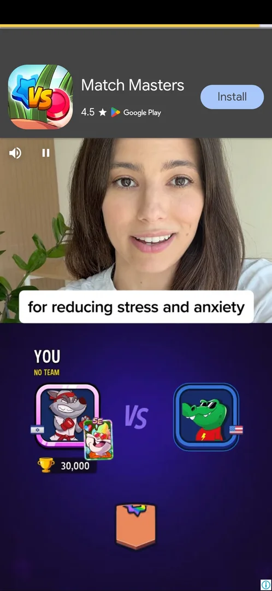
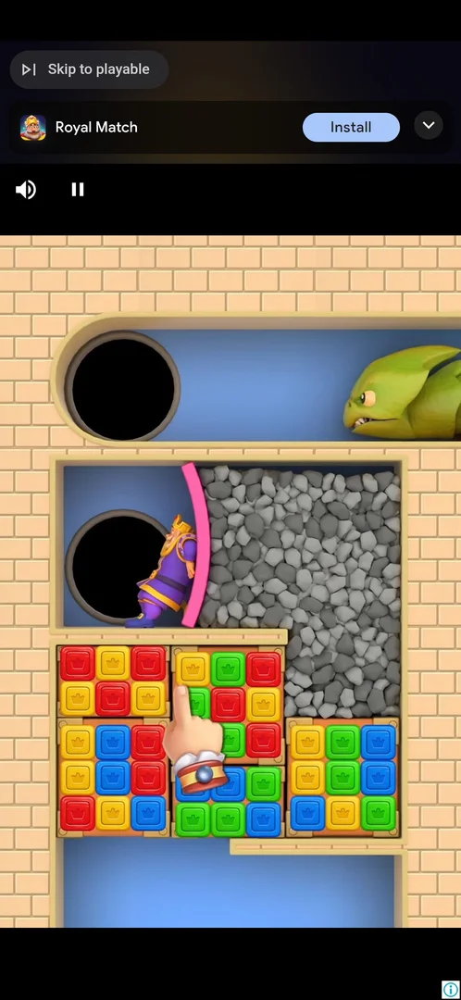
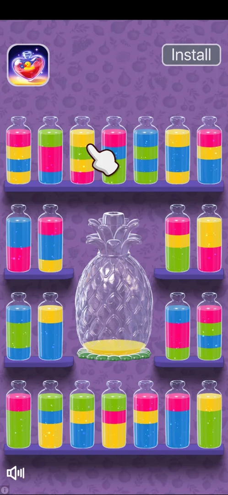
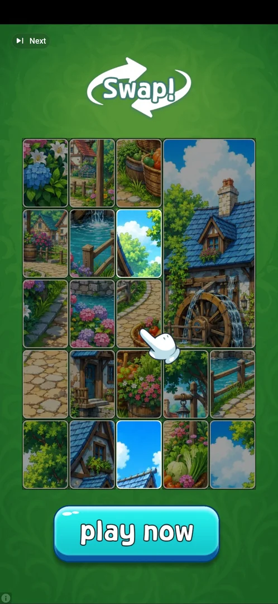

# Interstitial ad during classic play

A full-screen video ad for another game that plays when a classic game ends: at game over, between the
"No Space Left" board and the result screen, and after Settings > Replay, before the new board. It gives
nothing: the player waits for its skip control, then closes an end card [^s1] [^s2] [^s3]. It does not
come at every game over: in six game overs of one session four had an ad and two did not, and none came
during play [^s13]. In four game overs of the next session two had an ad [^s25], and in five of a later one three had an ad
[^s32] [^s33] [^s34]. In the three of the session after that, two had an ad [^s41] [^s42].

## Why it appeared

At game over of the first classic game on a fresh install (score 327, about 2 minutes of play): after the
"No Space Left" banner and before the "Can you Top that?" screen [^s1] [^s4].

## Where to find it

No button opens it: it starts by itself when a classic game ends. Two triggers were seen:

- Game over: the "No Space Left" board, then a black loading screen with a progress bar, then the video
  [^s1]. Only when enough time has passed since the previous ad (see How it works)
  [^s13].
- Settings > Replay in a game in progress (score 2516): the video starts at once, before the new board
  [^s3].

Tapping Play on the result screen for a new game never brought an ad (six games, then two more the
next session) [^s13] [^s26].

 [^s1]
*The "No Space Left" banner: the interstitial follows it*

## What it looks like

 [^s1]
*The video after game over: the skip button top right, PLAY NOW bottom right, an info icon bottom left*

A video ad over the whole screen, for another publisher's game. The layout changes with the ad (one per
ad network creative, inferred):

- After game over (first session): a white skip button with two chevrons appears top right after about
  10 s; a green PLAY NOW button bottom right, an info icon bottom left [^s1].
- After Replay (second session, an ad for Royal Match): the video starts in the lower part of the screen
  with the upper part black [^s3]; after about 10 s a white header with the game's icon, name, rating and
  a blue Install button appears, with a small skip-like icon (a triangle and a bar) top left [^s3].
- After game over (6 October): a video with a Google Play and Install footer (games 1 and 3)
  [^s14] [^s15]; a video with an "Open Store"
  button top left, Install Now and a progress bar (game 5) [^s16]; the Royal
  Match video with a "Skip to playable" button and a store header (game 6) [^s9].
- Later on 6 October: a coloring-game video with a "Next" control (a skip icon) top left and a Google
  Play and Install footer [^s27]; a video of a cannon game with PLAY NOW bottom right and, about a
  minute and a half in, a skip button with two chevrons top right [^s25].
- Three of the four game-over ads of 6 October opened a Google Play sheet for the advertised game by
  themselves, with no tap; the sheet's own X closed it [^s17]
  [^s18] [^s19]. The coloring-game ad did the same later that day [^s28].
- The third session of 6 October: a crossword-game video with a store header; the phone's Back key
  about 40 s in did nothing, a Google Play sheet opened by itself at about 1.2 minutes (its X closed it),
  then a playable end card with no X came [^s32] [^s35].
- The fourth session of 6 October: after the first game over, a block-puzzle video with a Google Play and
  Install footer; a Google Play sheet opened by itself (its X closed it), then a playable end card of a
  brick-and-car game with a "Next" label top left and a Play Now button [^s41] [^s43] [^s44]. After
  game C, a water-sort video with a "Next" label top left and the same footer [^s42]. Twice a Match Masters video with a store header
  (icon, rating, Google Play, Install) and a small skip-like icon top left; the phone's Back key closed it
  on a still end frame, 66 s after it began the first time [^s33] [^s34].

 [^s36]
*The Match Masters ad after game E: it came 3.3 minutes after the previous ad was closed*

 [^s3]
*The ad after Replay in its first seconds: no header and no close control yet*

### End card

 [^s2]
*The end card after game over: the X top right appears about 8 s after the skip*

After the skip of the game-over ad, a black end card with the advertised game's icon, name and a blue
INSTALL button. At first it has no close button; an X appears top right about 8 s later [^s2] [^s4].

### Store header

 [^s3]
*The header of the Replay ad: the small icon top left is not a skip*

The icon top left looks like a skip control, but a tap on it opened the game's Google Play listing [^s5].
The same Royal Match ad after a Block Slide game over behaved the same way, on its end card too [^s6]. Leaving the store and opening the game again
returned to a fresh classic board [^s7].

### Result screen

 [^s10]
*The result screen after the ad: one of five titles over the same Score, Best Score and Play*

Whether or not an ad played, the game over ends on the same blue result screen: the score, the best
score and a green Play button, and nothing else (no revive, no continue) [^s10]
[^s20]. Its title changes from game to game; eight were seen: "Can you Top
that?" [^s4], "Your Best is Next" [^s20], "Your High Score is Calling!"
[^s21], "Unbeaten? Try Again!" [^s10], "Just One More!" [^s11], "Try every Combo!" [^s29]
"See The Next Block" [^s30] and "Game Over", the title of all five game overs of one session, with and
without an ad [^s37] [^s34]. The title does not tell whether an ad played: "Your Best is Next", "Your
High Score is Calling!", "Try every Combo!" and "See The Next Block" came with no ad, the other three
after one. After game 6 a [Rating popup](rate-us.md) came over this screen [^s11].

## What you can do

| Tab or button | What it does |
|---|---|
| [Skip](#skip) | Game-over ad: ends the video, opens the end card |
| [Close (X)](#close-x) | Game-over ad: closes the ad, back to the game |
| [Top-left icon](#top-left-icon) | Replay ad: opens the Google Play listing |
| [Skip to playable](#skip-to-playable) | Royal Match game-over ad: not tapped; Back on its end card closed the ad |
| [Playable end card](#playable-end-card) | No close control: Back and waiting did nothing, the app was restarted |
| [Next](#next) | A "Next" label top left on some videos and playable end cards: a tap did nothing |
| [PLAY NOW and INSTALL](#play-now-and-install) | Not tapped |

### Skip

<!-- no-frame: the skip button is on the video frame above -->
Shown after about 10 s of the game-over video; it leads to the end card, not back to the game [^s2].

### Close (X)

<!-- no-frame: the X is on the end card frame above -->
Closes the ad: the "No Space Left" board is back, then the "Can you Top that?" screen [^s4]. On game 5's
ad of 6 October the end card had its X top left; it closed the ad to the result screen [^s10].

### Top-left icon

<!-- no-frame: the icon is on the store header frame above -->
On the Replay ad it opens the Google Play listing of the advertised game instead of closing the ad
[^s5]. No close control of this ad was found; the game was reopened from the phone [^s7].

### Skip to playable

 [^s9]
*The game-6 ad: "Skip to playable" top left, the Install header under it*

The Royal Match ad after game 6 showed a "Skip to playable" button top left and a header with the game's
icon, an Install button and a collapse arrow [^s9]. The button was not tapped; after more than a minute of video,
the phone's Back key on its end card closed the ad and the result screen came
[^s11]. This ad came after game 6 had ended: its frame was first marked as
an ad during play, but the result screen's score (2239, five points over the last board seen, 2234) shows
the game was over before it [^s13].

### Playable end card

 [^s12]
*A playable end card after the game-1 ad: no close X anywhere*

After the game-1 and game-3 ads of 6 October, and after a coloring-game ad (Color Oasis) later that day, the
end card was a small playable demo of the advertised
game, with its icon top left and an Install button top right but no X. It ignored the phone's Back key
and 20 to 40 s of waiting, and reopening the game from the phone showed it again; only a restart
of the app got out [^s12] [^s22] [^s23]. On the Color Oasis card the "Next" control of
the video was gone; it showed a PLAY NOW button and a hand pointer, and two Back presses and about 50 s
of waiting did nothing [^s31]. After a crossword-game ad a playable end card ignored the Back key twice
and the app was restarted again [^s35]. After the brick-and-car playable of the next session the
"Next" label top left was gone and Back did nothing; the app was restarted [^s44] [^s45].
After the restart, Classic opened a new board at 0 and the best score from the ended game was kept: the
game over had been saved before the ad [^s24].

### Next

 [^s46]
*The "Next" label top left of a playable end card: a tap on it did nothing*

Some Google Play-footer videos and their playable end cards show a "Next" label with a skip icon top
left (the coloring-game, flower-puzzle, picture-swap and water-sort ads) [^s27] [^s47] [^s42]. On a
picture-swap playable end card (after an Adventure win) a tap on "Next" did nothing, and the phone's Back
key made the label vanish without closing the card; there was no X, and only a restart of the app got
out [^s46] [^s48] [^s49].

### PLAY NOW and INSTALL

<!-- no-frame: both are on the frames above; not tapped -->
Not tapped; inferred: they lead to the store page of the advertised game.

## How it works

Version 10.8.1.

- The ad is not rewarded and no offer comes before it [^s1].
- Game-over ad: about 10 s of video before the skip, then about 8 s on the end card before the X
  [^s1] [^s2].
- Replay ad: the store header appears after about 10 s [^s3]. The same ad after a Block Slide game
  over still showed its end card about 45 s after it started [^s6].
- No ad during play and no banner ad on the board: none in two early sessions [^s4] [^s7] and none in
  six classic games of 6 October, one of them about 7 minutes long [^s13].
- Not every game over has an ad. Six game overs in one session, a few minutes apart
  [^s13]:

| Game | Game over at (session minute) | Since the previous ad began | Since it was closed | Ad |
|---|---|---|---|---|
| 1 | 1.4 | — | — | yes |
| 2 | 5.9 | 4.5 min | 1.1 min | no |
| 3 | 7.7 | 6.3 min | 2.9 min | yes |
| 4 | 12.7 | 4.7 min | 1.7 min | no |
| 5 | 14.7 | 6.8 min | 3.7 min | yes |
| 6 | about 20.2 | 5.5 min | 3.7 min | yes |

- Games 5 and 6 both had one, so it is not every second game over: the ad is gated by the time since
  the previous ad (which moment it counts from: see below).
- The next session, four classic games of about half a minute each. The app was started at the session's
  start and restarted after game B's ad, whose playable end card could not be closed
  [^s29] [^s31]:

| Game | Game over at (session minute) | Since the previous ad began | Since it was closed | Since the app was (re)started | Ad |
|---|---|---|---|---|---|
| A | 1.7 | about 8.5 to 9 min (previous session) | — | 1.7 min | no |
| B | 2.7 (ad at about 3.0) | — | — | 3.0 min | yes |
| C | 7.6 | 4.6 min | 2.2 min (closed by the restart) | 2.2 min | no |
| D | 8.65 | 5.6 min | 3.2 min | 3.2 min | yes |

- Game A had no ad although the previous ad was more than 8 minutes earlier [^s29]. Hypothesis: the
  cooldown also starts when the app is started, not verified. Games C and D fit both earlier readings
  (about 5 minutes from the previous ad's start, or about 3 minutes from its close) and do not tell them
  apart [^s30].
- Game D's ad was held open on purpose to tell the two apart; the phone's screen dimmed after about
  3.5 minutes with the ad still open, the session ended there and the test was not done
  [^s25].
- A later session told the two readings apart with an ad closed after about a minute. The app was
  started at session minute 0.8 and restarted at minute 8.0 to leave game B's playable end card
  [^s37] [^s32] [^s38] [^s33] [^s34]:

| Game | Game over at (session minute) | Since the previous ad began | Since it was closed | Since the app was (re)started | Ad |
|---|---|---|---|---|---|
| A | 4.0 | more than 2 hours | — | 3.2 min | no |
| B | 5.2 | — | — | 4.4 min | yes |
| C | 11.9 | 6.7 min | 3.9 min (closed by the restart) | 3.9 min | no |
| D | 12.9 | 7.7 min | 4.9 min | 4.9 min | yes, closed with Back after 66 s (minute 14.0) |
| E | 17.3 | 4.4 min | 3.3 min | 9.3 min | yes |

- Game E had an ad 4.4 minutes after the previous ad began, sooner than games 2 and 4 and the earlier
  game C (4.5 to 4.7 minutes), which had none; it was 3.3 minutes after that ad's close. The cooldown
  counts from the previous ad's close [^s34]. With all sessions, its length after a close is between
  1.7 minutes (no ad, game 4) and 2.9 minutes (an ad, game 3), inferred from the tables above.
- Games A and C, the first game over after each app start, had no ad 3.2 and 3.9 minutes after the
  start; the second game over after each start had one (B, D), as in the session before (A no, B yes;
  C no, D yes) [^s37] [^s38] [^s29] [^s30]. Adventure level 8, the first result after a third start (about 2.2
  minutes after it), had none either [^s40]. Hypothesis: the first result after an app start never shows
  an interstitial, whatever the time; not verified.
- A later session (the app restarted at session minute 0.6; the previous ad of the session before was
  closed about 4.8 minutes before game A's game over). The game-A ad was closed by a restart at minute 4.2;
  between it and game B the app was restarted again at about minute 29.5 to leave an Adventure ad's
  playable end card [^s41] [^s45] [^s49] [^s50] [^s42]:

| Game | Game over at (session minute) | Since the previous ad was closed | Since the app was (re)started | Ad |
|---|---|---|---|---|
| A | 1.6 | about 4.8 min (previous session) | 1.0 min | yes |
| B | about 32 | 2.4 min (closed by the restart) | 2.4 min | no |
| C | 33.6 | 4.0 min (the same) | 4.0 min | yes |

- Game A, the first game over after an app start, had an ad 1.0 minute after the start: the first
  result after a start is not exempt [^s41]. Why the first games after a start in two earlier sessions
  (1.7 and 3.2 minutes after it) had none is not explained [^s29] [^s37].
- Game B had none 2.4 minutes after the previous ad's close; with game 3 (an ad 2.9 minutes after a close)
  the classic cooldown after a close is between 2.4 and 2.9 minutes, inferred [^s50] [^s13].
- The cooldown is shared with Adventure: after this session's last classic ad, an Adventure win 3.8
  minutes after its close had no ad and the next win, 5.1 minutes after it, had one (see
  [Adventure mode](adventure.md)) [^s39]. In a later session Adventure wins 2.7 minutes after a close had
  no ad and 4.7, 6.8 and 7.4 minutes after one had an ad [^s51].
- After a trip to the store from the ad, opening the game again showed the screen the ad led to: a fresh
  classic board after Replay [^s7], the Game Over screen after Block Slide [^s8].

## Cases

| Case | What was done | Result | Source |
|---|---|---|---|
| Why it appeared <!-- case:chk-appeared --> | First game over | ✅ At game over of the first classic game, after "No Space Left" | [^s1] |
| Where to find it: shown after Settings > Replay (video, skip-like icon top left after ~10 s that opened Google Play; the launch returned to a fresh board) <!-- case:chk-entry --> | Tapped Replay in Settings on a stuck board | ✅ The ad played before the new board | [^s7] |
| Its screen: black loading frame, then a full-screen video with skip top right after ~10 s and PLAY NOW; an end card with an X ~8 s later <!-- case:chk-screen --> | Watched the game-over ad | ✅ | [^s1] |
| Kind: full-screen video interstitial, not rewarded <!-- case:chk-kind --> | First game over | ✅ | [^s1] |
| Reward: does not apply, an interstitial with no offer screen and no reward <!-- case:chk-reward --> | First game over | ✅ | [^s1] |
| Skip after ~10 s leads to an end card; its X appears ~8 s later <!-- case:chk-close --> | Tapped the skip, waited, tapped the X; on 6 October Back, waiting and restarts on other creatives | ✅ On the game-over ad; on the Replay ad the top-left icon opens the store; playable end cards with no X needed an app restart | [^s2] |
| A time cooldown between game-over interstitials <!-- case:cooldown --> | Classic game overs a few minutes apart over two sessions | ✅ Games 2 and 4, 1.1 and 1.7 min after an ad's close, had none; games 3, 5 and 6 had one | [^s25] |
| The first result after an app start has had no ad <!-- case:first-after-launch --> | Ended games and levels after three cold starts | ✅ Classic games A and C and Adventure level 8, the first results after a start, had none (3.2, 3.9 and about 2.2 min after it); the second result after each start had one. Refuted as a rule later: the first game over 1.0 min after an app start, 4.8 min after the previous ad's close, had an ad (task ad-first-game-after-launch) | [^s40] [^s41] |
| The game-over interstitial cooldown counts from the previous ad's close <!-- case:cooldown-from-close --> | Closed an ad with Back after 66 s; ended the next game 3.3 min after the close, 4.4 min after the ad began | ✅ An ad came: the cooldown counts from the close | [^s34] |
| How often: after game over and after Replay; on 6 October four ads in six game overs, none during play or on Play <!-- case:chk-frequency --> | Six classic game overs a few minutes apart | ✅ Not every game over: games 2 and 4 had none; a cooldown of about 5 minutes (inferred). The next session: two ads in four game overs, none 1.7 min after the app was started | [^s7] |

## Not verified

- Why the first game over after an app start had no ad in two sessions (1.7 and 3.2 minutes after the start) but had one in a third (1.0 minute after it, 4.8 minutes after the previous close)
- The exact cooldown after a close (between 2.4 and 2.9 minutes in classic, between 3.8 and 4.7 minutes in Adventure; task adv-ad-cooldown-4min)
- Whether every Replay plays an ad, or the same cooldown applies to it
- How the Replay ad's layout closes without the store (its close control); what "Skip to playable" does

[^s1]: session 20261003-193423-chrono-2FYKPJ, step 29 — [video at 5:10](https://youtu.be/A6Wh-xa4ryg?t=310)
[^s2]: session 20261003-193423-chrono-2FYKPJ, step 30 — [video at 5:52](https://youtu.be/A6Wh-xa4ryg?t=352)
[^s3]: session 20261003-212548-chrono-2FYKPJ, step 26 — [video at 4:30](https://youtu.be/ReMKqt9albk?t=270)
[^s4]: session 20261003-193423-chrono-2FYKPJ, step 31 — [video at 6:19](https://youtu.be/A6Wh-xa4ryg?t=379)
[^s5]: session 20261003-212548-chrono-2FYKPJ, step 27 — [video at 4:58](https://youtu.be/ReMKqt9albk?t=298)
[^s6]: session 20261003-212548-chrono-2FYKPJ, step 43 — [video at 10:03](https://youtu.be/ReMKqt9albk?t=603)
[^s7]: session 20261003-212548-chrono-2FYKPJ, step 28 — [video at 5:17](https://youtu.be/ReMKqt9albk?t=317)
[^s8]: session 20261003-212548-chrono-2FYKPJ, step 44 — [video at 10:32](https://youtu.be/ReMKqt9albk?t=632)
[^s9]: session 20261006-105231-chrono-2FYKPJ, step 49 — [video at 13:22](https://youtu.be/yIChzBeRjtU?t=802)
[^s10]: session 20261006-105231-chrono-2FYKPJ, step 34 — [video at 11:40](https://youtu.be/yIChzBeRjtU?t=700)
[^s11]: session 20261006-105231-chrono-2FYKPJ, step 50 — [video at 15:03](https://youtu.be/yIChzBeRjtU?t=903)
[^s12]: session 20261006-105231-chrono-2FYKPJ, step 4 — [video at 2:40](https://youtu.be/yIChzBeRjtU?t=160)

[^s13]: session 20261006-105231-chrono-2FYKPJ, step 51 — [video at 16:39](https://youtu.be/yIChzBeRjtU?t=999)
[^s14]: session 20261006-105231-chrono-2FYKPJ, step 2 — [video at 1:11](https://youtu.be/yIChzBeRjtU?t=71)
[^s15]: session 20261006-105231-chrono-2FYKPJ, step 17 — [video at 6:43](https://youtu.be/yIChzBeRjtU?t=403)
[^s16]: session 20261006-105231-chrono-2FYKPJ, step 31 — [video at 11:38](https://youtu.be/yIChzBeRjtU?t=698)
[^s17]: session 20261006-105231-chrono-2FYKPJ, step 3 — [video at 2:27](https://youtu.be/yIChzBeRjtU?t=147)
[^s18]: session 20261006-105231-chrono-2FYKPJ, step 18 — [video at 7:27](https://youtu.be/yIChzBeRjtU?t=447)
[^s19]: session 20261006-105231-chrono-2FYKPJ, step 32 — [video at 11:38](https://youtu.be/yIChzBeRjtU?t=698)
[^s20]: session 20261006-105231-chrono-2FYKPJ, step 12 — [video at 5:17](https://youtu.be/yIChzBeRjtU?t=317)
[^s21]: session 20261006-105231-chrono-2FYKPJ, step 25 — [video at 10:17](https://youtu.be/yIChzBeRjtU?t=617)
[^s22]: session 20261006-105231-chrono-2FYKPJ, step 6 — [video at 4:01](https://youtu.be/yIChzBeRjtU?t=241)
[^s23]: session 20261006-105231-chrono-2FYKPJ, step 20 — [video at 9:03](https://youtu.be/yIChzBeRjtU?t=543)
[^s24]: session 20261006-105231-chrono-2FYKPJ, step 8 — [video at 4:31](https://youtu.be/yIChzBeRjtU?t=271)

[^s25]: session 20261006-111957-chrono-2FYKPJ, step 23 — [video at 8:07](https://youtu.be/dKW3szW8gxw?t=487)
[^s26]: session 20261006-111957-chrono-2FYKPJ, step 20 — [video at 7:38](https://youtu.be/dKW3szW8gxw?t=458)
[^s27]: session 20261006-111957-chrono-2FYKPJ, step 10 — [video at 2:37](https://youtu.be/dKW3szW8gxw?t=157)
[^s28]: session 20261006-111957-chrono-2FYKPJ, step 11 — [video at 3:46](https://youtu.be/dKW3szW8gxw?t=226)
[^s29]: session 20261006-111957-chrono-2FYKPJ, step 5 — [video at 1:26](https://youtu.be/dKW3szW8gxw?t=86)
[^s30]: session 20261006-111957-chrono-2FYKPJ, step 19 — [video at 7:08](https://youtu.be/dKW3szW8gxw?t=428)
[^s31]: session 20261006-111957-chrono-2FYKPJ, step 14 — [video at 5:06](https://youtu.be/dKW3szW8gxw?t=306)

[^s32]: session 20261006-133549-chrono-2FYKPJ, step 16 — [video at 6:39](https://youtu.be/UNoU_1pbeJk?t=399)
[^s33]: session 20261006-133549-chrono-2FYKPJ, step 30 — [video at 12:25](https://youtu.be/UNoU_1pbeJk?t=745)
[^s34]: session 20261006-133549-chrono-2FYKPJ, step 37 — [video at 16:31](https://youtu.be/UNoU_1pbeJk?t=991)
[^s35]: session 20261006-133549-chrono-2FYKPJ, step 17 — [video at 7:07](https://youtu.be/UNoU_1pbeJk?t=427)
[^s36]: session 20261006-133549-chrono-2FYKPJ, step 36 — [video at 15:34](https://youtu.be/UNoU_1pbeJk?t=934)
[^s37]: session 20261006-133549-chrono-2FYKPJ, step 7 — [video at 3:38](https://youtu.be/UNoU_1pbeJk?t=218)
[^s38]: session 20261006-133549-chrono-2FYKPJ, step 25 — [video at 10:48](https://youtu.be/UNoU_1pbeJk?t=648)
[^s39]: session 20261006-133549-chrono-2FYKPJ, step 101 — [video at 29:02](https://youtu.be/UNoU_1pbeJk?t=1742)

[^s40]: session 20261006-133549-chrono-2FYKPJ, step 84 — [video at 26:43](https://youtu.be/UNoU_1pbeJk?t=1603)

[^s41]: session 20261006-141221-chrono-2FYKPJ, step 6 — [video at 1:23](https://youtu.be/x8gS5EhEoGs?t=83)
[^s42]: session 20261006-141221-chrono-2FYKPJ, step 104 — [video at 31:52](https://youtu.be/x8gS5EhEoGs?t=1912)
[^s43]: session 20261006-141221-chrono-2FYKPJ, step 7 — [video at 2:39](https://youtu.be/x8gS5EhEoGs?t=159)
[^s44]: session 20261006-141221-chrono-2FYKPJ, step 8 — [video at 2:52](https://youtu.be/x8gS5EhEoGs?t=172)
[^s45]: session 20261006-141221-chrono-2FYKPJ, step 9 — [video at 3:59](https://youtu.be/x8gS5EhEoGs?t=239)
[^s46]: session 20261006-141221-chrono-2FYKPJ, step 90 — [video at 26:51](https://youtu.be/x8gS5EhEoGs?t=1611)
[^s47]: session 20261006-141221-chrono-2FYKPJ, step 88 — [video at 24:56](https://youtu.be/x8gS5EhEoGs?t=1496)
[^s48]: session 20261006-141221-chrono-2FYKPJ, step 91 — [video at 27:23](https://youtu.be/x8gS5EhEoGs?t=1643)
[^s49]: session 20261006-141221-chrono-2FYKPJ, step 92 — [video at 28:04](https://youtu.be/x8gS5EhEoGs?t=1684)
[^s50]: session 20261006-141221-chrono-2FYKPJ, step 99 — [video at 30:25](https://youtu.be/x8gS5EhEoGs?t=1825)
[^s51]: session 20261006-141221-chrono-2FYKPJ, step 93 — [video at 28:25](https://youtu.be/x8gS5EhEoGs?t=1705)
