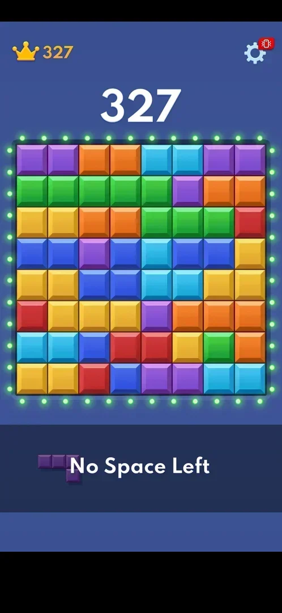
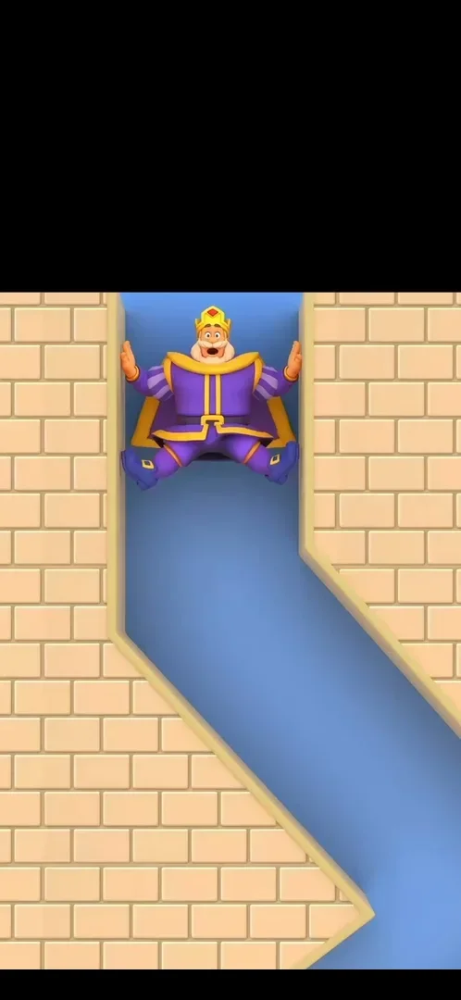
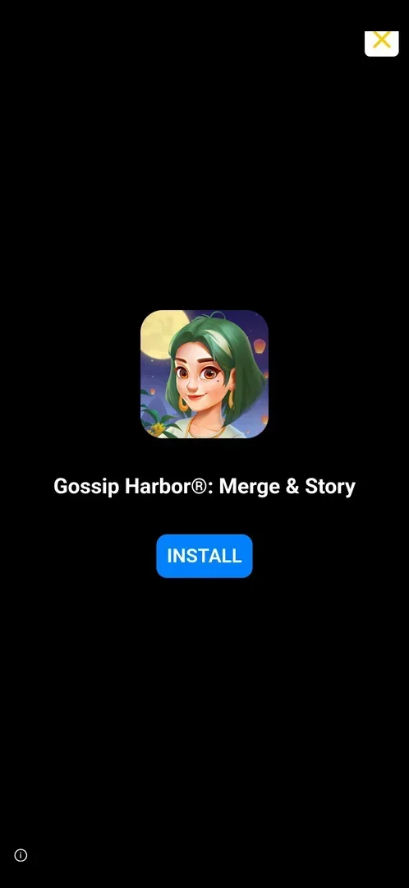
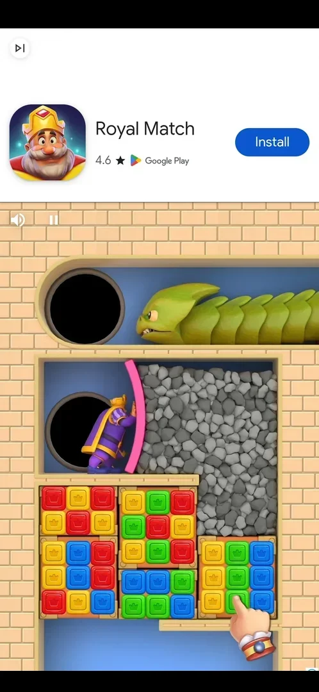

# Interstitial ad during classic play

A full-screen video ad for another game that plays when a classic game ends: at game over, between the
"No Space Left" board and the "Can you Top that?" screen, and after Settings > Replay, before the new
board. It gives nothing: the player waits for its skip control, then closes an end card [^s1] [^s2] [^s3].

## Why it appeared

At game over of the first classic game on a fresh install (score 327, about 2 minutes of play): after the
"No Space Left" banner and before the "Can you Top that?" screen [^s1] [^s4].

## Where to find it

No button opens it: it starts by itself when a classic game ends. Two triggers were seen:

- Game over: the "No Space Left" board, then a black loading screen with a progress bar, then the video
  [^s1].
- Settings > Replay in a game in progress (score 2516): the video starts at once, before the new board
  [^s3].

 [^s1]
*The "No Space Left" banner: the interstitial follows it*

## What it looks like

 [^s1]
*The video after game over: the skip button top right, PLAY NOW bottom right, an info icon bottom left*

A video ad over the whole screen, for another publisher's game. Two layouts were seen, one per ad
network creative (inferred):

- After game over (first session): a white skip button with two chevrons appears top right after about
  10 s; a green PLAY NOW button bottom right, an info icon bottom left [^s1].
- After Replay (second session, an ad for Royal Match): the video starts in the lower part of the screen
  with the upper part black [^s3]; after about 10 s a white header with the game's icon, name, rating and
  a blue Install button appears, with a small skip-like icon (a triangle and a bar) top left [^s3].

 [^s3]
*The ad after Replay in its first seconds: no header and no close control yet*

### End card

 [^s2]
*The end card after game over: the X top right appears about 8 s after the skip*

After the skip of the game-over ad, a black end card with the advertised game's icon, name and a blue
INSTALL button. At first it has no close button; an X appears top right about 8 s later [^s2] [^s4].

### Store header

 [^s3]
*The header of the Replay ad: the small icon top left is not a skip*

The icon top left looks like a skip control, but a tap on it opened the game's Google Play listing [^s5].
The same Royal Match ad after a Block Slide game over behaved the same way, on its end card too [^s6]. Leaving the store and opening the game again
returned to a fresh classic board [^s7].

## What you can do

| Tab or button | What it does |
|---|---|
| [Skip](#skip) | Game-over ad: ends the video, opens the end card |
| [Close (X)](#close-x) | Game-over ad: closes the ad, back to the game |
| [Top-left icon](#top-left-icon) | Replay ad: opens the Google Play listing |
| [PLAY NOW and INSTALL](#play-now-and-install) | Not tapped |

### Skip

<!-- no-frame: the skip button is on the video frame above -->
Shown after about 10 s of the game-over video; it leads to the end card, not back to the game [^s2].

### Close (X)

<!-- no-frame: the X is on the end card frame above -->
Closes the ad: the "No Space Left" board is back, then the "Can you Top that?" screen [^s4].

### Top-left icon

<!-- no-frame: the icon is on the store header frame above -->
On the Replay ad it opens the Google Play listing of the advertised game instead of closing the ad
[^s5]. No close control of this ad was found; the game was reopened from the phone [^s7].

### PLAY NOW and INSTALL

<!-- no-frame: both are on the frames above; not tapped -->
Not tapped; inferred: they lead to the store page of the advertised game.

## How it works

Version 10.8.1.

- The ad is not rewarded and no offer comes before it [^s1].
- Game-over ad: about 10 s of video before the skip, then about 8 s on the end card before the X
  [^s1] [^s2].
- Replay ad: the store header appears after about 10 s [^s3]. The same ad after a Block Slide game
  over still showed its end card about 45 s after it started [^s6].
- Frequency seen: one ad at each of the two classic restarts (one game over, one Replay), no ad during
  play and no banner ad on the board [^s4] [^s7]. Whether it shows at every restart is not verified.
- After a trip to the store from the ad, opening the game again showed the screen the ad led to: a fresh
  classic board after Replay [^s7], the Game Over screen after Block Slide [^s8].

## Cases

| Case | What was done | Result | Source |
|---|---|---|---|
| Why it appeared <!-- case:chk-appeared --> | First game over | ✅ At game over of the first classic game, after "No Space Left" | [^s1] |
| Where to find it: shown after Settings > Replay (video, skip-like icon top left after ~10 s that opened Google Play; the launch returned to a fresh board) <!-- case:chk-entry --> | Tapped Replay in Settings on a stuck board | ✅ The ad played before the new board | [^s7] |
| Its screen: black loading frame, then a full-screen video with skip top right after ~10 s and PLAY NOW; an end card with an X ~8 s later <!-- case:chk-screen --> | Watched the game-over ad | ✅ | [^s1] |
| Kind: full-screen video interstitial, not rewarded <!-- case:chk-kind --> | First game over | ✅ | [^s1] |
| Reward: does not apply, an interstitial with no offer screen and no reward <!-- case:chk-reward --> | First game over | ✅ | [^s1] |
| Skip after ~10 s leads to an end card; its X appears ~8 s later <!-- case:chk-close --> | Tapped the skip, waited, tapped the X | ✅ On the game-over ad; on the Replay ad the top-left icon opens the store | [^s2] |
| How often: after game over (first session) and after Replay (this session), one ad per restart <!-- case:chk-frequency --> | Two restarts in two sessions | ✅ One ad at each; the exact cadence is the experiment ad-cadence | [^s7] |

## Not verified

- Whether the ad plays at every game over and every Replay, or every Nth, and whether there is a cooldown
- How the Replay ad's layout closes without the store (its close control)

[^s1]: session 20261003-193423-chrono-2FYKPJ, step 29 — [video at 5:10](https://youtu.be/A6Wh-xa4ryg?t=310)
[^s2]: session 20261003-193423-chrono-2FYKPJ, step 30 — [video at 5:52](https://youtu.be/A6Wh-xa4ryg?t=352)
[^s3]: session 20261003-212548-chrono-2FYKPJ, step 26 — [video at 4:30](https://youtu.be/ReMKqt9albk?t=270)
[^s4]: session 20261003-193423-chrono-2FYKPJ, step 31 — [video at 6:19](https://youtu.be/A6Wh-xa4ryg?t=379)
[^s5]: session 20261003-212548-chrono-2FYKPJ, step 27 — [video at 4:58](https://youtu.be/ReMKqt9albk?t=298)
[^s6]: session 20261003-212548-chrono-2FYKPJ, step 43 — [video at 10:03](https://youtu.be/ReMKqt9albk?t=603)
[^s7]: session 20261003-212548-chrono-2FYKPJ, step 28 — [video at 5:17](https://youtu.be/ReMKqt9albk?t=317)
[^s8]: session 20261003-212548-chrono-2FYKPJ, step 44 — [video at 10:32](https://youtu.be/ReMKqt9albk?t=632)
