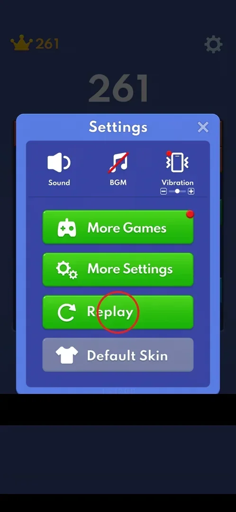
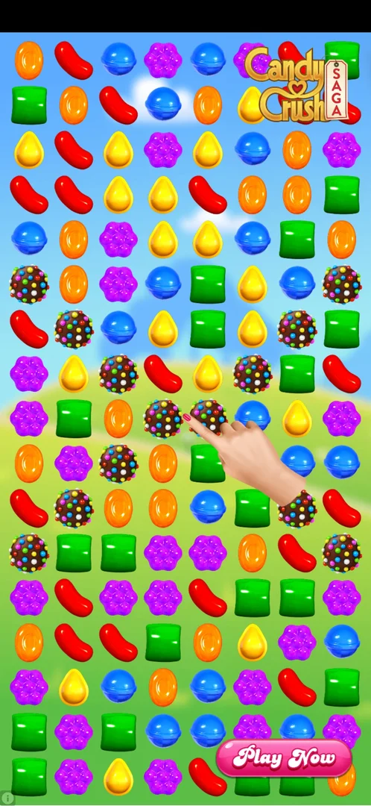

# Interstitial ads

Block Blast! shows full-screen ads for other games between games. In this session one appeared when the
player chose Replay; it played as a video, then as an interactive "playable" end card for another
puzzle game [^s2].

## Where to find it

It is not a place to open but something that interrupts: the one seen came right after the Replay button
in Settings (gear at the top right of the board, then Replay) [^s1] [^s2].

 [^s1]

## What it looks like

The whole screen is taken by the advertised game: a match-3 board with a hand showing a move and a
"Play Now" button, later a full-screen end card with the same button. In the first seconds there is no
close control [^s2].

 [^s2]

## How it works

- Shown after Replay in Settings, version 10.6.5 [^s2].
- After more than 30 seconds the end card still had no visible close cross, and the phone's Back button
  did nothing [^s3]. The app had to be restarted
  [^s4].
- After the restart the game came back with the new board and the best score kept; the Android
  notification permission prompt was shown again [^s5].

## Cases

| Case | What was done | Result | Source |
|---|---|---|---|
| Close the interstitial after Replay | Waited about 30 s, then pressed Back | ❌ No close control appeared and Back was ignored; the app was restarted | [^s4] |

## Not verified

- When else interstitials appear: after a game over, after a number of moves or minutes.
- Whether a close cross appears later than 30 seconds, or only on some ads.
- Whether the game offers rewarded ads (for example a revive at game over).

[^s1]: session 20261001-200952-chrono-2FYKPJ, step 38 — [video at 8:08](https://youtu.be/1AkjzicKdRM?t=488)
[^s2]: session 20261001-200952-chrono-2FYKPJ, step 39 — [video at 8:12](https://youtu.be/1AkjzicKdRM?t=492)
[^s3]: session 20261001-200952-chrono-2FYKPJ, step 40 — [video at 9:36](https://youtu.be/1AkjzicKdRM?t=576)
[^s4]: session 20261001-200952-chrono-2FYKPJ, step 41 — [video at 9:55](https://youtu.be/1AkjzicKdRM?t=595)
[^s5]: session 20261001-200952-chrono-2FYKPJ, step 42 — [video at 10:02](https://youtu.be/1AkjzicKdRM?t=602)
