# Adventure diamond-collection levels

Adventure levels where the goal is to collect gem tiles, not to reach a target score. The board, the
tray and the drag are the same as in [Classic](classic.md). The level starts on a pre-built layout. Some
board cells and some cells of the tray pieces carry a gem, and clearing a row or column that holds a gem
collects it. The header counts down the gems left of each kind, and the level is won when every count
reaches zero. Seen on Adventure levels 2 to 8 in version 10.8.1 [^s1] [^s2] [^s3] [^s16].

## Why it appeared

Adventure level 2 opened after the first win. The header shows a diamond with a count (60) in place of a
score bar, and there are diamond tiles on the board and in tray pieces [^s1].

## Where to find it

Home menu > Adventure > the green "Level N" button at the bottom of the Adventure map. There is no
separate entry: the gem goal belongs to the level. On the map the current level's cell looks like any
other cell, with no gem mark [^s4] [^s5].

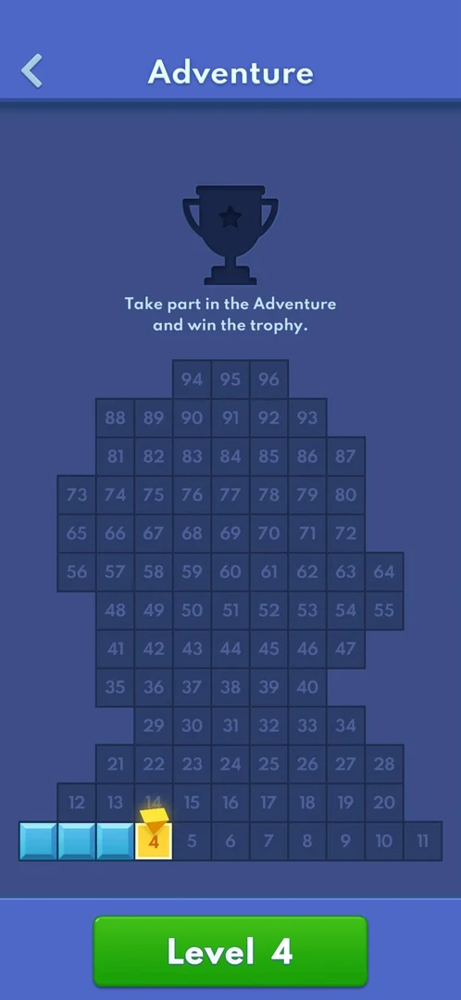 [^s5]
*The green Level 4 button at the bottom of the Adventure map; cell 4 carries no gem mark*

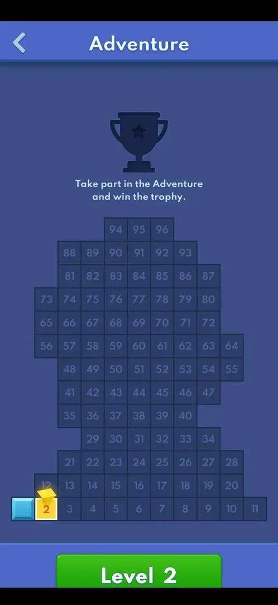 [^s4]
*The same entry on level 2: the green Level 2 button*

## What it looks like

Level 2 has a back arrow, a gear and, in place of the score bar, a blue diamond with the count left
(60). The pre-built layout is a tree of green blocks with diamond tiles in it. Two of the three tray
pieces carry diamond cells too [^s1].

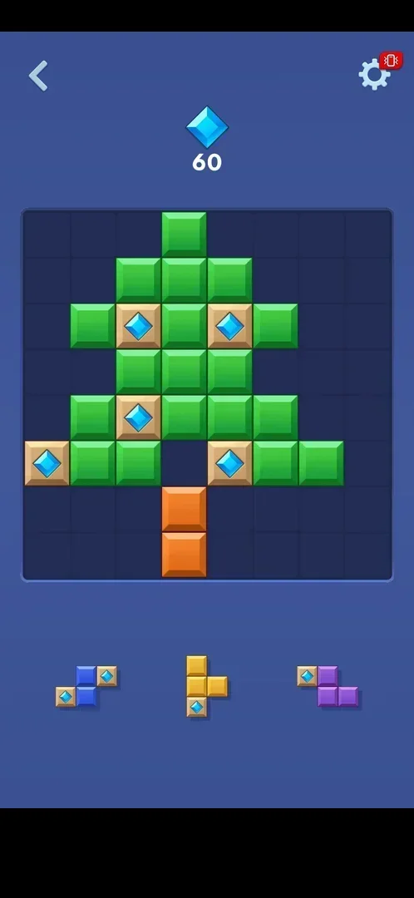 [^s1]

Level 3 has two goals side by side, 56 red gems and 54 orange gems, on a frame-shaped layout of yellow
blocks. Its tray pieces include diagonal shapes with gem cells [^s2]. Level 4 has
three goals: 22 blue diamonds, 20 orange gems and 20 yellow stars. Its layout is a symmetrical shape of
cyan and yellow blocks, with gem tiles in it [^s6].

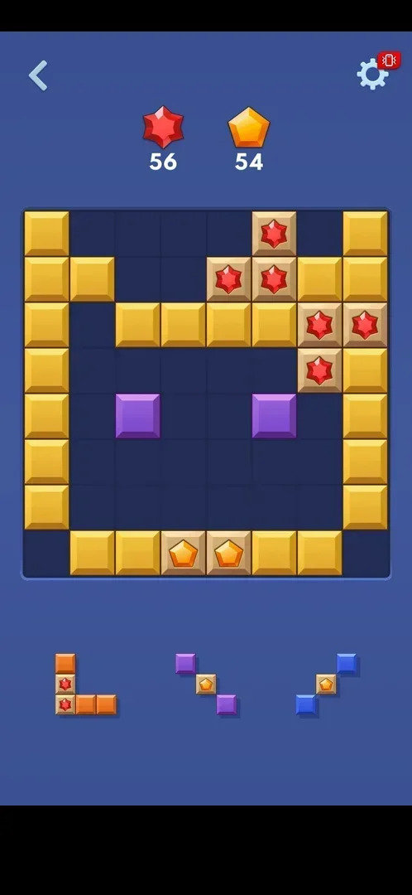 [^s2]

Levels 6 to 8 keep three goals: level 6 40 each of blue, red and purple gems, level 7 22, 22 and 20,
level 8 30 blue diamonds, 30 orange pentagons and 30 red stars. Level 8's layout is a block of cyan
cells with gem tiles in and around it, and all three tray pieces carry gem cells [^s17] [^s16].

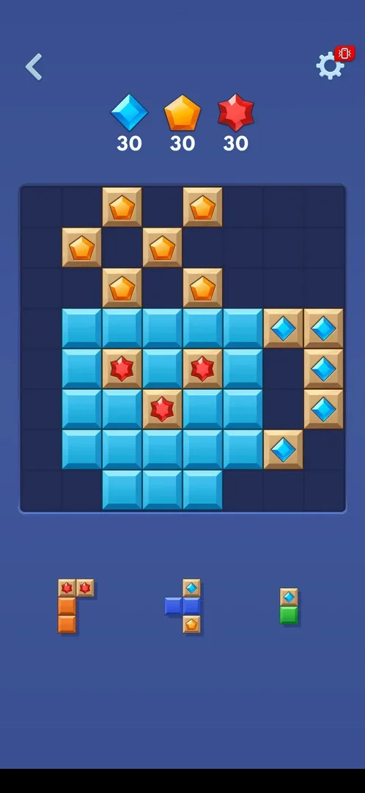 [^s16]
*Level 8: three goals of 30 each*

### Target Collection banner

At the start of a gem level a "Target Collection" banner slides across the board. It shows each goal
gem with its count (level 4: 22 blue diamonds, 20 orange gems, 20 yellow stars). The gems then fly up
into the header counters, and the banner leaves to show the pre-built layout. The banner also comes
back when the level is restarted with Replay [^s6] [^s7].

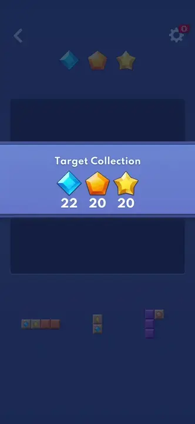 [^s6]
*Clip 3 s · [original on YouTube from 1:34](https://youtu.be/pwB69H7MFAc?t=94)*

### Result

When a goal is met, its count turns into a green check [^s8].

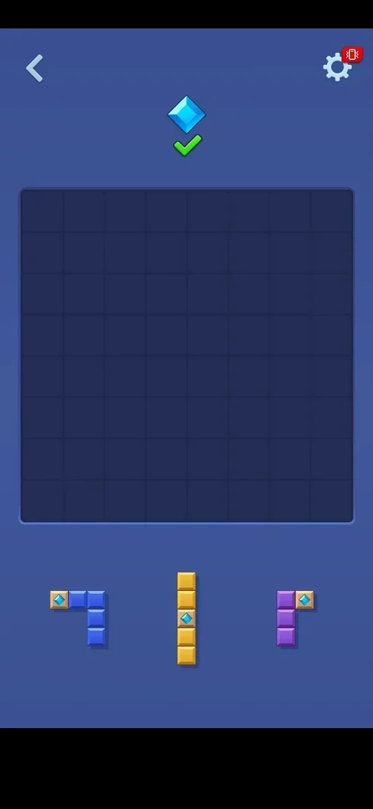 [^s8]

After the level 4 win, the win screen showed Consecutive Victories x3 and a purple "Next Hard Level"
button where earlier wins showed a green "Next Level". Level 5 was not opened, so what makes a level
"hard" is not known [^s9].

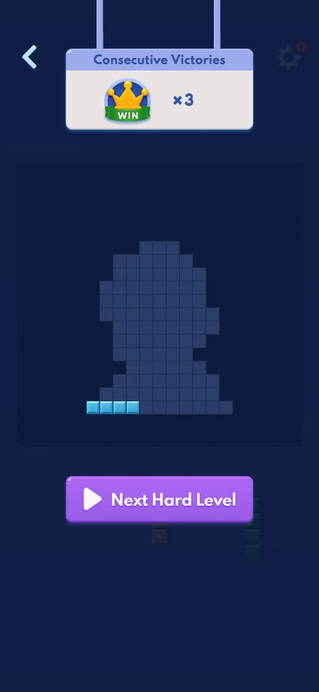 [^s9]

### Replay ad

In the gear menu, Replay shows a full-screen video ad before the level restarts. On 5 October this was a
Royal Match video with "Skip to playable" and Install, followed by a playable end card with no close
button. The Back key closed it [^s10] [^s7]. See
[Interstitial ads](ad-interstitial-classic.md).

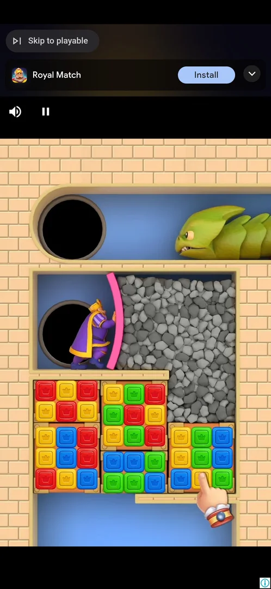 [^s10]

## What you can do

| Tab or button | What it does |
|---|---|
| [Back arrow](#back-arrow) | Leaves the level for the Adventure map |
| [Gear](#gear) | Opens Settings with Home and Replay |

### Back arrow

<!-- no-frame: the back arrow is the top-left control in the level frames above -->
Leaves the level. Opening the level again from the map restarts it on the same pre-built board with the
same goal, with no prompt and no cost [^s11].

### Gear

<!-- no-frame: the in-level Settings frame of this session shows debug numbers; the menu is shown on the Settings page -->
Opens the in-level Settings (see [Settings](settings.md)). Home goes straight to the home menu
[^s3]. Replay shows an ad, then restarts the level [^s7].

## How it works

Version 10.8.1.

- A gem is collected when the row or column that holds its tile is cleared. The gem flies to the header
  and the count drops by one. The clear also shows "+10" [^s12].
- Gems are on the pre-built board and on cells of new tray pieces [^s1].
- No move limit, timer, lives or boosters were seen [^s1] [^s11].
- Goals per level so far: level 2, 60 diamonds; level 3, 56 red and 54 orange gems; level 4, 22 blue
  diamonds, 20 orange gems and 20 yellow stars [^s1] [^s2] [^s6]; level 6, 40/40/40; level 7, 22/22/20;
  level 8, 30/30/30 [^s17] [^s16].
- Levels 2 to 8 are all gem levels; level 1 and hard level 9 have a target score instead (see
  [Adventure hard levels](adv-hard-levels.md)) [^s16] [^s18].
- A restart keeps the layout and the goals, but the first tray is not the same: the tray after Replay
  differed from the tray before it [^s7].
- The level 4 win took about 5 minutes and 45 moves, including the Replay ad [^s13].

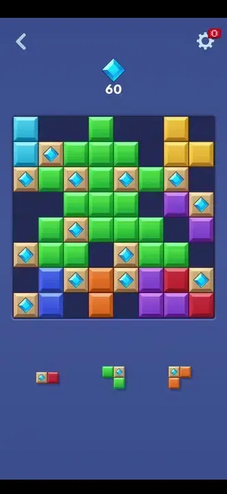 [^s12]
*Clip 9.8 s · [original on YouTube from 5:30](https://youtu.be/RE70Idi_jrA?t=330)*

## Outcomes

The base level is the 8x8 board of Classic.

| Outcome | As the base or what differs | Frame |
|---|---|---|
| No Space Left: no tray piece fits <!-- case:under-no-space-left --> | Differs: the board dims and shows the gems still needed (56), with "You Can Do It!" and a green Retry button in place of "Can you Top that?" and Play. The Consecutive Victories panel drops in at x0. No ad came after this loss, and there was no revive or price [^s14] | 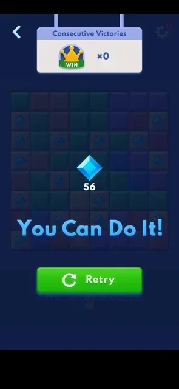 |
| Win <!-- case:under-win --> | Differs, because Classic has no win. The counters turn into checks, then the win screen shows the Consecutive Victories panel, the trophy grid with one more cell lit and a Next Level button (on level 4, "Next Hard Level"). There are no coins or other reward. After the level 2 win an interstitial ad came first [^s15] [^s9] | 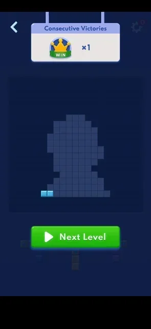 |
| Quit: gear > Home <!-- case:under-quit --> | Differs from Classic's Back key only in the route. On level 4, the gear's Home button goes to the home menu at once, with no confirmation and no cost, and the level stays the current one [^s3] | 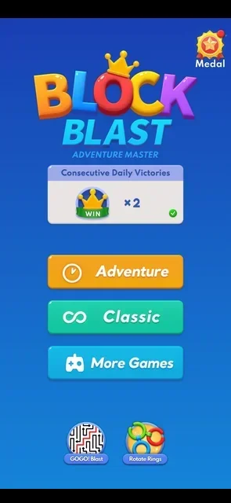 |
| Restart: gear > Replay <!-- case:under-restart --> | Same as Classic's Replay: a video ad first (on level 4, a playable end card with no close button, closed with the Back key), then a fresh start. The level restarts with the Target Collection banner, the same layout and the same goals (22/20/20), but a different first tray. The Consecutive Daily Victories counter does not change [^s7] [^s13] | 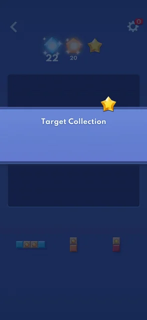 |
| Leaving the app <!-- case:under-exit-app --> | not verified | — |

## Cases

| Case | What was done | Result | Source |
|---|---|---|---|
| Why it appeared <!-- case:chk-appeared --> | Won Adventure level 1, opened level 2 | ✅ The level 2 header shows a diamond counter (60) in place of a score bar | [^s1] |
| Where to find it <!-- case:chk-entry --> | Home menu > Adventure > Level N | ✅ No separate entry: the gem goal belongs to the level (levels 2, 3 and 4 so far) | [^s1] |
| What it looks like <!-- case:chk-screen --> | Opened levels 2 and 3 | ✅ Back arrow, gear and a counter per gem kind in place of the score bar; gem tiles on the board and on tray pieces | [^s1] |
| How it is announced <!-- case:chk-announce --> | Opened level 4 from the map, then restarted it | ✅ A Target Collection banner slides over the board at level start and shows the goal gems, which fly to the header. The map cell has no mark. (Earlier entry corrected: on 3 October no announcement was noted) | [^s7] |
| What differs from the base level <!-- case:chk-differs --> | Played levels 2 and 3 | ✅ Same board, tray and drag. The goal is to collect gems by clearing their lines, on a pre-built layout, with several gem kinds from level 3. No move limit or timer | [^s2] |
| Its win <!-- case:chk-win --> | Won levels 2, 3 and 4 | ✅ The counters turn into checks and the board clears. The win screen is the same as on the score level: Consecutive Victories, a trophy cell lit, Next Level (Next Hard Level after level 4). No reward currency | [^s15] |
| A loss <!-- case:chk-loss --> | Lost level 2 on purpose | ✅ No Space Left: the board dims and shows the diamonds left, "You Can Do It!" and Retry. The only cost is the Adventure win streak (x1 to x0); the daily counter stayed | [^s14] |
| Retry and continue offers <!-- case:chk-retry --> | Back arrow, then Adventure > Level 2 | ✅ No continue or revive offer, no price. The level restarts with the same pre-built board and goal. The loss screen's Retry button was not tapped | [^s11] |
| Restart from the gear <!-- case:under-restart --> | Gear > Replay on level 4 | ✅ A video ad, closed with the Back key on its end card, then level 4 again with the banner and the same goals 22/20/20; the first tray differed | [^s7] |
| Gem goals on levels 6 to 8 <!-- case:levels-l6-l8 --> | Won levels 6, 7 and 8 | ✅ 40/40/40, 22/22/20, 30/30/30; level 1 and hard level 9 are score levels | [^s16] |
| Where and how often it comes up <!-- case:chk-frequency --> | — | not verified: levels 2 to 8 are gem levels, levels 1 and 9 score levels; later levels were not opened |  |

## Not verified

- Which levels are gem levels after level 9; a score level came back on level 9 <!-- case:chk-frequency -->
- Leaving the app in a gem level and coming back <!-- case:under-exit-app -->
- What the Retry button on the loss screen does (the level was restarted from the map instead)
- How many points or gems a single clear is worth when several gem tiles are in one line

[^s1]: session 20261003-235233-chrono-2FYKPJ, step 25 — [video at 5:02](https://youtu.be/RE70Idi_jrA?t=302)
[^s2]: session 20261003-235233-chrono-2FYKPJ, step 48 — [video at 10:22](https://youtu.be/RE70Idi_jrA?t=622)
[^s3]: session 20261003-235233-chrono-2FYKPJ, step 64 — [video at 13:34](https://youtu.be/RE70Idi_jrA?t=814)
[^s4]: session 20261003-235233-chrono-2FYKPJ, step 31 — [video at 6:35](https://youtu.be/RE70Idi_jrA?t=395)
[^s5]: session 20261005-004506-chrono-2FYKPJ, step 8 — [video at 1:24](https://youtu.be/pwB69H7MFAc?t=84)
[^s6]: session 20261005-004506-chrono-2FYKPJ, step 9 — [video at 1:37](https://youtu.be/pwB69H7MFAc?t=97)
[^s7]: session 20261005-004506-chrono-2FYKPJ, step 13 — [video at 4:28](https://youtu.be/pwB69H7MFAc?t=268)
[^s8]: session 20261003-235233-chrono-2FYKPJ, step 43 — [video at 8:35](https://youtu.be/RE70Idi_jrA?t=515)
[^s9]: session 20261005-004506-chrono-2FYKPJ, step 23 — [video at 6:03](https://youtu.be/pwB69H7MFAc?t=363)
[^s10]: session 20261005-004506-chrono-2FYKPJ, step 11 — [video at 2:01](https://youtu.be/pwB69H7MFAc?t=121)
[^s11]: session 20261003-235233-chrono-2FYKPJ, step 32 — [video at 6:42](https://youtu.be/RE70Idi_jrA?t=402)
[^s12]: session 20261003-235233-chrono-2FYKPJ, step 27 — [video at 5:37](https://youtu.be/RE70Idi_jrA?t=337)
[^s13]: session 20261005-004506-chrono-2FYKPJ, step 24 — [video at 6:19](https://youtu.be/pwB69H7MFAc?t=379)
[^s14]: session 20261003-235233-chrono-2FYKPJ, step 29 — [video at 5:50](https://youtu.be/RE70Idi_jrA?t=350)
[^s15]: session 20261003-235233-chrono-2FYKPJ, step 45 — [video at 9:42](https://youtu.be/RE70Idi_jrA?t=582)

[^s16]: session 20261006-133549-chrono-2FYKPJ, step 73 — [video at 25:03](https://youtu.be/UNoU_1pbeJk?t=1503)
[^s17]: session 20261006-133549-chrono-2FYKPJ, step 60 — [video at 20:18](https://youtu.be/UNoU_1pbeJk?t=1218)
[^s18]: session 20261006-133549-chrono-2FYKPJ, step 104 — [video at 31:39](https://youtu.be/UNoU_1pbeJk?t=1899)
