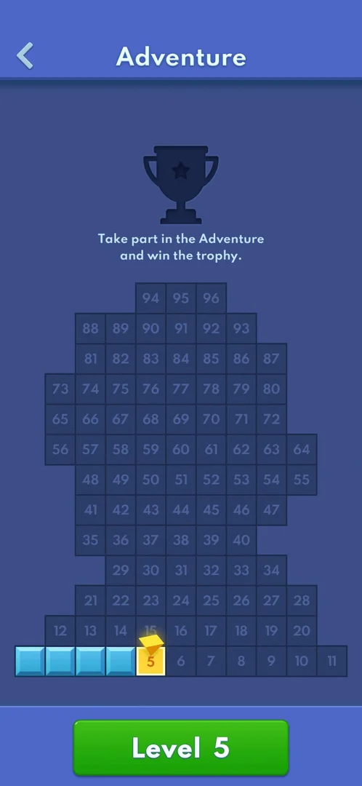
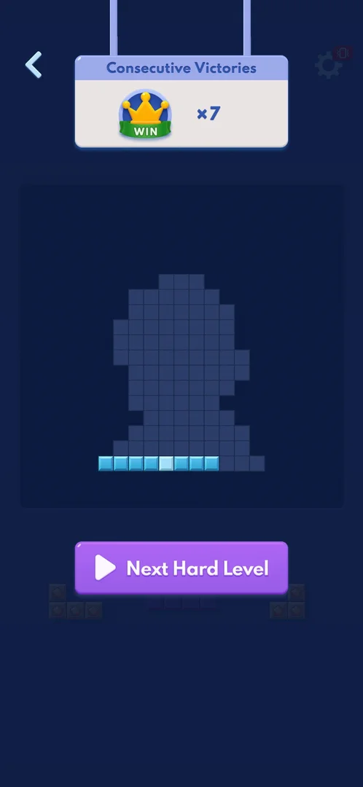
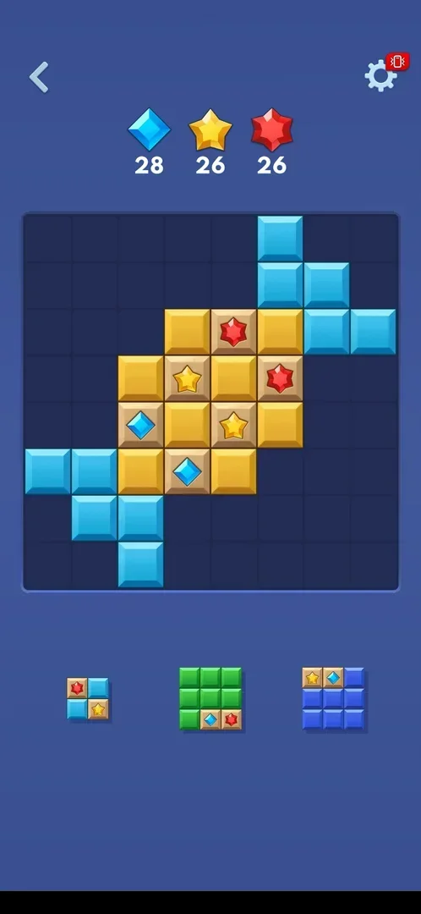
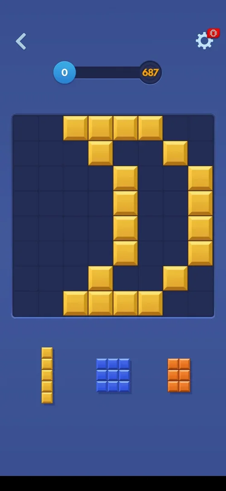
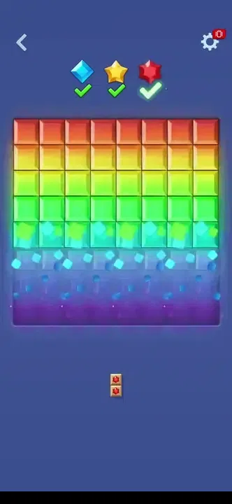
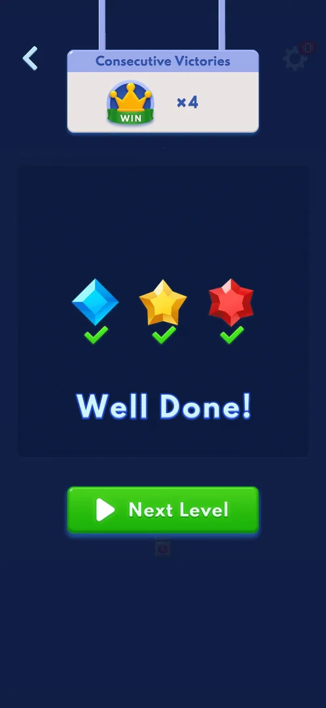
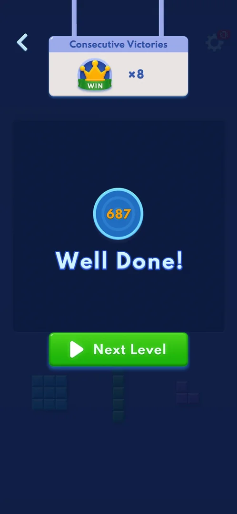

# Adventure hard levels (Next Hard Level)

Some Adventure levels are flagged "hard". The flag is shown in one place only: the win screen of the
level before, whose button reads "Next Hard Level" (purple) instead of "Next Level" (green). Two hard
levels were seen. Level 5 is a [gem-collection level](adv-diamonds.md) with the same rules as levels 2
to 4, but with larger goals: 28, 26 and 26 gems against 22, 20 and 20 on level 4 [^s1] [^s3]. Level 9 is
a score level, with a target of 687 points [^s6].

## Why it appeared

After Adventure level 4 was won, the win screen's button read "Next Hard Level" (purple) instead of the
green "Next Level", which flags level 5 as hard [^s1].

## Where to find it

Home menu > Adventure > the green "Level 5" button at the bottom of the Adventure map. On the map, cell 5
looks like any other current cell, with no hard mark. The button reads "Level 5", not "Hard" [^s2].

 [^s2]
*The green Level 5 button at the bottom of the Adventure map; cell 5 has no hard mark*

The win screen of the level before also leads there: the purple Next Hard Level button starts the hard
level at once (level 8 to level 9) [^s7] [^s6].

 [^s7]
*The purple Next Hard Level button on the level 8 win screen opens hard level 9*

## What it looks like

Level 5 opens with the same "Target Collection" banner as the other gem levels. The header then shows
three goals: 28 blue diamonds, 26 yellow stars and 26 red gems. The pre-built layout is a symmetrical
shape of yellow and cyan blocks with six gem tiles in its centre. The first tray held a 2x2 piece and two
3x3 pieces, all with gem cells. There is no "hard" label, colour or icon in the level: the back arrow,
gear and goal counters look the same as on level 4 [^s3].

 [^s3]

### Level 9

 [^s6]
*Hard level 9: a score bar to 687 in place of gem counters*

Level 9 has a score bar from 0 to 687 in the header, like level 1, and no gem goals. Its pre-built layout
is a symmetrical pattern of yellow blocks; the first tray held a 1x5, a 3x3 and a 3x2 piece. As on level
5, nothing in the level marks it as hard [^s6]. So hard levels are not only gem levels [^s8].

### Result

When the last goal was met, all three counters showed green checks while a 1x2 piece was still in the
tray. A rainbow sweep then ran across the board [^s5].

 [^s5]
*Clip 7.2 s · [original on YouTube from 3:04](https://youtu.be/a20Ukrexpfs?t=184)*

A full-screen interstitial ad came next: a video for another game, then an end card with no close
button, which the Back key closed. After it came the win screen: the Consecutive Victories panel at x4,
the three gems with checks, "Well Done!" and a green "Next Level" button. Level 6 is therefore not
flagged hard [^s4].

 [^s4]

Level 9 ended the same way: an interstitial ad (a video, a Google Play sheet that opened by itself, an end
card with an X top right), then the win screen with Consecutive Victories x8, the score 687, "Well Done!"
and a green Next Level, so level 10 is not flagged hard [^s8].

 [^s8]
*The level 9 win screen: "Well Done!" over the score reached*

## How it works

Version 10.8.1.

| Level | Hard | Goals |
|---|---|---|
| 4 | no | 22 blue diamonds, 20 orange gems, 20 yellow stars |
| 5 | yes | 28 blue diamonds, 26 yellow stars, 26 red gems |
| 6 | no (offered as "Next Level") | 40 each of blue, red and purple gems |
| 7 | no (offered as "Next Level") | 22, 22 and 20 gems |
| 8 | not seen (level 7's win screen was hidden by an ad and a restart) | 30 blue diamonds, 30 orange pentagons, 30 red stars |
| 9 | yes | a score of 687 |
| 10 | no (offered as "Next Level") | not opened |

Levels 6 to 10 are from one session [^s9] [^s10] [^s7] [^s8]. Hypothesis: every fourth level from level 5 is
hard (next: level 13); not verified.

[^s1] [^s3]

- Rules seen on level 5 are the gem-level rules: a gem is collected when its row or column is cleared.
  There was no move limit, timer, lives or booster [^s3] [^s4].
- Late in the level, the tray pieces were made only of gem cells (for example a 1x2 piece of two red
  gems) [^s5].
- Level 5 was won in about 1.5 minutes of play over eight trays, plus the ad, by the same placing method
  that won level 4 in about 5 minutes. Inferred: the larger goals did not make it slower to win [^s4].
- No reward for a hard level was seen: the win screen is the same as for other levels [^s4] [^s8].
- Level 9 was won in about 2 minutes of play [^s8].

## Outcomes

The base level is the Adventure [gem-collection level](adv-diamonds.md) on the 8x8 board of Classic.

| Outcome | As the base or what differs | Frame |
|---|---|---|
| Restart: gear > Replay <!-- case:under-restart --> | not verified | — |
| No Space Left: no tray piece fits <!-- case:under-no-space-left --> | not verified | — |
| Win <!-- case:under-win --> | Same as the base gem level: the counters turn into checks, an interstitial ad, then the win screen with Consecutive Victories (x4) and a green Next Level. No extra reward [^s4] |  |
| Quit: gear > Home or the back arrow <!-- case:under-quit --> | not verified | — |
| Leaving the app <!-- case:under-exit-app --> | not verified | — |

## Cases

| Case | What was done | Result | Source |
|---|---|---|---|
| Why it appeared <!-- case:chk-appeared --> | Won Adventure level 4 | ✅ The win screen's button read "Next Hard Level" (purple) in place of the green "Next Level" | [^s1] |
| How it is announced <!-- case:chk-announce --> | Looked at the level 4 win screen and the map | ✅ Only the purple "Next Hard Level" button on the level before; map cell 5 has no hard mark | [^s1] |
| Where to find it <!-- case:chk-entry --> | Home menu > Adventure > Level 5 | ✅ The green Level 5 button on the map, as for any level | [^s2] |
| Its screen <!-- case:chk-screen --> | Opened level 5 | ✅ Target Collection banner, goals 28 blue diamonds, 26 stars, 26 red gems; no hard marker in the level | [^s3] |
| What differs from the base level <!-- case:chk-differs --> | Played level 5 to the win | ✅ Three gem goals with larger counts (28/26/26 against 22/20/20 on level 4), a pre-built centre pattern, 3x3 pieces in the tray; no extra rules | [^s4] |
| Its win <!-- case:chk-win --> | Won level 5 | ✅ "Well Done!", three green checks, Consecutive Victories x4, a green Next Level; an interstitial ad before the win screen | [^s4] |
| Level 9 is hard and a score level <!-- case:hard-l9 --> | Won level 8, tapped Next Hard Level, won level 9 | ✅ A score bar to 687, no gem goals; an ad before the win screen; x8, then a green Next Level (level 10 not hard). Hard so far: levels 5 and 9 | [^s8] |
| Its loss <!-- case:chk-loss --> | — | not verified: level 5 was won on the first try |  |
| Retry and continue offers <!-- case:chk-retry --> | — | not verified: no loss |  |
| Where and how often it comes up <!-- case:chk-frequency --> | — | not verified: of levels 1 to 10, levels 5 and 9 are hard; level 8 not seen |  |

## Not verified

- A loss on a hard level: its fail screen and what it costs <!-- case:chk-loss -->
- Retry and continue offers after a loss on a hard level, and their price <!-- case:chk-retry -->
- Which later levels are hard; so far levels 5 and 9 of levels 1 to 10, level 8 not seen (every fourth level is a hypothesis) <!-- case:chk-frequency -->
- Gear > Replay on a hard level <!-- case:under-restart -->
- No Space Left on a hard level <!-- case:under-no-space-left -->
- Quitting a hard level with gear > Home or the back arrow <!-- case:under-quit -->
- Leaving the app in a hard level and coming back <!-- case:under-exit-app -->

[^s1]: session 20261005-004506-chrono-2FYKPJ, step 23 — [video at 6:03](https://youtu.be/pwB69H7MFAc?t=363)
[^s2]: session 20261005-015205-chrono-2FYKPJ, step 10 — [video at 1:42](https://youtu.be/a20Ukrexpfs?t=102)
[^s3]: session 20261005-015205-chrono-2FYKPJ, step 11 — [video at 1:56](https://youtu.be/a20Ukrexpfs?t=116)
[^s4]: session 20261005-015205-chrono-2FYKPJ, step 21 — [video at 5:44](https://youtu.be/a20Ukrexpfs?t=344)
[^s5]: session 20261005-015205-chrono-2FYKPJ, step 18 — [video at 3:06](https://youtu.be/a20Ukrexpfs?t=186)

[^s6]: session 20261006-133549-chrono-2FYKPJ, step 85 — [video at 27:03](https://youtu.be/UNoU_1pbeJk?t=1623)
[^s7]: session 20261006-133549-chrono-2FYKPJ, step 84 — [video at 26:43](https://youtu.be/UNoU_1pbeJk?t=1603)
[^s8]: session 20261006-133549-chrono-2FYKPJ, step 104 — [video at 31:39](https://youtu.be/UNoU_1pbeJk?t=1899)
[^s9]: session 20261006-133549-chrono-2FYKPJ, step 60 — [video at 20:18](https://youtu.be/UNoU_1pbeJk?t=1218)
[^s10]: session 20261006-133549-chrono-2FYKPJ, step 73 — [video at 25:03](https://youtu.be/UNoU_1pbeJk?t=1503)
