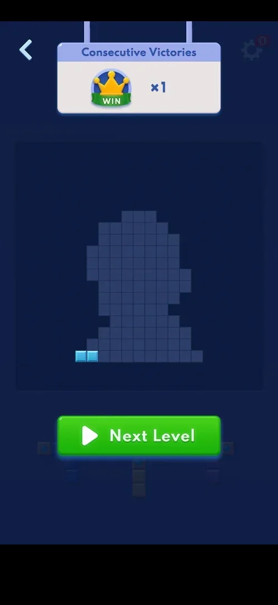

# Adventure Consecutive Victories (win streak)

A counter of [Adventure](adventure.md) levels won in a row. It shows only on the result screen of an
Adventure level, as a panel "Consecutive Victories" with a crown on a WIN ribbon and "xN" that hangs down
over the top of the screen: each win adds one, a loss sets it back to x0 [^s1] [^s2]. It is a different
counter from the home menu's [Consecutive Daily Victories](daily-victories.md), which counts days [^s1].
No reward was seen for it [^s4].

## Why it appeared

The panel dropped onto the result screen of the first Adventure level played: x1 after the level 1 win,
x0 after the level 2 loss [^s1].

## Where to find it

<!-- no-entry: no control opens it; the panel appears by itself on every Adventure result screen -->
No control opens it: it appears by itself at the top of the win or loss screen of every Adventure level
[^s1]. Nothing of it shows during a level [^s1].

## What it looks like

 [^s2]
*The panel at the top of a win screen: crown WIN badge and x2*

A white panel with a blue title bar "Consecutive Victories", hung from two cords from the top edge. On
the left a crown on a green WIN ribbon, on the right the count "xN" [^s2]. It covers the top of the
dimmed level; the rest of the result screen (the trophy grid and Next Level, or "You Can Do It!" and
Retry) is the [Adventure](adventure.md) result [^s2] [^s5].

 [^s2]
*Clip 3 s · [original on YouTube from 12:04](https://youtu.be/RE70Idi_jrA?t=724)*

### Result

 [^s3]
*After a loss the count starts again: the level 2 win shows x1*

## How it works

Version 10.8.1.

| Result | The panel | Source |
|---|---|---|
| Level 1 won | x1 | [^s1] |
| Level 2 lost (No Space Left) | x0 | [^s5] |
| Level 2 won (second try) | x1 | [^s3] |
| Level 3 won | x2 | [^s2] |
| Level 6 won | x5 | [^s6] |
| Level 7 won (win screen hidden by an ad, the app restarted) | not shown | [^s7] |
| Level 8 won | x7 | [^s8] |
| Level 9 won (hard) | x8 | [^s9] |

- Each Adventure win adds one; a loss resets it to x0 [^s1] [^s2].
- The loss screen shows x0 with only Retry and the back arrow: no offer to keep the streak, no price
  [^s5].
- No reward came at x1 or x2: no popup, no coins on the win screen [^s4]. None came at x5, x7 or x8
  either [^s6] [^s8] [^s9].
- A win whose win screen never showed still counts: the level 7 win ended in an ad that needed an app
  restart, and the level 8 win showed x7 [^s7] [^s8].

 [^s8]
*x7 after level 8: the hidden level 7 win counted*
- The home menu's daily counter did not follow it: after the level 2 loss the panel showed x0 and the
  daily counter stayed x1 [^s1].

## Cases

| Case | What was done | Result | Source |
|---|---|---|---|
| Why it appeared <!-- case:chk-appeared --> | Won level 1, lost level 2 | ✅ The panel on the result screen: x1, then x0 | [^s1] |
| Where to find it <!-- case:chk-entry --> | — | ✅ No entry: it appears by itself on the Adventure result screen | [^s1] |
| Its screen <!-- case:chk-screen --> | Won and lost Adventure levels | ✅ The "Consecutive Victories" panel with the crown WIN badge and xN over the win or loss screen | [^s1] |
| The counter <!-- case:chk-counter --> | Four Adventure results | ✅ Counts Adventure level wins in a row; shown only on the result panel | [^s1] |
| During a level <!-- case:chk-in-level --> | Played levels 1-4 | ✅ Nothing shows during the level | [^s1] |
| What breaks it <!-- case:chk-break --> | Lost level 2 | ✅ A loss resets it to x0; the home menu's daily counter stayed x1 | [^s1] |
| Rewards <!-- case:chk-rewards --> | Reached x1 and x2 | ✅ No reward seen; the panel only counts | [^s4] |
| Offers to keep it <!-- case:chk-save --> | Looked at the loss screen | ✅ None: x0 with only Retry and the back arrow, no revive or paid keep | [^s5] |
| Win under the streak <!-- case:under-win --> | Won levels 1, 2 (second try) and 3 | ✅ Each win adds one: x1, x1 (from 0), x2 | [^s2] |
| No Space Left under the streak <!-- case:under-no-space-left --> | Lost level 2 at x1 | ✅ Reset to x0 on the loss screen | [^s5] |
| A win hidden by an ad and an app restart <!-- case:restart-after-win --> | Restarted the app out of the level 7 ad, then won level 8 | ✅ Still counted: x5 after level 6, x7 after level 8, x8 after level 9 | [^s8] |
| Restart (gear > Replay) under the streak <!-- case:under-restart --> | — | not verified |  |
| Quit (gear > Home) under the streak <!-- case:under-quit --> | Quit level 4 at x2 with gear > Home | not verified: the panel only shows on a result screen, and none came after the quit |  |
| Leaving the app under the streak <!-- case:under-exit-app --> | — | not verified |  |

## Not verified

- Settings gear > Replay in a level with the streak running: kept or reset <!-- case:under-restart -->
- Quitting a level (gear > Home) with the streak running: kept or reset; to be read on the next result screen <!-- case:under-quit -->
- Leaving the app in a level with the streak running <!-- case:under-exit-app -->
- Whether anything pays at a higher count (nothing up to x8)

[^s1]: session 20261003-235233-chrono-2FYKPJ, step 30 — [video at 6:08](https://youtu.be/RE70Idi_jrA?t=368)
[^s2]: session 20261003-235233-chrono-2FYKPJ, step 59 — [video at 12:07](https://youtu.be/RE70Idi_jrA?t=727)
[^s3]: session 20261003-235233-chrono-2FYKPJ, step 45 — [video at 9:41](https://youtu.be/RE70Idi_jrA?t=581)
[^s4]: session 20261003-235233-chrono-2FYKPJ, step 60 — [video at 12:34](https://youtu.be/RE70Idi_jrA?t=754)
[^s5]: session 20261003-235233-chrono-2FYKPJ, step 29 — [video at 5:47](https://youtu.be/RE70Idi_jrA?t=347)

[^s6]: session 20261006-133549-chrono-2FYKPJ, step 60 — [video at 20:18](https://youtu.be/UNoU_1pbeJk?t=1218)
[^s7]: session 20261006-133549-chrono-2FYKPJ, step 72 — [video at 24:43](https://youtu.be/UNoU_1pbeJk?t=1483)
[^s8]: session 20261006-133549-chrono-2FYKPJ, step 84 — [video at 26:43](https://youtu.be/UNoU_1pbeJk?t=1603)
[^s9]: session 20261006-133549-chrono-2FYKPJ, step 104 — [video at 31:39](https://youtu.be/UNoU_1pbeJk?t=1899)
