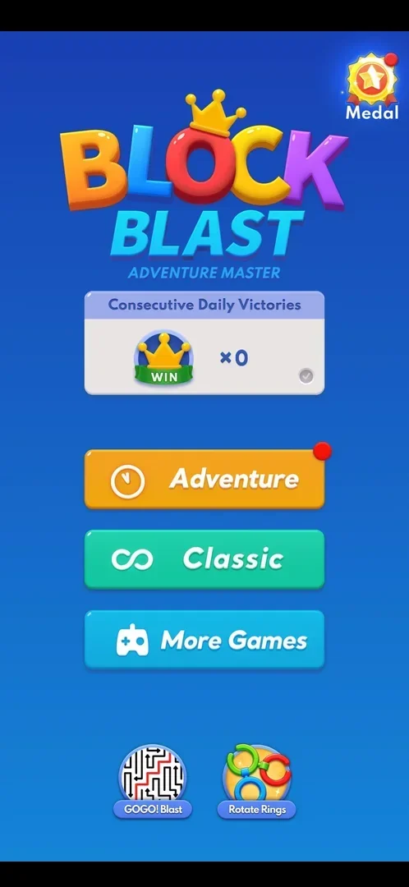
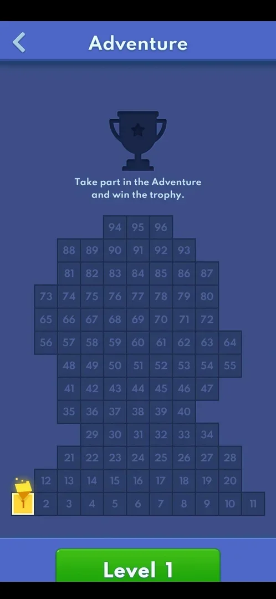
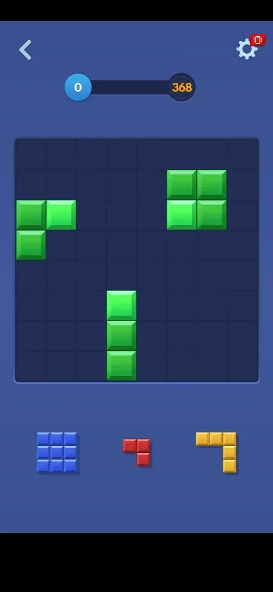
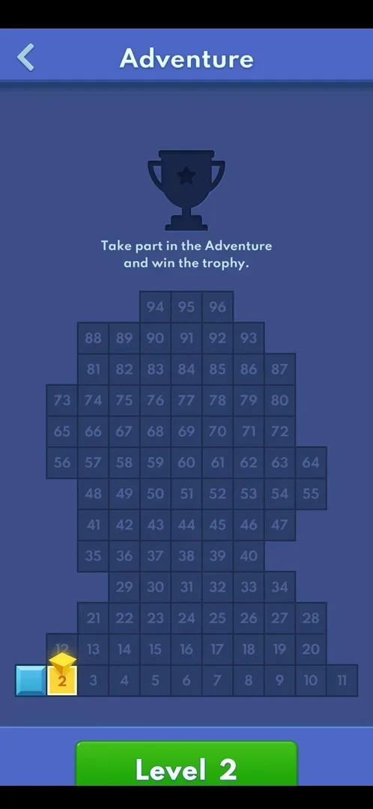
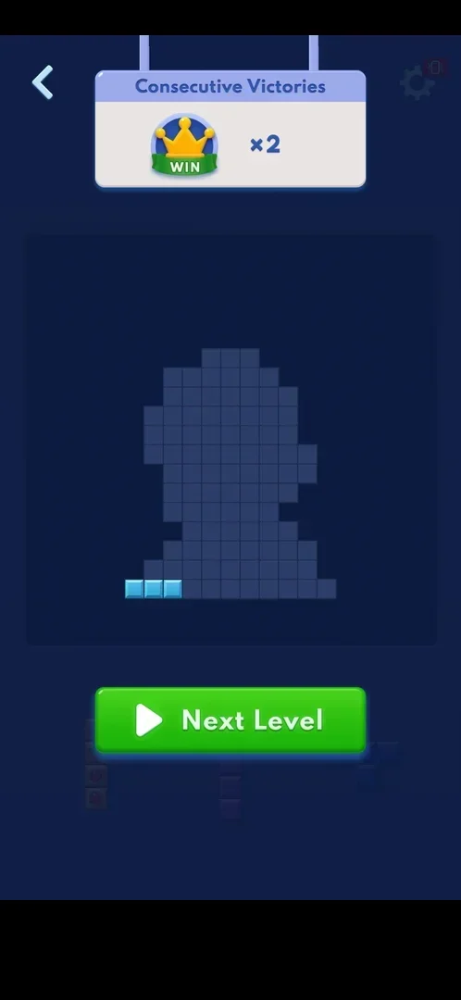
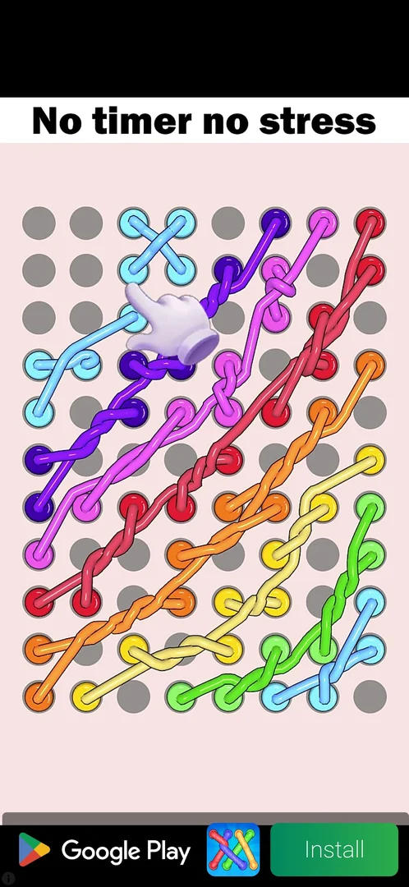
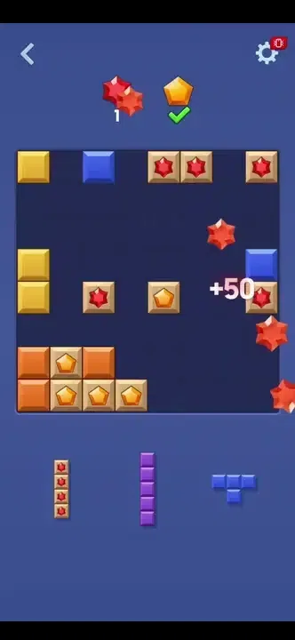
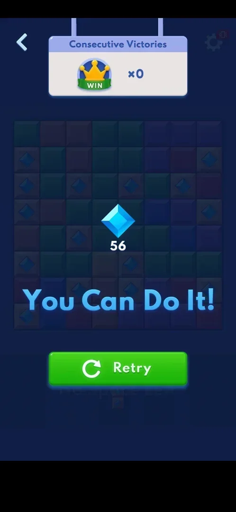

# Adventure mode

A mode of 96 levels in a row. Each level is the 8x8 board, tray and drag of [Classic](classic.md), but
it starts on a pre-built layout and has a goal: a target score (levels 1 and 9 to 12) or gems to
collect (levels 2 to 4, 6 to 8 and 13; see [Adventure diamond-collection levels](adv-diamonds.md)) [^s28] [^s29]. The levels sit on a map shaped like a
trophy; winning all of them wins the trophy [^s3] [^s4] [^s6]. A win adds one to the
[Adventure win streak](adv-win-streak.md) and counts for the home menu's
[Consecutive Daily Victories](daily-victories.md) [^s9] [^s10]. No energy, lives, timer or currency
was seen [^s11].

## Why it appeared

On the home menu with a red dot, the first time the menu was opened (the phone's Back key from a classic
game) [^s1]. The red dot was gone after the first Adventure win [^s10].

## Where to find it

Home menu > the orange Adventure button, the first of the three mode buttons, with a red dot top right
until the first win [^s2] [^s10]. The home menu is reached with the Back key from the classic board (see
[Home menu](home-menu.md)).

 [^s2]
*The orange Adventure button with a red dot, above Classic*

## What it looks like

 [^s3]
*The Adventure map before the first level: cell 1 is the current one*

The Adventure screen: a back arrow and the title "Adventure"; a dark trophy silhouette with the line
"Take part in the Adventure and win the trophy."; under it 96 numbered cells laid out in the shape of a
trophy, from 1 bottom left to 96 at the top; a green "Level N" button at the bottom. The current level's
cell is yellow with a marker on it; won cells are filled light blue [^s3] [^s5].

## What you can do

| Tab or button | What it does |
|---|---|
| [Level N](#level-n) | Plays the current level |
| [Level cells](#level-cells) | Show progress; a tap on a future cell does nothing |
| [Gear in a level](#gear-in-a-level) | Settings with Home and Replay |
| [Win screen](#win-screen) | Next Level, or the back arrow to the home menu |
| [Loss screen](#loss-screen) | Retry, or the back arrow to the home menu |

### Level N

 [^s4]
*Level 1: a score bar to 368 in place of Classic's score*

The green button at the bottom of the map opens the current level straight away, with no intro or
goal popup [^s4]. The level screen has a back arrow, the gear and the goal at the top, the board and
the tray [^s4]. Level 1's goal is a score bar from 0 to 368; from level 2 the goal is a counter for each
gem kind [^s4] [^s6].

 [^s6]
*Level 2: the goal is 60 diamonds*

### Level cells

 [^s5]
*After the first win: cell 1 lit, cell 2 current, Level 2 button*

The cells show progress only. A tap on a future cell (5) changed nothing; only the Level N button plays,
and only the current level [^s11].

### Gear in a level

 [^s7]
*The in-level Settings: Home and Replay instead of More Games and Default Skin*

The gear opens a Settings popup with Sound, BGM, Vibration with a slider, More Settings, Home and Replay
[^s7] (see [Settings](settings.md)). Home leaves for the home menu at once, with no confirmation and no
cost; the level stays the current one [^s12]. Replay was not tapped.

### Win screen

 [^s16]
*The win screen after level 3: win streak x2, three cells lit, Next Level*

When the goal is met the board dims, a "Consecutive Victories xN" panel drops in from the top, the
trophy grid shows the won cell lit, and a green Next Level button is at the bottom; the back arrow stays
top left [^s9] [^s16]. No coins or other currency were paid [^s9]. The back arrow goes to the home menu
[^s10]. Next Level starts the next level at once, with its Target Collection banner (level 6 to
level 7) [^s18]. When the next level is hard the button is a purple "Next Hard Level" (after level 8), and
it starts the hard level the same way [^s19] (see [Adventure hard levels](adv-hard-levels.md)).

 [^s20]
*An interstitial ad in place of the win screen, right after the level 7 win*

When an interstitial ad is due, it starts right as the level is won, before the win screen (levels 7,
9, 11, 12 and 13) [^s21] [^s22] [^s30] [^s31] [^s32]. After levels 11 and 12 the phone's Back key on the ad's
end card closed it and the win screen followed [^s33] [^s31]. After level 7 the ad ended on a playable end card with no X that ignored the Back key,
and the app had to be restarted: the win was kept, the map showed Level 8 as current and the win streak
went on counting [^s21] [^s23]. The same happened after level 13: the map showed Level 14 as current
[^s29].

 [^s16]
*Clip 3 s · [original on YouTube from 12:04](https://youtu.be/RE70Idi_jrA?t=724)*

### Loss screen

 [^s8]
*The loss screen: the gems still needed, "You Can Do It!" and Retry; the win streak back to x0*

When no tray piece fits before the goal is met: the board dims, the goal shows what is left (56 of 60
diamonds), "You Can Do It!" and a green Retry button; the "Consecutive Victories" panel drops in at x0
(it was x1). No revive or continue offer, no price, no lives spent [^s8]. The back arrow goes to the
home menu [^s10]. Retry was not tapped: the level was restarted from the map instead [^s13].

## How it works

Version 10.8.1.

- Levels are played in order: only the current one can be opened, from the Level N button [^s11].
- Each level has a pre-built board and a goal. Goals so far: level 1 a score of 368; level 2 60
  diamonds; level 3 56 red and 54 orange gems; level 4 22 blue diamonds, 20 orange gems and 20 yellow
  stars [^s4] [^s6] [^s15] [^s12]. Gems are collected by clearing the row or column that holds the gem
  tile (see [Adventure diamond-collection levels](adv-diamonds.md)) [^s17].
- No move limit, timer, boosters, energy or lives [^s6] [^s11].
- A lost level restarts with the same pre-built board and goal: level 2 opened again with the same
  60-diamond tree layout [^s13].
- A win pays no currency; it lights the level's cell on the trophy map, adds one to the
  [Adventure win streak](adv-win-streak.md) and counts for the day on
  [Consecutive Daily Victories](daily-victories.md) [^s9] [^s10] [^s16].
- An interstitial ad came once in four results: after the level 2 win on the second try, before the win
  screen [^s14]. Its top-left icon opened the Play Store (see
  [Interstitial ad](ad-interstitial-classic.md)).
- Adventure ads follow the same time cooldown as classic game-over ads, counted from the previous ad's
  close whatever mode it came in. Four wins after a classic ad closed at session minute 18.2
  [^s24] [^s21] [^s23] [^s25]:

| Level | Won at (session minute) | Since the previous ad was closed | First result after an app start | Ad |
|---|---|---|---|---|
| 6 | about 22.0 | 3.8 min (a classic ad) | no | no |
| 7 | about 23.3 | 5.1 min (the same classic ad) | no | yes, before the win screen |
| 8 | about 28.7 | about 2.2 min (the level 7 ad, ended by a restart) | yes | no |
| 9 (hard) | about 31.2 | about 4.7 min (the same) | no | yes, before the win screen |

- Level 6 had no ad 3.8 minutes after a close, although a classic game over 3.3 minutes after a close
  had one in the same session [^s26].
- A later session timed four wins against the previous ad's close on purpose (level 13's last clear was
  held back). The first close was a restart of the app out of a classic ad at session minute 4.2
  [^s34] [^s28] [^s33] [^s31] [^s29]:

| Level | Won at (session minute) | Since the previous ad was closed | Ad | Ad closed |
|---|---|---|---|---|
| 10 | about 6.9 | 2.7 min (a classic ad, closed by a restart) | no | — |
| 11 | about 11.6 | 7.4 min (the same) | yes (Royal Match) | Back on its end card, minute 13.6 |
| 12 | about 20.4 | 6.8 min (the level 11 ad) | yes (a nail game) | Back on its end card, minute 21.3 |
| 13 | about 26.0 | 4.7 min (the level 12 ad) | yes (a flower puzzle) | a restart: a playable end card with no working close |

- With level 6 (none 3.8 minutes after a close) and level 13 (an ad 4.7 minutes after one), the Adventure
  cooldown ends between 3.8 and 4.7 minutes after the previous ad's close [^s29]. A classic game over
  had an ad 3.3 minutes after a close [^s26]: inferred, the Adventure cooldown is longer than classic's, or
  it was a different close (a restart against Back); task adv-ad-cooldown-4min.
- Goals of later levels: level 6 40/40/40 gems, level 7 22/22/20, level 8 30/30/30; hard level 9 a
  score of 687 [^s27] [^s22]; level 10 a score of 395, level 11 641, level 12 733; level 13 34 stars and
  34 purple gems [^s28] [^s33] [^s31] [^s29].
- Levels 10 to 12 won in a row took the win streak to x10 after level 11 and x11 after level 12
  [^s33] [^s31] (see [Adventure win streak](adv-win-streak.md)).
- Levels 1 to 3 each took about 2 to 3 minutes of play [^s9] [^s14] [^s16].

## Cases

| Case | What was done | Result | Source |
|---|---|---|---|
| Why it appeared <!-- case:chk-appeared --> | Opened the home menu with Back | ✅ On the menu with a red dot; the dot was gone after the first win | [^s1] |
| Where to find it <!-- case:chk-entry --> | Home menu > Adventure | ✅ The orange Adventure button opens the Adventure map | [^s2] |
| Its screen <!-- case:chk-screen --> | Opened Adventure | ✅ Back arrow, title, trophy silhouette, 96-cell trophy-shaped grid, green Level N button | [^s3] |
| Rules <!-- case:chk-rules --> | Played levels 1 and 2 | ✅ Classic's board, tray and drag with a goal and a pre-built board: level 1 a score of 368, level 2 60 diamonds; no boosters | [^s6] |
| Different goals per level <!-- case:goals --> | Opened levels 1 to 4 | ✅ Score 368; 60 diamonds; 56 red + 54 orange; 22 blue + 20 orange + 20 yellow stars | [^s12] |
| A win <!-- case:chk-win --> | Won level 1 | ✅ Board dims, Consecutive Victories x1, the won cell lit, Next Level; no currency | [^s9] |
| A loss <!-- case:chk-loss --> | Lost level 2 on No Space Left | ✅ The goal left (56), "You Can Do It!", Retry, back arrow; win streak x1 to x0; no revive, no cost | [^s8] |
| Retry after a loss <!-- case:retry --> | Back arrow, then Adventure > Level 2 | ✅ The same level with the same pre-built board and goal | [^s13] |
| Quit a level <!-- case:quit --> | Gear > Home in level 4 | ✅ Home menu at once, no confirmation, no cost; level 4 stays current | [^s12] |
| An ad before the win screen <!-- case:ad-before-win --> | Won levels 6 to 9; restarted the app out of the level 7 ad | ✅ The ad comes right at the win, before the win screen (levels 7, 9, 11, 12 and 13), on a time cooldown from the previous ad's close (ends between 3.8 and 4.7 min in Adventure); the level 7 and level 13 wins were kept after a restart | [^s21] [^s29] |
| Next Level on the win screen <!-- case:next-level --> | Tapped Next Level after level 6 and Next Hard Level after level 8 | ✅ The next level starts at once with its Target Collection banner; Next Hard Level starts hard level 9 | [^s19] |
| Progression inside the mode <!-- case:chk-progression --> | Looked at the map before and after wins | ✅ 96 levels in a trophy-shaped grid; the current cell yellow with a marker, won cells lit | [^s3] |
| Limits <!-- case:chk-limits --> | Looked at the map and levels; tapped a future cell | ✅ No energy, lives, timer or attempt counter; future cells do nothing | [^s11] |

## Not verified

- What the loss screen's Retry button does (the level was restarted from the map)
- Settings gear > Replay inside a level
- Leaving the app in a level and coming back
- The exact Adventure ad cooldown between 3.8 and 4.7 minutes after a close, and whether a close by restart counts the same as one by Back (task adv-ad-cooldown-4min)
- What winning all 96 levels pays

[^s1]: session 20261003-212548-chrono-2FYKPJ, step 29 — [video at 5:55](https://youtu.be/ReMKqt9albk?t=355)
[^s2]: session 20261003-235233-chrono-2FYKPJ, step 5 — [video at 1:28](https://youtu.be/RE70Idi_jrA?t=88)
[^s3]: session 20261003-235233-chrono-2FYKPJ, step 6 — [video at 1:36](https://youtu.be/RE70Idi_jrA?t=96)
[^s4]: session 20261003-235233-chrono-2FYKPJ, step 7 — [video at 1:49](https://youtu.be/RE70Idi_jrA?t=109)
[^s5]: session 20261003-235233-chrono-2FYKPJ, step 23 — [video at 4:35](https://youtu.be/RE70Idi_jrA?t=275)
[^s6]: session 20261003-235233-chrono-2FYKPJ, step 25 — [video at 4:57](https://youtu.be/RE70Idi_jrA?t=297)
[^s7]: session 20261003-235233-chrono-2FYKPJ, step 63 — [video at 13:13](https://youtu.be/RE70Idi_jrA?t=793)
[^s8]: session 20261003-235233-chrono-2FYKPJ, step 29 — [video at 5:47](https://youtu.be/RE70Idi_jrA?t=347)
[^s9]: session 20261003-235233-chrono-2FYKPJ, step 21 — [video at 3:47](https://youtu.be/RE70Idi_jrA?t=227)
[^s10]: session 20261003-235233-chrono-2FYKPJ, step 22 — [video at 4:11](https://youtu.be/RE70Idi_jrA?t=251)
[^s11]: session 20261003-235233-chrono-2FYKPJ, step 24 — [video at 4:46](https://youtu.be/RE70Idi_jrA?t=286)
[^s12]: session 20261003-235233-chrono-2FYKPJ, step 64 — [video at 13:28](https://youtu.be/RE70Idi_jrA?t=808)
[^s13]: session 20261003-235233-chrono-2FYKPJ, step 32 — [video at 6:39](https://youtu.be/RE70Idi_jrA?t=399)
[^s14]: session 20261003-235233-chrono-2FYKPJ, step 45 — [video at 9:41](https://youtu.be/RE70Idi_jrA?t=581)
[^s15]: session 20261003-235233-chrono-2FYKPJ, step 48 — [video at 10:21](https://youtu.be/RE70Idi_jrA?t=621)
[^s16]: session 20261003-235233-chrono-2FYKPJ, step 59 — [video at 12:07](https://youtu.be/RE70Idi_jrA?t=727)
[^s17]: session 20261003-235233-chrono-2FYKPJ, step 27 — [video at 5:32](https://youtu.be/RE70Idi_jrA?t=332)

[^s18]: session 20261006-133549-chrono-2FYKPJ, step 61 — [video at 20:39](https://youtu.be/UNoU_1pbeJk?t=1239)
[^s19]: session 20261006-133549-chrono-2FYKPJ, step 85 — [video at 27:03](https://youtu.be/UNoU_1pbeJk?t=1623)
[^s20]: session 20261006-133549-chrono-2FYKPJ, step 67 — [video at 21:27](https://youtu.be/UNoU_1pbeJk?t=1287)
[^s21]: session 20261006-133549-chrono-2FYKPJ, step 72 — [video at 24:43](https://youtu.be/UNoU_1pbeJk?t=1483)
[^s22]: session 20261006-133549-chrono-2FYKPJ, step 104 — [video at 31:39](https://youtu.be/UNoU_1pbeJk?t=1899)
[^s23]: session 20261006-133549-chrono-2FYKPJ, step 84 — [video at 26:43](https://youtu.be/UNoU_1pbeJk?t=1603)
[^s24]: session 20261006-133549-chrono-2FYKPJ, step 60 — [video at 20:18](https://youtu.be/UNoU_1pbeJk?t=1218)
[^s25]: session 20261006-133549-chrono-2FYKPJ, step 101 — [video at 29:02](https://youtu.be/UNoU_1pbeJk?t=1742)
[^s26]: session 20261006-133549-chrono-2FYKPJ, step 37 — [video at 16:31](https://youtu.be/UNoU_1pbeJk?t=991)
[^s27]: session 20261006-133549-chrono-2FYKPJ, step 73 — [video at 25:03](https://youtu.be/UNoU_1pbeJk?t=1503)

[^s28]: session 20261006-141221-chrono-2FYKPJ, step 18 — [video at 6:32](https://youtu.be/x8gS5EhEoGs?t=392)
[^s29]: session 20261006-141221-chrono-2FYKPJ, step 93 — [video at 28:25](https://youtu.be/x8gS5EhEoGs?t=1705)
[^s30]: session 20261006-141221-chrono-2FYKPJ, step 43 — [video at 11:15](https://youtu.be/x8gS5EhEoGs?t=675)
[^s31]: session 20261006-141221-chrono-2FYKPJ, step 79 — [video at 20:24](https://youtu.be/x8gS5EhEoGs?t=1224)
[^s32]: session 20261006-141221-chrono-2FYKPJ, step 88 — [video at 24:56](https://youtu.be/x8gS5EhEoGs?t=1496)
[^s33]: session 20261006-141221-chrono-2FYKPJ, step 44 — [video at 12:54](https://youtu.be/x8gS5EhEoGs?t=774)
[^s34]: session 20261006-141221-chrono-2FYKPJ, step 9 — [video at 3:59](https://youtu.be/x8gS5EhEoGs?t=239)
