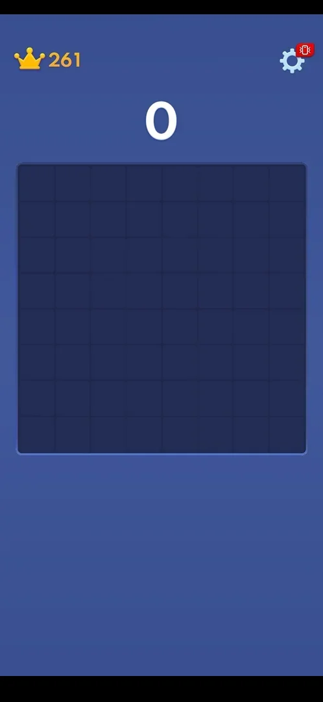
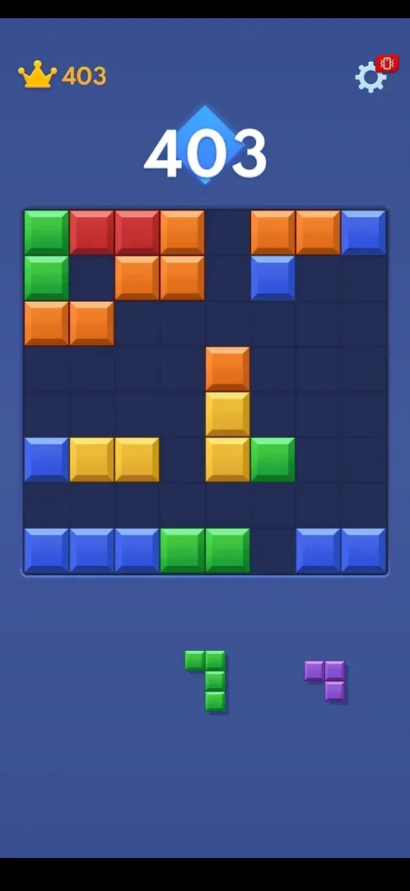
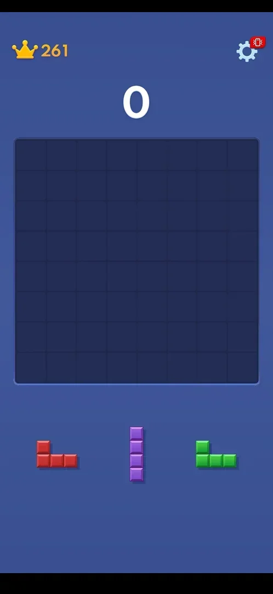
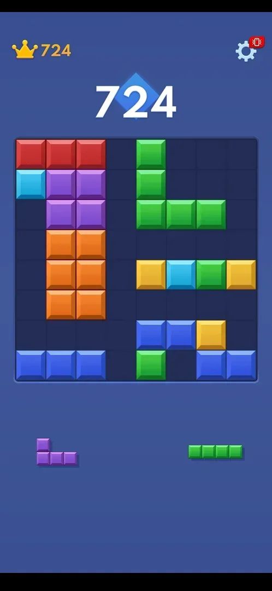
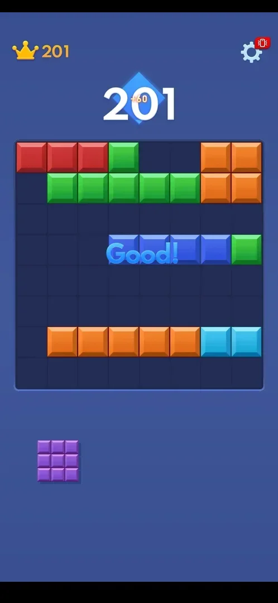

# Classic endless mode

Classic is the game itself: an 8x8 board and a tray of three block pieces. The player drags pieces onto
the board; a full row or column disappears and scores points, and the game goes on as long as the
pieces still fit. There is no level and no timer; the goal is to beat one's own best score
[^s3] [^s2].

## Where to find it

<!-- no-entry: there is no home screen or mode button; the game opens straight onto the classic board (after the one-move tutorial on the first launch) -->

There is nothing to tap: in version 10.6.5 the game has no home screen and opens straight onto the
classic board. On the first launch the [First-launch tutorial](tutorial.md) comes first and the classic
game continues from its board [^s3]. The splash screen's subtitle reads
"Adventure Master", but no other mode was found [^s1].

## What it looks like

At the top left a crown with the best score, at the top right the gear that opens
[Settings](settings.md); the current score in large digits above the board; the empty 8x8 board in the
middle; three pieces in the tray below it [^s1]. Pieces seen: straight lines of 2, 3 and 5 cells,
2x2 and 3x3 squares, and L, T and Z shapes [^s4] [^s2]; in a later game also straight lines of 4 cells,
small and large L shapes, and three pieces at once that included two 3x3 squares [^s9]
[^s10]. While the score is 0 it stands alone; in frames where the current score is also
the best score, it sits on a blue diamond (inferred from the frames, not confirmed as a "new best"
marker) [^s11] [^s12].

 [^s11]

 [^s13]

 [^s1]

### A long game

 [^s12]

One game was played for about 8 minutes, about 45 placements, from 0 to 724 points. The best score
by the crown rose with the score the whole time (from 261 to 724), and nothing interrupted the game:
no ad, no revive offer and no game over appeared [^s12].

### Result

A piece that completes two rows at once: both rows vanish, "+60" pops up in a blue diamond over the
score and "Good!" is written across the board. The crown's best score rises together with the score
once the old best is passed [^s2].

 [^s2]

## How it works

Numbers are from version 10.6.5.

- Placing a piece scores one point per cell [^s5].
- Clearing one line adds about 10: a 3-cell piece that completed a row gave +13
  [^s5].
- Clearing two lines with one piece gave +60 and the word "Good!" [^s2].
- When all three pieces of the tray are placed, a new set of three appears
  [^s3].
- The best score by the crown updates live during the game, not only at its end: it went from 261 to 724
  while playing [^s12].
- No ad was shown during play: none in a game of 724 points and about 45 placements [^s12].
- Whether a tray piece that fits nowhere is drawn dimmed is not known yet: no such piece has been seen
  [^s13].

  > ⚠️ Previously (v10.6.5, 2026-10-01): "A tray piece that does not fit anywhere on the board is drawn
  > dimmed (half-bright)". The "half bright" piece of that session was a normal green piece that the
  > solver misread (its dark bevel was not counted); in the frame it is as bright as the others [^s13].
- The best score is kept when the game is restarted with [Replay](replay.md) [^s1].
- While dragged, a piece floats well above the finger and travels about one and a half times as far as
  the finger does; a very short drag drops the piece back into the tray
  [^s6] [^s7].
- Between the tutorial (score 6) and the first opening of Settings the score and best score read 124
  with no move made in between; the reason is unknown [^s8].

## Cases

| Case | What was done | Result | Source |
|---|---|---|---|
| Clear two rows with one piece | A T piece dropped to complete two rows | ✅ +60 and "Good!" | [^s2] |
| Reach game over: what the result screen offers (revive, ad, replay) | One game played to 724 points (about 8 minutes, about 45 placements) | not verified: the session ended before game over | [^s12] |
| An ad during play | The same game of 724 points | ✅ no ad and no interruption | [^s12] |
| Scoring for 1, 2, 3+ lines and combos | One and two lines seen | partly: 3+ lines and combos not seen | [^s5] |

## Not verified

- Game over: what happens when no piece fits (result screen, revive offer, ad). Not reached in a game of
  about 35 moves, nor in a second game of 724 points and about 45 placements [^s12].
- Scoring for three or more lines at once and for clears on consecutive moves (combos).
- Whether pieces can be rotated (inferred no: none was rotated in this session).
- Whether an "Adventure" mode exists, as the splash subtitle suggests.
- Whether the blue diamond behind the score marks a new best score (seen at 201/201, 403/403 and
  724/724, absent at 0 with best 261) [^s2] [^s11] [^s13] [^s12].
- Where the 124 points after the tutorial came from.

[^s1]: session 20261001-200952-chrono-2FYKPJ, step 42 — [video at 10:02](https://youtu.be/1AkjzicKdRM?t=602)
[^s2]: session 20261001-200952-chrono-2FYKPJ, step 30 — [video at 6:32](https://youtu.be/1AkjzicKdRM?t=392)
[^s3]: session 20261001-200952-chrono-2FYKPJ, step 5 — [video at 1:07](https://youtu.be/1AkjzicKdRM?t=67)
[^s4]: session 20261001-200952-chrono-2FYKPJ, step 9 — [video at 2:10](https://youtu.be/1AkjzicKdRM?t=130)
[^s5]: session 20261001-200952-chrono-2FYKPJ, step 23 — [video at 5:00](https://youtu.be/1AkjzicKdRM?t=300)
[^s6]: session 20261001-200952-chrono-2FYKPJ, step 12 — [video at 3:05](https://youtu.be/1AkjzicKdRM?t=185)
[^s7]: session 20261001-200952-chrono-2FYKPJ, step 25 — [video at 5:21](https://youtu.be/1AkjzicKdRM?t=321)
[^s8]: session 20261001-200952-chrono-2FYKPJ, step 7 — [video at 1:41](https://youtu.be/1AkjzicKdRM?t=101)

[^s9]: session 20261001-230945-chrono-2FYKPJ, step 54 — [video at 7:07](https://youtu.be/FCyMJVmeYx4?t=427)
[^s10]: session 20261001-230945-chrono-2FYKPJ, step 40 — [video at 5:29](https://youtu.be/FCyMJVmeYx4?t=329)
[^s11]: session 20261001-230945-chrono-2FYKPJ, step 0 — [video at 0:00](https://youtu.be/FCyMJVmeYx4?t=0)
[^s12]: session 20261001-230945-chrono-2FYKPJ, step 63 — [video at 8:12](https://youtu.be/FCyMJVmeYx4?t=492)
[^s13]: session 20261001-230945-chrono-2FYKPJ, step 32 — [video at 4:33](https://youtu.be/FCyMJVmeYx4?t=273)
