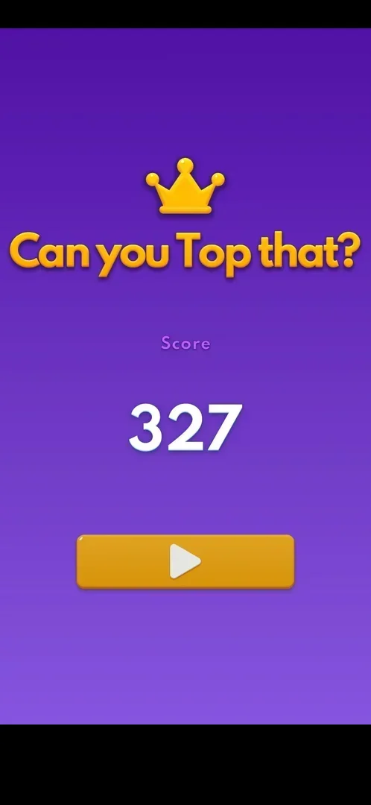
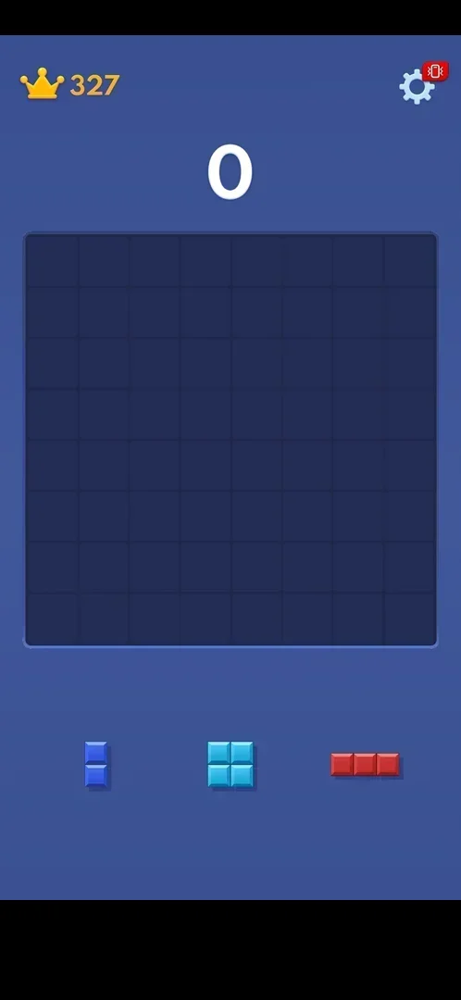
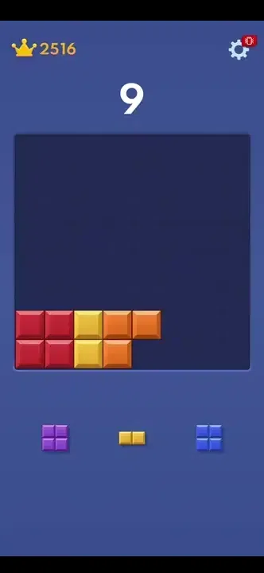
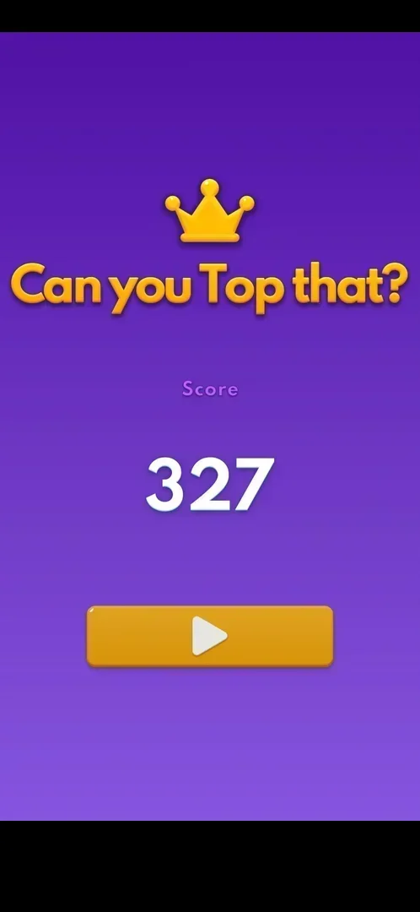
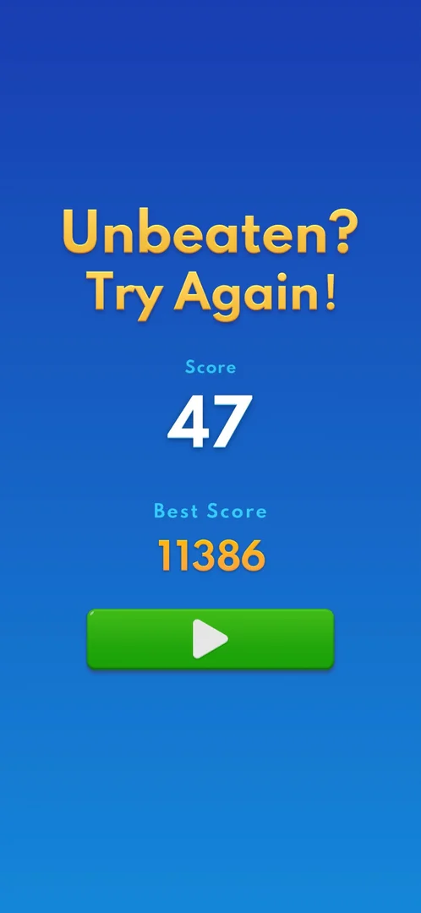

# Classic mode (endless 8x8)

The game's main board: an 8x8 grid, three pieces in a tray under it, and a score that grows as pieces
are placed and rows or columns are cleared. There are no levels or goals: a game runs until no tray piece
fits, then shows the score and a Play button for the next board [^s1] [^s2]. The app opens on it; the
home menu with the other modes is behind the phone's Back key [^s3].

## Why it appeared

The default board on launch, after the tutorial [^s4].

## Where to find it

- On launch: after the Terms of Use and the one tutorial board the app opens straight on the classic
  board, and later launches open on it too [^s2] [^s5].
- Home menu > the green Classic button, the second of the three mode buttons (see
  [Home menu](home-menu.md)) [^s6].
- After a game over: the orange Play button on the "Can you Top that?" screen starts a new empty board
  [^s7].

 [^s1]
*The orange Play button under the score is the only way on from the game-over screen*

 [^s3]
*The green Classic button on the home menu opens a classic board*

## What it looks like

 [^s5]
*The classic board: crown and best score top left, gear top right, the score above the 8x8 grid, three pieces below*

- The current score, large, above the board [^s2].
- A crown with the best score top left. It is not a button: a tap changes nothing [^s8].
- The Settings gear top right, with a red badge showing a vibrating phone [^s2] (see
  [Settings](settings.md)).
- Three pieces in the tray under the board [^s2].
- At high scores a cyan diamond badge stands behind the score: seen at 1106 and at 2512, gone at 2516
  [^s9] [^s14]. What it marks is not verified.

No other control is on the screen: no booster, no coin counter, no level number, no menu button [^s2].

## What you can do

| Tab or button | What it does |
|---|---|
| [Tray pieces](#tray-pieces) | Drag a piece onto the board |
| [Settings gear](#settings-gear) | Opens Settings over the board; Replay restarts |
| [Back key](#back-key) | Opens the home menu |
| [Play](#play) | On the game-over screen: starts a new board |

### Tray pieces

<!-- no-frame: the tray is on the board frame above -->
Each piece is dragged from the tray onto free cells [^s11]. Shapes seen include squares (2x2 and 3x3),
straight bars of 1 to 5 cells, 2x3 and 3x2 blocks, L, T, S/Z and plus-like shapes, a single cell and a
diagonal of separate cells [^s12] [^s13] [^s9] [^s14]. No special pieces or obstacles were seen in
two games (scores 327 and 2516) [^s1] [^s14].

### Settings gear

<!-- no-frame: the gear is on the board frame above; Settings has its own page -->
Opens the Settings popup: Sound, BGM, Vibration, More Games, More Settings, Replay and Default Skin
[^s15]. Replay in a game in progress (score 2516) played an interstitial ad, then a new empty board with
score 0; the best score stayed 2516. No confirmation and no revive offer came before it [^s16] [^s17].

### Back key

<!-- no-frame: the phone's Back key is not on the screen; the home menu frame is above -->
The phone's Back key on the classic board opens the home menu at once, with no confirmation and no cost
[^s3]. It was pressed on an empty board at score 0, right after Replay [^s17] [^s3]. Classic on the home
menu then opened a board with score 0 and the best kept (2516) [^s6]; as the board left was empty,
whether a game in progress is kept is not verified.

### Play

<!-- no-frame: the button is on the game-over frame above -->
The only button on the game-over screen; it opens a new empty board with the best score kept (327)
[^s7].

## How it works

Version 10.8.1.

- A row or a column that is completely filled clears. The tutorial's one 2x2 drop cleared two rows and
  two columns at once and showed "+120" [^s2].
- The score of the tutorial board carries into the first classic game: it counted up from 4 to 124
  after that clear (a frame taken mid count-up shows 19) [^s2] [^s15].
- The game ends only when no tray piece fits anywhere. On a board whose bottom row was empty, with three
  straight bars of 5, 3 and 4 cells in the tray, there was no game over: the pieces fit there [^s14].
  The drags into that bottom row did not drop then, so the game stood at 2516 [^s14]. A later session
  dropped pieces into the bottom row by hand four times out of four, among them a 1-row piece of two
  cells: the stall was a limit of the automated drag, not of the game [^s19].
- While a piece is dragged it is drawn above the finger: to drop a 1-row piece on the bottom row the
  finger ended about two cells under the board's bottom edge [^s19].
- Placing that 2-cell piece raised the score from 9 to 11 [^s19]; inferred: one point per cell
  placed.
- The best score is kept across Replay, the Back key and new boards [^s17] [^s6].
- In the first game the crown's best score equals the current score all the way, as every score is a
  new best [^s12].
- From a score of 223 a ring of green dots surrounds the board; it was not there at 187 [^s12]
  [^s13]. What it marks is not verified (inferred: a new best).
- The first game, played to lose fast, lasted about 3.5 minutes and about 44 moves and ended at 327
  [^s1]. The second game reached 2516 in about 4 minutes [^s14].

 [^s19]
*Clip 5 s · [original on YouTube from 1:00](https://youtu.be/RE70Idi_jrA?t=60)*

## Outcomes

| Outcome | What happens | Source |
|---|---|---|
| Loss: no tray piece fits | "No Space Left" banner with the piece that does not fit, the empty cells fill with colour, an interstitial ad (not at every game over), then the result screen with the score and Play; its title changes from game to game | [^s1] [^s20] |
| Restart: Settings > Replay | An interstitial ad, then a new empty board, score 0, best kept; no confirmation | [^s17] |
| Quit: the Back key | The home menu at once, no confirmation, no cost; whether a game in progress is kept is not verified (the board left was empty) | [^s3] |
| Leaving the app | The game in progress is kept: a game left at 11366 when the app was stopped at the end of a session came back on the same board at 11366 on the next launch, and went on to 11386 | [^s21] |
| Win | Does not exist: the board is endless, a game only ends in a loss | [^s1] |

### Loss

 [^s18]
*"No Space Left": the last piece is shown in the banner, the board is filled with colour*

1. When no piece left in the tray fits, a dark banner "No Space Left" shows that piece, and the board's
   empty cells are filled with coloured blocks [^s18].
2. A black loading screen, then a full-screen video ad (see [Interstitial ad](ad-interstitial-classic.md))
   [^s18].
3. After the ad closes the "No Space Left" board is back for a moment [^s1].
4. "Can you Top that?" on purple, a crown, "Score" and the score, one orange Play button [^s1].

No revive or second-chance offer was shown, and the end screen has no home or menu button [^s1].
Six game overs on 6 October went the same way with no revive offer; two of them had no ad at all
(see [Interstitial ad](ad-interstitial-classic.md)) [^s20]. Their result screens were blue, with "Score",
"Best Score" and a green Play button, under a title that changed between games: "Your Best is Next",
"Your High Score is Calling!", "Unbeaten? Try Again!" and "Just One More!" [^s22] [^s23] [^s24] [^s25].
After the sixth one a [Rating popup](rate-us.md) came over that screen [^s25].

 [^s1]
*The end screen after the first game: score 327, no revive offer*

 [^s24]
*A later result screen: blue, with the best score and a green Play; the title is one of several*

## Cases

| Case | What was done | Result | Source |
|---|---|---|---|
| Why it appeared <!-- case:chk-appeared --> | Fresh install, tutorial | ✅ The board follows the tutorial at once | [^s4] |
| Where to find it <!-- case:chk-entry --> | Launch; Back on the board; Play on the end screen | ✅ The app opens on the board; Back on the board opens the home menu (Classic, Adventure, More Games); Play starts a new empty board, best 327 | [^s3] [^s7] |
| What it looks like: its screen <!-- case:chk-screen --> | Classic board after the tutorial | ✅ 8x8 board, score, crown best, gear, three tray pieces | [^s2] |
| The level screen: every element of the HUD <!-- case:chk-hud --> | Tapped the crown | ✅ Score, crown best (not a button), gear with a red vibration badge; no boosters, level number or timer | [^s8] |
| Rules <!-- case:chk-rules --> | Two games; bottom-row drops by hand | ✅ No how-to beyond the tutorial board: drag pieces, full rows and columns clear, the game ends when no piece fits; the bottom row takes pieces (the stall at 2516 was the automated drag) | [^s19] |
| Loss: No Space Left banner, board fills with colour, interstitial, then "Can you Top that?" with score and Play; no revive on the first game <!-- case:chk-loss --> | Played the first game until no piece fitted | ✅ | [^s1] |
| No Space Left: no tray piece fits; banner with the piece, board fills with colour, interstitial, then "Can you Top that?" and Play (a new board) <!-- case:no-space-left --> | Played until no piece fitted, then tapped Play | ✅ | [^s1] |
| Win <!-- case:chk-win --> | First game | ✅ Does not apply: the board is endless and scored; a game ends only when no piece fits | [^s1] |
| Restart: Settings gear > Replay <!-- case:chk-restart --> | Tapped Replay at 2516 | ✅ Interstitial ad, then a new empty board, score 0, best kept (2516) | [^s17] |
| After a loss or restart: retry and continue offers <!-- case:chk-retry --> | Replay mid-game; six game overs on 6 October | ✅ Restarts without a revive offer; best kept; no revive or continue at any of the six game overs | [^s17] [^s20] |
| A piece dropped into the bottom row <!-- case:row7-drop --> | Dragged a 1-row piece onto the bottom row by hand | ✅ It landed there; the finger ended about two cells under the board's edge | [^s19] |
| Leaving the app mid-game <!-- case:chk-exit-app --> | A session ended with a game at 11366 (the app stopped); Classic opened at the next launch | ✅ The same board at 11366; the game went on to 11386 | [^s21] |
| Result screen titles <!-- case:result-titles --> | Six game overs in one session | ✅ The title changes: "Can you Top that?", "Your Best is Next", "Your High Score is Calling!", "Unbeaten? Try Again!", "Just One More!"; the layout is always Score, Best Score and a green Play | [^s24] |
| Level elements: obstacles or special pieces <!-- case:chk-elements --> | Two games, up to 2516 | ✅ Does not apply: plain coloured pieces only; a cyan diamond badge behind the score at high scores | [^s9] |

> ⚠️ **Previously** (corrected 2026-10-04): this page listed two cases as verified.
> "Quit: Back key mid-game, then Classic: home menu with no confirmation and no cost; Classic opened a
> board with score 0, best kept" — the board left was already empty (score 0, right after Replay), so
> it did not show whether a game in progress is kept [^s6].
> "Exit the app and come back: left to the Play Store from an ad, launched the game: the state was kept
> (the screen left was back)" — the screen that came back was Block Slide's game-over screen, not a
> classic board [^s10]; in classic the return after a Replay ad was a fresh board [^s17].

## Not verified

- Quit with a game in progress <!-- case:chk-quit -->: Back opens the home menu with no confirmation
  [^s3], but it was pressed on an empty board at score 0 right after Replay, and Classic then opened a
  board with score 0 [^s6]; whether a game with a score is kept is not verified (to retest with a score
  above 0).
- What decides the result screen's title (random or a rule)
- The cyan diamond badge behind the score: what it marks
- The green dot ring around the board: what it marks
- The points for each clear (placing a 2-cell piece gave 2)

[^s1]: session 20261003-193423-chrono-2FYKPJ, step 31 — [video at 6:19](https://youtu.be/A6Wh-xa4ryg?t=379)
[^s2]: session 20261003-193423-chrono-2FYKPJ, step 4 — [video at 0:51](https://youtu.be/A6Wh-xa4ryg?t=51)
[^s3]: session 20261003-212548-chrono-2FYKPJ, step 29 — [video at 5:49](https://youtu.be/ReMKqt9albk?t=349)
[^s4]: session 20261003-193423-chrono-2FYKPJ, step 1 — [video at 0:13](https://youtu.be/A6Wh-xa4ryg?t=13)
[^s5]: session 20261003-212548-chrono-2FYKPJ, step 1 — [video at 0:08](https://youtu.be/ReMKqt9albk?t=8)
[^s6]: session 20261003-212548-chrono-2FYKPJ, step 30 — [video at 5:59](https://youtu.be/ReMKqt9albk?t=359)
[^s7]: session 20261003-193423-chrono-2FYKPJ, step 32 — [video at 6:48](https://youtu.be/A6Wh-xa4ryg?t=408)
[^s8]: session 20261003-193423-chrono-2FYKPJ, step 16 — [video at 3:02](https://youtu.be/A6Wh-xa4ryg?t=182)
[^s9]: session 20261003-212548-chrono-2FYKPJ, step 13 — [video at 1:58](https://youtu.be/ReMKqt9albk?t=118)
[^s10]: session 20261003-212548-chrono-2FYKPJ, step 45 — [video at 10:49](https://youtu.be/ReMKqt9albk?t=649)
[^s11]: session 20261003-193423-chrono-2FYKPJ, step 17 — [video at 3:34](https://youtu.be/A6Wh-xa4ryg?t=214)
[^s12]: session 20261003-193423-chrono-2FYKPJ, step 21 — [video at 4:02](https://youtu.be/A6Wh-xa4ryg?t=242)
[^s13]: session 20261003-193423-chrono-2FYKPJ, step 22 — [video at 4:08](https://youtu.be/A6Wh-xa4ryg?t=248)
[^s14]: session 20261003-212548-chrono-2FYKPJ, step 24 — [video at 3:51](https://youtu.be/ReMKqt9albk?t=231)
[^s15]: session 20261003-193423-chrono-2FYKPJ, step 5 — [video at 1:06](https://youtu.be/A6Wh-xa4ryg?t=66)
[^s16]: session 20261003-212548-chrono-2FYKPJ, step 26 — [video at 4:30](https://youtu.be/ReMKqt9albk?t=270)
[^s17]: session 20261003-212548-chrono-2FYKPJ, step 28 — [video at 5:17](https://youtu.be/ReMKqt9albk?t=317)
[^s18]: session 20261003-193423-chrono-2FYKPJ, step 29 — [video at 5:10](https://youtu.be/A6Wh-xa4ryg?t=310)
[^s19]: session 20261003-235233-chrono-2FYKPJ, step 4 — [video at 1:05](https://youtu.be/RE70Idi_jrA?t=65)

[^s20]: session 20261006-105231-chrono-2FYKPJ, step 51 — [video at 16:39](https://youtu.be/yIChzBeRjtU?t=999)
[^s21]: session 20261006-105231-chrono-2FYKPJ, step 1 — [video at 0:40](https://youtu.be/yIChzBeRjtU?t=40)
[^s22]: session 20261006-105231-chrono-2FYKPJ, step 12 — [video at 5:17](https://youtu.be/yIChzBeRjtU?t=317)
[^s23]: session 20261006-105231-chrono-2FYKPJ, step 25 — [video at 10:17](https://youtu.be/yIChzBeRjtU?t=617)
[^s24]: session 20261006-105231-chrono-2FYKPJ, step 34 — [video at 11:40](https://youtu.be/yIChzBeRjtU?t=700)
[^s25]: session 20261006-105231-chrono-2FYKPJ, step 50 — [video at 15:03](https://youtu.be/yIChzBeRjtU?t=903)
