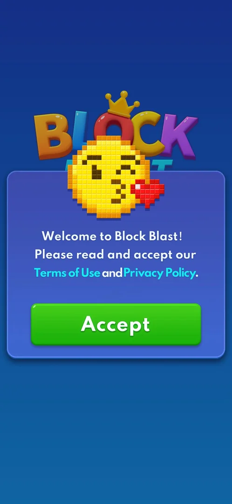

# Terms and privacy consent

The first thing a new player sees: a welcome window asking to accept the Terms of Use and the Privacy
Policy before playing. It has a single Accept button, so accepting is the only way into the game [^s1].

## Where to find it

<!-- no-entry: shown by itself on the very first launch, before anything else -->

Nothing opens it: it appears by itself on the very first launch of a fresh install, before the tutorial
[^s1]. The same documents can be reached later from Settings, More Settings (Terms of Service, Privacy
Policy) — see [Settings](settings.md).

## What it looks like

The Block Blast logo with a pixel-art kissing emoji over a blue window: "Welcome to Block Blast!" and a
request to read and accept the Terms of Use and Privacy Policy, both shown as links, then one green
Accept button [^s1].

 [^s1]

## How it works

- One button, Accept; there is no decline (version 10.6.5) [^s1].
- After Accept, Android asks for permission to send notifications; declining it does not block the game,
  which goes on to the [tutorial](tutorial.md) [^s2]
  [^s3].
- After an app restart the consent window was not shown again, but the notification prompt was
  [^s4].

## Cases

| Case | What was done | Result | Source |
|---|---|---|---|
| Accept on a fresh install | Tapped Accept, then declined notifications | ✅ The tutorial board opens | [^s3] |

## Not verified

- What the Terms of Use and Privacy Policy links open (not tapped).
- Whether the consent differs by country (for example a separate data-consent screen in the EU).

[^s1]: session 20261001-200952-chrono-2FYKPJ, step 0 — [video at 0:00](https://youtu.be/1AkjzicKdRM?t=0)
[^s2]: session 20261001-200952-chrono-2FYKPJ, step 1 — [video at 0:12](https://youtu.be/1AkjzicKdRM?t=12)
[^s3]: session 20261001-200952-chrono-2FYKPJ, step 2 — [video at 0:20](https://youtu.be/1AkjzicKdRM?t=20)
[^s4]: session 20261001-200952-chrono-2FYKPJ, step 42 — [video at 10:02](https://youtu.be/1AkjzicKdRM?t=602)
