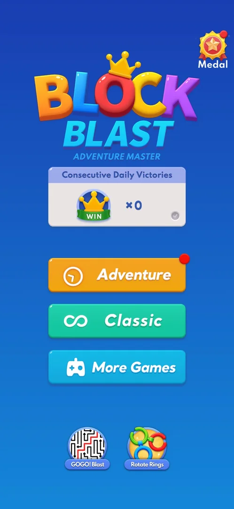

# Cross-promo icons on the home menu (GOGO! Blast, Rotate Rings)

Two round game icons at the bottom of the home menu, labelled GOGO! Blast and Rotate Rings. Tapping one
does not open anything inside Block Blast. It opens the phone's "Open with" chooser for a store page
(Galaxy Store or Google Play Store). The icons give no reward and show no ad [^s1] [^s2] [^s3].

## Why it appeared

The icons were on the home menu the first time it was opened (the phone's Back key from a classic game)
[^s4].

## Where to find it

Home menu > the bottom of the screen, under the More Games button: GOGO! Blast on the left, Rotate Rings
on the right [^s5]. The home menu is reached with the Back key from the classic board (see
[Home menu](home-menu.md)).

 [^s5]
*The two round icons at the bottom of the home menu, under More Games: GOGO! Blast (left) and Rotate Rings (right)*

## What it looks like

Each icon is round with a name label under it. GOGO! Blast shows a black-and-white maze with a red
line, and Rotate Rings shows interlocking coloured rings. There is no badge, price or "Ad" label on
either icon [^s4].

 [^s4]

A tap opens the phone's "Open with" chooser over the home menu, with Galaxy Store and Google Play Store
as choices for the advertised app's store page. This is a system dialog, so it is not shown here
<!-- no-frame: the chooser is a system dialog, not the game's frame --> [^s1] [^s2].

## What you can do

| Tab or button | What it does |
|---|---|
| [GOGO! Blast](#gogo-blast) | Opens the store chooser for GOGO! Blast |
| [Rotate Rings](#rotate-rings) | Opens the store chooser for Rotate Rings |

### GOGO! Blast

<!-- no-frame: the chooser is a system dialog, not the game's frame -->
A tap opens the "Open with" chooser (Galaxy Store / Google Play Store). The chooser has no close button.
The Back key dismisses it and the home menu is unchanged [^s1] [^s6].

### Rotate Rings

<!-- no-frame: the chooser is a system dialog, not the game's frame -->
Same as GOGO! Blast: the "Open with" chooser, dismissed with the Back key back to the home menu
[^s2] [^s7].

## How it works

Version 10.8.1.

- The icons are static and are on the home menu on every visit. On 5 October they were there before and
  after an Adventure level. No cooldown or cap was seen [^s3].
- A tap shows no ad and gives no reward or offer screen, only the store chooser [^s3].
- Dismissing the chooser loses nothing [^s3].

## Cases

| Case | What was done | Result | Source |
|---|---|---|---|
| Why it appeared <!-- case:chk-appeared --> | Opened the home menu with Back | ✅ On the menu the first time it opened | [^s4] |
| Where to find it <!-- case:chk-entry --> | Looked at the home menu | ✅ Two round icons at the bottom: GOGO! Blast and Rotate Rings | [^s4] |
| Its screen <!-- case:chk-screen --> | Looked at the icons | ✅ Round app icons with name labels under the More Games button | [^s4] |
| The kind <!-- case:chk-kind --> | Tapped GOGO! Blast, then Rotate Rings | ✅ Cross-promo: each tap opens the "Open with" chooser (Galaxy Store / Google Play Store) for the app's store page | [^s3] |
| How often it shows <!-- case:chk-frequency --> | Looked at the home menu before and after an Adventure level | ✅ On the home menu on every visit, no cooldown or cap; tapping shows no ad | [^s3] |
| Rewarded <!-- case:chk-reward --> | Tapped both icons and came back | ✅ Not rewarded: no reward and no offer screen, only the store chooser | [^s3] |
| How it closes <!-- case:chk-close --> | Back key on the chooser | ✅ No close button; the Back key dismisses it to the home menu (relaunching the game also returns there); nothing is lost | [^s3] |

## Not verified

- What the store page shows once a store is chosen (no store was picked)

[^s1]: session 20261005-004506-chrono-2FYKPJ, step 2 — [video at 0:35](https://youtu.be/pwB69H7MFAc?t=35)
[^s2]: session 20261005-004506-chrono-2FYKPJ, step 5 — [video at 1:01](https://youtu.be/pwB69H7MFAc?t=61)
[^s3]: session 20261005-004506-chrono-2FYKPJ, step 24 — [video at 6:19](https://youtu.be/pwB69H7MFAc?t=379)
[^s4]: session 20261003-212548-chrono-2FYKPJ, step 29 — [video at 5:55](https://youtu.be/ReMKqt9albk?t=355)
[^s5]: session 20261005-004506-chrono-2FYKPJ, step 0 — [video at 0:00](https://youtu.be/pwB69H7MFAc?t=0)
[^s6]: session 20261005-004506-chrono-2FYKPJ, step 3 — [video at 0:44](https://youtu.be/pwB69H7MFAc?t=44)
[^s7]: session 20261005-004506-chrono-2FYKPJ, step 6 — [video at 1:07](https://youtu.be/pwB69H7MFAc?t=67)
