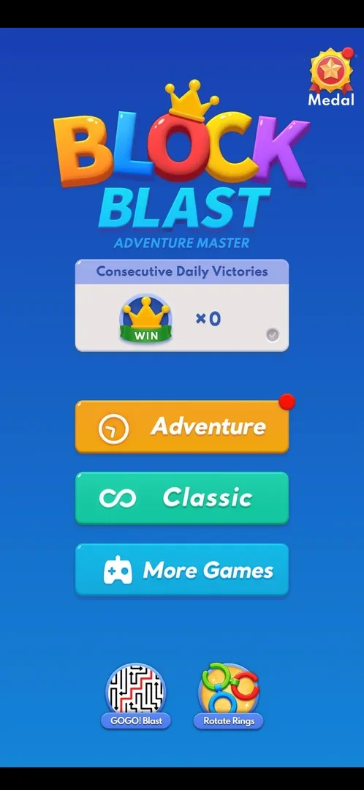

# Cross-promo icons on the home menu (GOGO! Blast, Rotate Rings)

Two round game icons at the bottom of the home menu, labelled GOGO! Blast and Rotate Rings. They were not
tapped; inferred: links to other games of the publisher [^s1].

## Why it appeared

On the home menu the first time it was opened (the phone's Back key from a classic game) [^s1].

## Where to find it

Home menu > the bottom of the screen, under the More Games button: GOGO! Blast left, Rotate Rings right
[^s1]. The home menu is reached with the Back key from the classic board (see [Home menu](home-menu.md)).

 [^s1]
*The two round icons at the bottom of the home menu: GOGO! Blast (a maze) and Rotate Rings (coloured rings)*

## What it looks like

<!-- no-screen: the icons (frame above) are all that was seen; neither was tapped -->
Two round icons with a name label under each: GOGO! Blast shows a black-and-white maze with a red line,
Rotate Rings shows interlocking coloured rings. No badge, price or "Ad" label is on them [^s1].

## How it works

Version 10.8.1. Always on the home menu when it was seen; nothing was tapped, so where they lead is not
verified [^s1].

## Cases

| Case | What was done | Result | Source |
|---|---|---|---|
| Why it appeared <!-- case:chk-appeared --> | Opened the home menu with Back | ✅ On the menu the first time it opened | [^s1] |
| Where to find it <!-- case:chk-entry --> | Looked at the home menu | ✅ Two round icons at the bottom: GOGO! Blast and Rotate Rings | [^s1] |
| Its screen <!-- case:chk-screen --> | Looked at the icons | ✅ Round app icons with name labels under the More Games button | [^s1] |
| The kind <!-- case:chk-kind --> | — | not verified: not tapped |  |
| How often it shows <!-- case:chk-frequency --> | — | not verified: one visit to the menu |  |
| Rewarded <!-- case:chk-reward --> | — | not verified |  |
| How it closes <!-- case:chk-close --> | — | not verified |  |

## Not verified

- The kind: a store link, an install prompt or an in-app page <!-- case:chk-kind -->
- Whether the icons are always there or change between visits <!-- case:chk-frequency -->
- Whether a tap gives anything in Block Blast <!-- case:chk-reward -->
- What a tap opens and how to get back <!-- case:chk-close -->

[^s1]: session 20261003-212548-chrono-2FYKPJ, step 29 — [video at 5:49](https://youtu.be/ReMKqt9albk?t=349)
