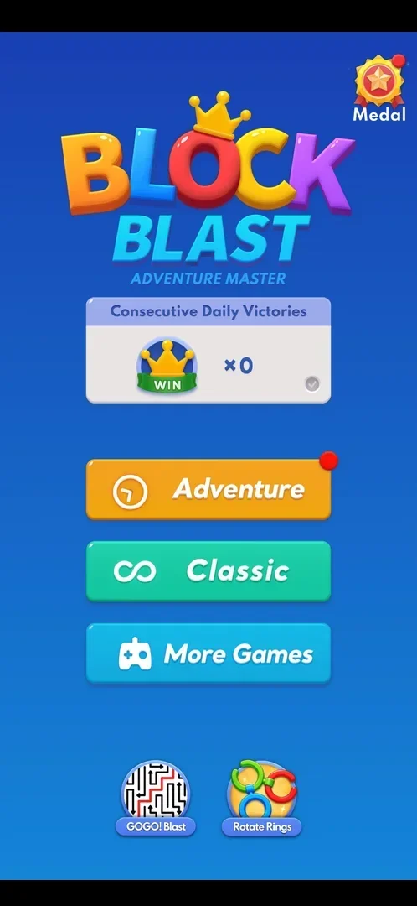
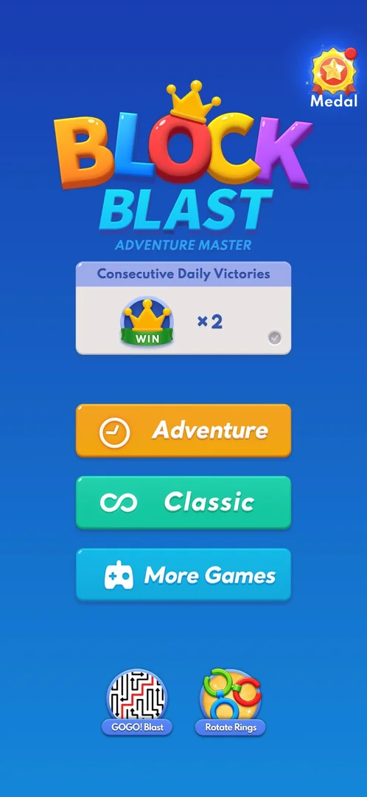
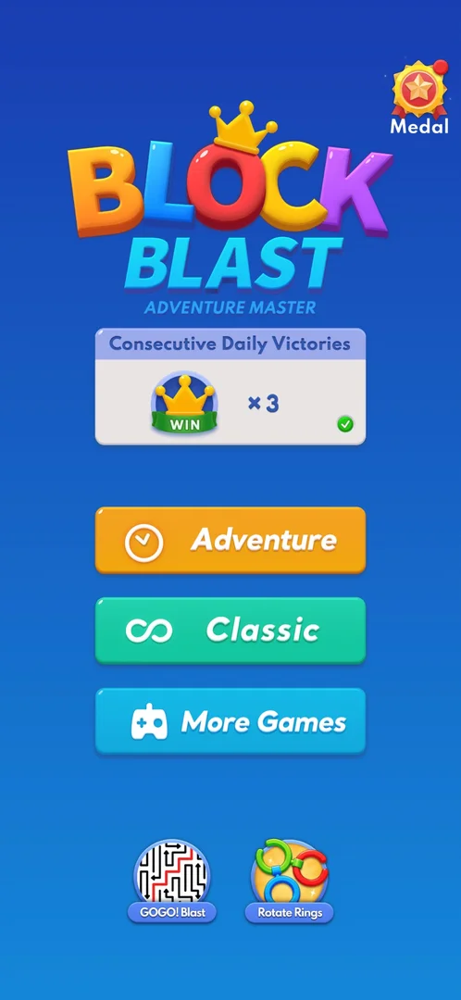

# Consecutive Daily Victories

A panel on the home menu titled "Consecutive Daily Victories", with a crown on a WIN ribbon, a counter
"xN" and a tick. It counts calendar days in a row with at least one [Adventure](adventure.md) level won.
The first win of a day adds one, more wins the same day add nothing, and the tick turns green once the
day's win is in [^s1] [^s2] [^s3]. It is a different counter from the
[Adventure win streak](adv-win-streak.md) ("Consecutive Victories" on the Adventure result screen), which
counts wins in a row and is reset by a loss [^s4]. No reward was seen for it, up to x3
[^s1] [^s3].

## Why it appeared

The panel was on the home menu, showing x0, the first time the menu was opened (the phone's Back key from
a classic game) [^s5].

## Where to find it

Home menu > the panel under the Block Blast logo, above the Adventure button [^s5]. The home
menu is reached with the Back key from the classic board (see [Home menu](home-menu.md)).

 [^s5]
*The Consecutive Daily Victories panel under the logo: WIN crown and x0*

## What it looks like

A white panel with a blue title bar, "Consecutive Daily Victories". On the left is a crown on a green WIN
ribbon, in the middle "xN", and bottom right a tick in a circle. The tick is grey before the day's first
Adventure win and green after it [^s5] [^s2]. Tapping the panel does nothing
[^s6].

 [^s5]
*Before any Adventure win: x0 and a grey tick*

 [^s7]
*A new day: the count from the day before (x2) stays, and the tick is grey again until the day's first win*

 [^s3]
*After the day's first win: x3, green tick*

### Result

 [^s1]
*After the second win of the second day: still x2, green tick*

## How it works

Version 10.8.1. The day boundary is the phone's midnight [^s1].

| When | The panel | Source |
|---|---|---|
| Two classic games (classic has no win) | x0, grey tick | [^s5] |
| Adventure level 1 won, 2026-10-03 23:56 | x1, green tick | [^s2] |
| Adventure level 2 lost, same day | x1, green tick | [^s4] |
| Adventure level 2 won just after midnight, 2026-10-04 | x2 | [^s1] |
| Adventure level 3 won, same day | x2, green tick | [^s1] |
| Adventure level 4 quit with gear > Home | x2, green tick | [^s8] |
| Game opened on 2026-10-05, no win yet | x2, grey tick | [^s7] |
| Adventure level 4 restarted with gear > Replay | x2, grey tick | [^s3] |
| Adventure level 4 won after the restart, 2026-10-05 | x3, green tick | [^s3] |

- Only Adventure wins counted. Classic games never moved it [^s5] [^s2].
- A loss on a day already won did not lower it, while the Adventure win streak went from x1 to x0 on
  the same loss [^s4].
- At a new day the count stays and the tick turns grey until that day's first Adventure win
  [^s7] [^s3].
- Nothing shows during an Adventure level. The panel on the result screen is the Adventure win streak,
  not this counter [^s2].
- No reward came at x1, x2 or x3: no popup and no currency on the home menu or the win screen
  [^s1] [^s3].

## Cases

| Case | What was done | Result | Source |
|---|---|---|---|
| Why it appeared <!-- case:chk-appeared --> | Opened the home menu with Back | ✅ The panel with x0 | [^s5] |
| Where to find it <!-- case:chk-entry --> | Looked at the home menu | ✅ The panel at the top of the home menu | [^s5] |
| Its screen <!-- case:chk-screen --> | Looked at the panel | ✅ Crown WIN badge, counter xN, a tick bottom right (grey, then green after the day's win) | [^s5] |
| The counter <!-- case:chk-counter --> | Won Adventure levels on 3, 4 and 5 October; tapped the panel | ✅ Counts calendar days in a row with an Adventure win: x1 on 3 October, x2 on 4 October (still x2 after a second win that day), x3 on the first win of 5 October, when the grey tick turned green. Tapping the panel does nothing | [^s3] |
| During a level <!-- case:chk-in-level --> | Played Adventure levels 1 to 4 | ✅ Nothing during the level; the result panel is the Adventure win streak | [^s2] |
| Rewards <!-- case:chk-rewards --> | Reached x1, x2 and x3 | ✅ No reward seen | [^s1] |
| What breaks it <!-- case:chk-break --> | Lost Adventure level 2 on a day already won | partly: a same-day loss does not break it (x1 kept); a missed day not tested |  |
| Offers to keep it <!-- case:chk-save --> | — | not verified: never broken |  |
| Win under the streak <!-- case:under-win --> | Won Adventure levels 1, 2, 3 and 4 | ✅ x1 on the first day's win, x2 on the next day's first win (kept on a second win that day), x3 on the third day's first win | [^s1] |
| No Space Left under the streak <!-- case:under-no-space-left --> | Lost Adventure level 2 at x1 | ✅ x1 kept with the green tick | [^s4] |
| Quit under the streak <!-- case:under-quit --> | Gear > Home in Adventure level 4 at x2 | ✅ x2 kept with the green tick | [^s8] |
| Restart (gear > Replay) under the streak <!-- case:under-restart --> | Gear > Replay in Adventure level 4 at x2, before the day's win | ✅ x2 and the grey tick stay until the win; the win after the restart gave x3 with a green tick | [^s3] |
| Leaving the app under the streak <!-- case:under-exit-app --> | — | not verified |  |

## Not verified

- What breaks it: a day with no Adventure win, and what the break costs (task daily-victories-missed-day) <!-- case:chk-break -->
- Offers to keep it after a break and their price <!-- case:chk-save -->
- Leaving the app with the streak running <!-- case:under-exit-app -->
- Whether anything pays at a higher count (x4 and up)

[^s1]: session 20261003-235233-chrono-2FYKPJ, step 60 — [video at 12:40](https://youtu.be/RE70Idi_jrA?t=760)
[^s2]: session 20261003-235233-chrono-2FYKPJ, step 22 — [video at 4:16](https://youtu.be/RE70Idi_jrA?t=256)
[^s3]: session 20261005-004506-chrono-2FYKPJ, step 24 — [video at 6:19](https://youtu.be/pwB69H7MFAc?t=379)
[^s4]: session 20261003-235233-chrono-2FYKPJ, step 30 — [video at 6:11](https://youtu.be/RE70Idi_jrA?t=371)
[^s5]: session 20261003-212548-chrono-2FYKPJ, step 29 — [video at 5:55](https://youtu.be/ReMKqt9albk?t=355)
[^s6]: session 20261005-004506-chrono-2FYKPJ, step 1 — [video at 0:29](https://youtu.be/pwB69H7MFAc?t=29)
[^s7]: session 20261005-004506-chrono-2FYKPJ, step 0 — [video at 0:00](https://youtu.be/pwB69H7MFAc?t=0)
[^s8]: session 20261003-235233-chrono-2FYKPJ, step 64 — [video at 13:34](https://youtu.be/RE70Idi_jrA?t=814)
