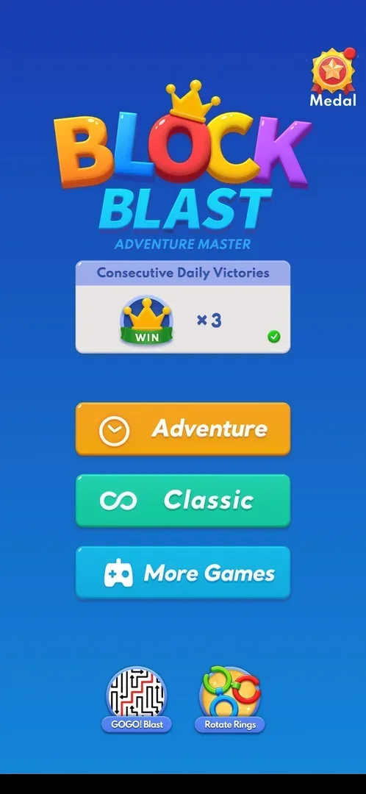

# Home menu

The game's title screen with its mode buttons: Adventure, Classic and More Games. It also has a
Consecutive Daily Victories panel, a Medal icon and two icons for other games. The app does not open on
it: the launch goes straight to the classic board. The menu is reached with the phone's Back key from a
classic game or from the Adventure win screen [^s1] [^s2] [^s6].

## Why it appeared

Pressing the phone's Back key in a classic game (mid-game, not on the game-over screen) opened it. The
classic board is the launch default, so the menu was not seen in the first session [^s1].

## Where to find it

Classic board > the phone's Back key. There is no on-screen button for it: the classic board has only
the crown, the score and the Settings gear [^s1] [^s2]. The Back key on the Adventure win screen ("Well
Done!", Next Level) also opens the home menu [^s6].

 [^s2]
*The classic board: no menu button on it, the phone's Back key opens the home menu*

## What it looks like

 [^s5]
*The home menu on 5 October: x3 with a green tick, a red dot on Medal only*

From top to bottom [^s1] [^s5]:

- The Medal icon top right, with a red dot when there is an award not yet viewed.
- The "Block Blast" logo with the line "Adventure Master".
- The Consecutive Daily Victories panel: a crown with a WIN ribbon, the count (x0 on 3 October, x3 on
  5 October) and a tick bottom right, grey or green.
- Three large buttons: Adventure (orange, a clock), Classic (green, an infinity sign), More Games
  (blue, a gamepad).
- Two round icons at the bottom: GOGO! Blast and Rotate Rings.

There is no Settings gear, coin counter or shop on the menu [^s1] [^s5].

 [^s1]
*The home menu on 3 October: x0, red dots on Medal and on Adventure*

## What you can do

| Tab or button | What it does |
|---|---|
| [Classic](#classic) | Opens a classic board |
| [More Games](#more-games) | Opens the More Games list |
| [Adventure](#adventure) | Opens the Adventure map |
| [Consecutive Daily Victories](#consecutive-daily-victories) | A counter of days with an Adventure win |
| [Medal](#medal) | Opens the Achievement screen |
| [GOGO! Blast and Rotate Rings](#gogo-blast-and-rotate-rings) | Cross-promotion icons for other games |

### Classic

<!-- no-frame: the button is on the home menu frame above -->
Opens the classic board: score 0, the best score kept (2516) and a different set of tray pieces from the
board that was left [^s3]. The board left had score 0 and no piece placed, so whether a game in progress
is kept is not verified. See [Classic mode](classic.md).

### More Games

<!-- no-frame: the list has its own page -->
Opens the same More Games list as Settings > More Games, as a popup over the home menu [^s4]. See
[More Games](more-games.md).

### Adventure

<!-- no-frame: the button is on the home menu frame above -->
Opens the Adventure map: a 96-cell grid in the shape of a trophy, with the green "Level N" button for the
current level at the bottom [^s7]. See [Adventure mode](adventure.md).

### Consecutive Daily Victories

<!-- no-frame: the panel is on the home menu frame above -->
Shows how many days in a row had an Adventure win. The tick turns green once the day has a win. On 5
October the panel was at x3 with a green tick at the start of the session and stayed at x3 after a second
Adventure win that day [^s5] [^s6]. See [Consecutive Daily Victories](daily-victories.md).

### Medal

<!-- no-frame: the icon is on the home menu frame above -->
Opens the Achievement screen with Statistics and nine Awards [^s8]. See [Medal](medal.md).

### GOGO! Blast and Rotate Rings

<!-- no-frame: both icons are on the home menu frame above -->
Two icons for other games, described on [Cross-promo icons](cross-promo-home.md).

## How it works

Version 10.8.1.

- Back from a classic game or from the Adventure win screen asks for no confirmation and costs nothing
  [^s1] [^s3] [^s6].
- Badges: the Medal icon's red dot was gone after the Achievement screen was visited, and it came back
  after the next Adventure win [^s9] [^s6]. On 3 October the Adventure button also had a red dot, before
  Adventure was first opened. It was not there on 5 October [^s1] [^s5].
- Changes with progress: the Daily Victories count grew from x0 (3 October) to x2 and then x3 (5 October)
  across days. No new buttons appeared on the menu over three days of play [^s1] [^s5] [^s6].
- The phone's Back key on the home menu itself was not tried.

## Cases

| Case | What was done | Result | Source |
|---|---|---|---|
| Why it appeared <!-- case:chk-appeared --> | Pressed the phone's Back key mid-game on the classic board | ✅ The home menu opened | [^s1] |
| Where to find it <!-- case:chk-entry --> | Back key on the classic board, and on the Adventure win screen | ✅ Both open the home menu; there is no on-screen button | [^s1] [^s6] |
| What it looks like: its screen <!-- case:chk-screen --> | Looked at the menu on 3 and 5 October | ✅ Logo, Medal top right, Daily Victories panel, Adventure, Classic, More Games, GOGO! Blast and Rotate Rings | [^s1] [^s5] |
| Every entry point on it <!-- case:chk-entries --> | Tapped Classic, More Games, Adventure and Medal | ✅ Classic opens a new board, More Games the list, Adventure the 96-level map, Medal the Achievement screen; the two round icons are cross-promotion | [^s3] [^s4] [^s7] [^s8] |
| Badges, timers and counters on it <!-- case:chk-badges --> | Watched the Medal dot and the daily panel across the session | ✅ The Medal dot clears after a visit and returns after an Adventure win; the panel's green tick means the day's win is counted, and it stays at x3 after a second win the same day | [^s6] |
| What changes on it with progress <!-- case:chk-changes --> | Compared the menu on 3 and 5 October | ✅ The daily count grew from x0 to x3 across days; no new buttons | [^s6] |

## Not verified

- The phone's Back key on the home menu itself
- Whether Classic returns to a game in progress left with Back (the board left had score 0)
- What the red dot on the Adventure button (3 October) pointed to

[^s1]: session 20261003-212548-chrono-2FYKPJ, step 29 — [video at 5:55](https://youtu.be/ReMKqt9albk?t=355)
[^s2]: session 20261003-212548-chrono-2FYKPJ, step 28 — [video at 5:24](https://youtu.be/ReMKqt9albk?t=324)
[^s3]: session 20261003-212548-chrono-2FYKPJ, step 30 — [video at 5:59](https://youtu.be/ReMKqt9albk?t=359)
[^s4]: session 20261003-212548-chrono-2FYKPJ, step 32 — [video at 6:13](https://youtu.be/ReMKqt9albk?t=373)
[^s5]: session 20261005-015205-chrono-2FYKPJ, step 0 — [video at 0:00](https://youtu.be/a20Ukrexpfs?t=0)
[^s6]: session 20261005-015205-chrono-2FYKPJ, step 22 — [video at 6:10](https://youtu.be/a20Ukrexpfs?t=370)
[^s7]: session 20261005-015205-chrono-2FYKPJ, step 10 — [video at 1:42](https://youtu.be/a20Ukrexpfs?t=102)
[^s8]: session 20261005-015205-chrono-2FYKPJ, step 1 — [video at 0:11](https://youtu.be/a20Ukrexpfs?t=11)
[^s9]: session 20261005-015205-chrono-2FYKPJ, step 9 — [video at 1:20](https://youtu.be/a20Ukrexpfs?t=80)
