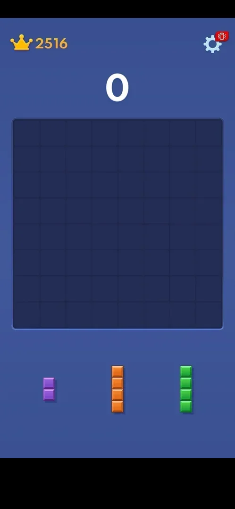

# Home menu

The game's title screen with its mode buttons: Adventure, Classic and More Games, a Consecutive Daily
Victories panel, a Medal icon and two icons for other games. The app does not open on it: the launch
goes straight to the classic board, and the menu is reached only with the phone's Back key from a
classic game [^s1] [^s2].

## Why it appeared

Pressing the phone's Back key in a classic game (mid-game, not on the game-over screen) opened it; the
classic board is the launch default, so the menu was not seen in the first session [^s1].

## Where to find it

Classic board > the phone's Back key. There is no on-screen button for it: the classic board has only
the crown, the score and the Settings gear [^s1] [^s2].

 [^s2]
*The classic board: no menu button on it, the phone's Back key opens the home menu*

## What it looks like

 [^s1]
*The home menu: red dots on Medal and on Adventure*

From top to bottom [^s1]:

- The Medal icon top right, with a red dot.
- The "Block Blast" logo with the line "Adventure Master".
- The Consecutive Daily Victories panel: a crown with a WIN ribbon, "x0", a grey tick bottom right.
- Three large buttons: Adventure (orange, a red dot), Classic (green, an infinity sign), More Games
  (blue, a gamepad).
- Two round icons at the bottom: GOGO! Blast and Rotate Rings (inferred: other games of the publisher).

There is no Settings gear, coin counter or shop on the menu [^s1].

## What you can do

| Tab or button | What it does |
|---|---|
| [Classic](#classic) | Opens a classic board |
| [More Games](#more-games) | Opens the More Games list |
| [Adventure](#adventure) | Not tapped |
| [Consecutive Daily Victories](#consecutive-daily-victories) | Not tapped |
| [Medal](#medal) | Not tapped |
| [GOGO! Blast and Rotate Rings](#gogo-blast-and-rotate-rings) | Not tapped |

### Classic

<!-- no-frame: the button is on the home menu frame above -->
Opens the classic board: score 0, the best score kept (2516) and a different set of tray pieces from the
board that was left [^s3]. The board left had score 0 and no piece placed, so whether a game in progress
is kept is not verified. See [Classic mode](classic.md).

### More Games

<!-- no-frame: the list has its own page -->
Opens the same More Games list as Settings > More Games, as a popup over the home menu [^s4]. See
[More Games](more-games.md).

### Adventure

<!-- no-frame: the button is on the home menu frame above; not tapped -->
Not tapped. See [Adventure mode](adventure.md).

### Consecutive Daily Victories

<!-- no-frame: the panel is on the home menu frame above; not tapped -->
Not tapped. See [Consecutive Daily Victories](daily-victories.md).

### Medal

<!-- no-frame: the icon is on the home menu frame above; not tapped -->
Not tapped. See [Medal](medal.md).

### GOGO! Blast and Rotate Rings

<!-- no-frame: both icons are on the home menu frame above; not tapped -->
Not tapped; inferred: they lead to the store pages of other games. See
[Cross-promo icons](cross-promo-home.md).

## How it works

Version 10.8.1. The phone's Back key on the home menu was not tried. Back from a classic game asks for no
confirmation and costs nothing [^s1] [^s3].

## Cases

| Case | What was done | Result | Source |
|---|---|---|---|
| Why it appeared <!-- case:chk-appeared --> | Pressed the phone's Back key mid-game on the classic board | ✅ The home menu opened | [^s1] |
| Where to find it <!-- case:chk-entry --> | Back key on the classic board | ✅ Only by the Back key; no on-screen button | [^s1] |
| What it looks like: its screen <!-- case:chk-screen --> | Looked at the menu | ✅ Logo, Daily Victories panel, Adventure, Classic, More Games, Medal, two game icons | [^s1] |
| Every entry point on it <!-- case:chk-entries --> | Tapped Classic and More Games | ✅ Classic opens a new board, More Games opens the list; Adventure, Daily Victories, Medal and the two game icons are open (no lock) but not tapped | [^s3] [^s4] |
| Badges, timers and counters on it <!-- case:chk-badges --> | — | not verified: red dots on Medal and Adventure and "x0" on the panel seen, what they point to not checked | [^s1] |
| What changes on it with progress <!-- case:chk-changes --> | — | not verified: seen once |  |

## Not verified

- Badges and counters: what the red dots on Medal and Adventure and the "x0" point to <!-- case:chk-badges -->
- What changes on the menu with progress <!-- case:chk-changes -->
- What Adventure, Consecutive Daily Victories, Medal, GOGO! Blast and Rotate Rings open
- The phone's Back key on the home menu
- Whether Classic returns to a game in progress left with Back (the board left had score 0)

[^s1]: session 20261003-212548-chrono-2FYKPJ, step 29 — [video at 5:49](https://youtu.be/ReMKqt9albk?t=349)
[^s2]: session 20261003-212548-chrono-2FYKPJ, step 28 — [video at 5:17](https://youtu.be/ReMKqt9albk?t=317)
[^s3]: session 20261003-212548-chrono-2FYKPJ, step 30 — [video at 5:59](https://youtu.be/ReMKqt9albk?t=359)
[^s4]: session 20261003-212548-chrono-2FYKPJ, step 32 — [video at 6:13](https://youtu.be/ReMKqt9albk?t=373)
