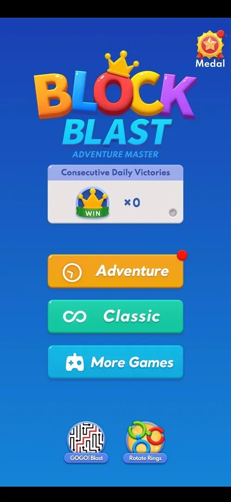

# Medal

An icon labelled "Medal" top right of the home menu: a gold medal with a red star and a red dot. It was
not opened; inferred from the name: a collection of medals or achievements [^s1].

## Why it appeared

On the home menu (top right, with a red dot) the first time the menu was opened, by the phone's Back key
from a classic game [^s1].

## Where to find it

Home menu > the Medal icon top right [^s1]. The home menu is reached with the Back key from the classic
board (see [Home menu](home-menu.md)).

 [^s1]
*The Medal icon top right of the home menu, with a red dot*

## What it looks like

<!-- no-screen: the Medal icon was not tapped in this session -->
Not seen.

## How it works

Version 10.8.1. Not verified: the screen was not opened.

## Cases

| Case | What was done | Result | Source |
|---|---|---|---|
| Why it appeared <!-- case:chk-appeared --> | Opened the home menu with Back | ✅ On the menu with a red dot | [^s1] |
| Where to find it <!-- case:chk-entry --> | Looked at the home menu | ✅ The Medal icon top right | [^s1] |
| Its screen <!-- case:chk-screen --> | — | not verified: not opened |  |
| Progress shown <!-- case:chk-progress --> | — | not verified |  |
| Its items <!-- case:chk-items --> | — | not verified |  |
| How items are earned <!-- case:chk-earn --> | — | not verified |  |
| What they are used for <!-- case:chk-use --> | — | not verified |  |
| What completing it gives <!-- case:chk-complete --> | — | not verified |  |

## Not verified

- Its screen <!-- case:chk-screen -->
- The progress it shows <!-- case:chk-progress -->
- Its items (medals) <!-- case:chk-items -->
- How a medal is earned <!-- case:chk-earn -->
- What medals are used for <!-- case:chk-use -->
- What completing a set gives <!-- case:chk-complete -->
- What the red dot on the icon points to

[^s1]: session 20261003-212548-chrono-2FYKPJ, step 29 — [video at 5:49](https://youtu.be/ReMKqt9albk?t=349)
