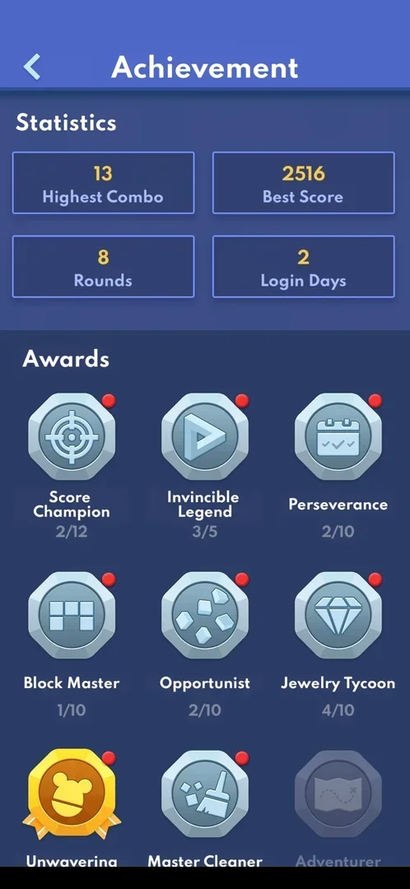
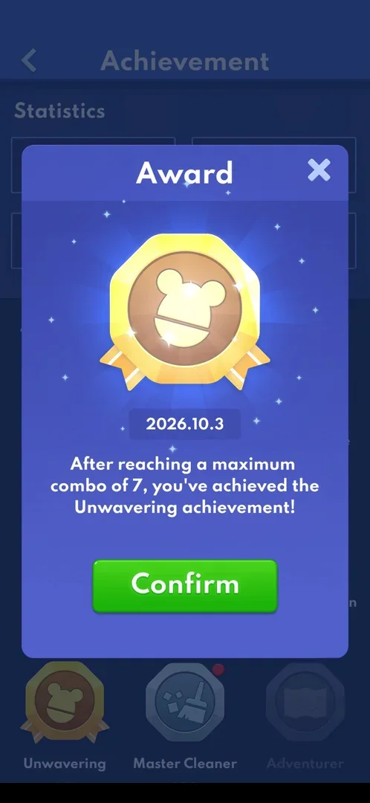
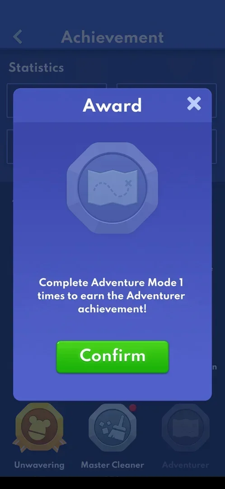

# Medal

The Medal icon on the home menu opens the "Achievement" screen. The top half lists the player's
statistics. The bottom half is a grid of nine awards. Each award has tiers, which are earned by playing
Classic and Adventure, and each tile shows the tier progress as n/m. Tapping a tile opens an Award popup
with the date and the condition. No currency or item is given for an award [^s2] [^s5].

## Why it appeared

The Medal icon was on the home menu (top right, with a red dot) the first time the menu was opened, by
the phone's Back key from a classic game [^s1].

## Where to find it

Home menu > the Medal icon top right [^s1] [^s2]. The home menu is reached with the Back key from the
classic board or from an Adventure win screen (see [Home menu](home-menu.md)).

 [^s1]
*The Medal icon top right of the home menu, with a red dot*

## What it looks like

The screen is titled "Achievement" and has a back arrow top left. Statistics shows four boxes: Highest
Combo 13, Best Score 2516, Rounds 8 and Login Days 2. Awards shows a 3x3 grid. Each tile has an
octagonal silver badge, the award's name and its progress. Most tiles carry a red dot. A finished
award has a gold badge. The award that is still locked is greyed out and shows no progress [^s2].

 [^s2]

## What you can do

| Tab or button | What it does |
|---|---|
| [Award tile](#award-tile) | Opens the Award popup for that award: the date and the condition, with Confirm |
| [Locked award](#locked-award) | Opens the same popup with the condition to unlock it |

The back arrow top left goes back to the home menu [^s5].

### Award tile

Tapping an unlocked tile opens the "Award" popup. It shows the badge, the date the current tier was
reached and a line that names the condition met. For Unwavering, the date is 2026.10.3 and the condition
is a maximum combo of 7. For Score Champion, it is 1800 points in Classic Mode, also dated 2026.10.3.
Confirm or the X closes the popup. After the popup was closed, the tile's red dot was gone. There is no
claim, equip or reward button [^s3] [^s5].

 [^s3]

### Locked award

The Adventurer tile is greyed out. Its popup shows the badge greyed out, with no date, and asks the
player to complete Adventure Mode once to earn it. Confirm closes it [^s4].

 [^s4]

## How it works

Version 10.8.1, as of 5 October 2026, with four Adventure levels won.

| Award | Progress | Condition seen |
|---|---|---|
| Score Champion | 2/12 | classic score (the tier shown: 1800 points) |
| Invincible Legend | 3/5 | not opened |
| Perseverance | 2/10 | not opened |
| Block Master | 1/10 | not opened |
| Opportunist | 2/10 | not opened |
| Jewelry Tycoon | 4/10 | not opened |
| Unwavering | 5/5, gold | maximum combo (the tier shown: 7) |
| Master Cleaner | 1/10 | not opened |
| Adventurer | locked | complete Adventure Mode once |

[^s2] [^s3] [^s4] [^s5]

- n/m is read here as tiers reached out of tiers in the award. This is inferred from the gold badge on
  Unwavering at 5/5, the only full count [^s2].
- A red dot on a tile is cleared by opening its popup. The dot on the home menu's Medal icon was gone
  after the screen was visited, with six tiles still dotted. It came back after the next Adventure win
  [^s5] [^s6].
- The Statistics boxes are counters only. Tapping them was not tried.
- Adventure Mode has 96 levels on its map (see [Adventure](adventure.md)). Inferred: "complete Adventure
  Mode" means all 96 levels, not verified.

## Cases

| Case | What was done | Result | Source |
|---|---|---|---|
| Why it appeared <!-- case:chk-appeared --> | Opened the home menu with Back | ✅ On the menu with a red dot | [^s1] |
| Where to find it <!-- case:chk-entry --> | Tapped the Medal icon top right of the home menu | ✅ Opens the Achievement screen | [^s2] |
| Its screen <!-- case:chk-screen --> | Opened the Achievement screen | ✅ Statistics (Highest Combo 13, Best Score 2516, Rounds 8, Login Days 2) and a grid of 9 tiered awards | [^s2] |
| Progress shown <!-- case:chk-progress --> | Read the tiles | ✅ Each tile shows n/m (Score Champion 2/12 to Unwavering 5/5); a red dot marks a tier not yet viewed | [^s2] |
| Its items <!-- case:chk-items --> | Read the grid | ✅ 9 awards: 8 unlocked, Unwavering gold (5/5), Adventurer greyed until Adventure Mode is completed once | [^s2] |
| How items are earned <!-- case:chk-earn --> | Opened Unwavering, Score Champion and Adventurer | ✅ By play: Score Champion by classic score (1800 points), Unwavering by maximum combo (7), Adventurer by completing Adventure Mode once | [^s5] |
| What they are used for <!-- case:chk-use --> | Opened popups, closed with Confirm | ✅ The popup shows the date and the condition; viewing clears the red dot; nothing to equip or spend | [^s5] |
| What completing it gives <!-- case:chk-complete --> | Opened the finished Unwavering award | ✅ A gold badge and a popup with the date 2026.10.3; no currency or item shown | [^s3] |

## Not verified

- What each tier of Invincible Legend, Perseverance, Block Master, Opportunist, Jewelry Tycoon and Master
  Cleaner needs (their popups were not opened)
- What "complete Adventure Mode" means (all 96 levels is inferred)
- The thresholds of the next tiers of Score Champion and Unwavering
- Whether the Statistics boxes are tappable

[^s1]: session 20261003-212548-chrono-2FYKPJ, step 29 — [video at 5:55](https://youtu.be/ReMKqt9albk?t=355)
[^s2]: session 20261005-015205-chrono-2FYKPJ, step 1 — [video at 0:11](https://youtu.be/a20Ukrexpfs?t=11)
[^s3]: session 20261005-015205-chrono-2FYKPJ, step 3 — [video at 0:29](https://youtu.be/a20Ukrexpfs?t=29)
[^s4]: session 20261005-015205-chrono-2FYKPJ, step 7 — [video at 1:04](https://youtu.be/a20Ukrexpfs?t=64)
[^s5]: session 20261005-015205-chrono-2FYKPJ, step 9 — [video at 1:20](https://youtu.be/a20Ukrexpfs?t=80)
[^s6]: session 20261005-015205-chrono-2FYKPJ, step 22 — [video at 6:10](https://youtu.be/a20Ukrexpfs?t=370)
