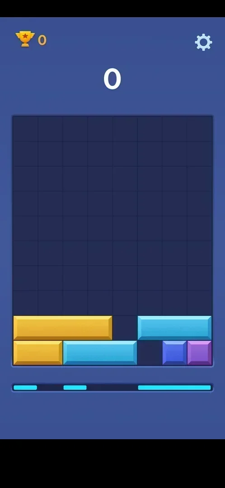
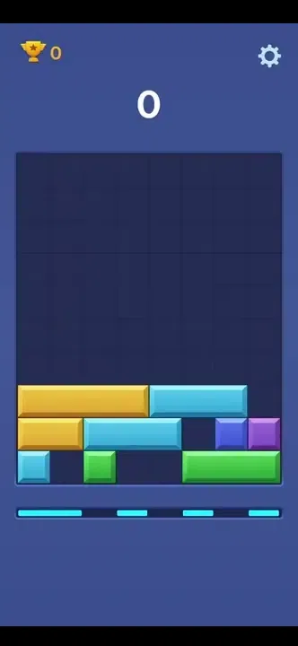
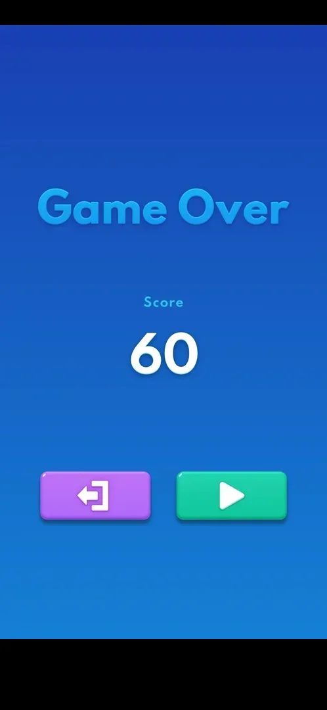

# Mini-game: Block Slide

One of the eight mini-games in the More Games list. It runs inside the app on its own board of
horizontal bars: the player slides bars sideways so that blocks fall and fill rows, a full row clears for
points, and every other move pushes a new row up from below. The game ends when the stack reaches the
top; it has a score and a best score, no levels [^s1] [^s2] [^s3].

## Why it appeared

Listed in Settings > More Games from the first launch [^s1].

## Where to find it

Settings gear > More Games, or the More Games button on the home menu; Block Slide is the last button of
the list (scroll down) [^s4] [^s5]. It is open from the first launch, with no lock or price [^s4].

 [^s4]
*The Block Slide button, last in More Games*

## What it looks like

 [^s6]
*Block Slide at the start: bars of different lengths in the bottom rows, the next row previewed below the board*

A board 8 cells wide and 10 high; at the start the bottom two rows hold horizontal bars 1 to 4 cells long
in several colours, with gaps. Under the board a strip of cyan segments shows the next row that will rise.
A trophy with the best score top left, the score in the middle, a gear top right [^s1] [^s6] [^s2].

## What you can do

| Tab or button | What it does |
|---|---|
| [Bars](#bars) | Drag a bar sideways along its row |
| [Settings gear](#settings-gear) | Sound, BGM, Vibration, Exit, Replay |
| [Game Over buttons](#game-over-buttons) | Exit (purple) and Play (green) |

### Bars

 [^s7]
*Clip 5 s · a slide that completes a row: the row clears, score 0 to 30*

A bar is dragged left or right within its row, as far as free cells allow. A block with nothing under it
falls. A row filled across all 8 cells clears and everything above drops [^s7] [^s2].

### Settings gear

<!-- no-frame: the mini-game Settings frame is on the More Games page -->
Opens a shorter Settings: Sound, BGM, Vibration, Exit and Replay. Exit returns to the More Games list
[^s8] [^s9]. See [More Games](more-games.md#mini-game-settings).

### Game Over buttons

 [^s3]
*The Block Slide end screen: no revive offer*

"Game Over", "Score" and the score, a purple exit button and a green Play button [^s3]. Play started a
new board with score 0 and the best (60) kept [^s10]. The exit button was not tapped.

## How it works

Version 10.8.1.

- A row clear gave +30; two clears in the game gave 60 [^s7] [^s11].
- Every move that clears nothing raises a new row of bars from the bottom; the cyan strip under the board
  previews it [^s2].
- The trophy shows the best score; in the first game it rose with the score (0, 30, 60) [^s7] [^s11].
- No energy, timer, attempts or prices were seen [^s3].

## Outcomes

| Outcome | What happens | Source |
|---|---|---|
| Loss: the stack reaches the top | An interstitial video ad (Royal Match), then Game Over with the score, exit and Play; no revive offer | [^s3] |
| Win | Does not exist: an endless score mode | [^s3] |

### Loss

<!-- no-frame: the Game Over frame is under "Game Over buttons" above -->
When the bars reached the top of the board an interstitial video ad played at once; its top-left icon
opened the Google Play listing, and the game came back on the Game Over screen at the next launch
[^s12] [^s13] [^s3]. See [Interstitial ad](ad-interstitial-classic.md).

## Cases

| Case | What was done | Result | Source |
|---|---|---|---|
| Why it appeared <!-- case:chk-appeared --> | Fresh install | ✅ In More Games from the first launch | [^s1] |
| Where to find it: More Games list entry (open, no lock) <!-- case:chk-entry --> | Tapped Block Slide | ✅ Opened inside the app | [^s4] |
| Its screen: 8x10 board, bars at the bottom, a preview row, trophy best and score, own gear (Sound, BGM, Vibration, Exit, Replay) <!-- case:chk-screen --> | Opened it | ✅ | [^s1] |
| Rules <!-- case:chk-rules --> | Slid bars | ✅ Drag a bar sideways; unsupported blocks fall; a full 8-cell row clears; every non-clearing move raises a new row from below | [^s3] |
| A win <!-- case:chk-win --> | One game | ✅ Does not apply: endless score mode; a row clear gives +30 | [^s3] |
| A loss <!-- case:chk-loss --> | Slid bars without clearing until the stack reached the top | ✅ Interstitial ad, then Game Over with Score 60, exit and Play; no revive | [^s3] |
| Progression inside the mode <!-- case:chk-progression --> | One game | ✅ Score only; the trophy top left is the best score | [^s3] |
| Limits <!-- case:chk-limits --> | One game | ✅ None seen: no energy or timer | [^s3] |

## Not verified

- The purple exit button on Game Over: where it leads
- Whether the interstitial plays after every Block Slide game
- Whether a clear of several rows at once scores more than 30 per row

[^s1]: session 20261003-193423-chrono-2FYKPJ, step 12 — [video at 2:19](https://youtu.be/A6Wh-xa4ryg?t=139)
[^s2]: session 20261003-212548-chrono-2FYKPJ, step 37 — [video at 7:23](https://youtu.be/ReMKqt9albk?t=443)
[^s3]: session 20261003-212548-chrono-2FYKPJ, step 44 — [video at 10:32](https://youtu.be/ReMKqt9albk?t=632)
[^s4]: session 20261003-193423-chrono-2FYKPJ, step 11 — [video at 2:08](https://youtu.be/A6Wh-xa4ryg?t=128)
[^s5]: session 20261003-212548-chrono-2FYKPJ, step 33 — [video at 6:22](https://youtu.be/ReMKqt9albk?t=382)
[^s6]: session 20261003-212548-chrono-2FYKPJ, step 34 — [video at 6:30](https://youtu.be/ReMKqt9albk?t=390)
[^s7]: session 20261003-212548-chrono-2FYKPJ, step 36 — [video at 7:09](https://youtu.be/ReMKqt9albk?t=429)
[^s8]: session 20261003-193423-chrono-2FYKPJ, step 13 — [video at 2:36](https://youtu.be/A6Wh-xa4ryg?t=156)
[^s9]: session 20261003-193423-chrono-2FYKPJ, step 14 — [video at 2:46](https://youtu.be/A6Wh-xa4ryg?t=166)
[^s10]: session 20261003-212548-chrono-2FYKPJ, step 45 — [video at 10:49](https://youtu.be/ReMKqt9albk?t=649)
[^s11]: session 20261003-212548-chrono-2FYKPJ, step 41 — [video at 8:31](https://youtu.be/ReMKqt9albk?t=511)
[^s12]: session 20261003-212548-chrono-2FYKPJ, step 42 — [video at 8:46](https://youtu.be/ReMKqt9albk?t=526)
[^s13]: session 20261003-212548-chrono-2FYKPJ, step 43 — [video at 10:03](https://youtu.be/ReMKqt9albk?t=603)
