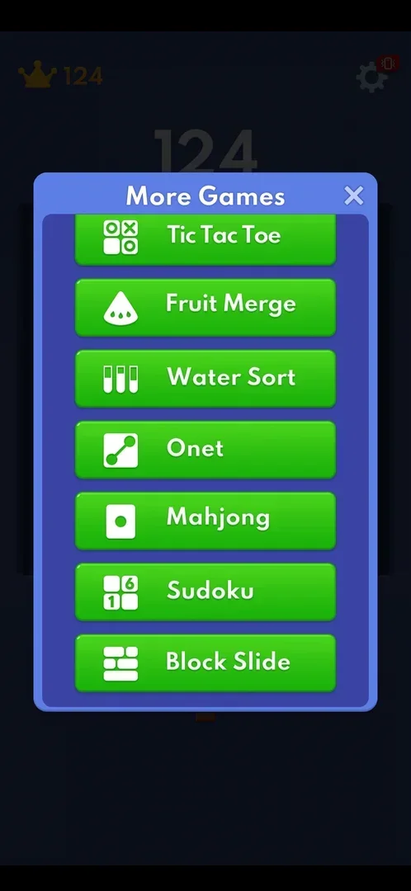
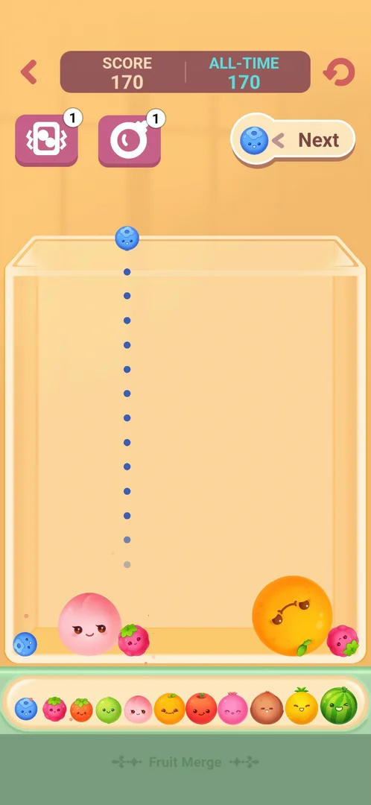
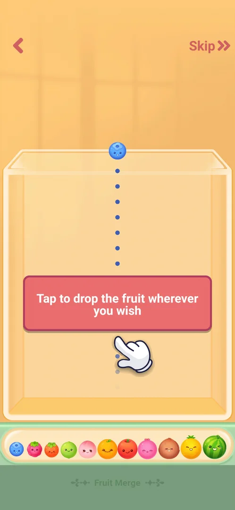
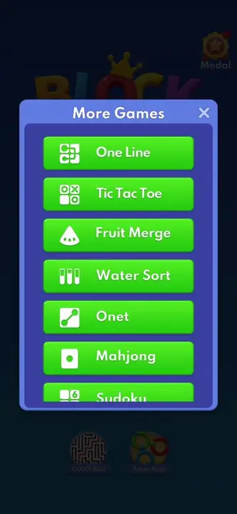
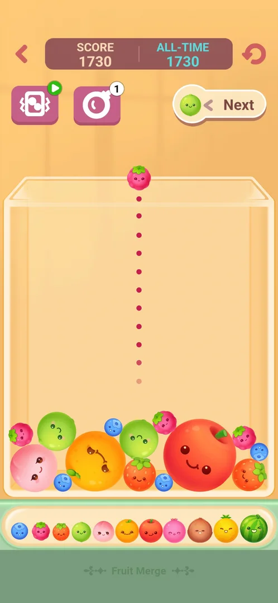
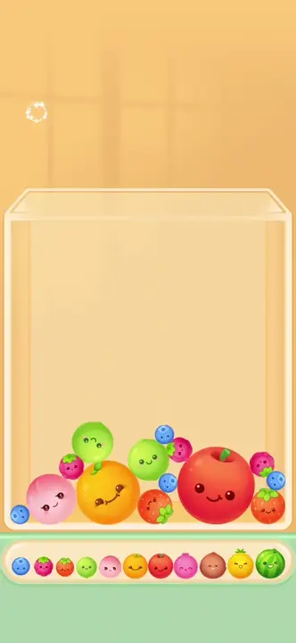
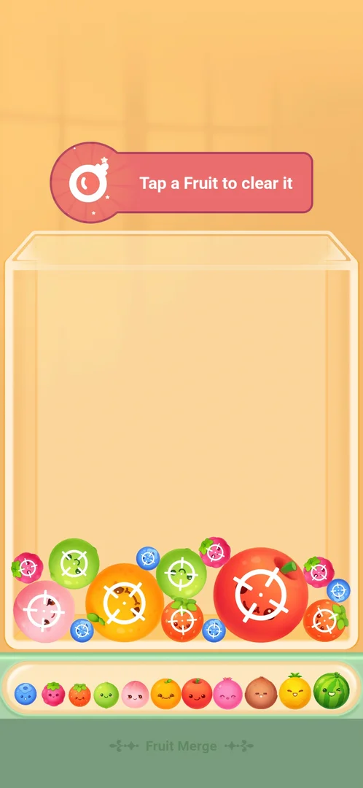
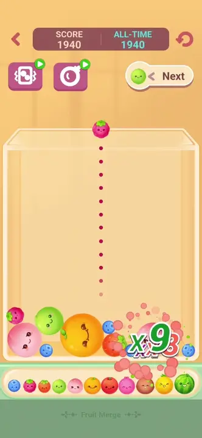
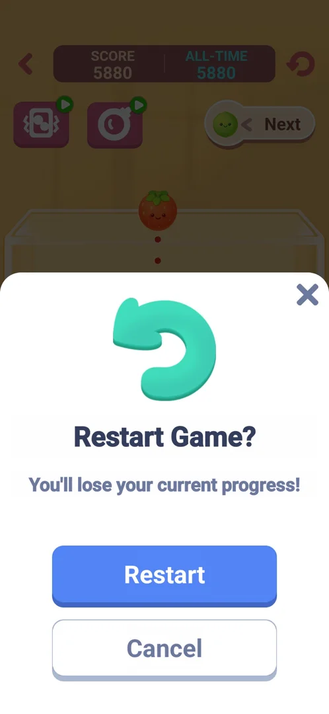
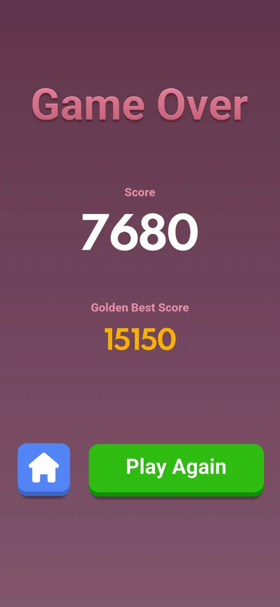

# Mini-game: Fruit Merge

One of the eight mini-games built into the app, opened from Settings > More Games. The player drops
fruits into a glass jar; two equal fruits that touch merge into the next fruit of an 11-step chain, from
a blueberry to a watermelon, and every merge adds to the score [^s4]. It is
one endless run with a score and an all-time best, two boosters and no levels
[^s4]; the run ends with a Game Over screen when the pile reaches the top of the jar
[^s13].

## Why it appeared

Listed in Settings > More Games from the first launch [^s1].

## Where to find it

Classic board > the gear > More Games > **Fruit Merge**, the third green button of the list, with a white
watermelon-slice icon; no scroll needed, no lock, price or timer on it [^s2] [^s3]. One tap opens the
mini-game inside the app [^s5].

 [^s2]
*More Games list: the Fruit Merge button, third in the list, between Tic Tac Toe and Water Sort*

## What it looks like

 [^s4]
*The board after a few drops: SCORE 170 and ALL-TIME 170, the two boosters with a count of 1, Next showing a blueberry*

A light-orange room with a glass jar in the middle [^s4]:

- Top row: the back arrow (left), a SCORE / ALL-TIME panel, the restart arrow (right).
- Second row: two booster buttons, each with a count badge (1), and a **Next** pill showing the fruit
  that comes after the current one.
- Above the jar: the current fruit, with a dotted line down to where it will land.
- Under the jar: the evolution bar, all 11 fruits from the smallest (blueberry) to the largest
  (watermelon); the steps between are, read from the art (inferred): raspberry, strawberry, lime, peach,
  orange, apple, a pink fruit, coconut, pineapple.

## What you can do

A tap in the jar drops the current fruit at that column. The back arrow leaves at once, without a dialog,
to the More Games list.

| Tab or button | What it does |
|---|---|
| [Tutorial](#tutorial) | First open only: a hint text with an animated hand; Skip closes it |
| [Shake booster](#shake-booster) | Shakes the jar and the fruits in it; 1 free use |
| [Bomb booster](#bomb-booster) | Removes one fruit of your choice; 1 free use |
| [Restart](#restart) | Asks Restart Game? before starting over |
| [Game Over](#game-over) | End of the run: score, best score, Home and Play Again |

### Tutorial

 [^s5]
*First open: "Tap to drop the fruit wherever you wish", an animated hand under it, Skip at the top right*

The first open shows the jar without the score panel and boosters, a red text box with the instruction and
a hand tapping under it; Skip and the back arrow are the only controls [^s5].

 [^s5]
*Clip 4.8 s · [original on YouTube from 0:26](https://youtu.be/ZV8q8uZj9Kk?t=26)*

### Shake booster

 [^s6]
*The shake booster, left of the two, after its free use: its badge is a green play icon; the bomb still shows 1*

The left booster (a phone with motion marks) shook the jar: the whole jar moved up and down and the fruits
settled again [^s6]. Its count badge then turned into a green play icon
[^s6]. Inferred: the play icon means a rewarded video refills it; it was not
tapped.

 [^s6]
*Clip 4.3 s · [original on YouTube from 2:05](https://youtu.be/ZV8q8uZj9Kk?t=125)*

### Bomb booster

 [^s7]
*The bomb booster: the banner "Tap a Fruit to clear it" and a crosshair on every fruit in the jar*

The right booster (a bomb) hides the top rows and shows the banner "Tap a Fruit to clear it" with a
crosshair on every fruit [^s7]. Tapping the apple removed it; the score went
from 1730 to 1940 between the two frames, and both boosters then showed the green play icon
[^s8].

 [^s8]
*Clip 3 s · [original on YouTube from 2:36](https://youtu.be/ZV8q8uZj9Kk?t=156)*

### Restart

 [^s9]
*The restart arrow at the top right opens "Restart Game?" with Restart, Cancel and X; SCORE 5880 behind it*

The dialog warns "You'll lose your current progress!"; Restart, Cancel and an X
[^s9]. Cancel returned to the same run [^s10].

### Game Over

 [^s13]
*Game Over: Score 7680, Golden Best Score 15150, the blue Home button at the bottom left and the green Play Again right of it*

Dropping every fruit at the middle of the jar, about 140 to 160 drops, built a pile up to the rim; in the
last board frame before the end, red rings surrounded the top fruit at the rim and the score was 7680
[^s14]. Two more drops ended the run and the Play Store came up over the app
[^s15]; back in the app a full-screen video ad for another game was playing, and
the phone's Back key closed it to the Game Over screen [^s16]. It shows the run's score, the Golden Best Score
(the ALL-TIME best of the board) and two buttons, Home and Play Again
[^s13]. No continue offer was seen on it. Home led back to the More Games list
[^s17]. Play Again was tapped while the buttons were still fading in and had no
visible effect [^s18].

## How it works

Version 10.8.1.

- A tap in the jar drops the current fruit at that column; the Next pill shows the one after it
  [^s4]. The fruits handed to the player in this run were small ones from the
  start of the chain (blueberry, raspberry, strawberry, lime) [^s9].
- Two equal fruits that touch merge into the next fruit of the chain [^s4].
- Score in one run: 170 after the first drops [^s4], 1730
  [^s6], 1940 [^s8] and 5880 about four minutes
  in [^s9]. ALL-TIME equalled SCORE throughout: it was the first run.
- Boosters: one free use each; afterwards the badge is a green play icon
  [^s8].
- No energy, lives, timer or levels were seen; the back arrow leaves without a dialog to the More Games
  list over the Classic board [^s11].
- In about four minutes of drops the jar never filled: merges kept the pile low, so the end of a run was
  not reached [^s11]. A second run, every fruit dropped at the middle, ended with the pile at the rim after
  about 140 to 160 drops, score 7680 [^s14].
- The run ends when the pile reaches the top of the jar (the map's case; the frame shows the pile at the
  rim with red rings round the top fruit just before) [^s14]. An ad comes
  before the Game Over screen [^s16].
- Kept between visits: on the next open the score was 0 and ALL-TIME 15150, a best from an earlier run not
  documented here; the boosters were grey with the green play badge, so the free uses did not come
  back [^s19].

## Cases

| Case | What was done | Result | Source |
|---|---|---|---|
| Settings > More Games list entry (open, no lock) <!-- case:chk-entry --> | Opened the More Games list and tapped Fruit Merge | ✅ The third button; opens the mini-game at once | [^s2] [^s5] |
| Why it appeared <!-- case:chk-appeared --> | Fresh install | ✅ In More Games from the first launch | [^s1] |
| Its screen <!-- case:chk-screen --> | Opened the mini-game, dropped fruits | ✅ Jar, evolution bar of 11 fruits, SCORE / ALL-TIME, 2 boosters, Next preview, restart and back arrows | [^s4] |
| Rules <!-- case:chk-rules --> | About 110 to 140 drops over four minutes; both boosters used | ✅ A tap drops the fruit at its column; two equal fruits merge into the next of 11; score rises on merges (5880); shake moves the jar, bomb removes one fruit; tutorial with Skip on first open | [^s5] [^s4] [^s8] |
| A win: its screen and what it pays <!-- case:chk-win --> | — | not verified: no win state seen in an endless run |  |
| A loss: its screen, what it costs and the retry offers <!-- case:chk-loss --> | Stacked fruits in one column to overflow the jar, twice | Partly: the first run never filled; the second reached Game Over (see game-over); Play Again's effect not seen | [^s12] [^s13] |
| Game over when the pile crosses the top line <!-- case:game-over --> | About 140 to 160 drops at the middle of the jar | ✅ An ad (Play Store, then a video), then Game Over: Score 7680, Golden Best Score 15150, Home, Play Again; Home goes back to More Games | [^s16] [^s13] [^s17] |
| Progression <!-- case:chk-progression --> | Played one run | ✅ SCORE and ALL-TIME best at the top; no stages or levels | [^s4] |
| Limits <!-- case:chk-limits --> | Used both boosters, opened restart, left with the back arrow | ✅ Each booster 1 free, then a green play badge; no energy or timer; back leaves at once; restart asks to confirm | [^s8] [^s9] [^s11] |

## Not verified

- A win: whether the run has any win or milestone screen (none seen in four minutes) <!-- case:chk-win -->
- A loss: the Game Over screen is seen (case game-over); what Play Again does and whether any continue offer exists are not <!-- case:chk-loss -->
- What the green play badge on a used booster does (inferred: a rewarded video refill; not tapped)
- Whether a run in progress is kept after leaving with the back arrow (ALL-TIME is kept)

[^s1]: session 20261003-193423-chrono-2FYKPJ, step 12 — [video at 2:19](https://youtu.be/A6Wh-xa4ryg?t=139)
[^s2]: session 20261003-193423-chrono-2FYKPJ, step 11 — [video at 2:08](https://youtu.be/A6Wh-xa4ryg?t=128)
[^s3]: session 20261003-193423-chrono-2FYKPJ, step 10 — [video at 1:57](https://youtu.be/A6Wh-xa4ryg?t=117)

[^s4]: session 20261005-125535-chrono-2FYKPJ, step 4 — [video at 0:52](https://youtu.be/ZV8q8uZj9Kk?t=52)
[^s5]: session 20261005-125535-chrono-2FYKPJ, step 2 — [video at 0:30](https://youtu.be/ZV8q8uZj9Kk?t=30)
[^s6]: session 20261005-125535-chrono-2FYKPJ, step 8 — [video at 2:09](https://youtu.be/ZV8q8uZj9Kk?t=129)
[^s7]: session 20261005-125535-chrono-2FYKPJ, step 9 — [video at 2:29](https://youtu.be/ZV8q8uZj9Kk?t=149)
[^s8]: session 20261005-125535-chrono-2FYKPJ, step 10 — [video at 2:38](https://youtu.be/ZV8q8uZj9Kk?t=158)
[^s9]: session 20261005-125535-chrono-2FYKPJ, step 14 — [video at 4:10](https://youtu.be/ZV8q8uZj9Kk?t=250)
[^s10]: session 20261005-125535-chrono-2FYKPJ, step 15 — [video at 4:19](https://youtu.be/ZV8q8uZj9Kk?t=259)
[^s11]: session 20261005-125535-chrono-2FYKPJ, step 16 — [video at 4:23](https://youtu.be/ZV8q8uZj9Kk?t=263)
[^s12]: session 20261005-125535-chrono-2FYKPJ, step 13 — [video at 3:55](https://youtu.be/ZV8q8uZj9Kk?t=235)

[^s13]: session 20261005-153835-chrono-2FYKPJ, step 13 — [video at 5:25](https://youtu.be/EdZAa-3kDtc?t=325)
[^s14]: session 20261005-153835-chrono-2FYKPJ, step 9 — [video at 4:11](https://youtu.be/EdZAa-3kDtc?t=251)
[^s15]: session 20261005-153835-chrono-2FYKPJ, step 10 — [video at 4:24](https://youtu.be/EdZAa-3kDtc?t=264)
[^s16]: session 20261005-153835-chrono-2FYKPJ, step 12 — [video at 5:07](https://youtu.be/EdZAa-3kDtc?t=307)
[^s17]: session 20261005-153835-chrono-2FYKPJ, step 15 — [video at 5:44](https://youtu.be/EdZAa-3kDtc?t=344)
[^s18]: session 20261005-153835-chrono-2FYKPJ, step 14 — [video at 5:32](https://youtu.be/EdZAa-3kDtc?t=332)
[^s19]: session 20261005-153835-chrono-2FYKPJ, step 2 — [video at 0:30](https://youtu.be/EdZAa-3kDtc?t=30)
