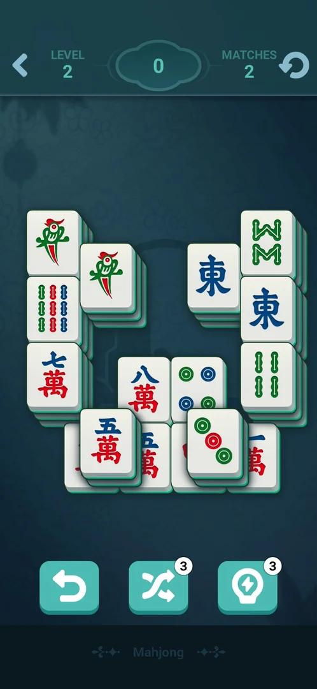
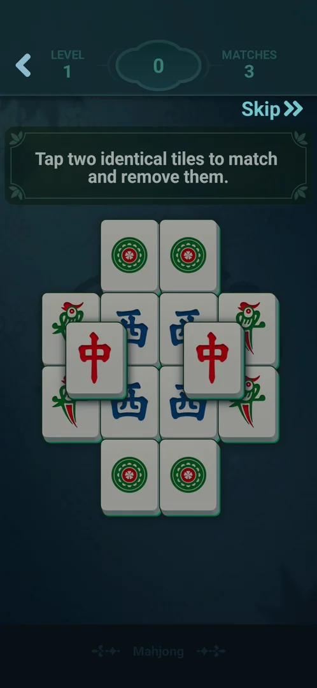
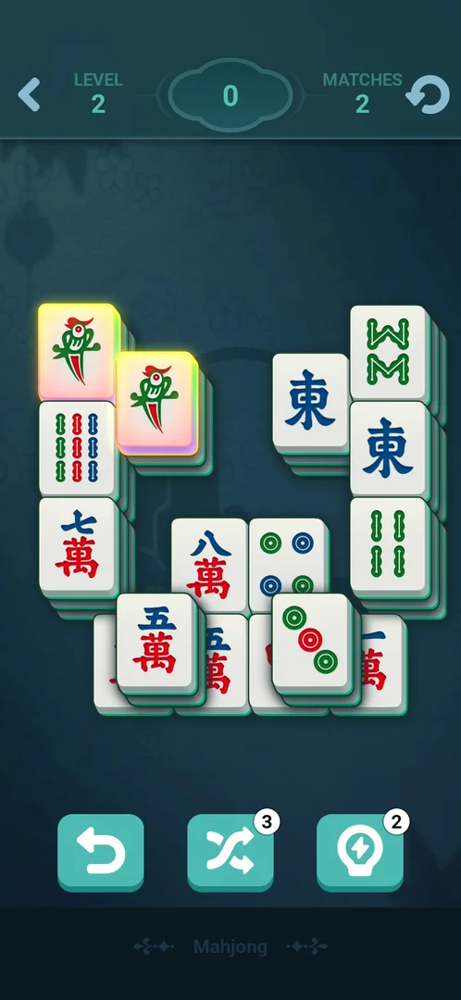
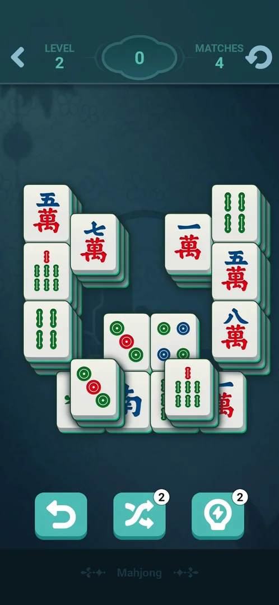
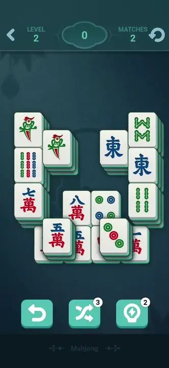
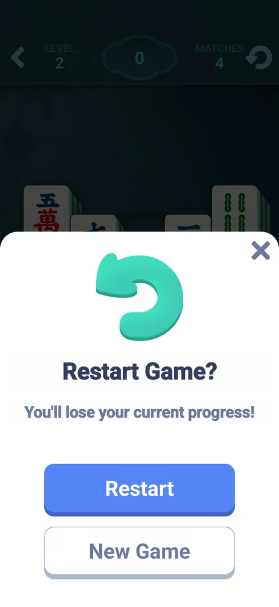
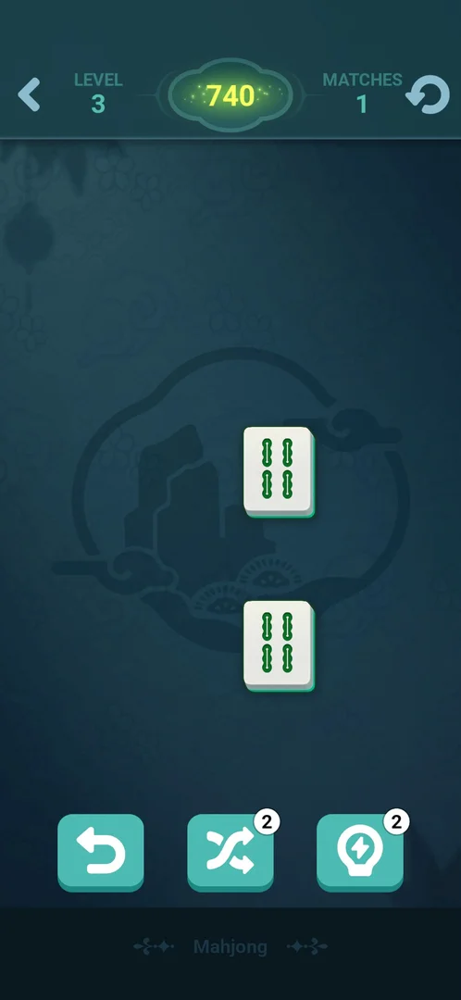
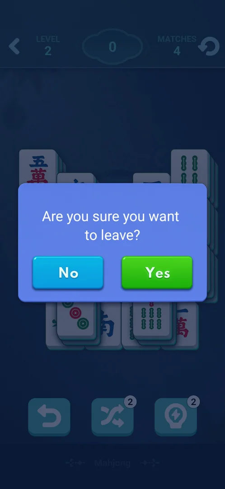
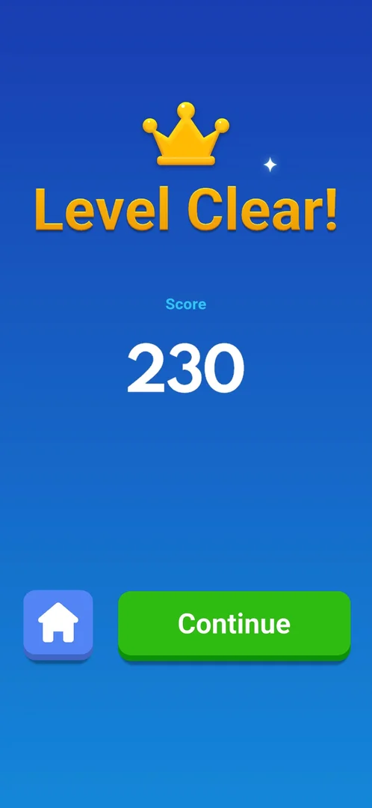

# Mini-game: Mahjong

One of the eight mini-games built into the app, opened from Settings > More Games. A Mahjong solitaire:
the player removes pairs of identical free tiles from a layered pile until the board is empty, level by
numbered level [^s4] [^s5]. Level 1 is a
guided tutorial; from level 2 three tools sit under the board: undo, shuffle and hint
[^s6].

## Why it appeared

Listed in Settings > More Games from the first launch [^s1].

## Where to find it

Classic board > the gear > More Games > **Mahjong**, the sixth green button of the list, with a white
tile icon; no scroll needed, no lock, price or timer on it [^s2] [^s3]. One tap opens level 1
[^s4].

 [^s2]
*More Games list: the Mahjong button, sixth in the list, under Onet*

## What it looks like

 [^s6]
*Level 2: LEVEL 2, score 0 in the middle, MATCHES 2, the restart arrow; undo, shuffle (3) and hint (3) under the board*

A dark-teal table [^s6]:

- Top bar: the back arrow, LEVEL with its number, the score in a cloud-shaped frame, MATCHES (the number
  of pairs that can be taken now) and the restart arrow.
- The board: classic Mahjong tiles (characters, bamboos, circles, winds, dragons, birds) stacked in layers;
  a tile is free when no tile covers it.
- Under the board, from level 2: undo (no count), shuffle (count 3) and hint (count 3).

## What you can do

Tapping two identical free tiles removes the pair and adds to the score.

| Tab or button | What it does |
|---|---|
| [Tutorial](#tutorial) | Level 1: a guided board with a hint text; Skip |
| [Hint](#hint) | Lights up a free pair; costs a charge (3) |
| [Undo](#undo) | Puts the last removed pair back; no count |
| [Shuffle](#shuffle) | Rearranges the tiles; costs a charge (3) |
| [Restart](#restart) | Restart Game? with Restart, New Game and X |
| [Back arrow](#back-arrow) | Leaves at once to the More Games list |
| [Back key](#back-key) | Are you sure you want to leave? No / Yes |
| [Level Clear!](#level-clear) | After the last pair: Home and Continue |

### Tutorial

 [^s4]
*Level 1: "Tap two identical tiles to match and remove them.", Skip at the top right, MATCHES 3*

Level 1 is a small pile of 12 tiles in two layers with the instruction text over it and Skip
[^s4]. After the first pair (score 30) the text changes to a second step
about matching the tiles on top to free the ones below, and a hand points at the next tile; covered tiles
are shown darker [^s7]. Level 1 had no tools under the board and no restart
arrow [^s4].

### Hint

 [^s8]
*Hint, the right one of the three tools: a free pair (two bird tiles) glows; its count went from 3 to 2*

Taking the hinted pair added 20 to the score and MATCHES went from 2 to 3
[^s9].

### Undo

 [^s10]
*Undo, the left tool with no count: the last pair is back on the board and the score is 0 again; the hint count stays 2*

### Shuffle

 [^s11]
*Shuffle, the middle tool: the same places hold other tiles, its count went from 3 to 2, MATCHES from 2 to 4*

 [^s11]
*Clip 4.8 s · [original on YouTube from 7:12](https://youtu.be/ZV8q8uZj9Kk?t=432)*

### Restart

 [^s12]
*The restart arrow at the top right: "Restart Game?", "You'll lose your current progress!", Restart, New Game and X*

Unlike Fruit Merge's dialog it offers New Game instead of Cancel [^s12]. X
closed it and kept the board [^s13].

### Back arrow

 [^s18]
*The back arrow at the top left of a level; here level 3 with its last pair (two 4-bamboo tiles) on the board*

The back arrow left level 3 with its last pair still on the board and no question asked: the More Games
list came up over the classic board [^s19]. The phone's Back key asks first (below).

### Back key

 [^s14]
*The phone's Back key in a level: "Are you sure you want to leave?" with No and Yes*

Yes returned to the More Games list [^s15].

### Level Clear!

 [^s5]
*After level 1: a crown, "Level Clear!", Score 230, a Home button and a green Continue*

Clearing level 1 first played a full-screen video ad for another game with no close control for the
first seconds; its skip-like icon at the top left opened that game's store page, and the game was brought
back by launching it [^s16] [^s17]
[^s5]. No coins or other reward were shown; Continue opened level 2
[^s6].

## How it works

Version 10.8.1.

- A pair of identical free tiles is removed; a tile is free when no tile lies on it
  [^s4].
- Score: the first pair of level 1 gave 30 [^s7] and level 1 (6 pairs)
  ended at 230 [^s5]; the first pair of level 2 gave 20
  [^s9]. Inferred: points per pair are not fixed.
- MATCHES counts the pairs that can be taken now: 3 at the start of level 1, 2 at the start of level 2, 4
  after a shuffle [^s4] [^s6]
  [^s11].
- Tools from level 2: hint 3, shuffle 3, undo without a count [^s6]. What
  happens when hint or shuffle reaches 0 was not seen.
- No energy, lives or timer were seen [^s6].
- The level reached is kept: after level 2 was cleared in an earlier session, More Games > Mahjong opened
  level 3 directly, also after app restarts [^s20] [^s21].
- The tool counts are kept between levels and sessions: level 3 started with shuffle 2 and hint 2, the
  charges spent in level 2 not restored [^s21].
- No dead end could be forced: in level 3 the player took free pairs in an order meant to bury the twins
  of the remaining tiles (15 pairs, 106 s), yet a matching pair was always free and the board ran down to
  its last pair, score 740 [^s22] [^s18]. Inferred: the boards may be dealt so that they can always
  be cleared; not verified.
- Level 1 took 112 s; a video ad played before its Level Clear! screen
  [^s5].

## Cases

| Case | What was done | Result | Source |
|---|---|---|---|
| Settings > More Games list entry (open, no lock) <!-- case:chk-entry --> | Opened the More Games list and tapped Mahjong | ✅ The sixth button; opens level 1 | [^s2] [^s4] |
| Why it appeared <!-- case:chk-appeared --> | Fresh install | ✅ In More Games from the first launch | [^s1] |
| Its screen <!-- case:chk-screen --> | Played levels 1 and 2 | ✅ LEVEL, score in the middle, MATCHES (pairs available), restart arrow; layered tile board; undo / shuffle 3 / hint 3 from level 2 | [^s6] |
| Rules <!-- case:chk-rules --> | Cleared level 1; in level 2 used hint, a match, undo and shuffle | ✅ Two identical free tiles are removed; level 1 is a guided tutorial with Skip; hint lights a pair (−1), shuffle rearranges (−1), undo puts the last pair back | [^s7] [^s8] [^s10] [^s11] |
| A win: its screen and what it pays <!-- case:chk-win --> | Cleared level 1 | ✅ A video ad, then Level Clear! with Score 230, Home and Continue; no currency reward | [^s5] |
| A loss: its screen, what it costs and the retry offers <!-- case:chk-loss --> | Level 3: paired tiles to bury the twins of the rest, down to the last pair | not verified: a free pair was always left, no board without moves | [^s18] |
| Progression <!-- case:chk-progression --> | Continue after level 1 | ✅ Numbered levels, level 1 a tutorial, Continue opens level 2; a score per level | [^s6] |
| Level 2 cleared <!-- case:win-l2 --> | Took every free pair of level 2 (MATCHES never reached 0) | ✅ A video ad, then a Water Sort playable ad with no close: Back and a relaunch did not leave it and the app had to be restarted, so level 2's Level Clear! was not seen; level 3 opened next time | [^s20] [^s21] |
| Limits <!-- case:chk-limits --> | Used the tools, opened restart, left with the Back key | ✅ No energy or timer; hint and shuffle 3 each; restart dialog Restart / New Game / X; Back asks Are you sure you want to leave (No / Yes) | [^s12] [^s14] |

## Not verified

- A loss: a board with no pair left, what it shows, costs and offers <!-- case:chk-loss --> (not reached in level 3 even when playing for it; it may not exist)
- What happens when hint or shuffle reaches 0 (a video or a price)
- Restart > New Game, and Home on Level Clear!

[^s1]: session 20261003-193423-chrono-2FYKPJ, step 12 — [video at 2:19](https://youtu.be/A6Wh-xa4ryg?t=139)
[^s2]: session 20261003-193423-chrono-2FYKPJ, step 11 — [video at 2:08](https://youtu.be/A6Wh-xa4ryg?t=128)
[^s3]: session 20261003-193423-chrono-2FYKPJ, step 10 — [video at 1:57](https://youtu.be/A6Wh-xa4ryg?t=117)

[^s4]: session 20261005-125535-chrono-2FYKPJ, step 17 — [video at 4:48](https://youtu.be/ZV8q8uZj9Kk?t=288)
[^s5]: session 20261005-125535-chrono-2FYKPJ, step 23 — [video at 6:32](https://youtu.be/ZV8q8uZj9Kk?t=392)
[^s6]: session 20261005-125535-chrono-2FYKPJ, step 24 — [video at 6:42](https://youtu.be/ZV8q8uZj9Kk?t=402)
[^s7]: session 20261005-125535-chrono-2FYKPJ, step 19 — [video at 5:11](https://youtu.be/ZV8q8uZj9Kk?t=311)
[^s8]: session 20261005-125535-chrono-2FYKPJ, step 25 — [video at 6:53](https://youtu.be/ZV8q8uZj9Kk?t=413)
[^s9]: session 20261005-125535-chrono-2FYKPJ, step 26 — [video at 7:03](https://youtu.be/ZV8q8uZj9Kk?t=423)
[^s10]: session 20261005-125535-chrono-2FYKPJ, step 27 — [video at 7:07](https://youtu.be/ZV8q8uZj9Kk?t=427)
[^s11]: session 20261005-125535-chrono-2FYKPJ, step 28 — [video at 7:16](https://youtu.be/ZV8q8uZj9Kk?t=436)
[^s12]: session 20261005-125535-chrono-2FYKPJ, step 29 — [video at 7:31](https://youtu.be/ZV8q8uZj9Kk?t=451)
[^s13]: session 20261005-125535-chrono-2FYKPJ, step 30 — [video at 7:41](https://youtu.be/ZV8q8uZj9Kk?t=461)
[^s14]: session 20261005-125535-chrono-2FYKPJ, step 31 — [video at 7:46](https://youtu.be/ZV8q8uZj9Kk?t=466)
[^s15]: session 20261005-125535-chrono-2FYKPJ, step 32 — [video at 7:55](https://youtu.be/ZV8q8uZj9Kk?t=475)
[^s16]: session 20261005-125535-chrono-2FYKPJ, step 21 — [video at 5:38](https://youtu.be/ZV8q8uZj9Kk?t=338)
[^s17]: session 20261005-125535-chrono-2FYKPJ, step 22 — [video at 6:11](https://youtu.be/ZV8q8uZj9Kk?t=371)

[^s18]: session 20261005-231555-chrono-2FYKPJ, step 8 — [video at 2:18](https://youtu.be/H_WygghZvno?t=138)
[^s19]: session 20261005-231555-chrono-2FYKPJ, step 9 — [video at 2:37](https://youtu.be/H_WygghZvno?t=157)
[^s20]: session 20261005-153835-chrono-2FYKPJ, step 28 — [video at 9:19](https://youtu.be/EdZAa-3kDtc?t=559)
[^s21]: session 20261005-231555-chrono-2FYKPJ, step 2 — [video at 0:35](https://youtu.be/H_WygghZvno?t=35)
[^s22]: session 20261005-231555-chrono-2FYKPJ, step 3 — [video at 0:49](https://youtu.be/H_WygghZvno?t=49)
