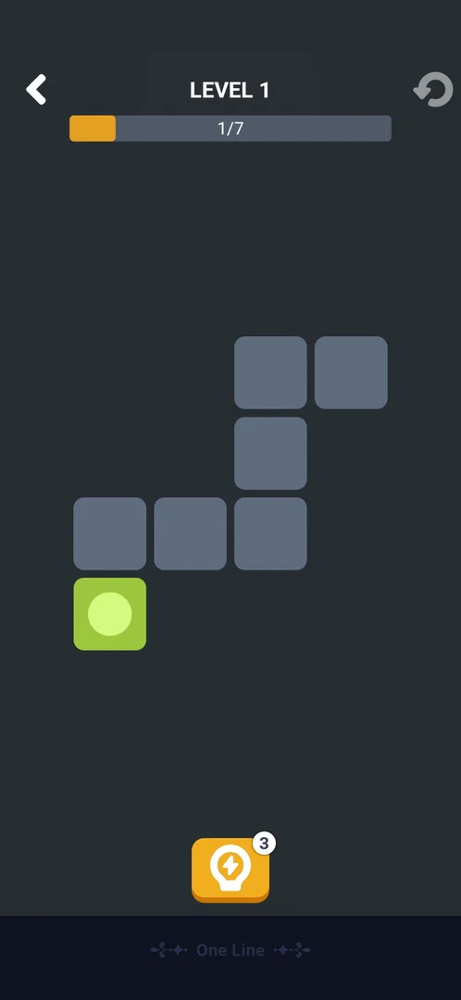
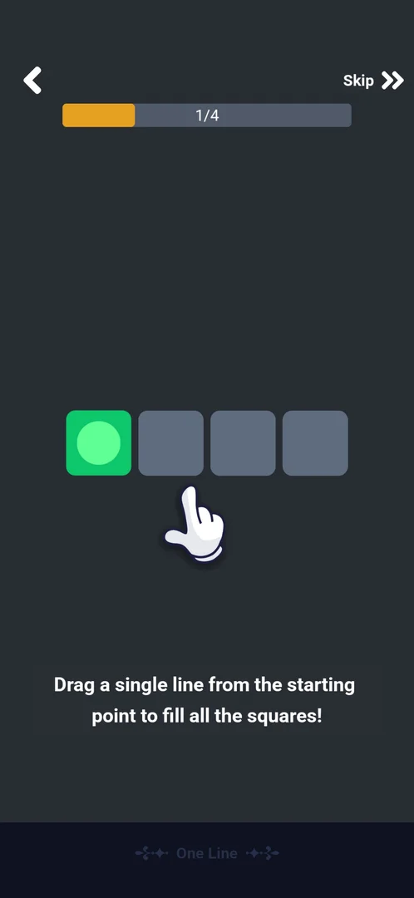
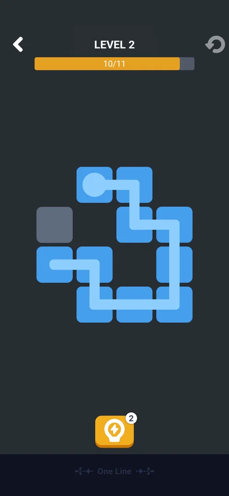
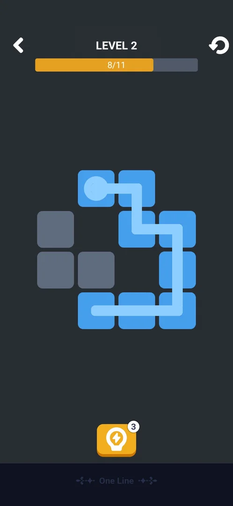
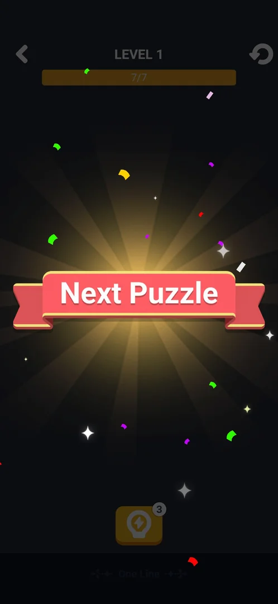

# Mini-game: One Line

One of the eight mini-games built into the app, opened from Settings > More Games. A one-stroke puzzle:
from a start square the player drags a single line that must pass through every square of the grid once;
filling the last square solves the level and the next, larger grid follows
[^s4] [^s5]
[^s6].

## Why it appeared

Listed in Settings > More Games from the first launch [^s1].

## Where to find it

Classic board > the gear > More Games > **One Line**, the first green button of the list, with a white
icon of a looped line; no lock, price or timer on it [^s2] [^s3]. One tap opens the tutorial on the first
visit [^s4].

 [^s2]
*More Games list: the One Line button, first in the list, above Tic Tac Toe*

## What it looks like

 [^s7]
*Level 1: LEVEL 1, the bar at 1/7, seven grey squares with the green start square at the bottom left, the hint lightbulb (3)*

A dark-grey screen [^s7]:

- Top: the back arrow, LEVEL with its number, the restart arrow; under them a bar counting the squares
  filled (1/7: the start square counts).
- The grid: grey squares with one coloured start square marked by a dot. Squares the line passed take
  the start square's colour (green in level 1, blue in level 2)
  [^s8] [^s9].
- Bottom: the hint lightbulb with a count (3).

## What you can do

A drag from the start square, or from the end of the line drawn so far, extends the line square by square.

| Tab or button | What it does |
|---|---|
| [Tutorial](#tutorial) | First visit: four steps with an animated hand; Skip |
| [Hint](#hint) | Draws the next squares of the solution; costs a charge (3) |
| [Restart](#restart) | Clears the line; the only way to undo a wrong path seen |
| [Next Puzzle](#next-puzzle) | After the last square: a ribbon, then the next level |

### Tutorial

 [^s4]
*Tutorial step 1 of 4: "Drag a single line from the starting point to fill all the squares!", a row of four squares, Skip at the top right*

The tutorial counts its steps in the bar (1/4) and shows an animated hand dragging from the start
square along the row [^s4]. The player completed it before level 1
[^s7].

*The tap on One Line, a Loading... label over the list, then the tutorial hand dragging from the start square* (clip dropped: per-dream clip limit) [^s4]
*Clip 4.1 s · [original on YouTube from 8:07](https://youtu.be/ZV8q8uZj9Kk?t=487)*

### Hint

 [^s10]
*The hint lightbulb at the bottom: the line drawn on by two squares to 10/11; its count went from 3 to 2*

The hint added squares from the end of the existing line; it did not clear it
[^s10].

### Restart

 [^s9]
*Level 2 at 8/11: the line stopped, no message on screen; the restart arrow at the top right*

When the line stopped short, nothing appeared: no message, no loss screen
[^s9]. The line kept between drags, and a new drag continued it from its
end [^s8]. No way to take back one square was seen; the restart arrow
clears the line (inferred from its icon; not tapped in this session).

### Next Puzzle

 [^s5]
*Level 1 solved: the bar at 7/7 and a "Next Puzzle" ribbon with confetti over the dimmed board*

Filling the last square of level 1 first played a full-screen video ad for another game (about 20 s);
the phone's Back key closed it and the Next Puzzle ribbon showed [^s11]
[^s5]. Level 2 then opened without a tap
[^s5]. No coins or other reward were shown.

In level 2 the last square showed a crown at the line's end (11/11) [^s6].
The video ad after it led to a playable ad (a small ring puzzle with a greyed Next at its top left and an
Install bar); Back three times and launching the game again did not close it, and the game had to be
restarted, so level 2's Next Puzzle screen was not seen [^s12]
[^s13] [^s14]
[^s15].

## How it works

Version 10.8.1.

- One continuous line from the start square through every square once; the bar counts the squares
  filled, the start included [^s7].
- Grid sizes: tutorial 4 squares, level 1 7, level 2 11 [^s4]
  [^s7] [^s5].
- The hint has 3 charges; one use drew 2 squares (8/11 to 10/11) [^s10].
  Whether the count is per level or shared was not seen: it was 3 at the start of both levels
  [^s7] [^s5].
- No energy, lives, timer or moves limit were seen [^s7].
- A video ad played after each level solved (2 of 2) [^s11]
  [^s6].

## Cases

| Case | What was done | Result | Source |
|---|---|---|---|
| Settings > More Games list entry (open, no lock) <!-- case:chk-entry --> | Opened the More Games list and tapped One Line | ✅ The first button; opens the tutorial | [^s2] [^s4] |
| Why it appeared <!-- case:chk-appeared --> | Fresh install | ✅ In More Games from the first launch | [^s1] |
| Its screen <!-- case:chk-screen --> | Played levels 1 and 2 | ✅ LEVEL N, the squares bar (1/7), restart arrow, hint lightbulb 3, grey grid with a coloured start square | [^s7] |
| Rules <!-- case:chk-rules --> | Tutorial, level 1 in two drags, level 2 with a hint | ✅ One line from the start through every square once; the line keeps between drags and continues from its end; the hint draws the next squares (3 to 2); tutorial of 4 steps with Skip | [^s4] [^s8] [^s10] |
| A win: its screen and what it pays <!-- case:chk-win --> | Filled the last square of levels 1 and 2 | ✅ A video ad (Back closes it), then Next Puzzle with confetti and level 2; after level 2 the ad chained into a playable that did not close | [^s5] [^s14] |
| A loss: its screen, what it costs and the retry offers <!-- case:chk-loss --> | Stopped the line at 8/11 in level 2 | ⚠️ No message or loss screen while the line stood; but this line could still be finished (the hint drew on from its end), so a true dead end was not shown | [^s9] [^s10] |
| Progression <!-- case:chk-progression --> | Solved level 1, played level 2 | ✅ Numbered levels, the grid grows (7, then 11 squares), Next Puzzle moves on | [^s5] |
| Limits <!-- case:chk-limits --> | Played two levels | ✅ No energy or timer; hint 3 shown at the start of each level | [^s7] [^s5] |

## Not verified

- A true dead end (a line that cannot be finished): whether anything appears, and whether a square can be taken back <!-- case:chk-loss -->
- The restart arrow (not tapped) and Skip in the tutorial
- What the hint costs at 0 charges, and whether its count is per level
- Level 2's Next Puzzle screen (blocked by a playable ad that did not close)

[^s1]: session 20261003-193423-chrono-2FYKPJ, step 12 — [video at 2:19](https://youtu.be/A6Wh-xa4ryg?t=139)
[^s2]: session 20261003-193423-chrono-2FYKPJ, step 11 — [video at 2:08](https://youtu.be/A6Wh-xa4ryg?t=128)
[^s3]: session 20261003-193423-chrono-2FYKPJ, step 10 — [video at 1:57](https://youtu.be/A6Wh-xa4ryg?t=117)

[^s4]: session 20261005-125535-chrono-2FYKPJ, step 33 — [video at 8:10](https://youtu.be/ZV8q8uZj9Kk?t=490)
[^s5]: session 20261005-125535-chrono-2FYKPJ, step 37 — [video at 9:34](https://youtu.be/ZV8q8uZj9Kk?t=574)
[^s6]: session 20261005-125535-chrono-2FYKPJ, step 40 — [video at 10:24](https://youtu.be/ZV8q8uZj9Kk?t=624)
[^s7]: session 20261005-125535-chrono-2FYKPJ, step 34 — [video at 8:24](https://youtu.be/ZV8q8uZj9Kk?t=504)
[^s8]: session 20261005-125535-chrono-2FYKPJ, step 35 — [video at 8:48](https://youtu.be/ZV8q8uZj9Kk?t=528)
[^s9]: session 20261005-125535-chrono-2FYKPJ, step 38 — [video at 10:04](https://youtu.be/ZV8q8uZj9Kk?t=604)
[^s10]: session 20261005-125535-chrono-2FYKPJ, step 39 — [video at 10:14](https://youtu.be/ZV8q8uZj9Kk?t=614)
[^s11]: session 20261005-125535-chrono-2FYKPJ, step 36 — [video at 8:58](https://youtu.be/ZV8q8uZj9Kk?t=538)
[^s12]: session 20261005-125535-chrono-2FYKPJ, step 41 — [video at 11:10](https://youtu.be/ZV8q8uZj9Kk?t=670)
[^s13]: session 20261005-125535-chrono-2FYKPJ, step 43 — [video at 11:27](https://youtu.be/ZV8q8uZj9Kk?t=687)
[^s14]: session 20261005-125535-chrono-2FYKPJ, step 44 — [video at 12:15](https://youtu.be/ZV8q8uZj9Kk?t=735)
[^s15]: session 20261005-125535-chrono-2FYKPJ, step 45 — [video at 13:12](https://youtu.be/ZV8q8uZj9Kk?t=792)
