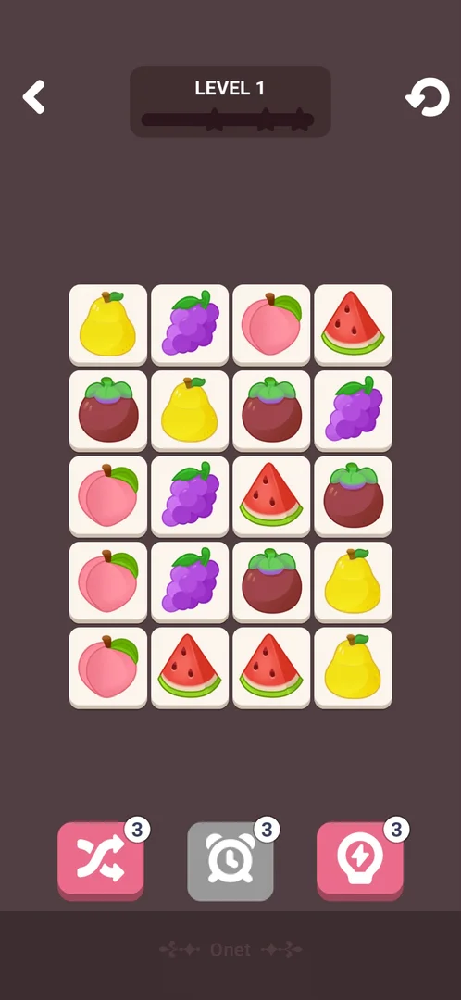
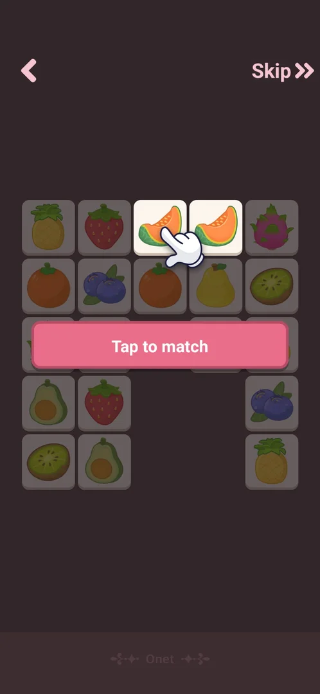
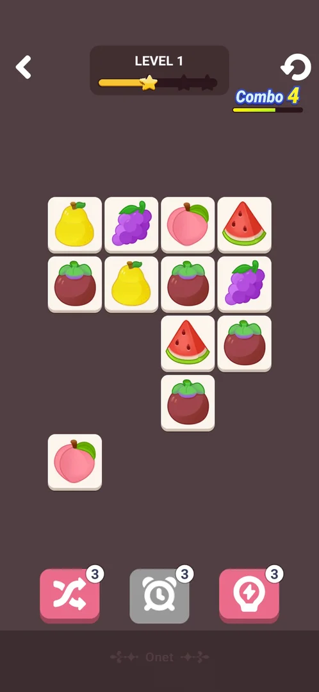
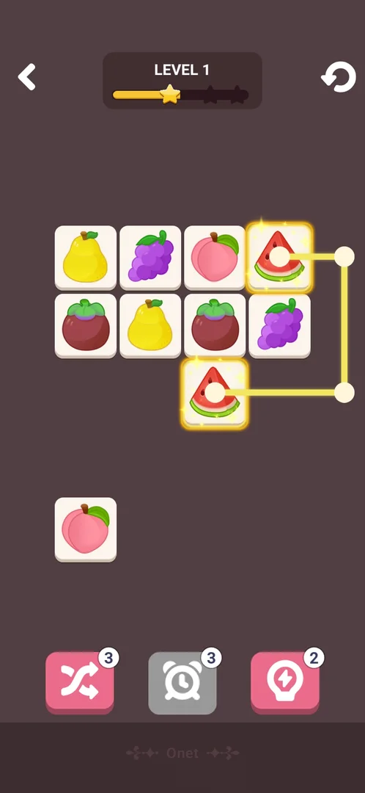
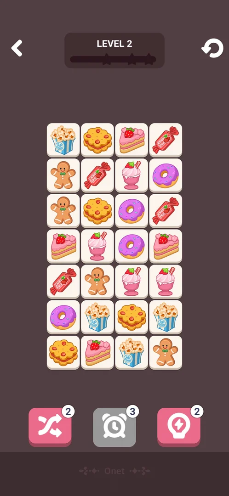
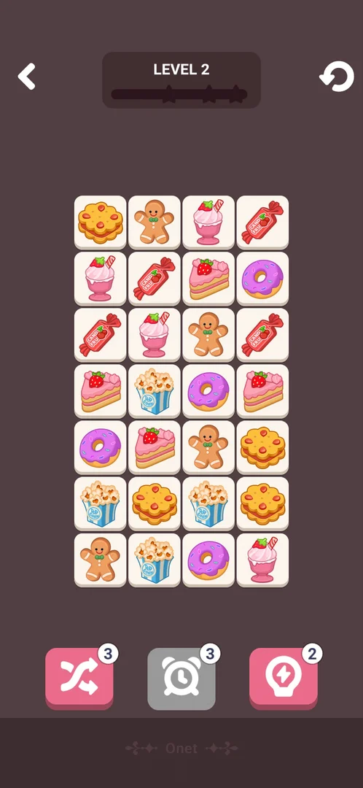
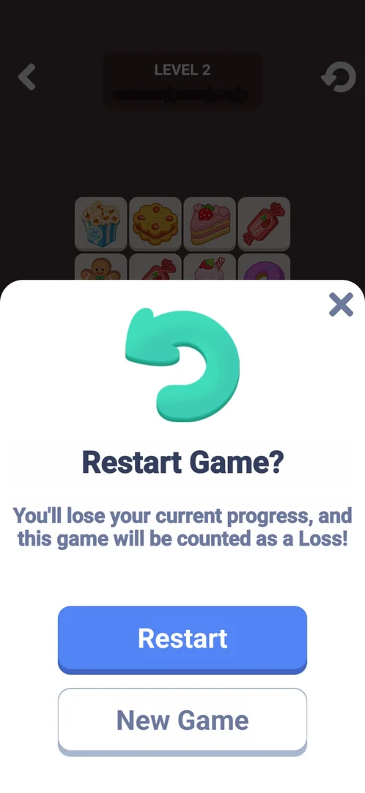

# Mini-game: Onet

One of the eight mini-games built into the app, opened from Settings > More Games. A tile-pairing puzzle:
the player taps two identical tiles, and they vanish when a line with at most two turns can join them
through empty cells, the space outside the board included; clearing the board passes the level and the
next, larger board follows [^s11] [^s6] [^s7].

## Why it appeared

Listed in Settings > More Games from the first launch [^s1].

## Where to find it

Classic board > the gear > More Games > **Onet**, the fifth button of the list (no scroll needed), green
with a white icon of two dots joined by a line; no lock, price or timer on it [^s2] [^s3]. The first tap
opens the tutorial [^s4].

 [^s2]
*More Games list: the Onet button, fifth in the list, green with two dots joined by a line*

## What it looks like

 [^s3]
*Level 1: the back arrow, LEVEL 1 with an empty bar of three stars, the restart arrow; a 4x5 board of fruit tiles; shuffle (3), the grey alarm clock (3) and the hint lightbulb (3) at the bottom*

A dark plum screen [^s3]:

- Top: the back arrow, a panel with LEVEL and its number over a progress bar with three stars, the
  restart arrow.
- The board: cream tiles with pictures, each picture on four tiles in levels 1 and 2 (level 1: five
  fruits on 4 columns x 5 rows; level 2: seven sweets on 4 x 7) [^s3] [^s7].
- Bottom: three tools with a count badge: shuffle (pink), an alarm clock (grey) and the hint lightbulb
  (pink); a faint "Onet" label under them.

## What you can do

A tap selects a tile; a tap on an identical tile clears both when a line of at most two turns joins them
[^s11] [^s12].

| Tab or button | What it does |
|---|---|
| [Tutorial](#tutorial) | First visit: a practice board with prompts and a hand; Skip |
| [Combo](#combo) | A counter of quick matches with a timer bar, under the restart arrow |
| [Hint](#hint) | Lights a pair that can be joined and draws its line; costs a charge (3) |
| [Shuffle](#shuffle) | Rearranges the tiles left; costs a charge (3) |
| [Alarm clock](#alarm-clock) | Grey, count 3; a tap did nothing |
| [Restart](#restart) | Restart Game?: restarting counts as a loss |

### Tutorial

 [^s4]
*First visit: a practice board of 5 x 5 fruit tiles dimmed except the pair to tap; "Tap to match" and the hand on two melons; Skip at the top right*

The tutorial is a board of its own: it lights one pair at a time with an animated hand and a prompt,
"Tap to match" for neighbouring pairs, then "Connect tiles with less than 2 turns" for a pair joined
around a corner [^s4] [^s13]. After the guided pairs the player cleared the
rest of the practice board, and LEVEL 1 opened [^s14] [^s3].

*The hand taps the first melon, the tile gets a rainbow frame, the second tap clears the pair and the hand moves to two lemons* (clip dropped: per-dream clip limit) [^s15]
*Clip 7.3 s · [original on YouTube from 12:05](https://youtu.be/YQn2vAf17A0?t=725)*

### Combo

 [^s5]
*Four quick pairs in level 1: "Combo 4" with a yellow-green bar under the restart arrow; the progress bar has reached the first star*

Matches in quick succession raise the Combo number; the bar under it reads as a timer for the next
match (inferred from its look; its run-out was not seen) [^s5]. No reward for a combo was seen.

### Hint

 [^s6]
*The hint lightbulb at the bottom right (count 3 to 2): two watermelons lit and the line drawn between them, out past the right edge of the board and back*

The hint picks a pair and draws its line; it does not clear it [^s6]. The line in this frame leaves the
board on the right: the edge counts as empty space. The count stayed at 2 into level 2
[^s7].

### Shuffle

 [^s8]
*After the shuffle (bottom left, count 3 to 2): the 28 level 2 tiles in new places*

 [^s7]
*The same board before the shuffle: shuffle 3, the alarm clock 3, hint 2*

The shuffle moved every tile at once; the star bar stayed empty [^s8] [^s7].

### Alarm clock

<!-- no-frame: the tap left the screen unchanged; the tool is seen grey on the frames above -->
The alarm clock (inferred: a freeze-time tool, from its icon; no timer was shown in either level) is grey
with a count of 3 in both levels; a tap on it in level 2 changed nothing, the count stayed 3
[^s16] [^s8].

### Restart

 [^s9]
*The restart arrow at the top right opens "Restart Game?": "You'll lose your current progress, and this game will be counted as a Loss!", Restart (blue), New Game (white), the X at the top right*

The sheet was closed with the X; Restart and New Game were not tapped
[^s17].

## How it works

Version 10.8.1.

- Two identical tiles clear when a line through empty cells joins them with at most two turns; the
  line may run outside the board [^s13] [^s6].
- Boards: tutorial 5 x 5 (partly empty), level 1 4 x 5 (20 tiles, fruits), level 2 4 x 7 (28 tiles,
  sweets) [^s4] [^s3] [^s7].
- The bar under LEVEL fills as pairs clear and has three stars on it; 4 of 10 pairs in level 1 reached
  the first star [^s5]. What the stars pay was not seen.
- Tools: shuffle 3, alarm clock 3 (grey, inactive), hint 3; the hint count spent in level 1 was still 2
  in level 2, so the counts carry over between levels [^s6] [^s7].
- No energy, lives, timer or moves limit were seen [^s3].
- Clearing level 1 was followed by a black screen and a full-screen video ad for another game, then a
  playable ad that Back and relaunching did not close; the app had to be restarted, so the win screen was
  not seen [^s12] [^s18]
  [^s19].
- The win was kept: after the app restart Onet opened at LEVEL 2 [^s7].

## Cases

| Case | What was done | Result | Source |
|---|---|---|---|
| Settings > More Games list entry (open, no lock) <!-- case:chk-entry --> | Scrolled the More Games list, tapped Onet | ✅ Onet, the fifth button; no lock; opens the tutorial | [^s2] |
| Why it appeared <!-- case:chk-appeared --> | Fresh install | ✅ In More Games from the first launch | [^s1] |
| Its screen <!-- case:chk-screen --> | Opened level 1 and level 2 | ✅ LEVEL N with a 3-star bar, back and restart arrows, 4x5 / 4x7 board, shuffle, alarm clock and hint | [^s3] |
| Rules: the goal and how it differs from the core game <!-- case:chk-rules --> | Played the tutorial and level 1 | ✅ Pairs of identical tiles joined by at most two turns, the outside of the board included; clear the board | [^s10] |
| A win: its screen and what it pays <!-- case:chk-win --> | Cleared level 1 | not verified: a video ad, then a playable ad that froze; the app was restarted | [^s12] |
| A loss: its screen, what it costs and the retry offers <!-- case:chk-loss --> | Opened Restart Game? | not verified: the sheet says a restart counts as a Loss; no loss screen seen | [^s9] |
| Progression inside the mode: stages, stars, a best score <!-- case:chk-progression --> | Played level 1 to the end, opened level 2 | ✅ Numbered levels, 3-star bar, combo counter; level 1 clear led to level 2 | [^s5] |
| Limits: attempts, energy, a timer or a schedule; what more attempts cost <!-- case:chk-limits --> | Tapped shuffle, the alarm clock, hint and restart | ✅ No energy or timer; shuffle and hint 3 charges each; the alarm clock inactive; restart counts as a loss | [^s8] |
| Progress kept after an app restart <!-- case:progress-kept --> | Cleared level 1, restarted the app during the ad, reopened Onet | ✅ LEVEL 2, hint 2 left | [^s7] |

## Not verified

- A win: its screen and what it pays: hidden by the frozen playable ad <!-- case:chk-win -->
- A loss: its screen, what it costs and the retry offers; whether a board can run out of joinable pairs <!-- case:chk-loss -->

[^s1]: session 20261003-193423-chrono-2FYKPJ, step 12 — [video at 2:19](https://youtu.be/A6Wh-xa4ryg?t=139)
[^s2]: session 20261003-193423-chrono-2FYKPJ, step 11 — [video at 2:08](https://youtu.be/A6Wh-xa4ryg?t=128)
[^s3]: session 20261005-131038-chrono-2FYKPJ, step 27 — [video at 13:21](https://youtu.be/YQn2vAf17A0?t=801)
[^s4]: session 20261005-131038-chrono-2FYKPJ, step 20 — [video at 11:59](https://youtu.be/YQn2vAf17A0?t=719)
[^s5]: session 20261005-131038-chrono-2FYKPJ, step 28 — [video at 13:50](https://youtu.be/YQn2vAf17A0?t=830)
[^s6]: session 20261005-131038-chrono-2FYKPJ, step 30 — [video at 14:29](https://youtu.be/YQn2vAf17A0?t=869)
[^s7]: session 20261005-131038-chrono-2FYKPJ, step 37 — [video at 17:20](https://youtu.be/YQn2vAf17A0?t=1040)
[^s8]: session 20261005-131038-chrono-2FYKPJ, step 39 — [video at 17:39](https://youtu.be/YQn2vAf17A0?t=1059)
[^s9]: session 20261005-131038-chrono-2FYKPJ, step 40 — [video at 17:49](https://youtu.be/YQn2vAf17A0?t=1069)
[^s10]: session 20261005-131038-chrono-2FYKPJ, step 25 — [video at 12:49](https://youtu.be/YQn2vAf17A0?t=769)

[^s11]: session 20261005-131038-chrono-2FYKPJ, step 24 — [video at 12:32](https://youtu.be/YQn2vAf17A0?t=752)
[^s12]: session 20261005-131038-chrono-2FYKPJ, step 31 — [video at 14:54](https://youtu.be/YQn2vAf17A0?t=894)
[^s13]: session 20261005-131038-chrono-2FYKPJ, step 23 — [video at 12:21](https://youtu.be/YQn2vAf17A0?t=741)
[^s14]: session 20261005-131038-chrono-2FYKPJ, step 26 — [video at 13:10](https://youtu.be/YQn2vAf17A0?t=790)
[^s15]: session 20261005-131038-chrono-2FYKPJ, step 21 — [video at 12:08](https://youtu.be/YQn2vAf17A0?t=728)
[^s16]: session 20261005-131038-chrono-2FYKPJ, step 38 — [video at 17:31](https://youtu.be/YQn2vAf17A0?t=1051)
[^s17]: session 20261005-131038-chrono-2FYKPJ, step 41 — [video at 17:59](https://youtu.be/YQn2vAf17A0?t=1079)
[^s18]: session 20261005-131038-chrono-2FYKPJ, step 33 — [video at 16:06](https://youtu.be/YQn2vAf17A0?t=966)
[^s19]: session 20261005-131038-chrono-2FYKPJ, step 35 — [video at 16:58](https://youtu.be/YQn2vAf17A0?t=1018)
