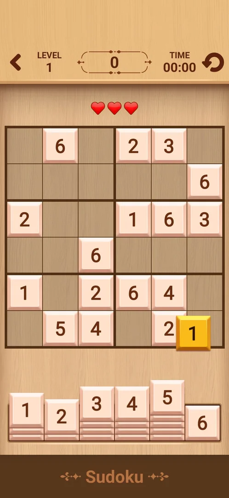
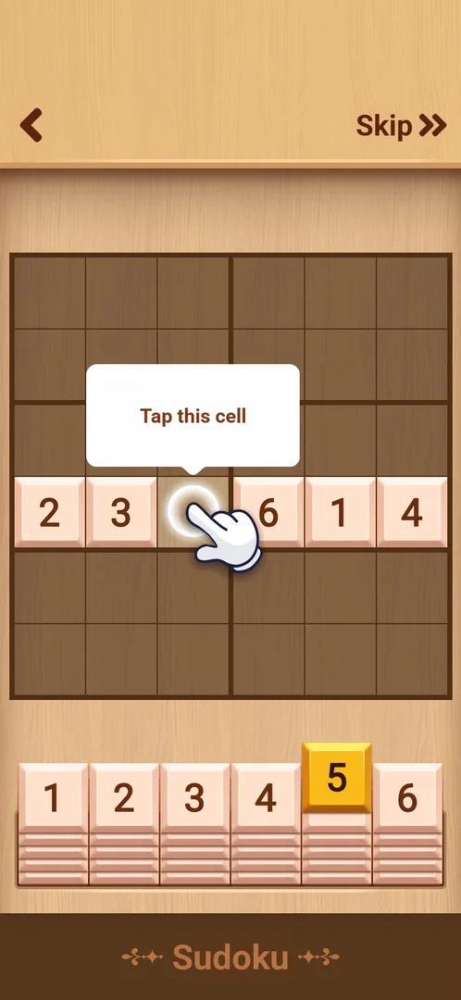
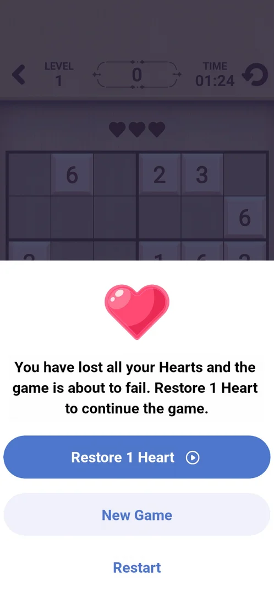
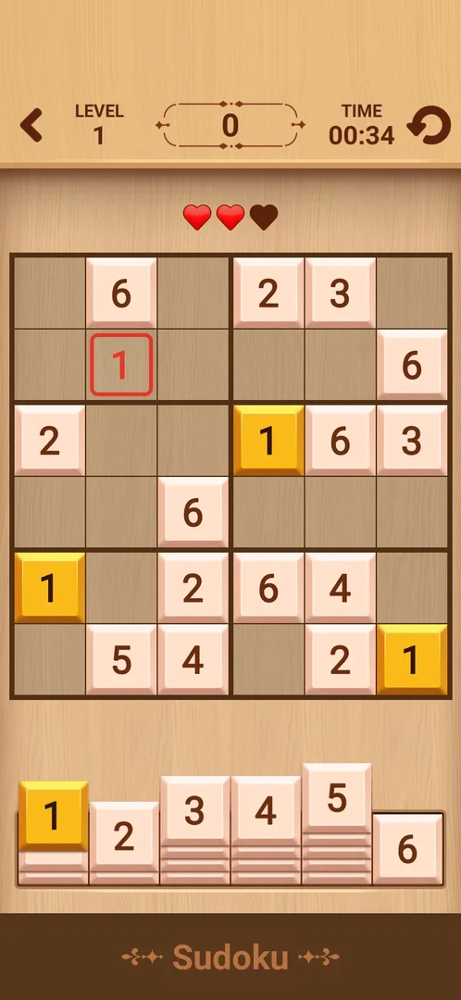
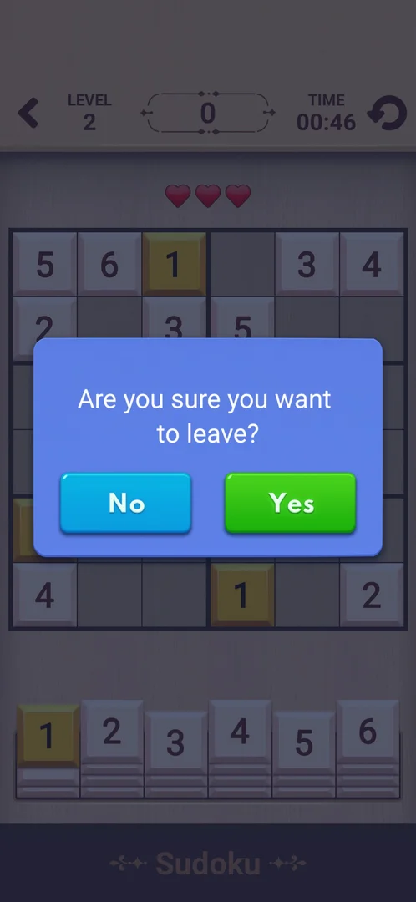
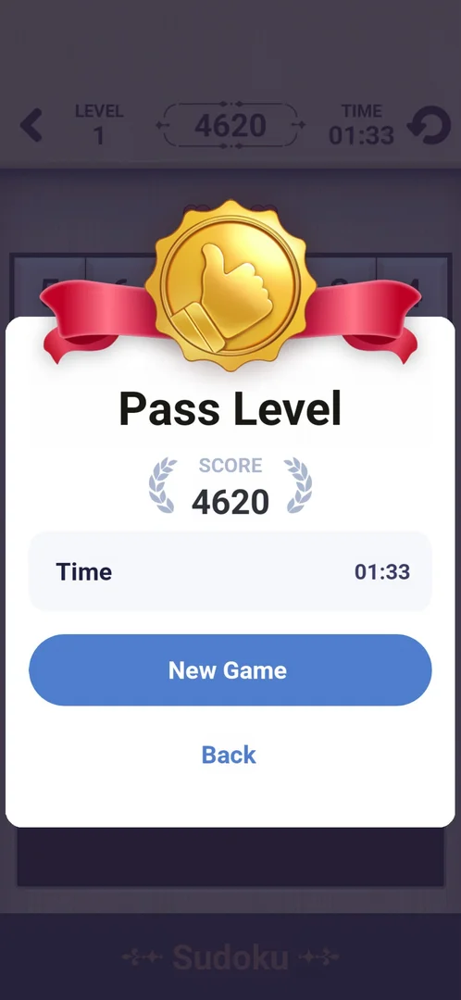

# Mini-game: Sudoku

One of the eight mini-games built into the app, opened from Settings > More Games. A 6x6 sudoku: the
player fills every row, column and 2x3 box with the digits 1 to 6, picking digits from a tray under the
board. Each board is a numbered level with a score and a timer; three hearts allow three wrong digits, and
losing them all opens a sheet with a rewarded-ad heart, a new game or a restart [^s3] [^s5] [^s8].

## Why it appeared

Listed in Settings > More Games from the first launch [^s1].

## Where to find it

Classic board > the gear > More Games > **Sudoku**, the seventh green button of the list, with a white
icon of number tiles; it is half hidden at the bottom of the list until the list is scrolled, and its
visible top half can be tapped. No lock, price or timer on it [^s2] [^s4].
One tap opens the mini-game inside the app; the first open starts with the tutorial [^s4].

 [^s2]
*More Games list: the Sudoku button, seventh in the list, under Mahjong*

## What it looks like

 [^s3]
*Level 1 just after the tutorial: LEVEL 1, score 0, TIME 00:00, three hearts, the selected digit 1 dropping into a cell*

A wooden board on a light wood background [^s3]:

- Top row: the back arrow, LEVEL with its number, the score in a framed box, TIME counting up from 00:00,
  the restart arrow.
- Three red hearts under the top row.
- The 6x6 board, split by thicker lines into six 2x3 boxes; given digits are light tiles.
- The digit tray 1 to 6 under the board: each digit is a stack of tiles whose height shows how many of
  that digit are still to be placed; the selected digit is yellow and the same digits on the board turn
  yellow too [^s3] [^s7].

## What you can do

Tap a digit in the tray, then an empty cell, to place it; the case notes say a cell then a digit works
too [^s9]. A correct digit stays as a tile; a wrong one is outlined red and costs a heart [^s7].

| Tab or button | What it does |
|---|---|
| [Tutorial](#tutorial) | First open only: a guided board that teaches the rules; Skip ends it |
| [Out of hearts](#out-of-hearts) | After the third wrong digit: Restore 1 Heart, New Game or Restart |
| [Back arrow](#back-arrow) | Leaving a level asks Are you sure you want to leave? |

### Tutorial

 [^s4]
*The first tutorial step: one row with a gap, the hint "Tap this cell", digit 5 raised in the tray, Skip at the top right*

The tutorial is a guided board with white hint boxes and an animated hand; only the back arrow and Skip
are around it [^s4]. Its steps seen: fill the gap in a row (the 5), the column rule (each column holds
the digits 1 to 6; tap digit 2, then its cell), the box rule, and elimination: after a digit is picked,
the cells in the same row or column as that digit are marked with an x [^s4]
[^s10] [^s11] [^s12].
Skip ended it and opened Level 1 [^s3].

*The column-rule step: the hint about columns and the hand tapping digit 2 in the tray* (clip dropped: per-dream clip limit) [^s10]
*Clip 3 s · [original on YouTube from 12:05](https://youtu.be/EdZAa-3kDtc?t=725)*

### Out of hearts

 [^s5]
*After the third wrong digit: the sheet "You have lost all your Hearts and the game is about to fail", Restore 1 Heart (video icon), New Game, Restart*

A wrong digit is outlined red, a heart goes dark, and the digit is then cleared from the cell [^s7].

*A wrong 1 placed: red outline, the third heart goes dark, the cell is cleared* (clip dropped: per-dream clip limit) [^s7]
*Clip 5.5 s · [original on YouTube from 13:52](https://youtu.be/EdZAa-3kDtc?t=832)*

 [^s7]
*The first wrong digit: the 1 outlined red in the top-left box, two red hearts and one dark, TIME 00:34*

At the third wrong digit all three hearts are dark and a white sheet rises over the board: the message
that the game is about to fail, **Restore 1 Heart** with a video icon (a rewarded ad, inferred from the
icon; not tapped), **New Game** and **Restart** [^s5]. Restart reloaded the same board with the same
given digits, three hearts and TIME back at 00:00 [^s13].

### Back arrow

 [^s6]
*Leaving Level 2: "Are you sure you want to leave?" with No (blue) and Yes (green)*

Leaving a level in progress asks "Are you sure you want to leave?" with No and Yes; the dialog was
opened with the phone's Back key, the back arrow on the board was not tapped, and neither answer was
tapped [^s6].

### Pass Level

 [^s8]
*The win panel: Pass Level, SCORE 4620, Time 01:33, New Game (blue) and Back*

The last digit filled the board and a white panel opened at once, with no ad before it: a gold
thumbs-up medal, **Pass Level**, the score, the time, **New Game** and **Back** [^s8]. New Game opened
Level 2 with a new board, three hearts, score 0 and TIME 00:00 [^s9].

*The last cell filled and the Pass Level panel* (clip dropped: per-dream clip limit) [^s8]
*Clip 4.8 s · [original on YouTube from 16:32](https://youtu.be/EdZAa-3kDtc?t=992)*

## How it works

Version 10.8.1.

- Rules: every row, column and 2x3 box holds the digits 1 to 6 once [^s4] [^s9].
- Hearts: 3 per board; each wrong digit costs one and is cleared from the cell; at 0 hearts the
  out-of-hearts sheet opens [^s7] [^s5]. Restore 1 Heart shows a video icon (not tapped).
- Score: 0 while the first digits went in [^s7], 3630 with one cell left
  [^s14], 4620 after the last cell [^s8]. How the points are counted per cell
  was not worked out.
- TIME counts up from 00:00 and restarts with the board: Level 1 was solved in 01:33 after the restart
  [^s8].
- Levels: numbered; New Game after a win opens the next level with a new board [^s9].
- No energy, lives outside the board or schedule were seen in levels 1 and 2; no ad came before the Pass
  Level panel [^s8] [^s9].

## Cases

| Case | What was done | Result | Source |
|---|---|---|---|
| Settings > More Games list entry (open, no lock) <!-- case:chk-entry --> | Scrolled the More Games list; tapped the half-visible Sudoku button | ✅ Sudoku, the seventh button; opens the mini-game at once | [^s2] [^s4] |
| Why it appeared <!-- case:chk-appeared --> | Fresh install | ✅ In More Games from the first launch | [^s1] |
| Its screen <!-- case:chk-screen --> | Opened the mini-game, skipped the tutorial | ✅ 6x6 grid in 2x3 boxes, Level, score, TIME, 3 hearts, digit tray 1-6 with stacked counts, restart arrow | [^s3] [^s9] |
| Rules <!-- case:chk-rules --> | Followed the tutorial, then solved Level 1 | ✅ Fill each row, column and 2x3 box with 1-6; tap a digit then a cell; same digits highlight; the tutorial teaches the column, box and x-elimination rules and has Skip | [^s4] [^s9] |
| A win: its screen and what it pays <!-- case:chk-win --> | Filled the Level 1 board | ✅ Pass Level panel: score 4620, time 1:33, New Game / Back; New Game opens Level 2 | [^s8] [^s9] |
| A loss: its screen, what it costs and the retry offers <!-- case:chk-loss --> | Placed three wrong digits on purpose, then Restart | ✅ Each costs a heart and the cell is cleared; at 0 hearts a sheet offers Restore 1 Heart (video), New Game, Restart; Restart reloads the same board with 3 hearts and TIME 0 | [^s7] [^s5] [^s13] |
| Progression <!-- case:chk-progression --> | Solved Level 1, tapped New Game | ✅ Numbered levels: Level 2 opens with a new board; score and time per level | [^s9] |
| Limits <!-- case:chk-limits --> | Played levels 1 and 2 | ✅ 3 hearts per board; no energy or timer limit seen; Restore 1 Heart shows a video icon | [^s5] [^s9] |

## Not verified

- What Restore 1 Heart and New Game on the out-of-hearts sheet do (not tapped)
- No and Yes on the leave dialog, the back arrow and the restart arrow on the board (not tapped)
- How the score is counted per digit, and whether wrong digits or time change it
- Whether a level in progress or the level number is kept after leaving

[^s1]: session 20261003-193423-chrono-2FYKPJ, step 12 — [video at 2:19](https://youtu.be/A6Wh-xa4ryg?t=139)
[^s2]: session 20261003-193423-chrono-2FYKPJ, step 11 — [video at 2:08](https://youtu.be/A6Wh-xa4ryg?t=128)
[^s3]: session 20261005-153835-chrono-2FYKPJ, step 39 — [video at 13:22](https://youtu.be/EdZAa-3kDtc?t=802)
[^s4]: session 20261005-153835-chrono-2FYKPJ, step 34 — [video at 11:56](https://youtu.be/EdZAa-3kDtc?t=716)
[^s5]: session 20261005-153835-chrono-2FYKPJ, step 44 — [video at 14:47](https://youtu.be/EdZAa-3kDtc?t=887)
[^s6]: session 20261005-153835-chrono-2FYKPJ, step 51 — [video at 17:59](https://youtu.be/EdZAa-3kDtc?t=1079)
[^s7]: session 20261005-153835-chrono-2FYKPJ, step 41 — [video at 13:57](https://youtu.be/EdZAa-3kDtc?t=837)
[^s8]: session 20261005-153835-chrono-2FYKPJ, step 49 — [video at 16:36](https://youtu.be/EdZAa-3kDtc?t=996)
[^s9]: session 20261005-153835-chrono-2FYKPJ, step 50 — [video at 17:17](https://youtu.be/EdZAa-3kDtc?t=1037)

[^s10]: session 20261005-153835-chrono-2FYKPJ, step 35 — [video at 12:07](https://youtu.be/EdZAa-3kDtc?t=727)
[^s11]: session 20261005-153835-chrono-2FYKPJ, step 37 — [video at 12:38](https://youtu.be/EdZAa-3kDtc?t=758)
[^s12]: session 20261005-153835-chrono-2FYKPJ, step 38 — [video at 12:57](https://youtu.be/EdZAa-3kDtc?t=777)
[^s13]: session 20261005-153835-chrono-2FYKPJ, step 45 — [video at 14:59](https://youtu.be/EdZAa-3kDtc?t=899)
[^s14]: session 20261005-153835-chrono-2FYKPJ, step 48 — [video at 16:26](https://youtu.be/EdZAa-3kDtc?t=986)
