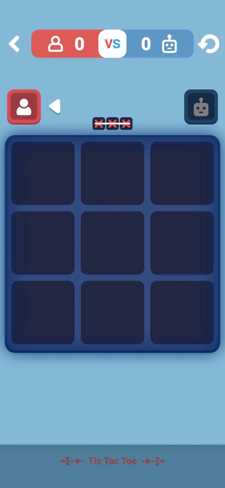
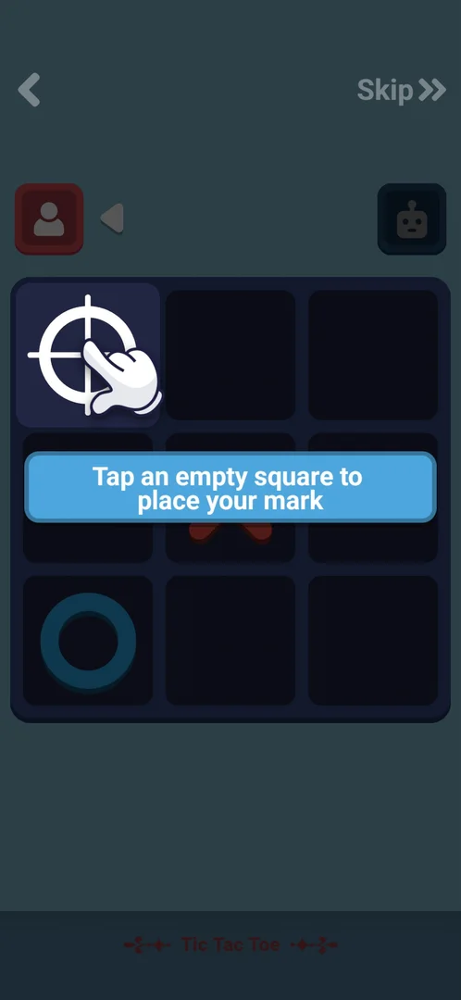
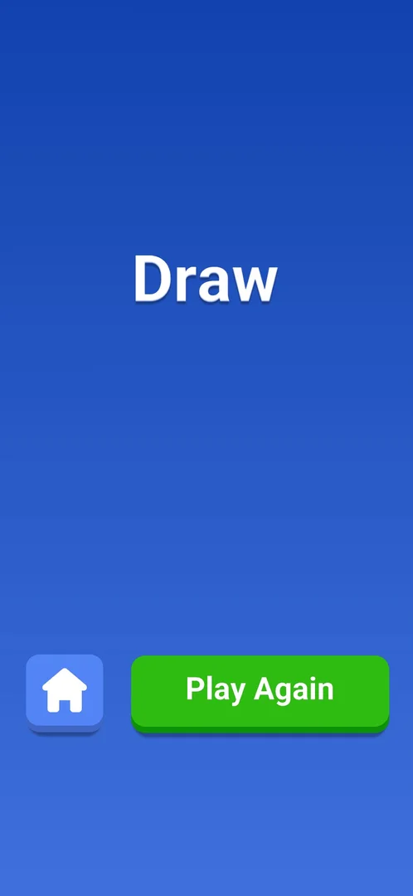
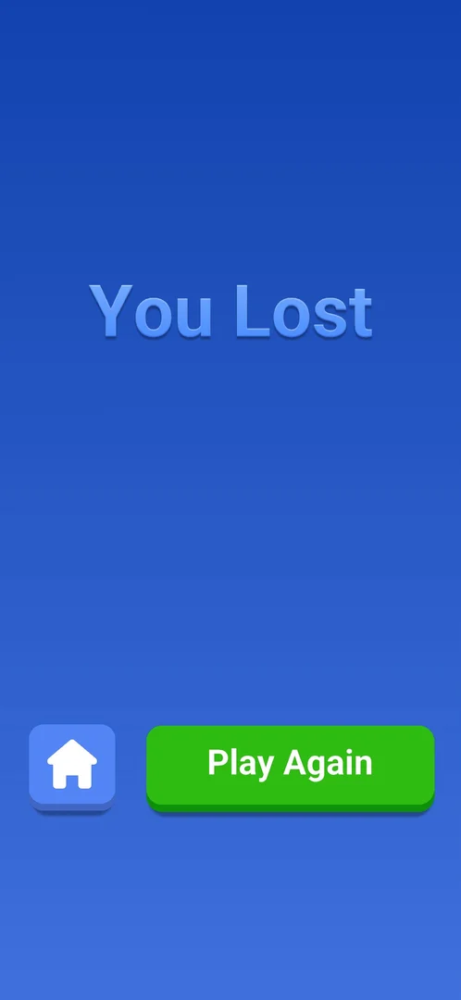

# Mini-game: Tic Tac Toe

One of the eight mini-games built into the app, opened from Settings > More Games. Classic noughts and
crosses on a 3x3 board against a robot: the player places red crosses, the robot blue noughts, and three
marks in a row win the round. The first visit opens a short guided tutorial; after it the rounds go on
without levels, each ending in a Draw or You Lost screen (a win against the robot was not played)
[^s4] [^s5] [^s6].

## Why it appeared

Listed in Settings > More Games from the first launch [^s1].

## Where to find it

Classic board > the gear > More Games > **Tic Tac Toe**, the second green button of the list, with a white
noughts-and-crosses icon; no scroll needed, no lock, price or timer on it [^s2] [^s3]. One tap opens the
tutorial on the first visit [^s4].

 [^s2]
*The Tic Tac Toe button in More Games: green, second in the list, under One Line*

## What it looks like

 [^s5]
*The board after the tutorial: the back arrow, the scoreboard (player 0 VS 0 robot), the restart arrow; the player's red avatar on the left with the turn arrow beside it, the robot's avatar on the right*

A light-blue screen with the title "Tic Tac Toe" at the bottom [^s5]:

- Top bar: the back arrow, the scoreboard (the player's count on red, VS, the robot's count on blue) and the
  restart arrow.
- Under it the two avatars: the player (red, left) and the robot (blue, right). A white arrow points at
  the side whose turn it is, and that avatar is lit [^s7].
- Above the grid a small strip of three red crosses: the goal, three in a row.
- The 3x3 grid.

## What you can do

Tapping an empty square places a cross; the robot answers about a second later
[^s7] [^s8].

| Tab or button | What it does |
|---|---|
| [Tutorial](#tutorial) | First visit: three guided moves with a hand and a hint text; Skip |
| [Draw](#draw) | A full board with no line: the Draw screen, Home and Play Again |
| [You Lost](#you-lost) | The robot's line: the You Lost screen, Home and Play Again |

The restart arrow, the back arrow and Skip were not tapped.

### Tutorial

 [^s4]
*The first tutorial step: the board is dimmed except the square under the hand; Skip at the top right*

The tutorial board starts with marks already placed. A hand and a blue text box lead three moves
[^s4] [^s9] [^s10]:

1. "Tap an empty square to place your mark" (the top-left square).
2. "Block your opponent from completing their row" (the bottom-middle square, between two noughts).
3. "Get three marks in a row to win!" (the top-middle square, which completes the middle column).

*After the first tutorial move the robot answers, then the board dims and the hand points at the square that blocks its row* (clip dropped: per-dream clip limit) [^s9]
*Clip 2.7 s · [original on YouTube from 2:56](https://youtu.be/H_WygghZvno?t=176)*

The third move wins the column; the line lights up and the text "Way to go! Now, onto the next round!"
follows. A tap moves on to the real board with the scoreboard at 0 VS 0
[^s11] [^s5].

### Draw

 [^s12]
*The Draw screen: the house button (Home) on the left, the green Play Again on the right; no score or reward*

When the last square was filled without a line, the title "Draw" came up on a blue screen, then a
full-screen video ad for another game started; after it ran on into a playable ad, the phone's Back key
closed it and the Draw screen showed its two buttons [^s13]
[^s14] [^s12]. Play Again opened a new round
at once, in which the robot moved first [^s15].

### You Lost

 [^s6]
*The You Lost screen: the same layout as Draw under another title*

The robot completed its diagonal and its count on the scoreboard went from 0 to 1; then a video ad for
another game played with a "Skip to playable" control, and after about 45 s the Back key brought up You
Lost [^s16] [^s6]. Home led back to the
More Games list over the home menu [^s17].

## How it works

Version 10.8.1.

- Three marks in a row (a row, a column or a diagonal) win the round; a full board without a line is a
  draw [^s11] [^s13].
- The player is always the red cross. The first move alternates: the player moved first in the first
  round after the tutorial, the robot in the next [^s7]
  [^s15].
- The robot blocked each of the player's threats in the drawn round and completed its own line as soon as
  the player left it open [^s8] [^s18]
  [^s16].
- The scoreboard counts round wins: it stayed 0 VS 0 after the draw and showed 0 VS 1 after the robot's
  win [^s15] [^s16]. Whether it is kept after
  leaving was not seen.
- No levels, stars, reward, energy, attempt limit or timer were seen; a video ad played after each
  finished round, before its result screen [^s13]
  [^s16].

## Cases

| Case | What was done | Result | Source |
|---|---|---|---|
| Why it appeared <!-- case:chk-appeared --> | Fresh install | ✅ In More Games from the first launch | [^s1] |
| Where to find it: the screen and the button that open it <!-- case:chk-entry --> | Opened More Games and tapped Tic Tac Toe | ✅ The second button; opens the tutorial on the first visit | [^s2] [^s4] |
| Its screen <!-- case:chk-screen --> | Finished the tutorial | ✅ 3x3 board, back arrow, restart arrow, scoreboard 0 VS 0, turn arrow beside the active avatar | [^s5] |
| Rules <!-- case:chk-rules --> | Tutorial, a drawn round, a lost round | ✅ Classic tic tac toe against a robot; three-step tutorial with Skip; the first move alternates; the robot blocks and completes its lines | [^s10] [^s15] |
| A win: its screen and what it pays <!-- case:chk-win --> | Won the tutorial's column | ✅ "Way to go! Now, onto the next round!", then the real board; no reward. A win against the robot in a real round was not played | [^s11] |
| A loss: its screen, what it costs and the retry offers <!-- case:chk-loss --> | Left the robot's diagonal open | ✅ A video ad, then You Lost with Home (to More Games) and Play Again; no cost, no continue offer; a draw gives the same screen titled Draw | [^s6] [^s12] |
| Progression <!-- case:chk-progression --> | Played two rounds after the tutorial | ✅ No stages or levels: endless rounds and a win count per side | [^s15] [^s16] |
| Limits <!-- case:chk-limits --> | Tutorial, a draw and a loss | ✅ No attempt limit or timer; a video ad after each finished round | [^s13] [^s16] |

## Not verified

- A win against the robot in a real round: its screen and the scoreboard
- The restart arrow, the back arrow and Skip
- Whether the scoreboard and the tutorial state are kept after leaving

[^s1]: session 20261003-193423-chrono-2FYKPJ, step 12 — [video at 2:19](https://youtu.be/A6Wh-xa4ryg?t=139)
[^s2]: session 20261003-193423-chrono-2FYKPJ, step 11 — [video at 2:08](https://youtu.be/A6Wh-xa4ryg?t=128)
[^s3]: session 20261003-193423-chrono-2FYKPJ, step 10 — [video at 1:57](https://youtu.be/A6Wh-xa4ryg?t=117)

[^s4]: session 20261005-231555-chrono-2FYKPJ, step 10 — [video at 2:47](https://youtu.be/H_WygghZvno?t=167)
[^s5]: session 20261005-231555-chrono-2FYKPJ, step 14 — [video at 3:50](https://youtu.be/H_WygghZvno?t=230)
[^s6]: session 20261005-231555-chrono-2FYKPJ, step 25 — [video at 8:31](https://youtu.be/H_WygghZvno?t=511)
[^s7]: session 20261005-231555-chrono-2FYKPJ, step 15 — [video at 4:03](https://youtu.be/H_WygghZvno?t=243)
[^s8]: session 20261005-231555-chrono-2FYKPJ, step 16 — [video at 4:15](https://youtu.be/H_WygghZvno?t=255)
[^s9]: session 20261005-231555-chrono-2FYKPJ, step 11 — [video at 2:59](https://youtu.be/H_WygghZvno?t=179)
[^s10]: session 20261005-231555-chrono-2FYKPJ, step 12 — [video at 3:00](https://youtu.be/H_WygghZvno?t=180)
[^s11]: session 20261005-231555-chrono-2FYKPJ, step 13 — [video at 3:11](https://youtu.be/H_WygghZvno?t=191)
[^s12]: session 20261005-231555-chrono-2FYKPJ, step 21 — [video at 6:38](https://youtu.be/H_WygghZvno?t=398)
[^s13]: session 20261005-231555-chrono-2FYKPJ, step 19 — [video at 5:14](https://youtu.be/H_WygghZvno?t=314)
[^s14]: session 20261005-231555-chrono-2FYKPJ, step 20 — [video at 5:33](https://youtu.be/H_WygghZvno?t=333)
[^s15]: session 20261005-231555-chrono-2FYKPJ, step 22 — [video at 6:50](https://youtu.be/H_WygghZvno?t=410)
[^s16]: session 20261005-231555-chrono-2FYKPJ, step 24 — [video at 7:20](https://youtu.be/H_WygghZvno?t=440)
[^s17]: session 20261005-231555-chrono-2FYKPJ, step 26 — [video at 8:44](https://youtu.be/H_WygghZvno?t=524)
[^s18]: session 20261005-231555-chrono-2FYKPJ, step 17 — [video at 4:28](https://youtu.be/H_WygghZvno?t=268)
