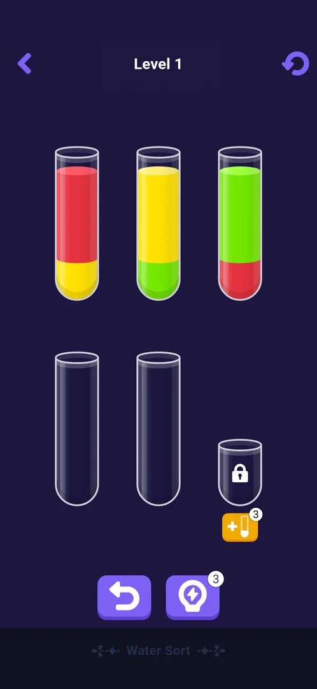
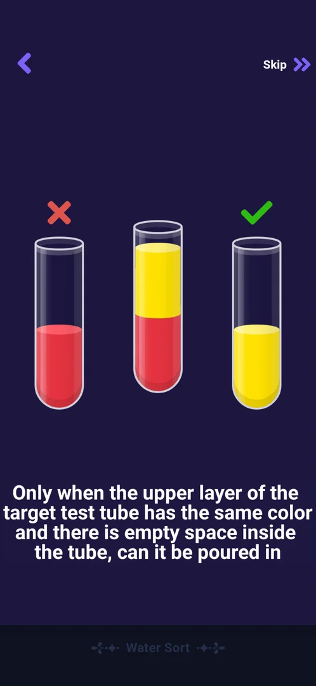
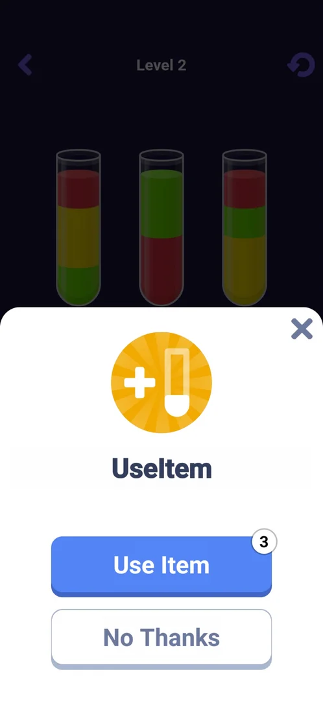
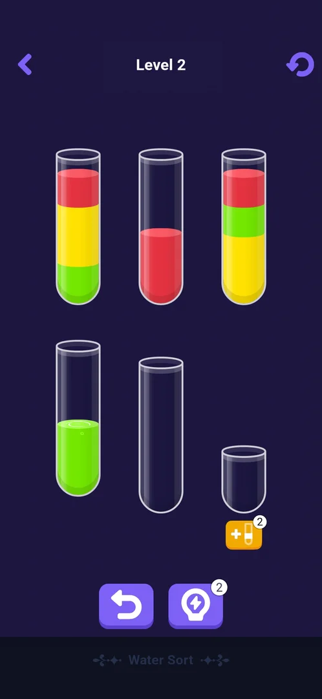
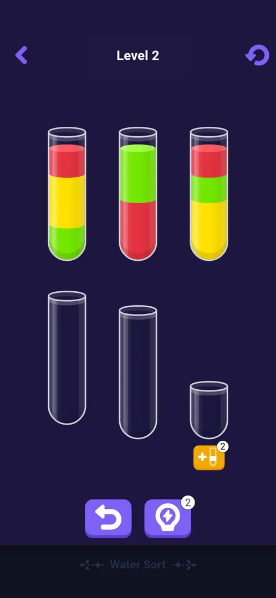

# Mini-game: Water Sort

One of the eight mini-games built into the app, opened from Settings > More Games. A colour-sorting puzzle:
the player pours coloured liquid layers from tube to tube until each tube holds a single colour, level by
numbered level. The first visit opens a short tutorial; the levels have an extra locked tube, an
add-tube item, a hint and an undo [^s4] [^s5].

## Why it appeared

Listed in Settings > More Games from the first launch [^s1].

## Where to find it

Classic board > the gear > More Games > **Water Sort**, the fourth green button of the list, with a white
icon of three test tubes; no scroll needed, no lock, price or timer on it [^s2] [^s3]. One tap opens the
tutorial on the first visit [^s4].

 [^s2]
*The Water Sort button in More Games: green, fourth in the list, under Fruit Merge*

## What it looks like

 [^s5]
*Level 1: the back arrow, "Level 1", the restart arrow; three filled tubes, two empty ones, a small locked tube with the orange add-tube button (3) under it; undo and hint (3) at the bottom*

A dark-violet screen with the title "Water Sort" at the bottom [^s5]:

- Top bar: the back arrow, "Level N" and the restart arrow.
- The tubes in two rows: in level 1 three tubes with two colours each and two empty tubes.
- A sixth, shorter tube with a padlock and under it the orange add-tube button with its count.
- At the bottom: undo (no count) and hint (count 3).

## What you can do

Tap a tube to lift it, then tap the target tube to pour its top colour there
[^s6] [^s7].

| Tab or button | What it does |
|---|---|
| [Tutorial](#tutorial) | First visit: three tubes, a hand and the pour rule; Skip |
| [Add tube](#add-tube) | The UseItem sheet: unlocks the sixth tube for one item (3) |
| [Hint](#hint) | Makes one pour automatically; costs a charge (3) |
| [Undo](#undo) | Takes the last pour back; no count |
| [Next Puzzle](#next-puzzle) | After the last cork: a banner, then the next level |

The restart arrow, the back arrow, Skip and No Thanks were not tapped.

### Tutorial

 [^s6]
*After the middle tube is selected: a red cross over the tube it cannot pour into, a green check over the one it can, and the pour rule under the tubes*

Three tubes: red, red under yellow, and yellow; a hand points at the middle one with the text "Click to
select test tube", and Skip sits at the top right [^s4]. Once a tube is
lifted, the text gives the rule: a pour is possible only when the target's top layer is the same colour and
the target has free space [^s6]. Two pours finish it: the yellow layer onto
the yellow tube, then the red onto the red one [^s7]
[^s5].

*The yellow layer pours across, the tube fills to one colour, a cork drops on it with confetti; the hand moves to the red tube* (clip dropped: per-dream clip limit) [^s7]
*Clip 3 s · [original on YouTube from 9:10](https://youtu.be/H_WygghZvno?t=550)*

After the second cork level 1 opened by itself [^s5].

### Add tube

 [^s8]
*The orange plus-tube button under the locked tube opens a white sheet: "UseItem", a blue Use Item button with the count 3, No Thanks and X*

Use Item removed the padlock: the short sixth tube became an empty tube to pour into, and the button's
count went from 3 to 2 [^s9].

### Hint

 [^s10]
*Hint, the right button at the bottom: it made one pour on its own (the green layer into an empty tube); its count went from 3 to 2*

*The hint lifts a tube and pours its top layer into an empty tube by itself* (clip dropped: per-dream clip limit) [^s10]
*Clip 4.5 s · [original on YouTube from 11:25](https://youtu.be/H_WygghZvno?t=685)*

### Undo

 [^s11]
*Undo, the left button at the bottom, with no count: the hinted pour is taken back; the hint charge is not returned*

### Next Puzzle

 [^s12]
*Level 2, on screen a second after level 1's last pour: three tubes of three layers each, two empty tubes and the locked tube*

The last pour of a level corks the tube with confetti, a "Next Puzzle" ribbon flashes over the board, and
the next level loads by itself: no result screen with buttons, no score, no reward and no ad
[^s13] [^s12].

*The last red layer is poured, the tube is corked, a Next Puzzle ribbon flashes and level 2 appears* (clip dropped: per-dream clip limit) [^s13]
*Clip 8.4 s · [original on YouTube from 10:31](https://youtu.be/H_WygghZvno?t=631)*

## How it works

Version 10.8.1.

- A pour moves the top colour of the lifted tube onto a tube whose top is the same colour (or that is
  empty) and that has free space [^s6] [^s14].
- A tube filled with one colour gets a cork and confetti; a level ends when every colour is corked
  [^s7] [^s12].
- Level 1: three colours in three tubes of two layers each, two empty tubes; solved in 5 pours and about
  60 s. Level 2: three colours in three tubes of three layers each, two empty tubes
  [^s5] [^s12].
- Items: add tube 3 and hint 3 at the start; each use takes one; undo has no count and did not give back
  the hint it undid [^s9] [^s10]
  [^s11]. What happens at 0 was not seen.
- No energy, lives, moves limit or timer were seen in the tutorial, level 1 and level 2
  [^s5] [^s12].

## Cases

| Case | What was done | Result | Source |
|---|---|---|---|
| Why it appeared <!-- case:chk-appeared --> | Fresh install | ✅ In More Games from the first launch | [^s1] |
| Where to find it: the screen and the button that open it <!-- case:chk-entry --> | Opened More Games and tapped Water Sort | ✅ The fourth button; opens the tutorial on the first visit | [^s2] [^s4] |
| Its screen <!-- case:chk-screen --> | Finished the tutorial | ✅ Level N title, back and restart arrows, the tubes, a locked extra tube with the add-tube button, undo and hint | [^s5] |
| Rules <!-- case:chk-rules --> | Tutorial, level 1, items in level 2 | ✅ Select a tube then a target; same top colour and free space; a single-colour tube is corked; tutorial with Skip; add tube (3), hint (3, one automatic pour), free undo | [^s6] [^s7] [^s10] |
| A win: its screen and what it pays <!-- case:chk-win --> | Solved level 1 | ✅ The last cork, a Next Puzzle ribbon, then level 2 loads by itself; no result screen, no reward, no ad | [^s12] |
| A loss: its screen, what it costs and the retry offers <!-- case:chk-loss --> | — | not verified: both levels had empty tubes to spare |  |
| Progression <!-- case:chk-progression --> | Solved level 1 | ✅ Numbered levels: level 1 two layers per tube, level 2 three; no result screen between them | [^s12] |
| Limits: attempts, energy, a timer or a schedule <!-- case:chk-limits --> | — | not verified: none seen in two levels, the item counts at 0 and later levels not reached |  |

## Not verified

- A loss: a board with no pour left, what it shows, costs and offers <!-- case:chk-loss -->
- Limits: attempts, energy, a timer; what the add tube and hint cost at 0 <!-- case:chk-limits -->
- The restart arrow, the back arrow, Skip and No Thanks
- Whether the level reached is kept after leaving

[^s1]: session 20261003-193423-chrono-2FYKPJ, step 12 — [video at 2:19](https://youtu.be/A6Wh-xa4ryg?t=139)
[^s2]: session 20261003-193423-chrono-2FYKPJ, step 11 — [video at 2:08](https://youtu.be/A6Wh-xa4ryg?t=128)
[^s3]: session 20261003-193423-chrono-2FYKPJ, step 10 — [video at 1:57](https://youtu.be/A6Wh-xa4ryg?t=117)

[^s4]: session 20261005-231555-chrono-2FYKPJ, step 27 — [video at 8:57](https://youtu.be/H_WygghZvno?t=537)
[^s5]: session 20261005-231555-chrono-2FYKPJ, step 31 — [video at 9:29](https://youtu.be/H_WygghZvno?t=569)
[^s6]: session 20261005-231555-chrono-2FYKPJ, step 28 — [video at 9:01](https://youtu.be/H_WygghZvno?t=541)
[^s7]: session 20261005-231555-chrono-2FYKPJ, step 29 — [video at 9:13](https://youtu.be/H_WygghZvno?t=553)
[^s8]: session 20261005-231555-chrono-2FYKPJ, step 35 — [video at 11:04](https://youtu.be/H_WygghZvno?t=664)
[^s9]: session 20261005-231555-chrono-2FYKPJ, step 36 — [video at 11:17](https://youtu.be/H_WygghZvno?t=677)
[^s10]: session 20261005-231555-chrono-2FYKPJ, step 37 — [video at 11:29](https://youtu.be/H_WygghZvno?t=689)
[^s11]: session 20261005-231555-chrono-2FYKPJ, step 38 — [video at 11:43](https://youtu.be/H_WygghZvno?t=703)
[^s12]: session 20261005-231555-chrono-2FYKPJ, step 34 — [video at 10:39](https://youtu.be/H_WygghZvno?t=639)
[^s13]: session 20261005-231555-chrono-2FYKPJ, step 33 — [video at 10:35](https://youtu.be/H_WygghZvno?t=635)
[^s14]: session 20261005-231555-chrono-2FYKPJ, step 32 — [video at 10:06](https://youtu.be/H_WygghZvno?t=606)
