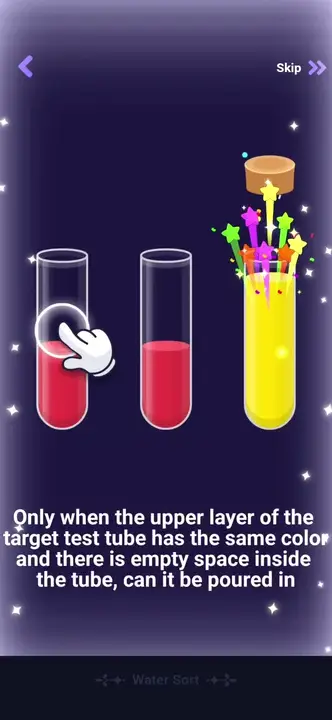
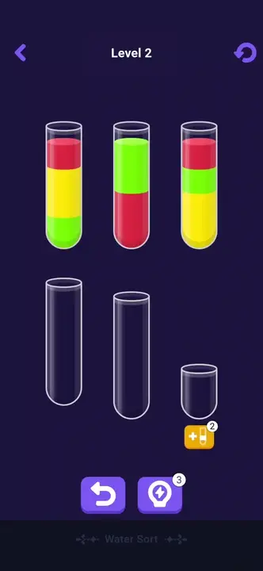
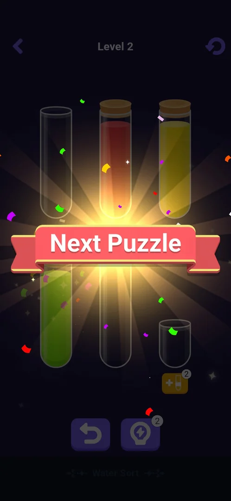
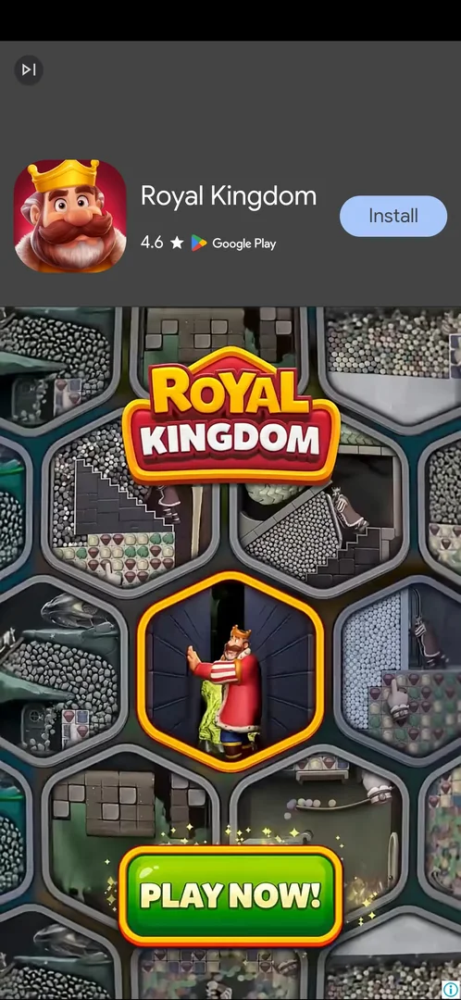
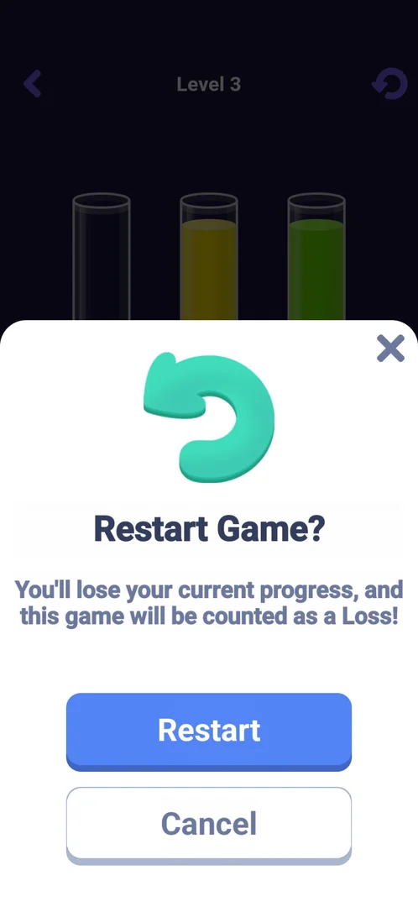
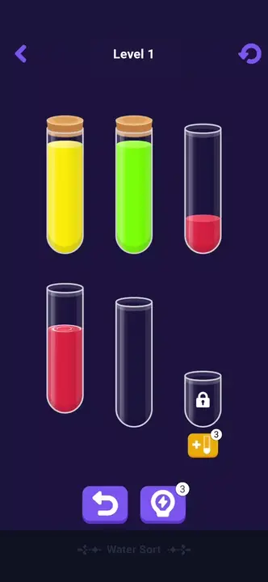
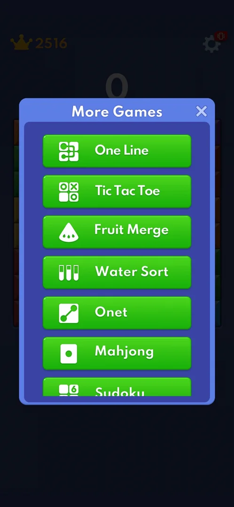
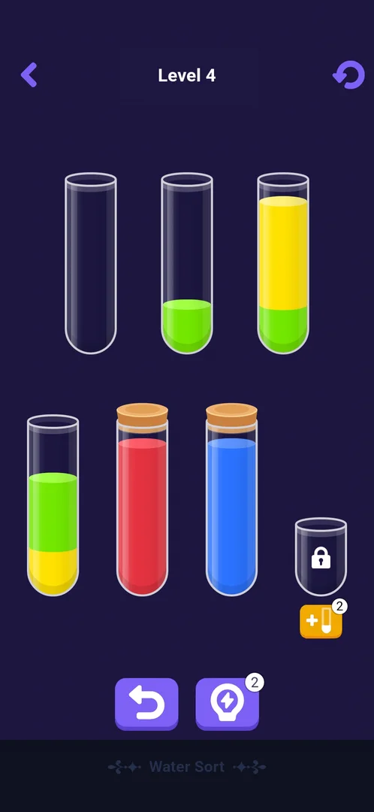
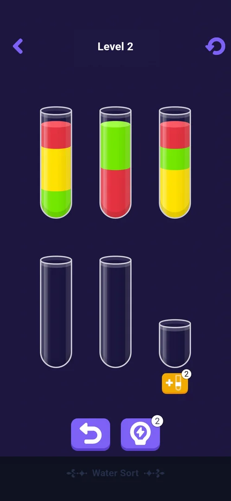

# Mini-game: Water Sort

One of the eight mini-games built into the app, opened from Settings > More Games. A colour-sorting puzzle:
the player pours coloured liquid layers from tube to tube until each tube holds a single colour, level by
numbered level (levels 1 to 7 seen). The first visit opens a short tutorial; the levels have an extra locked tube, an
add-tube item, a hint, an undo and a restart arrow [^s4] [^s5] [^s15].

## Why it appeared

Listed in Settings > More Games from the first launch [^s1].

## Where to find it

Classic board > the gear > More Games > **Water Sort**, the fourth green button of the list, with a white
icon of three test tubes; no scroll needed, no lock, price or timer on it [^s2] [^s3]. One tap opens the
tutorial on the first visit [^s4].

 [^s2]
*The Water Sort button in More Games: green, fourth in the list, under Fruit Merge*

## What it looks like

 [^s5]
*Level 1: the back arrow, "Level 1", the restart arrow; three filled tubes, two empty ones, a small locked tube with the orange add-tube button (3) under it; undo and hint (3) at the bottom*

A dark-violet screen with the title "Water Sort" at the bottom [^s5]:

- Top bar: the back arrow, "Level N" and the restart arrow.
- The tubes in two rows: in level 1 three tubes with two colours each and two empty tubes.
- A sixth, shorter tube with a padlock and under it the orange add-tube button with its count.
- At the bottom: undo (no count) and hint (count 3).

Levels 3 and 4 have four colours (red, yellow, green, blue), four filled tubes, two empty tubes and the
locked small tube, laid out as three tubes on top and four below [^s16] [^s17]. Levels 5 and 7 have the
same layout with four colours mixed up to four layers deep; level 6 has three colours in three full tubes and
two empty tubes, with the locked tube in the lower row [^s25] [^s26].

## What you can do

Tap a tube to lift it, then tap the target tube to pour its top colour there
[^s6] [^s7].

| Tab or button | What it does |
|---|---|
| [Tutorial](#tutorial) | First visit: three tubes, a hand and the pour rule; Skip |
| [Add tube](#add-tube) | The UseItem sheet: unlocks the sixth tube for one item (3) |
| [Hint](#hint) | Makes one pour automatically; costs a charge (3) |
| [Undo](#undo) | Takes the last pour back; no count |
| [Next Puzzle](#next-puzzle) | After the last cork: a banner, then the next level; after the level 6 win, a video ad first |
| [Restart Game?](#restart-game) | The restart arrow, top right: a sheet that warns the game counts as a Loss; Restart, Cancel, X |
| [Back arrow](#back-arrow) | Top left of the board: leaves Water Sort at once, to the More Games list |

Skip, No Thanks, and Cancel and X on Restart Game? were not tapped.

### Tutorial

 [^s6]
*After the middle tube is selected: a red cross over the tube it cannot pour into, a green check over the one it can, and the pour rule under the tubes*

Three tubes: red, red under yellow, and yellow; a hand points at the middle one with the text "Click to
select test tube", and Skip sits at the top right [^s4]. Once a tube is
lifted, the text gives the rule: a pour is possible only when the target's top layer is the same colour and
the target has free space [^s6]. Two pours finish it: the yellow layer onto
the yellow tube, then the red onto the red one [^s7]
[^s5].

 [^s7]
*Clip 3 s · [original on YouTube from 9:10](https://youtu.be/H_WygghZvno?t=550)*

After the second cork level 1 opened by itself [^s5].

### Add tube

 [^s8]
*The orange plus-tube button under the locked tube opens a white sheet: "UseItem", a blue Use Item button with the count 3, No Thanks and X*

Use Item removed the padlock: the short sixth tube became an empty tube to pour into, and the button's
count went from 3 to 2 [^s9].

### Hint

 [^s10]
*Hint, the right button at the bottom: it made one pour on its own (the green layer into an empty tube); its count went from 3 to 2*

 [^s10]
*Clip 4.5 s · [original on YouTube from 11:25](https://youtu.be/H_WygghZvno?t=685)*

### Undo

 [^s11]
*Undo, the left button at the bottom, with no count: the hinted pour is taken back; the hint charge is not returned*

### Next Puzzle

 [^s18]
*Level 2 solved: the corked red and yellow tubes behind a Next Puzzle ribbon with confetti; the bar and buttons are dimmed, nothing to tap*

 [^s12]
*Level 2, on screen a second after level 1's last pour: three tubes of three layers each, two empty tubes and the locked tube*

The last pour of a level corks the tube with confetti, a "Next Puzzle" ribbon flashes over the board, and
the next level loads by itself: no result screen with buttons, no score, no reward and no ad
[^s13] [^s12]. The same happened from level 2 to level 3, from level 3 to level 4, and after the wins of
levels 4 and 5 [^s18] [^s17] [^s24] [^s25].

The win of level 6 was different: right after its last pour a full-screen video ad for another game came up
before level 7 [^s27]. It had a Google Play header with an Install button; after about 35 s, with no tap,
the video turned into a PLAY NOW end card with a skip icon at the top left and no X. One Back key closed it
and level 7 was on screen; Google Play did not open [^s28].

 [^s27]
*The end card of the video ad after the level 6 win: the Install header, PLAY NOW and a skip icon top left, no close button; Back closed it to level 7*

### Restart Game?

 [^s15]
*The restart arrow, top right of the board, opens a white bottom sheet: "Restart Game?", a warning that the current progress is lost and the game is counted as a Loss, a blue Restart button, Cancel and X*

Tapped on level 3 after one pour. Restart closed the sheet and played a full-screen video interstitial for
another puzzle game, with a Google Play footer and no close control at first [^s19]. About 15 s later, with no
tap, the ad opened the game's page in Google Play by itself [^s19]. Back from the store [^s20] led to a playable end
card of the same ad that ignored Back twice and a 20 s wait; only closing and restarting the app got out
[^s21]. The reset board after Restart was therefore not seen. What the counted Loss changes (a counter,
a streak) was not seen either.

 [^s13]
*Clip 8.4 s · [original on YouTube from 10:31](https://youtu.be/H_WygghZvno?t=631)*

### Back arrow

 [^s26]
*After the back arrow, top left of the level 7 board: the More Games list with the X at its top right, over the classic board with score 0*

Tapped on level 7 before any pour. Water Sort closed at once with no confirmation, and the More Games list
came up over the classic board (score 0), though in this session Water Sort had been opened from the home
menu [^s26]. The X of the list then led to the classic board [^s29].

## How it works

Version 10.8.1.

- A pour moves the top colour of the lifted tube onto a tube whose top is the same colour (or that is
  empty) and that has free space [^s6] [^s14].
- A tube filled with one colour gets a cork and confetti; a level ends when every colour is corked
  [^s7] [^s12].
- Level 1: three colours in three tubes of two layers each, two empty tubes; solved in 5 pours and about
  60 s. Level 2: three colours in three tubes of three layers each, two empty tubes
  [^s5] [^s12].
- Items: add tube 3 and hint 3 at the start; each use takes one; undo has no count and did not give back
  the hint it undid [^s9] [^s10]
  [^s11]. What happens at 0 was not seen.
- No energy, lives, moves limit or timer were seen in the tutorial and levels 1 to 7
  [^s5] [^s12] [^s17] [^s26]. Level 3 was solved in 8 pours and about 47 s; level 4 was four pours from the end
  when a session stopped and was finished in the next one in 3 pours and about 43 s [^s17] [^s22] [^s24].
  Level 5 took 14 pours and about 91 s, level 6 4 pours [^s25] [^s27].
- Ads: no ad after the wins of levels 1 to 5; a video ad after the win of level 6 [^s25] [^s27].
- Restart is free of items but asks to confirm, counts the game as a Loss and plays an interstitial [^s15] [^s19].
- Progress is kept: after leaving at level 2 and restarting the app, Water Sort reopened on level 2 with its
  board dealt again from the start; the sixth tube unlocked there with an item in the earlier session stayed
  unlocked, and the add-tube and hint counts stayed at 2 and 2 [^s23]. On level 3 the sixth tube was locked again,
  so an unlock holds for its level only [^s16].
- Level 4, left mid-level when a session stopped, reopened after an app restart with the board as left: red and
  blue already corked, the other pours still to make [^s24]. Why level 2 earlier came back dealt from the start
  and level 4 came back as left was not seen.
- Boards are fixed per level: level 3 reopened after an app restart with the same layout as before [^s16].
- Inferred from the player's solver, not seen on screen: the boards of levels 3, 4, 5 and 7 have no reachable
  position without a legal pour (every reachable position searched: level 4 5132, level 5 11357, level 7
  6732), so pouring cannot lead to a loss on these levels; through level 7 every board has two empty tubes and
  three or four colours [^s17] [^s26].

 [^s24]
*Level 4 reopened in a later session: the board as left, the red and blue tubes corked, the small sixth tube locked, the add-tube and hint counts both 2*

 [^s23]
*Level 2 reopened in a later session: the board from the start, the small sixth tube still unlocked, the add-tube and hint counts both 2*

## Cases

| Case | What was done | Result | Source |
|---|---|---|---|
| Why it appeared <!-- case:chk-appeared --> | Fresh install | ✅ In More Games from the first launch | [^s1] |
| Where to find it: the screen and the button that open it <!-- case:chk-entry --> | Opened More Games and tapped Water Sort | ✅ The fourth button; opens the tutorial on the first visit | [^s2] [^s4] |
| Its screen <!-- case:chk-screen --> | Finished the tutorial | ✅ Level N title, back and restart arrows, the tubes, a locked extra tube with the add-tube button, undo and hint | [^s5] |
| Rules <!-- case:chk-rules --> | Tutorial, level 1, items in level 2 | ✅ Select a tube then a target; same top colour and free space; a single-colour tube is corked; tutorial with Skip; add tube (3), hint (3, one automatic pour), free undo | [^s6] [^s7] [^s10] |
| A win: its screen and what it pays <!-- case:chk-win --> | Solved levels 1 to 6 | ✅ The last cork, a Next Puzzle ribbon, then the next level loads by itself; no result screen and no reward (an ad after level 6) | [^s12] [^s27] |
| A loss: its screen, what it costs and the retry offers <!-- case:chk-loss --> | — | not verified: no stuck board reachable in levels 1 to 7; Restart counts a Loss, but its result was hidden by the ad |  |
| Progression <!-- case:chk-progression --> | Solved level 1 | ✅ Numbered levels: level 1 two layers per tube, level 2 three; no result screen between them | [^s12] |
| Limits: attempts, energy, a timer or a schedule <!-- case:chk-limits --> | Played levels 1 to 7 over four sessions | ✅ No energy, lives, timer or attempt counter; Restart is free but counts a Loss and plays an ad; the add-tube and hint counts do not refill between sessions (2 and 2 after one use each) | [^s23] [^s15] [^s26] |
| Level kept after leaving <!-- case:level-kept --> | Left at level 2, restarted the app, opened Water Sort | ✅ Level 2 again, its board from the start; the unlocked sixth tube and the spent items (2 and 2) kept | [^s23] |
| Restart arrow <!-- case:restart-arrow --> | Tapped it on level 3 after one pour, then Restart | ✅ Restart Game? counted as a Loss; a video interstitial that opened Google Play by itself and a playable that ignored Back; after an app restart level 3 had the same layout | [^s15] [^s19] [^s16] |
| Board kept mid-level <!-- case:board-saved --> | A session stopped on level 4 four pours from the end; the app was relaunched and Water Sort opened | ✅ Level 4 as left, red and blue already corked, not dealt again | [^s24] |
| Back arrow <!-- case:back-arrow --> | Tapped it on level 7 | ✅ Left at once with no confirm, to the More Games list over the classic board (score 0), though Water Sort was opened from the home menu | [^s26] |
| Ad after a win <!-- case:win-ad --> | Solved levels 4, 5 and 6 | ✅ No ad after levels 1 to 5; after level 6 a video ad with a store header, about 35 s, an end card with no X; Back closed it to level 7 | [^s27] [^s28] |
| No stuck board through level 7 <!-- case:no-dead-end --> | Searched every reachable position of levels 4, 5 and 7 with the player's solver | ✅ Inferred: no position without a legal pour (5132, 11357 and 6732 positions), so no loss by pouring; every board two empty tubes, three or four colours | [^s26] |

## Not verified

- A loss: a board with no pour left (none reachable through level 7; later levels with fewer empty tubes or more colours not reached), what it shows, costs and offers; what a Loss from Restart changes <!-- case:chk-loss -->
- What the add tube and hint offer at 0
- Why level 2 came back dealt from the start and level 4 came back as left
- How often a win plays an ad after level 6
- The board right after Restart (the ad blocked it); Cancel and X on Restart Game?
- Skip and No Thanks

[^s1]: session 20261003-193423-chrono-2FYKPJ, step 12 — [video at 2:19](https://youtu.be/A6Wh-xa4ryg?t=139)
[^s2]: session 20261003-193423-chrono-2FYKPJ, step 11 — [video at 2:08](https://youtu.be/A6Wh-xa4ryg?t=128)
[^s3]: session 20261003-193423-chrono-2FYKPJ, step 10 — [video at 1:57](https://youtu.be/A6Wh-xa4ryg?t=117)

[^s4]: session 20261005-231555-chrono-2FYKPJ, step 27 — [video at 8:57](https://youtu.be/H_WygghZvno?t=537)
[^s5]: session 20261005-231555-chrono-2FYKPJ, step 31 — [video at 9:29](https://youtu.be/H_WygghZvno?t=569)
[^s6]: session 20261005-231555-chrono-2FYKPJ, step 28 — [video at 9:01](https://youtu.be/H_WygghZvno?t=541)
[^s7]: session 20261005-231555-chrono-2FYKPJ, step 29 — [video at 9:13](https://youtu.be/H_WygghZvno?t=553)
[^s8]: session 20261005-231555-chrono-2FYKPJ, step 35 — [video at 11:04](https://youtu.be/H_WygghZvno?t=664)
[^s9]: session 20261005-231555-chrono-2FYKPJ, step 36 — [video at 11:17](https://youtu.be/H_WygghZvno?t=677)
[^s10]: session 20261005-231555-chrono-2FYKPJ, step 37 — [video at 11:29](https://youtu.be/H_WygghZvno?t=689)
[^s11]: session 20261005-231555-chrono-2FYKPJ, step 38 — [video at 11:43](https://youtu.be/H_WygghZvno?t=703)
[^s12]: session 20261005-231555-chrono-2FYKPJ, step 34 — [video at 10:39](https://youtu.be/H_WygghZvno?t=639)
[^s13]: session 20261005-231555-chrono-2FYKPJ, step 33 — [video at 10:35](https://youtu.be/H_WygghZvno?t=635)
[^s14]: session 20261005-231555-chrono-2FYKPJ, step 32 — [video at 10:06](https://youtu.be/H_WygghZvno?t=606)

[^s15]: session 20261006-053412-chrono-2FYKPJ, step 7 — [video at 2:17](https://youtu.be/xt9xkPDfH7w?t=137)
[^s16]: session 20261006-053412-chrono-2FYKPJ, step 14 — [video at 4:45](https://youtu.be/xt9xkPDfH7w?t=285)
[^s17]: session 20261006-053412-chrono-2FYKPJ, step 16 — [video at 5:40](https://youtu.be/xt9xkPDfH7w?t=340)
[^s18]: session 20261006-053412-chrono-2FYKPJ, step 5 — [video at 1:46](https://youtu.be/xt9xkPDfH7w?t=106)
[^s19]: session 20261006-053412-chrono-2FYKPJ, step 8 — [video at 2:27](https://youtu.be/xt9xkPDfH7w?t=147)
[^s20]: session 20261006-053412-chrono-2FYKPJ, step 9 — [video at 3:18](https://youtu.be/xt9xkPDfH7w?t=198)
[^s21]: session 20261006-053412-chrono-2FYKPJ, step 12 — [video at 4:20](https://youtu.be/xt9xkPDfH7w?t=260)
[^s22]: session 20261006-053412-chrono-2FYKPJ, step 19 — [video at 6:42](https://youtu.be/xt9xkPDfH7w?t=402)
[^s23]: session 20261006-053412-chrono-2FYKPJ, step 2 — [video at 0:40](https://youtu.be/xt9xkPDfH7w?t=40)

[^s24]: session 20261006-084209-chrono-2FYKPJ, step 2 — [video at 0:42](https://youtu.be/NvQjrsBQB28?t=42)
[^s25]: session 20261006-084209-chrono-2FYKPJ, step 13 — [video at 2:59](https://youtu.be/NvQjrsBQB28?t=179)
[^s26]: session 20261006-084209-chrono-2FYKPJ, step 18 — [video at 5:17](https://youtu.be/NvQjrsBQB28?t=317)
[^s27]: session 20261006-084209-chrono-2FYKPJ, step 16 — [video at 3:32](https://youtu.be/NvQjrsBQB28?t=212)
[^s28]: session 20261006-084209-chrono-2FYKPJ, step 17 — [video at 4:48](https://youtu.be/NvQjrsBQB28?t=288)
[^s29]: session 20261006-084209-chrono-2FYKPJ, step 19 — [video at 6:01](https://youtu.be/NvQjrsBQB28?t=361)
