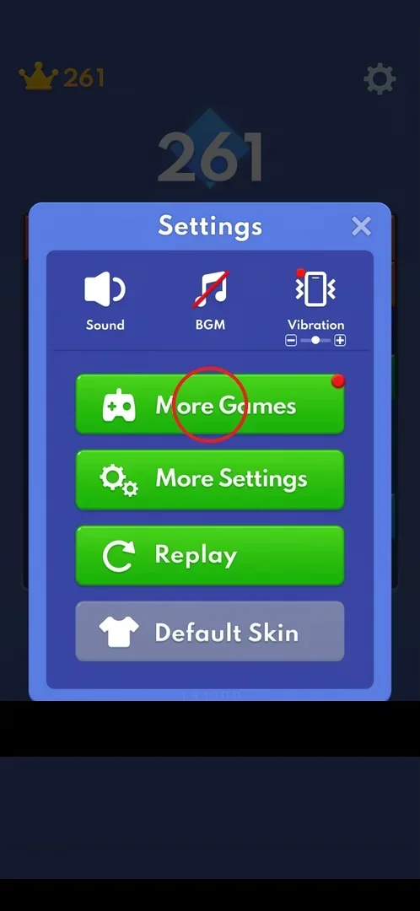
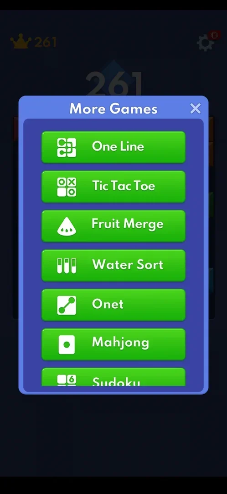
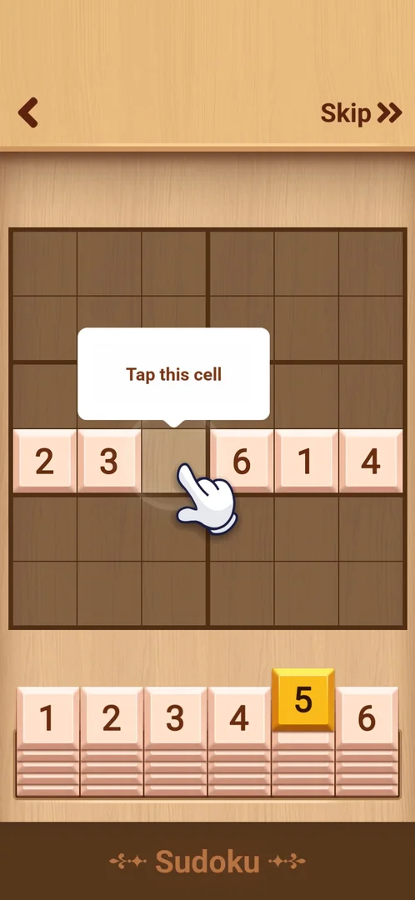

# More Games (cross-promo)

More Games is a list of eight small puzzle games built into Block Blast! itself: the player can leave
the block board for a round of Sudoku, Mahjong, Water Sort and others without installing anything. In
version 10.6.5 the entry Sudoku opened inside the app, not in a store [^s3].

## Where to find it

From the classic board: the gear at the top right, then the green More Games button at the top of the
Settings popup. The button carries a red badge [^s1].

 [^s1]

## What it looks like

A popup titled "More Games" with a close cross and a scrolling column of green buttons, each with an
icon: One Line, Tic Tac Toe, Fruit Merge, Water Sort, Onet, Mahjong, Sudoku and, further down,
Block Slide [^s2] [^s3].

 [^s2]

## What you can do

Each button opens its mini-game. Only Sudoku was opened in this session; One Line, Tic Tac Toe,
Fruit Merge, Water Sort, Onet, Mahjong and Block Slide were not.

| Tab or button | What it does |
|---|---|
| [Sudoku](#sudoku) | Opens a 6x6 Sudoku inside the app, with its own tutorial |

### Sudoku

A wooden-themed 6x6 Sudoku with a back arrow at the top left and "Skip >>" at the top right, a row of
number tiles 1 to 6 under the grid and the title "Sudoku" at the bottom. It starts with its own tutorial:
a hand and a "Tap this cell" bubble point at the one empty cell of a nearly full row [^s3]. The back
arrow returns to the More Games list [^s4], and the list's close cross returns to the same Block Blast
board [^s5].

 [^s3]

## How it works

- 8 mini-games in version 10.6.5: One Line, Tic Tac Toe, Fruit Merge, Water Sort, Onet, Mahjong, Sudoku,
  Block Slide [^s3].
- They are built in: Sudoku opened inside Block Blast! [^s3]. That the other seven are built in too is
  inferred from Sudoku.
- Leaving a mini-game kept the classic game as it was [^s5].

## Cases

| Case | What was done | Result | Source |
|---|---|---|---|
| Open the Sudoku mini-game | More Games, scroll, Sudoku, then back | ✅ Opens in-app with a tutorial; back returns to the list | [^s3] |
| Open each of the 8 built-in mini-games and document their loop | <!-- --> | not verified |  |

## Not verified

- The other seven mini-games: what each looks like and whether any of them rewards the Block Blast game.
- What the Sudoku round gives after the tutorial; what Skip does.
- When the red badge on the More Games button goes away.

[^s1]: session 20261001-200952-chrono-2FYKPJ, step 32 — [video at 6:57](https://youtu.be/1AkjzicKdRM?t=417)
[^s2]: session 20261001-200952-chrono-2FYKPJ, step 33 — [video at 7:08](https://youtu.be/1AkjzicKdRM?t=428)
[^s3]: session 20261001-200952-chrono-2FYKPJ, step 35 — [video at 7:31](https://youtu.be/1AkjzicKdRM?t=451)
[^s4]: session 20261001-200952-chrono-2FYKPJ, step 36 — [video at 7:44](https://youtu.be/1AkjzicKdRM?t=464)
[^s5]: session 20261001-200952-chrono-2FYKPJ, step 37 — [video at 7:54](https://youtu.be/1AkjzicKdRM?t=474)
