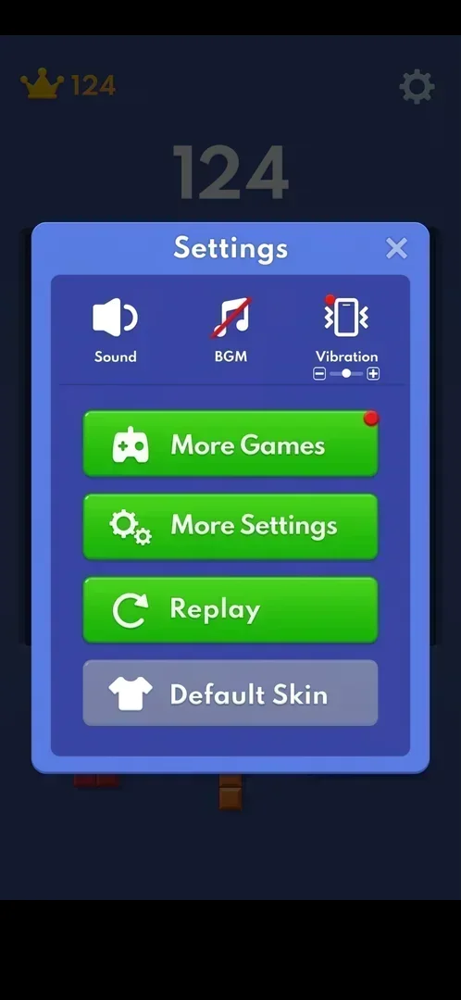
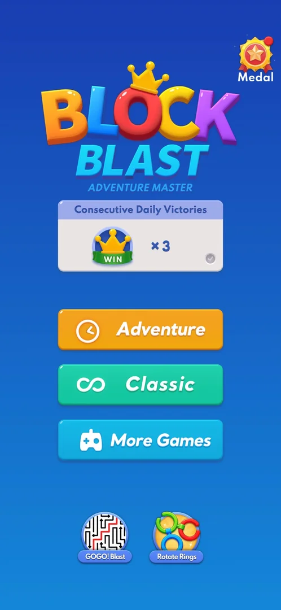
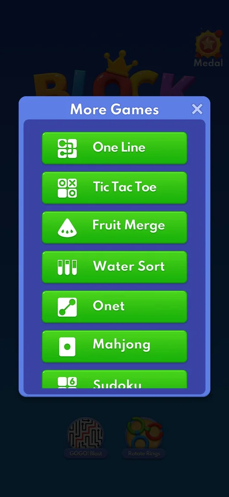
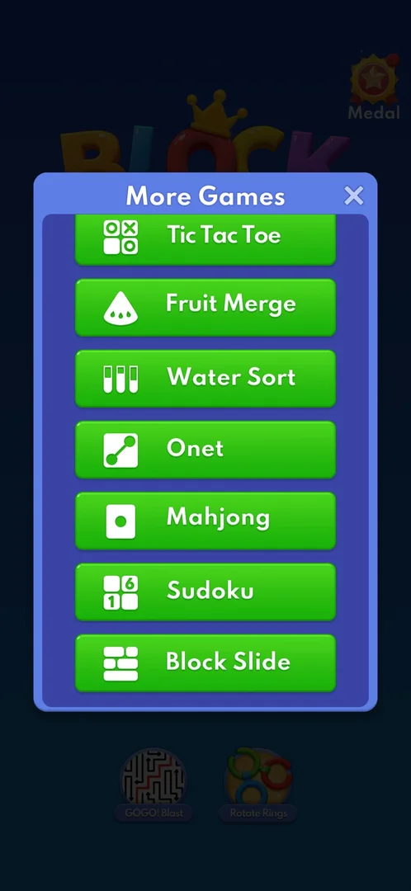
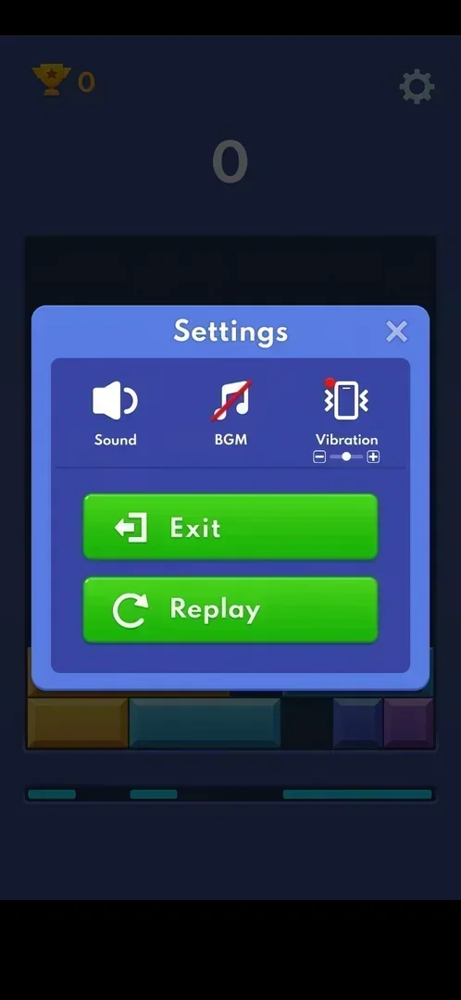

# More Games (mini-game list)

A list of eight mini-games built into the app, opened from Settings or from the home menu. Each opens
inside Block Blast on its own board; the classic game waits behind it with its score kept [^s1] [^s2]
[^s3].

## Why it appeared

In Settings from the first launch, with a red dot badge on its button [^s1].

## Where to find it

- Classic board > the gear top right > the green More Games button, the first of the four buttons, with a
  red dot [^s1].
- Home menu > the blue More Games button, the third mode button [^s3].

 [^s1]
*The More Games button in Settings, with its red dot*

 [^s10]
*The blue More Games button on the home menu, under Classic*

## What it looks like

 [^s11]
*More Games opened from the home menu: seven buttons visible, the X top right*

A popup "More Games" with an X top right and a scrolling column of green buttons, each with a white icon
and a name: One Line, Tic Tac Toe, Fruit Merge, Water Sort, Onet, Mahjong, Sudoku, Block Slide. None is
locked or priced, and no button has a badge, timer or counter, from Settings or from the home menu
[^s4] [^s5] [^s3]. Three days later, with Adventure progressed to level 5, the list was the same eight
buttons in the same order [^s11] [^s12].

 [^s12]
*The list scrolled to its end: Block Slide is the eighth and last*

## What you can do

| Tab or button | What it does |
|---|---|
| [A mini-game button](#a-mini-game-button) | Opens that mini-game inside the app |
| [Mini-game Settings](#mini-game-settings) | Exit back to the list, Replay |
| [Close (X)](#close-x) | Closes the list back to the board |

### A mini-game button

<!-- no-frame: the buttons are on the list frames above -->
Block Slide, the one opened, ran inside the app on its own screen, with a trophy best score, a score and
its own gear [^s1] [^s6]. Pages: [One Line](mg-one-line.md), [Tic Tac Toe](mg-tic-tac-toe.md),
[Fruit Merge](mg-fruit-merge.md), [Water Sort](mg-water-sort.md), [Onet](mg-onet.md),
[Mahjong](mg-mahjong.md), [Sudoku](mg-sudoku.md), [Block Slide](mg-block-slide.md).

### Mini-game Settings

 [^s7]
*Inside a mini-game the gear has Exit and Replay only*

The gear inside a mini-game opens Settings with Sound, BGM, Vibration, Exit and Replay [^s7]. Exit
returns to the More Games list over the classic board; the classic score (124) was kept [^s2].

### Close (X)

<!-- no-frame: the X is top right of the list frames above -->
The X top right of the list closes it; the classic board is back as it was [^s8]. Opened from the home
menu, the X returns to the home menu [^s13].

## How it works

Version 10.8.1. All eight mini-games are open from the first launch; no price, lock or timer is shown on
the list [^s4]. The red dot is on the More Games button in Settings, not on the list [^s1]. In the second
session, after the list had been opened once, the button had no red dot [^s9]; inferred: opening the list
clears it.

## Cases

| Case | What was done | Result | Source |
|---|---|---|---|
| Why it appeared <!-- case:chk-appeared --> | Fresh install | ✅ In Settings from the first launch | [^s1] |
| Where to find it: Settings gear > More Games, and the More Games button on the home menu <!-- case:chk-entry --> | Opened it both ways | ✅ The same list | [^s3] |
| Its screen: scrolling popup list of 8 mini-games <!-- case:chk-screen --> | Scrolled the list | ✅ | [^s4] |
| Every entry: One Line, Tic Tac Toe, Fruit Merge, Water Sort, Onet, Mahjong, Sudoku, Block Slide; all open <!-- case:chk-entries --> | Scrolled the list, opened Block Slide | ✅ | [^s4] |
| Badges, timers and counters on it <!-- case:chk-badges --> | Looked at the list from Settings and from the home menu | ✅ None: all 8 plain green buttons | [^s3] |
| What changes on it with progress <!-- case:chk-changes --> | Opened the list from the home menu after Adventure level 5 and scrolled it to the end | ✅ Nothing: the same 8 green buttons, no locks or badges | [^s12] |

## Not verified

- Whether the list changes further on (new games, order, badges) past Adventure level 5
- Whether the red dot on the More Games button comes back (new games, a new day)

[^s1]: session 20261003-193423-chrono-2FYKPJ, step 12 — [video at 2:19](https://youtu.be/A6Wh-xa4ryg?t=139)
[^s2]: session 20261003-193423-chrono-2FYKPJ, step 14 — [video at 2:46](https://youtu.be/A6Wh-xa4ryg?t=166)
[^s3]: session 20261003-212548-chrono-2FYKPJ, step 32 — [video at 6:13](https://youtu.be/ReMKqt9albk?t=373)
[^s4]: session 20261003-193423-chrono-2FYKPJ, step 11 — [video at 2:08](https://youtu.be/A6Wh-xa4ryg?t=128)
[^s5]: session 20261003-193423-chrono-2FYKPJ, step 10 — [video at 1:57](https://youtu.be/A6Wh-xa4ryg?t=117)
[^s6]: session 20261003-212548-chrono-2FYKPJ, step 34 — [video at 6:30](https://youtu.be/ReMKqt9albk?t=390)
[^s7]: session 20261003-193423-chrono-2FYKPJ, step 13 — [video at 2:36](https://youtu.be/A6Wh-xa4ryg?t=156)
[^s8]: session 20261003-193423-chrono-2FYKPJ, step 15 — [video at 2:58](https://youtu.be/A6Wh-xa4ryg?t=178)
[^s9]: session 20261003-212548-chrono-2FYKPJ, step 25 — [video at 4:18](https://youtu.be/ReMKqt9albk?t=258)

[^s10]: session 20261006-011754-chrono-2FYKPJ, step 0 — [video at 0:00](https://youtu.be/LkzkyenlZ3w?t=0)
[^s11]: session 20261006-011754-chrono-2FYKPJ, step 1 — [video at 0:23](https://youtu.be/LkzkyenlZ3w?t=23)
[^s12]: session 20261006-011754-chrono-2FYKPJ, step 2 — [video at 0:34](https://youtu.be/LkzkyenlZ3w?t=34)
[^s13]: session 20261006-011754-chrono-2FYKPJ, step 3 — [video at 0:43](https://youtu.be/LkzkyenlZ3w?t=43)
