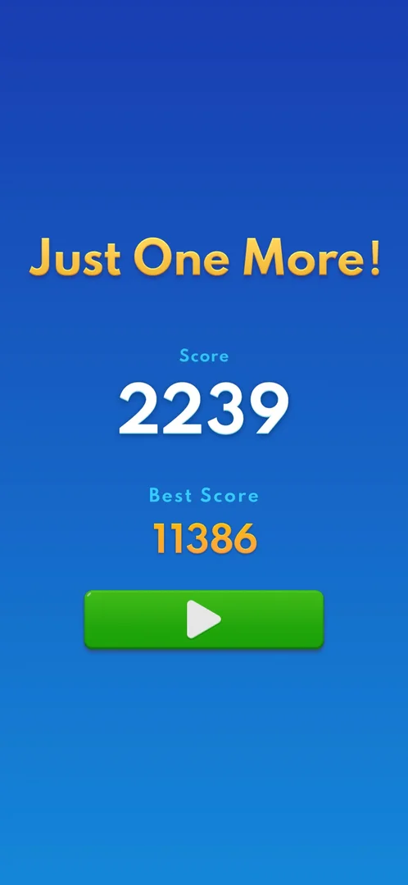
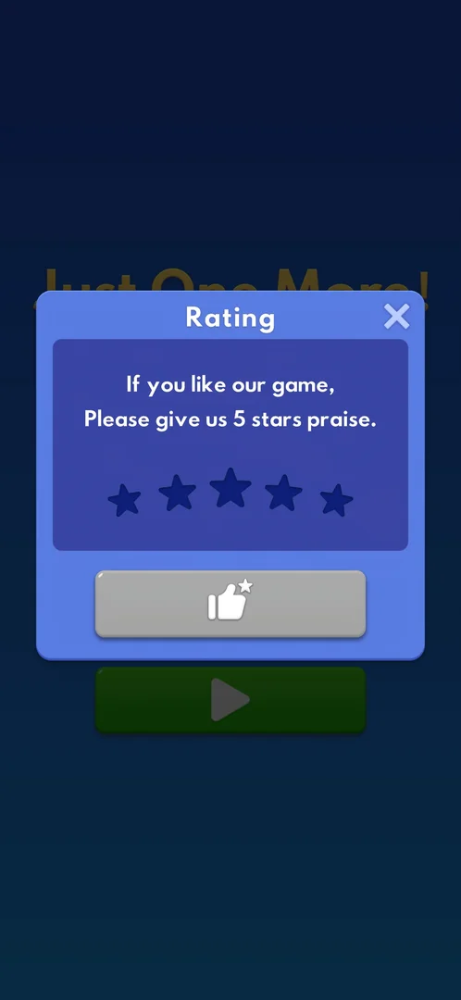

# Rating prompt (rate us)

A blue popup titled "Rating" that asks the player to rate the game with five stars. It comes up by
itself over the classic result screen after a game over; it has five star icons, a grey thumbs-up
button and a close X, and gives nothing [^s1]. It was seen once, after the sixth classic game over of a
session and never in the sessions before [^s1], nor in the next two sessions [^s3].

## Why it appeared

Over the classic result screen after game 6's game over and its interstitial (session game overs: 6th;
first time seen in any session) [^s1]. That game ended at 2239 points, about 20 minutes into the
session [^s2].

Hypothesis: it is shown after a set number of game overs (or of sessions or play time) and only once
or a few times per install, not verified. Earlier sessions reached classic, Adventure and mini-game game
overs without it (inferred from the sessions' records; no Rating frame in them).

## Where to find it

No button opens it: it pops up over the classic result screen once the game-over interstitial is
closed [^s1]. Under it is the result screen of that game, here titled "Just One More!" with the score,
the best score and the green Play button [^s2].

 [^s2]
*The result screen the popup covers; the green Play button is the way on once the popup is closed*

## What it looks like

 [^s1]
*The Rating popup: five star icons, the grey thumbs-up button below them, the close X top right*

A blue panel with the title "Rating" and an X in the top right corner. An inner dark-blue box holds a
two-line request ("If you like our game, Please give us 5 stars praise.") and a row of five dark star
icons, the middle one the largest. Below the box is a wide grey button with a white thumbs-up and a
small star. The result screen behind is dimmed; its title and Play button show at the popup's top and
bottom edges [^s1].

## What you can do

| Tab or button | What it does |
|---|---|
| [Stars](#stars) | Not tapped |
| [Thumbs-up](#thumbs-up) | Not tapped |
| [Close (X)](#close-x) | Closes the popup, back to the result screen |

### Stars

<!-- no-frame: the stars are on the popup frame above -->
Five star icons, all dark when the popup opens [^s1]. Not tapped. Inferred: a tap fills the stars up to
the one tapped, and the choice goes with the thumbs-up button.

### Thumbs-up

<!-- no-frame: the button is on the popup frame above -->
A grey button under the stars [^s1]. Not tapped. Inferred from its grey colour while no star is chosen:
it is inactive until a star is tapped, and with a high rating it leads to the Google Play review.

### Close (X)

<!-- no-frame: the result screen after the X is the frame under "Where to find it" -->
Closes the popup at once: the "Just One More!" result screen with Play is back, no store page opens and
nothing is given [^s2].

## How it works

Version 10.8.1.

- Seen once in a 26-minute session, after the sixth game over of the session (game 6, 2239
  points); games 1 to 5 of the same session ended without it [^s1] [^s2].
- It came after that game's interstitial ad was closed and the result screen's score had counted up,
  not in place of the ad [^s1].
- No reward and no price: closing it changes nothing on the result screen [^s2].
- It did not come back in the next two sessions: nine classic game overs with scores of 21 to 143 and
  four Adventure wins, all without it. So far one popup in 15 classic game overs over three sessions,
  on the only high score (2239); the later games were lost on purpose at low scores [^s3].

## Cases

| Case | What was done | Result | Source |
|---|---|---|---|
| Close X dismisses the Rating popup and leaves the 'Just One More!' result screen with Play; no store opened <!-- case:close-x --> | Tapped the X | ✅ The result screen with Play; no store page | [^s2] |
| No entry of its own <!-- case:chk-entry --> | Ended classic game 6 | ✅ It pops up by itself over the classic result screen after a game over (here after the game-over interstitial) | [^s1] |
| Its screen <!-- case:chk-screen --> | Looked at the popup | ✅ Blue "Rating" panel: a request for 5 stars, five star icons, a grey thumbs-up button, the close X top right | [^s1] |
| Options <!-- case:chk-options --> | Looked at the popup | ✅ Five stars, the thumbs-up button and the X | [^s1] |
| Why it appeared <!-- case:chk-appeared --> | Six classic game overs in one session | ✅ After the sixth game over, over the result screen; the exact trigger is a hypothesis (task rate-us-trigger) | [^s1] |
| Links out <!-- case:chk-links --> | Looked at the popup | ✅ Does not apply: no privacy, terms or help links; the only way out of the game would be the rating answer itself (see chk-answers) | [^s1] |
| Not shown again <!-- case:no-repeat --> | Nine more classic game overs (scores 21 to 143) and four Adventure wins over two sessions | ✅ No Rating popup; whether a score, a count or a once-only rule holds it back is open (task rate-us-trigger) | [^s3] |
| What each answer does and whether it comes back <!-- case:chk-answers --> | Only the X tapped | not verified |  |

## Not verified

- What the stars and the thumbs-up do (a store review page or an in-game thank-you), and whether the
  popup comes back after the X or after an answer <!-- case:chk-answers -->
- What brings it up: a game-over count, a score, play time or install age (task rate-us-trigger)

[^s1]: session 20261006-105231-chrono-2FYKPJ, step 50 — [video at 15:03](https://youtu.be/yIChzBeRjtU?t=903)
[^s2]: session 20261006-105231-chrono-2FYKPJ, step 51 — [video at 16:39](https://youtu.be/yIChzBeRjtU?t=999)

[^s3]: session 20261006-133549-chrono-2FYKPJ, step 37 — [video at 16:31](https://youtu.be/UNoU_1pbeJk?t=991)
