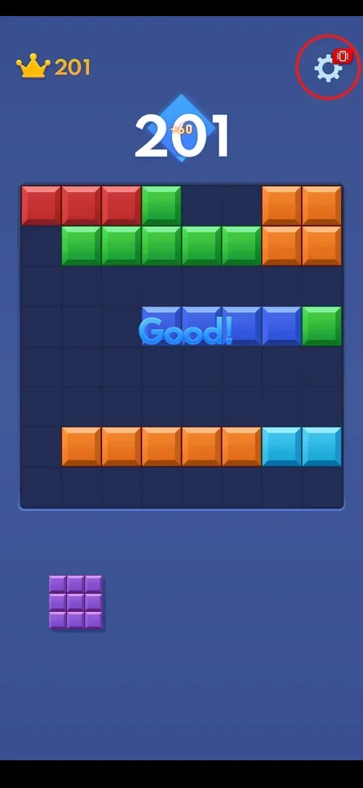
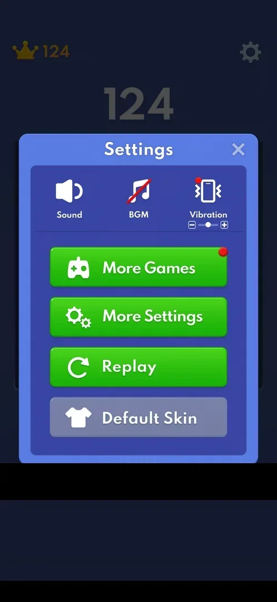
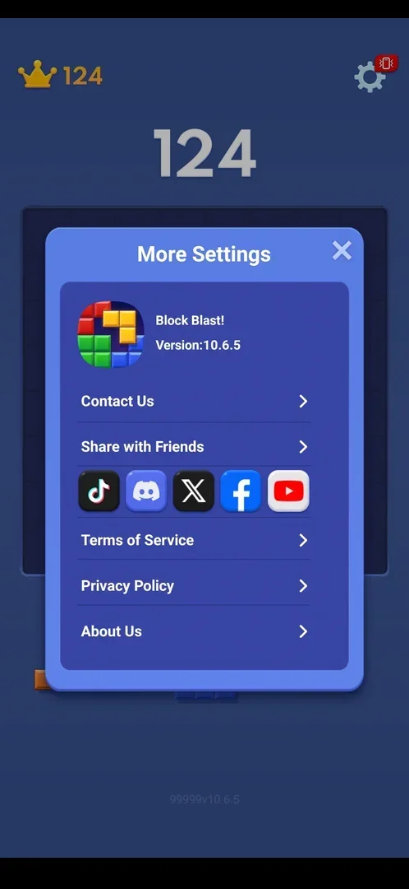

# Settings

Settings is a popup over the board, and in version 10.6.5 it is the only menu the game has: there is no
home screen, so every other part of the game (sound, the mini-game list, restarting the game, skins,
legal and contact links) is reached from here [^s1] [^s2].

## Where to find it

From the classic board: the gear icon at the top right, opposite the crown with the best score [^s1].

 [^s1]

## What it looks like

A blue popup titled "Settings" with a close cross. The top row has three icon toggles: Sound, BGM (music;
shown crossed out, so off, on a fresh install) and Vibration, which also has a small slider between - and +
for the vibration strength. Under them are four big buttons: More Games (green, with a red badge),
More Settings, Replay and Default Skin (grey, unlike the others) [^s2]. The score and best score stay
dimmed behind the popup. Under the popup the game prints a small build string (1.5.12.0.0) and a list of
numeric ids, blacked out on the frames here [^s2].

 [^s2]

## What you can do

| Tab or button | What it does |
|---|---|
| [Sound / BGM / Vibration](#sound--bgm--vibration) | Sound effects, background music and vibration on/off; vibration strength with - and + |
| [More Settings](#more-settings) | Version, Contact Us, Share with Friends, social links, Terms of Service, Privacy Policy, About Us |
| [More Games](more-games.md) | List of 8 built-in mini-games |
| [Replay](replay.md) | Restarts the classic game; an interstitial ad is shown first |
| [Default Skin](skins.md) | Grey; tapping it did nothing in this session |

### Sound / BGM / Vibration

The three toggles in the top row of the popup. On a fresh install BGM was off (its icon is crossed out)
and Sound and Vibration were on [^s2]. None of them was tapped in this session.

 [^s2]

### More Settings

A second popup: the game icon, the name "Block Blast!" and "Version:10.6.5", then Contact Us, Share with
Friends, a row of five social icons (TikTok, Discord, X, Facebook, YouTube), Terms of Service,
Privacy Policy and About Us, each with an arrow [^s3]. A small "99999v10.6.5" label sits under the popup.
The social links lead out of the game, so none of the rows was opened [^s3].

 [^s3]

## How it works

- The popup opens over a running game; the close cross returns to the same board [^s3].
- The red badge on More Games was there before the list had been opened [^s2].

## Cases

| Case | What was done | Result | Source |
|---|---|---|---|
| Open More Settings: version, contact us, share, ToS, privacy, about | Gear, then More Settings | ✅ The popup lists version 10.6.5 and the links above | [^s3] |
| Toggle Sound on/off | <!-- --> | not verified |  |
| Toggle BGM on/off (BGM was off by default) | <!-- --> | not verified |  |
| Toggle Vibration and change its strength with -/+ | <!-- --> | not verified |  |

## Not verified

- Toggle Sound on/off.
- Toggle BGM on/off (BGM was off by default).
- Toggle Vibration and change its strength with - and +.
- What Contact Us, Share with Friends and About Us open (not tapped).
- What the build string and numeric ids under the popup are (they look like build and test-group ids:
  inferred).

[^s1]: session 20261001-200952-chrono-2FYKPJ, step 30 — [video at 6:32](https://youtu.be/1AkjzicKdRM?t=392)
[^s2]: session 20261001-200952-chrono-2FYKPJ, step 6 — [video at 1:27](https://youtu.be/1AkjzicKdRM?t=87)
[^s3]: session 20261001-200952-chrono-2FYKPJ, step 7 — [video at 1:41](https://youtu.be/1AkjzicKdRM?t=101)
