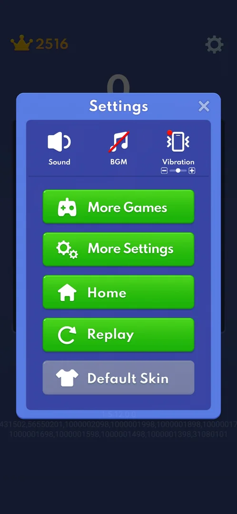
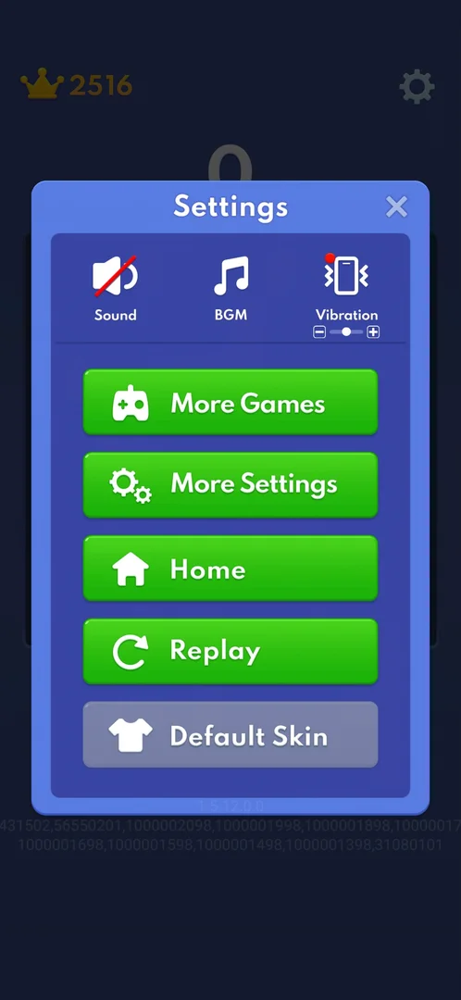
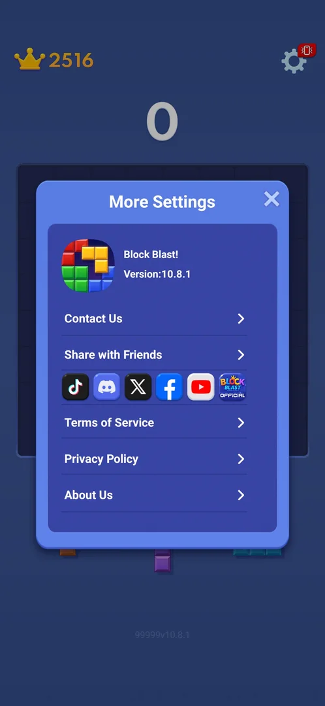
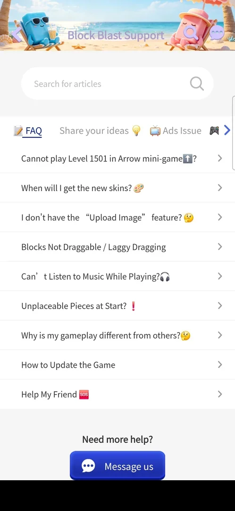
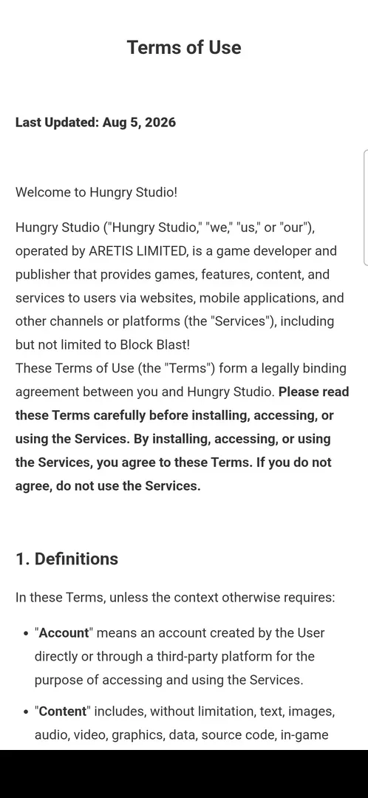
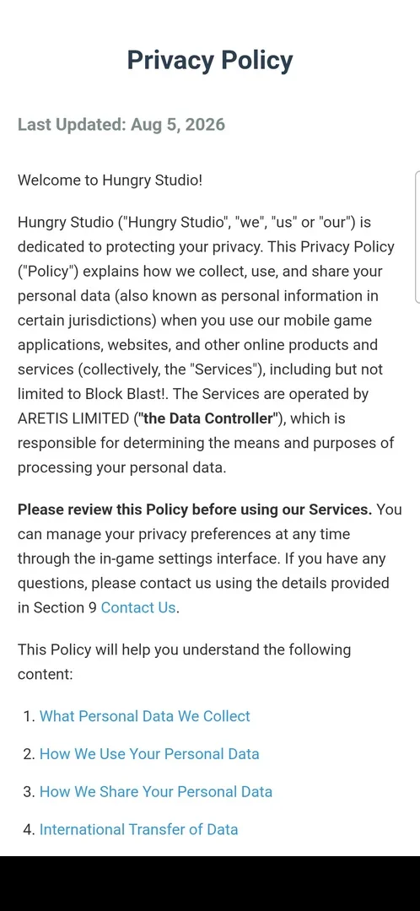

# Settings

A popup over the classic board with three sound and vibration controls and a column of buttons: More
Games (the built-in mini-games), More Settings (version, contact and external links), Replay (a new board)
and a grey Default Skin; on 6 October also Home [^s1] [^s2] [^s14]. Inside an Adventure level
the same gear opens a shorter Settings with Home and Replay [^s12].

## Why it appeared

Always on the classic board: gear top right [^s1].

## Where to find it

The gear top right of the classic board; it is there from the tutorial board on, with a red badge showing a
vibrating phone [^s1] [^s3].

 [^s1]
*The gear top right of the classic board opens Settings*

## What it looks like

 [^s14]
*Settings over the dimmed classic board on 6 October, after Adventure level 5: three controls at the top, five buttons below, the X top right*

The title "Settings" and an X top right. A row of three icons: Sound, BGM (crossed out in red: off on a
fresh install) and Vibration with a minus/plus slider and a red dot. Below, green buttons More Games, More
Settings, Home, Replay, and a grey Default Skin button [^s14].

On a fresh install there was no Home button: More Games (with a red dot), More Settings, Replay and Default
Skin, with a build label 1.5.7.0.0 bottom right of the screen [^s1]. On 6 October (still version
10.8.1) the classic Settings had Home between More Settings and Replay; the build label under the popup
read 1.5.12.0.0, with two lines of comma-separated numbers under it [^s14]. What brought Home in is not
known (inferred: Adventure progress or the build change).

 [^s1]
*Settings on a fresh install: four buttons, no Home*

## What you can do

| Tab or button | What it does |
|---|---|
| [Sound, BGM, Vibration](#sound-bgm-vibration) | Sound and BGM switch on and off; the Vibration slider moves |
| [More Games](#more-games) | Opens the list of eight built-in mini-games |
| [More Settings](#more-settings) | Opens version, contact and external links |
| [Replay](#replay) | An interstitial ad, then a new classic board |
| [Default Skin](#default-skin) | A tap does nothing |
| [Home](#home) | Leaves for the home menu (tapped in an Adventure level) |
| [Contact Us](#contact-us) | From More Settings: the Block Blast Support help center inside the app |
| [Share with Friends](#share-with-friends) | From More Settings: the phone's share sheet with a link to the game |
| [Social icons](#social-icons) | From More Settings: TikTok, Discord, X, Facebook and the official site in the browser; YouTube in the YouTube app |
| [Terms of Service](#terms-of-service) | From More Settings: the Terms of Use page inside the app |
| [Privacy Policy](#privacy-policy) | From More Settings: the Privacy Policy page inside the app |
| [About Us](#about-us) | From More Settings: the official Block Blast website in the browser |

### Sound, BGM, Vibration

 [^s15]
*Sound off and BGM on: a tap crosses an icon out or clears its cross*

Sound is on and BGM is off on a fresh install; Vibration has a slider with minus and plus and a red dot,
like the red vibration badge on the gear [^s1]. A tap on Sound crosses its icon out in red; a second tap
clears the cross [^s16] [^s17]. BGM works the same way: a tap removed its cross, another put it back
[^s15] [^s18]. Minus on the Vibration slider moved the knob a step left, plus moved it back
[^s19] [^s20]. The popup stays open through all of these; each was set back as it was. Whether the
sound, the music and the vibration on the phone change with them, and what the red dot on Vibration asks
for, is not verified.

### More Games

 [^s4]
*More Games: a scrolling list of green buttons, one per mini-game*

A popup "More Games" with eight green buttons: One Line, Tic Tac Toe, Fruit Merge, Water Sort, Onet,
Mahjong, Sudoku and Block Slide; the list scrolls [^s4] [^s5]. The games run
inside the app: see [More Games](more-games.md).

### More Settings

 [^s6]
*More Settings: the version at the top, then rows of links*

A popup "More Settings": the app icon, "Block Blast!" and "Version:10.8.1"; rows Contact Us and Share with
Friends; a row of six icons (TikTok, Discord, X, Facebook, YouTube, Block Blast Official); rows Terms of
Service, Privacy Policy and About Us. A label "9999v10.8.1" is under the popup [^s6]; on 6 October
it read "99999v10.8.1" [^s21]. The X closes it back to the board, not to Settings [^s7]. Every row and
icon was opened on 6 October (sections below); each one, closed with the Back key or by returning to the
game, brought back the classic board without Settings [^s25] [^s27] [^s29].

 [^s21]
*More Settings: Terms of Service is the row under the six social icons*

### Replay

<!-- no-frame: the button is on the Settings frame above -->
A green button with a circular arrow [^s1]. Tapped in a classic game at score 2516: no confirmation, an
interstitial video ad, then a new empty board with score 0 and the best (2516) kept [^s8] [^s2]. See
[Classic mode](classic.md) and [Interstitial ad](ad-interstitial-classic.md).

### Default Skin

<!-- no-frame: the button is on the Settings frame above; tapping it changed nothing -->
Grey, with a T-shirt icon. A tap changes nothing on screen [^s9]. See
[Skins](skins.md).

### Home

 [^s12]
*The in-level Settings of an Adventure level: Home and Replay in place of More Games and Default Skin*

In an [Adventure](adventure.md) level the gear top right opens Settings with Sound, BGM, Vibration with
its slider, More Settings, Home and Replay; More Games and Default Skin are not there [^s12]. Home goes to
the home menu at once, with no confirmation and no cost; the level stays the current one [^s13]. Replay
there was not tapped. On 6 October Home was in the classic Settings too, between More Settings
and Replay [^s14]; it was not tapped there.

### Contact Us

 [^s24]
*Contact Us opens the Block Blast Support help center inside the game (the phone's navigation bar blacked out)*

The Contact Us row opens a "Block Blast Support" page inside the game: a search field "Search for
articles", tabs FAQ, Share your ideas, Ads Issue and more to the right, a list of nine FAQ questions
(skins, dragging, music, unplaceable pieces, updating the game and others) and a "Message us" button under
"Need more help?" [^s24]. Nothing on it was tapped. The Back key returned to the classic board [^s25].

### Share with Friends

<!-- no-frame: the share sheet is the phone's own screen, not the game's -->
The Share with Friends row opens the phone's share sheet titled "Sharing link", with a short link on
blockblastgame.onelink.me, contacts and apps to send it to [^s26]. Nothing was shared; the Back key
returned to the classic board [^s27].

### Social icons

<!-- no-frame: every icon leaves the game for the browser or another app -->
The row of six icons between Share with Friends and Terms of Service. Each leaves the game [^s30]:

| Icon | Opens |
|---|---|
| TikTok | The browser on the Block Blast! Official TikTok account (@blockblastofficial) [^s30] |
| Discord | The browser on an invite page to the Block Blast! Discord server [^s31] |
| X | The browser on the game's X profile (@BlockBlastS) [^s32] |
| Facebook | The browser on the Block Blast Facebook page, behind a login popup [^s33] |
| YouTube | The YouTube app on the Block Blast channel [^s34] |
| Block Blast Official | The browser on the official website, the same page as [About Us](#about-us) [^s35] |

Returning to the game brought back the classic board [^s35].

### Terms of Service

 [^s22]
*Terms of Service opens a white page "Terms of Use" inside the app (the phone's navigation bar blacked out)*

The Terms of Service row in More Settings opens a white page inside the game, blank for a few seconds, then
a page titled "Terms of Use", last updated Aug 5, 2026, naming Hungry Studio, operated by ARETIS LIMITED,
with numbered sections starting with Definitions [^s22]. The phone's Back key closed the page and More
Settings together: the classic board came back with the score 0 and best 2516, without Settings
[^s23].

### Privacy Policy

 [^s28]
*Privacy Policy opens a white page inside the game (the phone's navigation bar blacked out)*

The Privacy Policy row opens a page "Privacy Policy" inside the game, like Terms of Service: last updated
Aug 5, 2026, by Hungry Studio, naming ARETIS LIMITED as the data controller, with a numbered list of
contents [^s28]. The Back key returned to the classic board [^s29].

### About Us

<!-- no-frame: About Us leaves the game for the browser -->
The About Us row leaves the game: the browser opens the official Block Blast website (share.blockblast.com),
a download page with App Store and Google Play badges [^s36]. The Block Blast Official icon opens the same
page [^s35].

## How it works

Version 10.8.1 (More Settings); the Settings screen also shows a build label, 1.5.7.0.0 on a fresh install
and 1.5.12.0.0 on 6 October [^s1] [^s6] [^s14]. Inside a
mini-game the gear opens a shorter Settings: Sound, BGM, Vibration, Exit and Replay, without More Games,
More Settings or Default Skin [^s10]. In the second session the red dot on More Games was gone (the list
had been opened in the first); the red dot on Vibration and the badge on the gear were still there [^s11],
and still on 6 October [^s14] [^s23]. There is no prompt in Settings: its popups (Settings,
More Settings) close with the X or the Back key [^s23].

## Cases

| Case | What was done | Result | Source |
|---|---|---|---|
| Why it appeared <!-- case:chk-appeared --> | Classic board | ✅ The gear is on the board from the start | [^s1] |
| Where to find it <!-- case:chk-entry --> | Tapped the gear | ✅ Settings opened | [^s1] |
| What it looks like <!-- case:chk-screen --> | Opened Settings | ✅ Three controls and four buttons | [^s1] |
| Every option or button and what it changes <!-- case:chk-options --> | Tapped Sound, BGM, Vibration minus and plus, each and back; Default Skin; earlier More Games, More Settings, Replay | ✅ Sound and BGM icons cross and uncross; the Vibration knob moves; Default Skin does nothing; Replay restarts the board after an ad | [^s15] [^s19] [^s2] |
| What each answer does for a prompt <!-- case:chk-answers --> | Opened every popup; closed them with the X and the Back key | ✅ Does not apply: no prompt; Back from the terms page closed More Settings too | [^s23] |
| Links out (contact, social, terms, privacy): where they lead <!-- case:chk-links --> | Opened every row and icon of More Settings | ✅ Contact Us, Terms of Service and Privacy Policy open pages inside the game; Share with Friends the phone's share sheet; About Us and five icons the browser; YouTube the YouTube app | [^s22] [^s24] [^s26] [^s28] [^s36] [^s34] |
| Settings in an Adventure level <!-- case:adventure-popup --> | Tapped the gear in Adventure level 4, then Home | ✅ Sound, BGM, Vibration, More Settings, Home, Replay; Home leaves for the home menu with no confirmation | [^s13] |

## Not verified

- Whether Sound, BGM and Vibration change what the phone plays and does; what the red dot on Vibration and the badge on the gear ask for
- What Message us and the FAQ tabs on the Contact Us page do (not tapped)
- Home in the classic Settings, and what brought it in
- Replay in the in-level Settings of an Adventure level

[^s1]: session 20261003-193423-chrono-2FYKPJ, step 5 — [video at 1:06](https://youtu.be/A6Wh-xa4ryg?t=66)
[^s2]: session 20261003-212548-chrono-2FYKPJ, step 28 — [video at 5:17](https://youtu.be/ReMKqt9albk?t=317)
[^s3]: session 20261003-193423-chrono-2FYKPJ, step 1 — [video at 0:13](https://youtu.be/A6Wh-xa4ryg?t=13)
[^s4]: session 20261003-193423-chrono-2FYKPJ, step 11 — [video at 2:08](https://youtu.be/A6Wh-xa4ryg?t=128)
[^s5]: session 20261003-193423-chrono-2FYKPJ, step 10 — [video at 1:57](https://youtu.be/A6Wh-xa4ryg?t=117)
[^s6]: session 20261003-193423-chrono-2FYKPJ, step 6 — [video at 1:21](https://youtu.be/A6Wh-xa4ryg?t=81)
[^s7]: session 20261003-193423-chrono-2FYKPJ, step 7 — [video at 1:32](https://youtu.be/A6Wh-xa4ryg?t=92)
[^s8]: session 20261003-212548-chrono-2FYKPJ, step 26 — [video at 4:30](https://youtu.be/ReMKqt9albk?t=270)
[^s9]: session 20261003-193423-chrono-2FYKPJ, step 9 — [video at 1:46](https://youtu.be/A6Wh-xa4ryg?t=106)
[^s10]: session 20261003-193423-chrono-2FYKPJ, step 13 — [video at 2:36](https://youtu.be/A6Wh-xa4ryg?t=156)
[^s11]: session 20261003-212548-chrono-2FYKPJ, step 25 — [video at 4:18](https://youtu.be/ReMKqt9albk?t=258)
[^s12]: session 20261003-235233-chrono-2FYKPJ, step 63 — [video at 13:13](https://youtu.be/RE70Idi_jrA?t=793)
[^s13]: session 20261003-235233-chrono-2FYKPJ, step 64 — [video at 13:28](https://youtu.be/RE70Idi_jrA?t=808)

[^s14]: session 20261006-011754-chrono-2FYKPJ, step 5 — [video at 0:57](https://youtu.be/LkzkyenlZ3w?t=57)
[^s15]: session 20261006-011754-chrono-2FYKPJ, step 8 — [video at 1:29](https://youtu.be/LkzkyenlZ3w?t=89)
[^s16]: session 20261006-011754-chrono-2FYKPJ, step 6 — [video at 1:07](https://youtu.be/LkzkyenlZ3w?t=67)
[^s17]: session 20261006-011754-chrono-2FYKPJ, step 9 — [video at 1:41](https://youtu.be/LkzkyenlZ3w?t=101)
[^s18]: session 20261006-011754-chrono-2FYKPJ, step 10 — [video at 1:45](https://youtu.be/LkzkyenlZ3w?t=105)
[^s19]: session 20261006-011754-chrono-2FYKPJ, step 11 — [video at 1:49](https://youtu.be/LkzkyenlZ3w?t=109)
[^s20]: session 20261006-011754-chrono-2FYKPJ, step 12 — [video at 1:57](https://youtu.be/LkzkyenlZ3w?t=117)
[^s21]: session 20261006-011754-chrono-2FYKPJ, step 14 — [video at 2:12](https://youtu.be/LkzkyenlZ3w?t=132)
[^s22]: session 20261006-011754-chrono-2FYKPJ, step 15 — [video at 2:21](https://youtu.be/LkzkyenlZ3w?t=141)
[^s23]: session 20261006-011754-chrono-2FYKPJ, step 16 — [video at 2:39](https://youtu.be/LkzkyenlZ3w?t=159)

[^s24]: session 20261006-032721-chrono-2FYKPJ, step 5 — [video at 0:41](https://youtu.be/nugMYVUvpqk?t=41)
[^s25]: session 20261006-032721-chrono-2FYKPJ, step 6 — [video at 0:59](https://youtu.be/nugMYVUvpqk?t=59)
[^s26]: session 20261006-032721-chrono-2FYKPJ, step 9 — [video at 1:16](https://youtu.be/nugMYVUvpqk?t=76)
[^s27]: session 20261006-032721-chrono-2FYKPJ, step 10 — [video at 1:30](https://youtu.be/nugMYVUvpqk?t=90)
[^s28]: session 20261006-032721-chrono-2FYKPJ, step 13 — [video at 1:47](https://youtu.be/nugMYVUvpqk?t=107)
[^s29]: session 20261006-032721-chrono-2FYKPJ, step 14 — [video at 2:03](https://youtu.be/nugMYVUvpqk?t=123)
[^s30]: session 20261006-032721-chrono-2FYKPJ, step 25 — [video at 3:19](https://youtu.be/nugMYVUvpqk?t=199)
[^s31]: session 20261006-032721-chrono-2FYKPJ, step 29 — [video at 3:53](https://youtu.be/nugMYVUvpqk?t=233)
[^s32]: session 20261006-032721-chrono-2FYKPJ, step 33 — [video at 4:26](https://youtu.be/nugMYVUvpqk?t=266)
[^s33]: session 20261006-032721-chrono-2FYKPJ, step 37 — [video at 5:01](https://youtu.be/nugMYVUvpqk?t=301)
[^s34]: session 20261006-032721-chrono-2FYKPJ, step 42 — [video at 5:50](https://youtu.be/nugMYVUvpqk?t=350)
[^s35]: session 20261006-032721-chrono-2FYKPJ, step 47 — [video at 6:27](https://youtu.be/nugMYVUvpqk?t=387)
[^s36]: session 20261006-032721-chrono-2FYKPJ, step 21 — [video at 2:44](https://youtu.be/nugMYVUvpqk?t=164)
