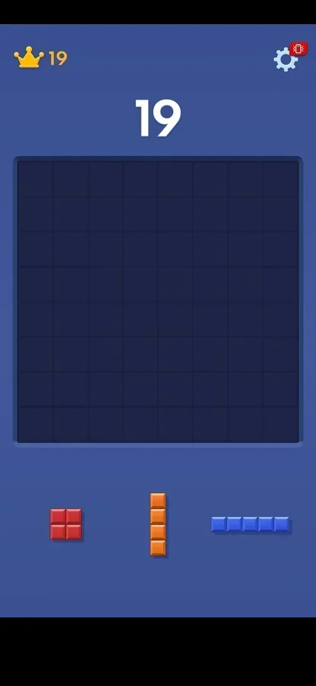
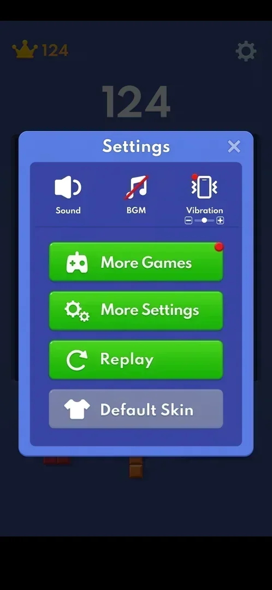
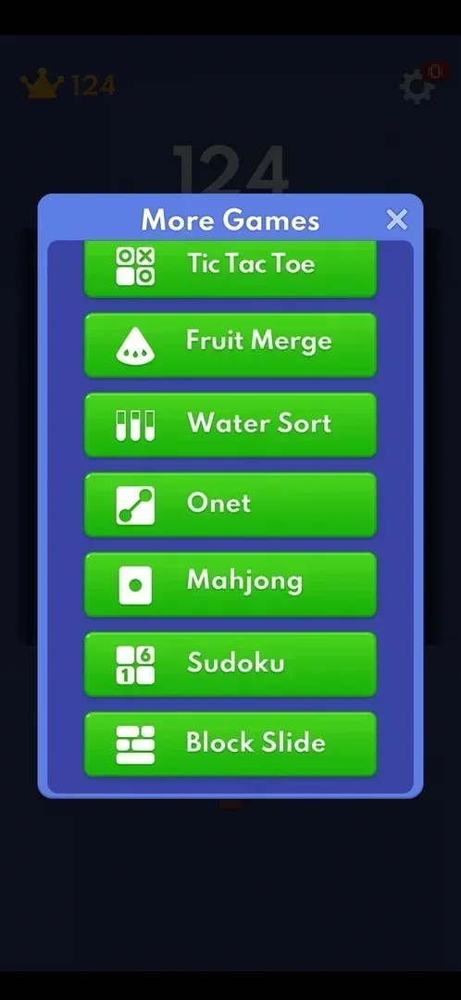
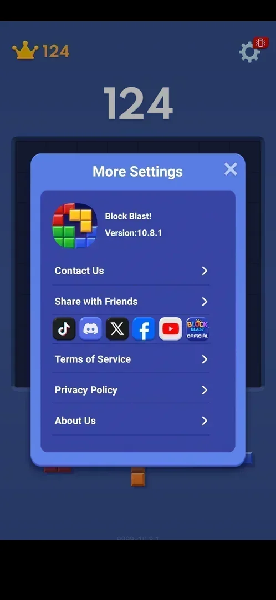
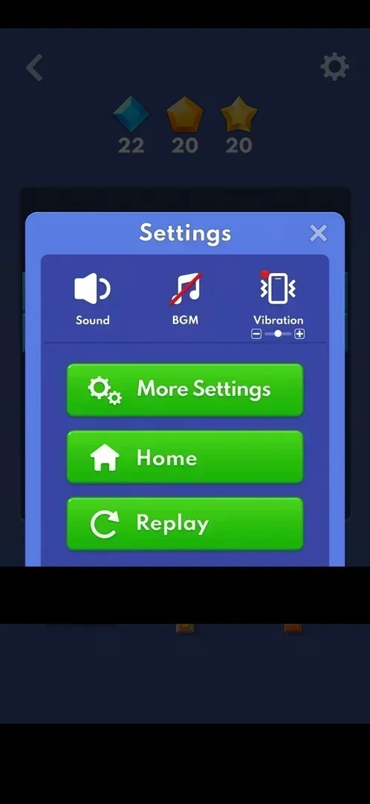

# Settings

A popup over the classic board with three sound and vibration controls and four buttons: More Games (the
built-in mini-games), More Settings (version, contact and external links), Replay (a new board) and a grey
Default Skin [^s1] [^s2]. Inside an Adventure level the same gear opens a shorter Settings with Home and
Replay [^s12].

## Why it appeared

Always on the classic board: gear top right [^s1].

## Where to find it

The gear top right of the classic board; it is there from the tutorial board on, with a red badge showing a
vibrating phone [^s1] [^s3].

 [^s1]
*The gear top right of the classic board opens Settings*

## What it looks like

 [^s1]
*Settings over the dimmed board: three controls at the top, four buttons below, the X top right*

The title "Settings" and an X top right. A row of three icons: Sound, BGM (crossed out in red: off on a
fresh install) and Vibration with a minus/plus slider and a red dot. Below, green buttons More Games (with
a red dot), More Settings, Replay, and a grey Default Skin button. A build label 1.5.7.0.0 is bottom right
of the screen [^s1].

## What you can do

| Tab or button | What it does |
|---|---|
| [Sound, BGM, Vibration](#sound-bgm-vibration) | Not changed |
| [More Games](#more-games) | Opens the list of eight built-in mini-games |
| [More Settings](#more-settings) | Opens version, contact and external links |
| [Replay](#replay) | An interstitial ad, then a new classic board |
| [Default Skin](#default-skin) | A tap does nothing |
| [Home](#home) | Only in an Adventure level: leaves for the home menu |

### Sound, BGM, Vibration

<!-- no-frame: the controls are on the Settings frame above; not changed this session -->
Sound is on and BGM is off on a fresh install; Vibration has a slider with minus and plus and a red dot,
like the red vibration badge on the gear [^s1]. What the red dot asks for is not verified.

### More Games

 [^s4]
*More Games: a scrolling list of green buttons, one per mini-game*

A popup "More Games" with eight green buttons: One Line, Tic Tac Toe, Fruit Merge, Water Sort, Onet,
Mahjong, Sudoku and Block Slide; the list scrolls [^s4] [^s5]. The games run
inside the app: see [More Games](more-games.md).

### More Settings

 [^s6]
*More Settings: the version at the top, then rows of links*

A popup "More Settings": the app icon, "Block Blast!" and "Version:10.8.1"; rows Contact Us and Share with
Friends; a row of six icons (TikTok, Discord, X, Facebook, YouTube, Block Blast Official); rows Terms of
Service, Privacy Policy and About Us. A label "9999v10.8.1" is under the popup [^s6]. The X closes it back
to the board, not to Settings [^s7]. No row was opened.

### Replay

<!-- no-frame: the button is on the Settings frame above -->
A green button with a circular arrow [^s1]. Tapped in a classic game at score 2516: no confirmation, an
interstitial video ad, then a new empty board with score 0 and the best (2516) kept [^s8] [^s2]. See
[Classic mode](classic.md) and [Interstitial ad](ad-interstitial-classic.md).

### Default Skin

<!-- no-frame: the button is on the Settings frame above; tapping it changed nothing -->
Grey, with a T-shirt icon. A tap changes nothing on screen [^s9]. See
[Skins](skins.md).

### Home

 [^s12]
*The in-level Settings of an Adventure level: Home and Replay in place of More Games and Default Skin*

In an [Adventure](adventure.md) level the gear top right opens Settings with Sound, BGM, Vibration with
its slider, More Settings, Home and Replay; More Games and Default Skin are not there [^s12]. Home goes to
the home menu at once, with no confirmation and no cost; the level stays the current one [^s13]. Replay
there was not tapped.

## How it works

Version 10.8.1 (More Settings); the Settings screen also shows a build label 1.5.7.0.0 [^s1] [^s6]. Inside a
mini-game the gear opens a shorter Settings: Sound, BGM, Vibration, Exit and Replay, without More Games,
More Settings or Default Skin [^s10]. In the second session the red dot on More Games was gone (the list
had been opened in the first); the red dot on Vibration and the badge on the gear were still there [^s11].

## Cases

| Case | What was done | Result | Source |
|---|---|---|---|
| Why it appeared <!-- case:chk-appeared --> | Classic board | ✅ The gear is on the board from the start | [^s1] |
| Where to find it <!-- case:chk-entry --> | Tapped the gear | ✅ Settings opened | [^s1] |
| What it looks like <!-- case:chk-screen --> | Opened Settings | ✅ Three controls and four buttons | [^s1] |
| Every option or button and what it changes <!-- case:chk-options --> | Opened More Games, More Settings; tapped Default Skin and Replay | partly: Replay restarts the board after an ad; Sound, BGM and Vibration not tried | [^s2] |
| What each answer does for a prompt <!-- case:chk-answers --> | — | does not apply: no prompt in Settings |  |
| Links out (contact, social, terms, privacy): where they lead <!-- case:chk-links --> | — | not verified: no row of More Settings opened |  |
| Settings in an Adventure level <!-- case:adventure-popup --> | Tapped the gear in Adventure level 4, then Home | ✅ Sound, BGM, Vibration, More Settings, Home, Replay; Home leaves for the home menu with no confirmation | [^s13] |

## Not verified

- Sound, BGM and Vibration: what each changes; the red dot on Vibration and the badge on the gear <!-- case:chk-options -->
- Where the More Settings rows and social icons lead <!-- case:chk-links -->
- Replay in the in-level Settings of an Adventure level

[^s1]: session 20261003-193423-chrono-2FYKPJ, step 5 — [video at 1:06](https://youtu.be/A6Wh-xa4ryg?t=66)
[^s2]: session 20261003-212548-chrono-2FYKPJ, step 28 — [video at 5:17](https://youtu.be/ReMKqt9albk?t=317)
[^s3]: session 20261003-193423-chrono-2FYKPJ, step 1 — [video at 0:13](https://youtu.be/A6Wh-xa4ryg?t=13)
[^s4]: session 20261003-193423-chrono-2FYKPJ, step 11 — [video at 2:08](https://youtu.be/A6Wh-xa4ryg?t=128)
[^s5]: session 20261003-193423-chrono-2FYKPJ, step 10 — [video at 1:57](https://youtu.be/A6Wh-xa4ryg?t=117)
[^s6]: session 20261003-193423-chrono-2FYKPJ, step 6 — [video at 1:21](https://youtu.be/A6Wh-xa4ryg?t=81)
[^s7]: session 20261003-193423-chrono-2FYKPJ, step 7 — [video at 1:32](https://youtu.be/A6Wh-xa4ryg?t=92)
[^s8]: session 20261003-212548-chrono-2FYKPJ, step 26 — [video at 4:30](https://youtu.be/ReMKqt9albk?t=270)
[^s9]: session 20261003-193423-chrono-2FYKPJ, step 9 — [video at 1:46](https://youtu.be/A6Wh-xa4ryg?t=106)
[^s10]: session 20261003-193423-chrono-2FYKPJ, step 13 — [video at 2:36](https://youtu.be/A6Wh-xa4ryg?t=156)
[^s11]: session 20261003-212548-chrono-2FYKPJ, step 25 — [video at 4:18](https://youtu.be/ReMKqt9albk?t=258)
[^s12]: session 20261003-235233-chrono-2FYKPJ, step 63 — [video at 13:13](https://youtu.be/RE70Idi_jrA?t=793)
[^s13]: session 20261003-235233-chrono-2FYKPJ, step 64 — [video at 13:28](https://youtu.be/RE70Idi_jrA?t=808)
