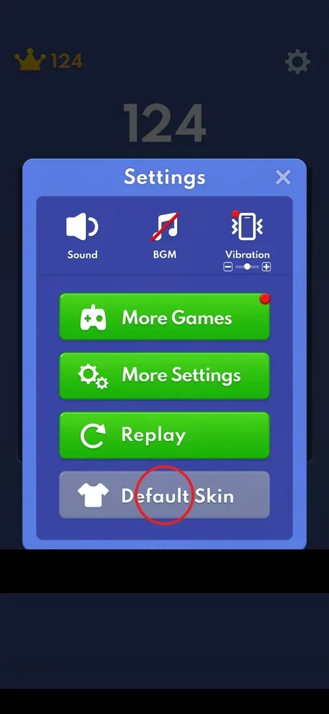

# Skins

Skins would change how the blocks look. In version 10.6.5 the only sign of them is a "Default Skin"
button in Settings, and on a new account it is grey and does nothing [^s1]
[^s2].

## Where to find it

From the classic board: the gear at the top right, then the last button of the Settings popup,
"Default Skin" with a T-shirt icon. It is grey while the other buttons are green [^s1].

 [^s1]

## What it looks like

<!-- no-screen: tapping the grey Default Skin button opened nothing in this session -->

No skin screen was seen: tapping the grey button left the Settings popup as it was, with no message
[^s2].

## How it works

- On a fresh install with one game played (best score 261) the button is grey and inactive
  [^s2]. That skins unlock later is inferred from the grey look; the
  condition is unknown.

## Cases

| Case | What was done | Result | Source |
|---|---|---|---|
| Open skins from Settings | Tapped the grey Default Skin button | ❌ Nothing happened | [^s2] |

## Not verified

- What unlocks skins (score, number of games, days played) and what the skin screen looks like.

[^s1]: session 20261001-200952-chrono-2FYKPJ, step 6 — [video at 1:27](https://youtu.be/1AkjzicKdRM?t=87)
[^s2]: session 20261001-200952-chrono-2FYKPJ, step 32 — [video at 6:57](https://youtu.be/1AkjzicKdRM?t=417)
