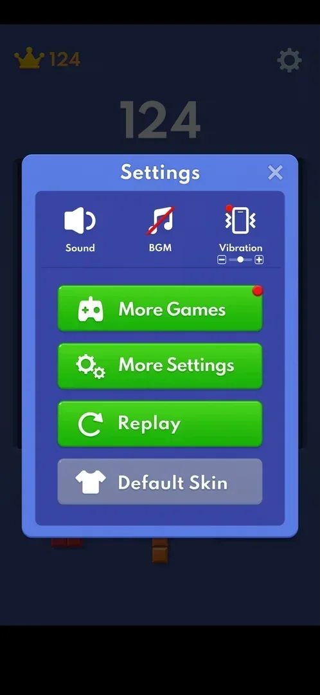

# Skins (Default Skin button)

A grey "Default Skin" button at the bottom of Settings. On a fresh install a tap does nothing; no skin
list or other skin was seen [^s2] [^s3].

## Why it appeared

The button is in Settings from the first launch [^s1]. Hypothesis: other skins, and an active button,
come with progress or an event; not verified.

## Where to find it

Classic board > the gear top right > Default Skin, the last button, grey with a T-shirt icon [^s2].

 [^s2]
*The grey Default Skin button, last in Settings*

## What it looks like

<!-- no-screen: a tap on Default Skin changed nothing; no skin screen was opened -->
No screen of its own: tapping the button left Settings unchanged [^s3]. The
grey colour, unlike the green buttons above it, is the only sign that it is inactive [^s2].

## How it works

Version 10.8.1. The board, the blocks and the tray use one look all session; nothing changed it [^s1].

## Cases

| Case | What was done | Result | Source |
|---|---|---|---|
| Why it appeared <!-- case:chk-appeared --> | Fresh install | hypothesis: other skins come with progress or events; not verified | [^s1] |
| Where to find it <!-- case:chk-entry --> | Opened Settings | ✅ Default Skin, last button | [^s2] |
| What it looks like: its screen <!-- case:chk-screen --> | Tapped Default Skin | not verified: nothing opened | [^s3] |
| The progress toward skins <!-- case:chk-progress --> | — | not verified |  |
| The items: every skin, owned and locked <!-- case:chk-items --> | — | not verified: only the default skin seen |  |
| How a skin is earned <!-- case:chk-earn --> | — | not verified |  |
| Using a skin: equip it, what changes <!-- case:chk-use --> | — | not verified |  |
| Completing a set: the reward <!-- case:chk-complete --> | — | not verified |  |

## Not verified

- What makes Default Skin active and what it opens <!-- case:chk-appeared -->
- The skin screen <!-- case:chk-screen -->
- Progress toward skins <!-- case:chk-progress -->
- The skins on offer, owned and locked <!-- case:chk-items -->
- How a skin is earned <!-- case:chk-earn -->
- Equipping a skin <!-- case:chk-use -->
- A reward for a complete set <!-- case:chk-complete -->

[^s1]: session 20261003-193423-chrono-2FYKPJ, step 5 — [video at 1:06](https://youtu.be/A6Wh-xa4ryg?t=66)
[^s2]: session 20261003-193423-chrono-2FYKPJ, step 8 — [video at 1:42](https://youtu.be/A6Wh-xa4ryg?t=102)

[^s3]: session 20261003-193423-chrono-2FYKPJ, step 9 — [video at 1:46](https://youtu.be/A6Wh-xa4ryg?t=106)
