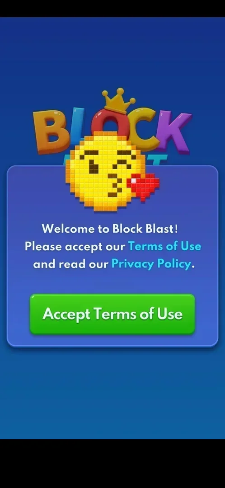

# Terms of Use consent

The first thing a fresh install shows: a welcome window that asks the player to accept the Terms of Use
and read the Privacy Policy, with a single button to accept [^s1].

## Why it appeared

First launch of a fresh install, before anything else [^s1].

## Where to find it

<!-- no-entry: no control opens it; it is shown by itself on the first launch of a fresh install -->
It is shown by itself on the first launch; no button in the game opens it. The same documents are
linked later from Settings > More Settings (Terms of Service, Privacy Policy) [^s1] [^s2].

## What it looks like

 [^s1]
*The consent window: two links in the text and one green button; there is no decline option*

A blue panel under the game's logo and a pixel-art emoji. The text welcomes the player and asks them to
accept the Terms of Use and read the Privacy Policy; both names are cyan links. One green button, "Accept
Terms of Use". No decline or close button [^s1].

## What you can do

| Tab or button | What it does |
|---|---|
| [Accept Terms of Use](#accept-terms-of-use) | Closes the window and opens the tutorial board |
| [Terms of Use and Privacy Policy links](#terms-of-use-and-privacy-policy-links) | Not tapped |

### Accept Terms of Use

<!-- no-frame: the button is on the consent frame above -->
The window closes and the [tutorial board](tutorial.md) appears [^s3].

### Terms of Use and Privacy Policy links

<!-- no-frame: the links are on the consent frame above; not tapped -->
Cyan words in the text [^s1]. Where they lead is not verified.

## How it works

Version 10.8.1. Accepting is the only way into the game; after it the window was not seen again in this
session [^s1] [^s3].

## Cases

| Case | What was done | Result | Source |
|---|---|---|---|
| Welcome window with Terms of Use and Privacy Policy links and one Accept button; no decline <!-- case:chk-screen --> | Fresh install | ✅ | [^s1] |
| Why it appeared <!-- case:chk-appeared --> | Fresh install | ✅ First launch, before anything else | [^s1] |
| Where to find it <!-- case:chk-entry --> | — | ✅ No entry: shown by itself on the first launch | [^s1] |
| Every option or button and what it changes <!-- case:chk-options --> | Tapped Accept | ✅ The only button: it opens the tutorial | [^s3] |
| What each answer does and whether it comes back <!-- case:chk-answers --> | Accepted | not verified: no other answer exists; whether it comes back after a reinstall or an update not checked |  |
| Links out (terms, privacy): where they lead <!-- case:chk-links --> | — | not verified: not tapped |  |

## Not verified

- Whether the window comes back (a reinstall, an updated policy) <!-- case:chk-answers -->
- Where the Terms of Use and Privacy Policy links lead <!-- case:chk-links -->

[^s1]: session 20261003-193423-chrono-2FYKPJ, step 0 — [video at 0:00](https://youtu.be/A6Wh-xa4ryg?t=0)

[^s2]: session 20261003-193423-chrono-2FYKPJ, step 6 — [video at 1:21](https://youtu.be/A6Wh-xa4ryg?t=81)
[^s3]: session 20261003-193423-chrono-2FYKPJ, step 1 — [video at 0:13](https://youtu.be/A6Wh-xa4ryg?t=13)
