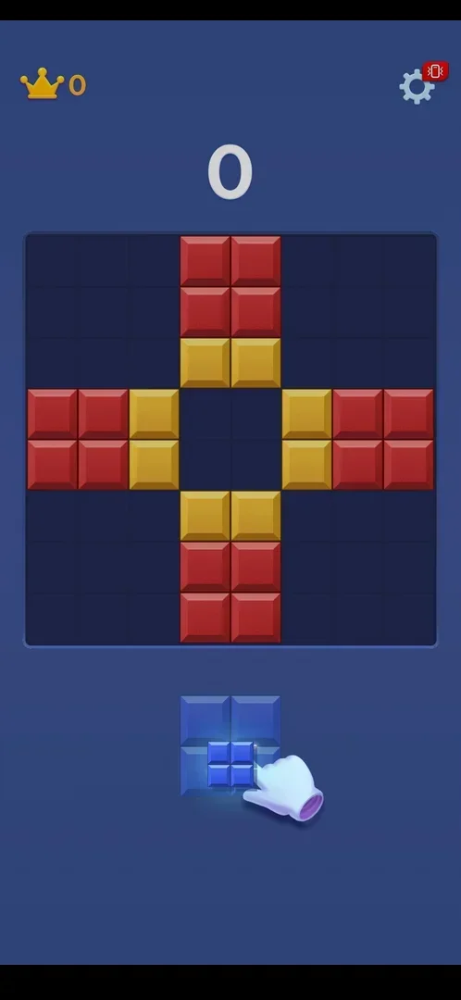
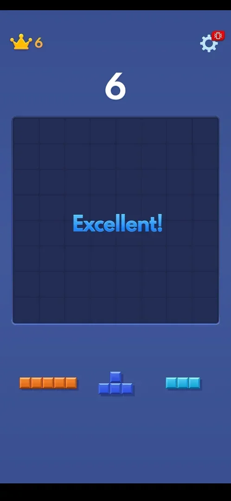

# First-launch tutorial

The tutorial is a single scripted move that teaches the whole game: drag a block into a gap so that full
rows and columns disappear. It is shown once, on the first launch, and leads straight into the
[classic game](classic.md) [^s1] [^s2].

## Where to find it

<!-- no-entry: starts by itself on the first launch, right after the consent window and the Android notification prompt -->

It starts by itself on the first launch: after the [Terms and privacy consent](consent.md) window and the
phone's notification permission prompt, the game opens on the tutorial board; there is no menu before it
[^s3] [^s1].

## What it looks like

The normal classic screen (crown with best score 0, gear, score 0) with a prepared board: red and yellow
blocks form a cross that leaves a 2x2 hole in the middle. The tray holds one blue 2x2 piece, and an
animated hand shows dragging it up into the hole [^s1].

 [^s1]

### Result

Dropping the 2x2 into the hole completes two rows and two columns at once: the whole board empties,
"Excellent!" appears, the score and best score become 6, and the first normal tray of three pieces
appears [^s2].

 [^s2]

## How it works

- One move only; the classic game continues on the same screen (version 10.6.5) [^s2].
- The tutorial move scored +6 despite clearing four lines, far below a normal two-line clear (+60): the
  tutorial's scoring looks scripted (inferred) [^s2].
- The piece floats above the finger while dragged, so a drag aimed exactly at the hole falls short; the
  first two drags in this session did not place the piece [^s4] [^s2].

## Cases

| Case | What was done | Result | Source |
|---|---|---|---|
| First-launch flow on a fresh install | Accepted consent, declined notifications, dragged the 2x2 into the hole | ✅ Board cleared, +6, "Excellent!", classic game starts | [^s2] |

## Not verified

- Whether the tutorial can be skipped, and whether a failed drag shows a hint again.
- Whether any later tutorial appears (for example for a new mode).

[^s1]: session 20261001-200952-chrono-2FYKPJ, step 2 — [video at 0:20](https://youtu.be/1AkjzicKdRM?t=20)
[^s2]: session 20261001-200952-chrono-2FYKPJ, step 5 — [video at 1:07](https://youtu.be/1AkjzicKdRM?t=67)
[^s3]: session 20261001-200952-chrono-2FYKPJ, step 1 — [video at 0:12](https://youtu.be/1AkjzicKdRM?t=12)
[^s4]: session 20261001-200952-chrono-2FYKPJ, step 4 — [video at 0:54](https://youtu.be/1AkjzicKdRM?t=54)
