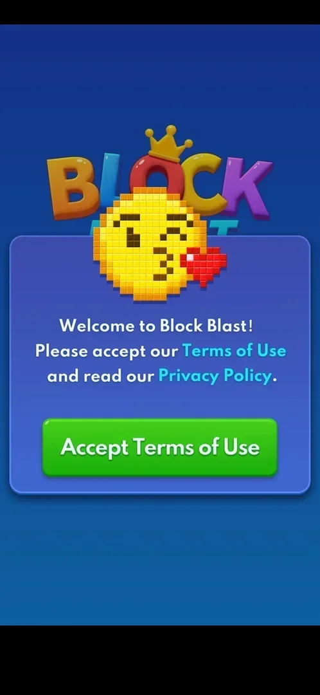
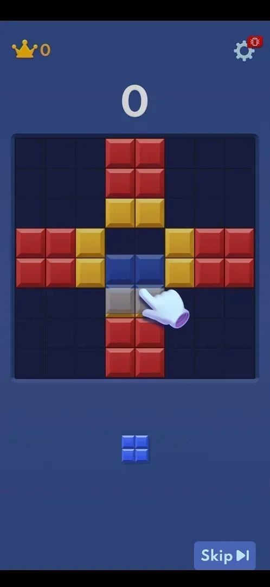
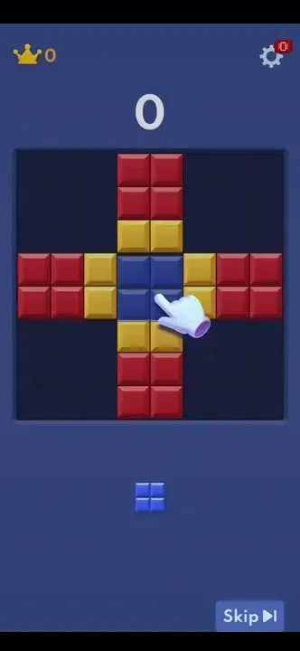

# First-launch tutorial board

A single prepared board shown once on a fresh install: an animated hand shows how to drag the only
tray piece into a gap, and the one drop clears two rows and two columns. The classic game then starts
on the same screen without a break [^s1] [^s3].

## Why it appeared

Right after accepting the Terms of Use on a fresh install [^s1].

## Where to find it

It opens by itself after the green "Accept Terms of Use" button of the first-launch window
([Terms of Use consent](terms-consent.md)); nothing in the game opens it again so far [^s2] [^s1].

 [^s2]
*The green "Accept Terms of Use" button opens the tutorial board*

## What it looks like

 [^s1]
*The tutorial board: one blue 2x2 piece in the tray, the hand showing where it goes, Skip bottom right*

The 8x8 board holds a prepared cross of red and yellow blocks with a 2x2 gap at its centre; the tray holds
one blue 2x2 piece; an animated hand drags a ghost of the piece into the gap. The classic HUD is already
there: crown and best score 0 top left, score 0, the gear with a red badge top right. A "Skip" button is
bottom right [^s1].

 [^s3]
*Clip 5.2 s · [original on YouTube from 0:47](https://youtu.be/A6Wh-xa4ryg?t=47)*

## What you can do

| Tab or button | What it does |
|---|---|
| [The 2x2 piece](#the-2x2-piece) | Drag it into the gap: the tutorial ends |
| [Skip](#skip) | Not tried |

### The 2x2 piece

<!-- no-frame: the piece and the hand are on the tutorial frame and in the clip above -->
Dropped into the gap, it completes two rows and two columns; they clear with "+120", the score goes to 4
and counts up to 124, and three new pieces fill the tray: the classic game has begun [^s3]
[^s4].

### Skip

<!-- no-frame: the button is on the tutorial frame above; not tapped -->
A "Skip" button with a skip-to-end icon, bottom right of the tutorial board [^s1]. What it does is not
verified.

## How it works

Version 10.8.1. One board, one move. The score earned on it is kept: the first classic game starts with
it (124) [^s3] [^s4]. Android's notification permission prompt appeared over
the board during the first drag; it is a system dialog, not part of the tutorial
[^s5].

## Cases

| Case | What was done | Result | Source |
|---|---|---|---|
| One board only: the 2x2 into the cross gap clears 2 rows + 2 columns; a classic game follows at once with the score kept <!-- case:chk-steps --> | Dragged the 2x2 into the gap | ✅ "+120", score counted up to 124, classic tray appeared | [^s3] |
| Skip button bottom right on the tutorial board <!-- case:chk-skip --> | — | not verified: not tapped |  |
| Its screen: prepared cross board with a 2x2 gap, one 2x2 piece, an animated hand, Skip bottom right <!-- case:chk-screen --> | Fresh install | ✅ | [^s1] |
| How it ends: after the one drop the classic board follows at once with the score kept; the notification prompt pops up during it <!-- case:chk-end --> | Dragged the piece | ✅ | [^s3] |
| Why it appeared <!-- case:chk-appeared --> | Accepted the Terms of Use | ✅ It follows the consent window | [^s1] |
| Where to find it <!-- case:chk-entry --> | Fresh install | ✅ Shown by itself after the consent window | [^s2] |
| Whether it can be seen again (How to play, a help button) <!-- case:chk-replay --> | — | not verified: no help button seen in Settings |  |

## Not verified

- What Skip does <!-- case:chk-skip -->
- Whether the tutorial can be seen again <!-- case:chk-replay -->

[^s1]: session 20261003-193423-chrono-2FYKPJ, step 1 — [video at 0:13](https://youtu.be/A6Wh-xa4ryg?t=13)
[^s2]: session 20261003-193423-chrono-2FYKPJ, step 0 — [video at 0:00](https://youtu.be/A6Wh-xa4ryg?t=0)
[^s3]: session 20261003-193423-chrono-2FYKPJ, step 4 — [video at 0:51](https://youtu.be/A6Wh-xa4ryg?t=51)

[^s4]: session 20261003-193423-chrono-2FYKPJ, step 5 — [video at 1:06](https://youtu.be/A6Wh-xa4ryg?t=66)
[^s5]: session 20261003-193423-chrono-2FYKPJ, step 2 — [video at 0:36](https://youtu.be/A6Wh-xa4ryg?t=36)
