# Levels: Block Blast!

Every level the agents met, as its board looked at the start (the ad strips cropped). The notes tell where a new element or rule appears.

| adventure 1 | adventure 2 | adventure 3 | adventure 4 | adventure L5 hard |
|---|---|---|---|---|
|  |  |  |  |  |

| water sort L6 | adventure L7 | adventure L8 | adventure L9 (hard) | adventure L10 |
|---|---|---|---|---|
| 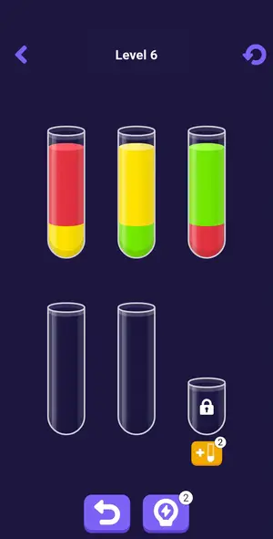 | 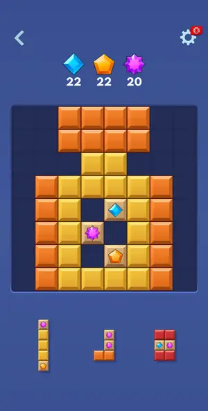 | no frame | no frame | no frame |

| adventure L11 | adventure L12 | adventure L13 | classic game 1 | classic game 2 (session) |
|---|---|---|---|---|
| 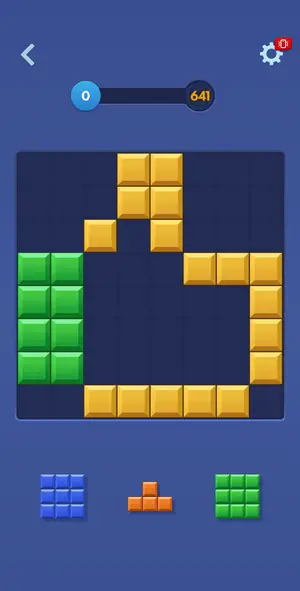 | 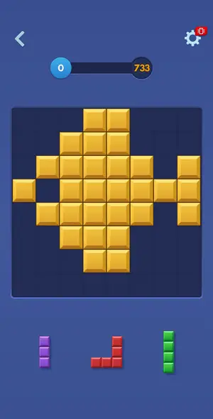 | 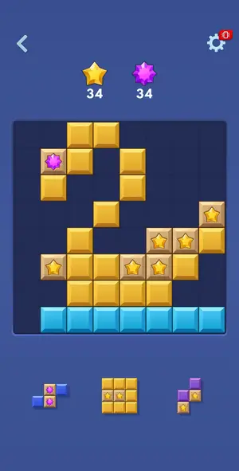 |  | 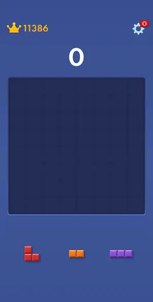 |

| classic game 3 | classic game 3 (session) | classic game 4 (session) | classic game 5 (session) | classic game 6 (session) |
|---|---|---|---|---|
|  | 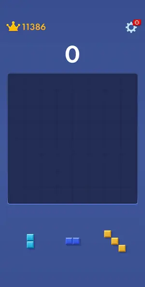 | 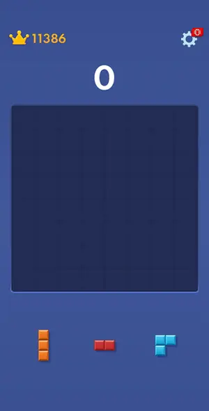 | 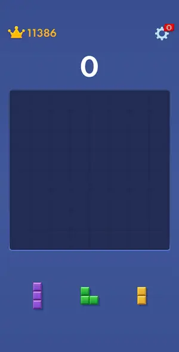 | 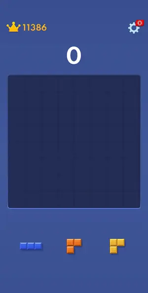 |

| classic game A | classic game A (1st after launch) | classic game A (ad-cadence) | classic game A (launch check) | classic game B |
|---|---|---|---|---|
| 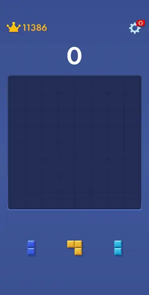 | 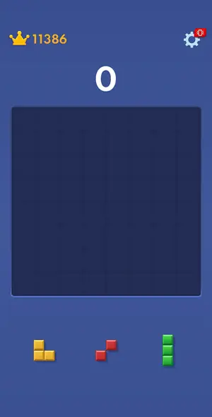 | 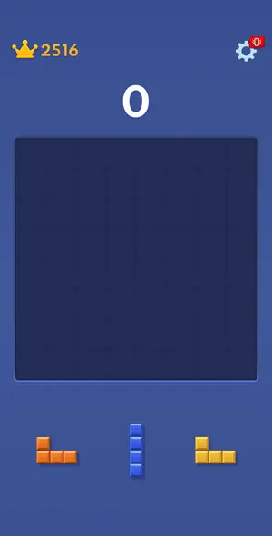 | 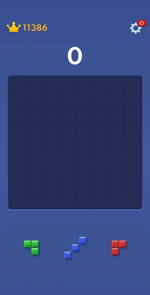 | 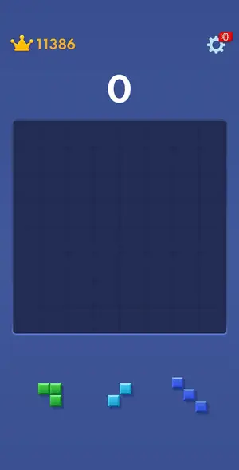 |

| classic game C | classic game D | classic game E (short-ad test) | classic game (resumed at 11366) | classic row-7 drop test |
|---|---|---|---|---|
| 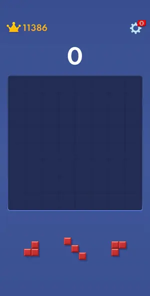 | 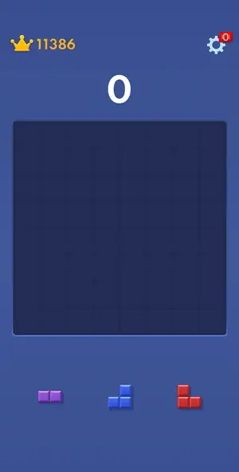 | 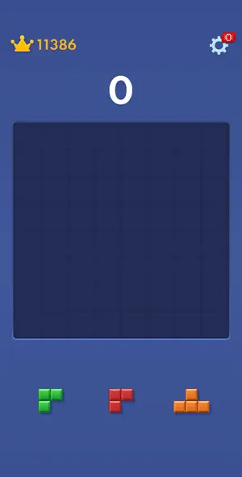 | 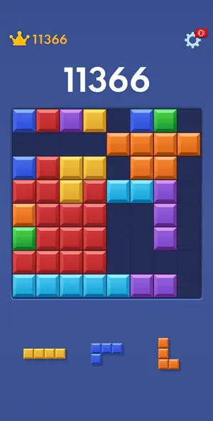 |  |

| fruit merge 1 | fruit merge loss | mahjong 1 | mahjong 2 | one line 1 |
|---|---|---|---|---|
| 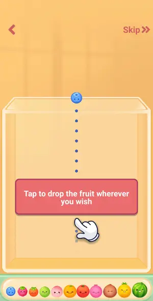 | 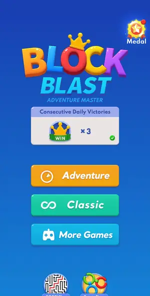 | 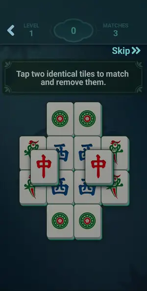 | 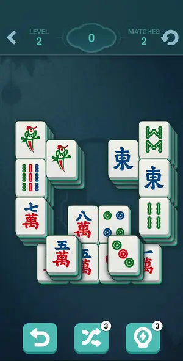 | 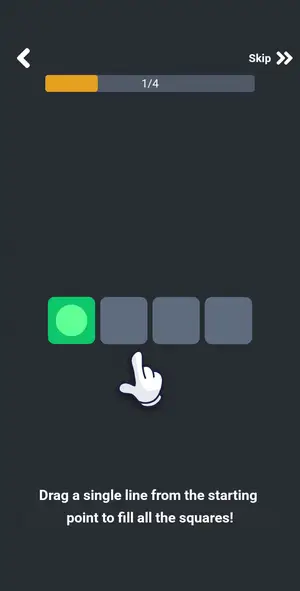 |

| Onet L1 | tutorial |
|---|---|
| 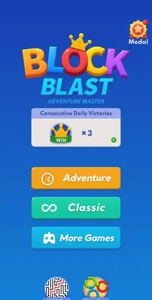 |  |

## Tries

| Level | Mechanic | Result | Time | Note |
|---|---|---|---|---|
| adventure 1 | adventure | 3 won | 60 s | won in ~1.9 min by the classic solver (15 rounds, 56 moves); NOTE the --board score mode on the plain 'solve' call was not kept: the --run rounds said [mode gameover], and the target 368 was still rea |
| adventure 2 | adventure | 2 won, 1 lost | 50 s | retry of diamond L2 won in ~2.2 min of play by the classic solver in score mode (--board on the first --run, kept by memory on the next): 60 diamonds collected by line clears; a transient adb reset cr |
| adventure 3 | adventure | 2 won, 1 lost, 1 quit | 47 s | two-gem goal (56 red, 54 orange) won in ~2 min by the classic solver in score mode; stops on gem-fly animation frames, rerun works |
| adventure 4 | adventure | 2 won, 2 quit | 43 s | L4 gem level won (win screen seen, shot 31) |
| adventure L5 hard | adventure | 2 won | 91 s | L5 hard won with solver score mode, 2 solver runs, ~1.5 min play plus ad; goals 28/26/26 gems |
| water sort L6 | water-sort | 2 won | 122 s | L6 solved in one call; interstitial after the win, Back on its end card returned to Level 7 |
| adventure L7 | adventure | 1 won | 258 s | L7 gem level (22/22/20) won by the solver in ~0.9 min; the interstitial came right at the win, before the win panel; playable end card forced a restart; the Adventure map then shows Level 8 (win kept) |
| adventure L8 | adventure | 1 won | 117 s | L8 won by the solver in ~1.6 min; no interstitial (first result after cold launch 3, ~2.2 min after it); Consecutive Victories x7; L9 offered as 'Next Hard Level' |
| adventure L9 (hard) | adventure | 1 won | 326 s | L9 hard: score-target level (bar to 687), won by the solver in score mode in ~2 min of play; the interstitial (rings video, Open Store top left, auto store sheet, end card X top right) played ~3 min b |
| adventure L10 | adventure | 1 won | 165 s | L10 score target 395, solver score mode won in ~1.1 min of play (40 s paced wait first). Win at session min ~6.9 = 2.7 min after the ad close by restart: no interstitial, the win panel came straight |
| adventure L11 | adventure | 1 won | 374 s | L11 score 641 won by solver score mode (~3.6 min of play); interstitial (Royal Match, ~11.6 = 7.4 min after the previous close) before the win panel, closed by Back at 13.6; Consecutive Victories x10 |
| adventure L12 | adventure | 1 won | 419 s | L12 score 733 won by solver score mode (~5.8 min incl. a forced over-budget stop); interstitial (nail game video, ~20.4 = 6.8 min after the 13.6 close) before the win panel, closed by Back at 21.3; x1 |
| adventure L13 | adventure | 1 won | 515 s | L13 gems 34 stars + 34 purple won by solver score mode (held twice on purpose for the ad timing); goal done at ~26.0, interstitial at once (4.7 min after the 21.3 close), playable end card with no clo |
| classic game 1 | classic | 1 lost | — | scout: gameover mode reached No Space Left at 327 in ~2.2 min (solver 41 placements + 1 hand drag); interstitial then the end screen, no revive |
| classic game 2 (session) | classic | 1 lost | — | Gameover mode BLOCK ended a fresh game at 38 in 5 rounds (0.8 min). No interstitial before the result screen 'Your Best is Next' (a new title variant vs 'Can you Top that?'). |
| classic game 3 | classic | 1 quit | — | row 7 unreachable, stuck at 2516 with no game over; tried Replay next |
| classic game 3 (session) | classic | 1 lost | — | BLOCK ended game 3 in 1.2 min (No Space Left, shot 29); one adb drop mid-run recovered. |
| classic game 4 (session) | classic | 1 lost | — | BLOCK ended game 4 in 1.2 min (No Space Left, shot 45); an adb drop at the start was recovered by a shot. |
| classic game 5 (session) | classic | 1 lost | — | BLOCK ended game 5 in 1.3 min (No Space Left, shot 55). |
| classic game 6 (session) | classic | 1 lost | — | Game 6: 12 score-mode rounds (2234), then gameover mode BLOCK; ended 2239 at ~20.5 min session time. Game-over interstitial played (Royal Match, Back on end card) - refutes 'every second game over'. R |
| classic game A | classic | 1 lost | — | BLOCK line ended the game in 0.6 min, score 37; no interstitial, result 'Try every Combo!' (new title) ~9 min after the previous session's last ad |
| classic game A (1st after launch) | classic | 1 lost | — | BLOCK mode game over in ~0.5 min, score 42; interstitial followed at 1.2 min after the cold launch |
| classic game A (ad-cadence) | classic | 1 quit | — | gameover mode ran 84 trays in 10.7 min with no game over: crowded boards get small pieces and forced clears; score 11366 (new best, was 2516). No interstitial mid-game in 10.7 min. Gameover mode needs |
| classic game A (launch check) | classic | 1 lost | — | BLOCK mode game over at session min 4.0 = 3.2 min after the cold launch (min 0.8); NO interstitial; result title 'Game Over', score 42 |
| classic game B | classic | 3 lost | — | BLOCK ended it in 0.5 min; game-over interstitial (coloring-game video, Google Play footer, top-left Next) at session min ~3.0 |
| classic game C | classic | 3 lost | — | BLOCK in 0.5 min, score 41; no ad at game over (session min 7.6 = 4.6 min after game B's ad began, 2.2 after it was closed by restart); title 'See The Next Block' |
| classic game D | classic | 2 lost | — | BLOCK in 0.4 min; interstitial at game over (session min ~8.65 = 5.6 after game B's ad began, 3.2 after its close) |
| classic game E (short-ad test) | classic | 1 lost | — | BLOCK game over at min 17.3, 3.3 min after ad D's close and 4.4 after its start: interstitial (Match Masters again), Back closed it at 18.2 |
| classic game (resumed at 11366) | classic | 1 lost | — | BLOCK line from the solver's first round ended the resumed game in 0.5 min: No Space Left (shot 6) with a 4-line still in the tray, final 11386 (new best). Interstitial (video, Google Play footer) rig |
| classic row-7 drop test | classic | 1 quit | — | row-7 drop test: 4 of 4 hand drags landed with the 2.4-lift model; 1-row 2-line from (347,1210) to finger (415,1186) landed on row 7 cols 4-5 (finger 2.05 cells under the board edge); 2x2 to rows 6-7  |
| fruit merge 1 | fruit-merge | 1 quit | — | studying only; 110 taps, merges work, loss not reached (jar rarely overflows with merging) |
| fruit merge loss | fruit-merge | 1 quit | — | ad (playable end card) came right after the jar filled; frozen, restart lost the screen; loss screen never seen |
| mahjong 1 | mahjong-mg | 1 won | 112 s | tutorial level 1: 6 pairs, +30 per match, score 230 |
| mahjong 2 | mahjong-mg | 1 quit | — | studied tools only |
| one line 1 | one-line | 1 quit | — | L2 board finished but a looping playable ad blocked the win screen; no win frame |
| Onet L1 | onet | 1 quit | — | cleared L1 board, interstitial then frozen playable ad; win screen never seen, restart |
| tutorial | classic | 1 won | 172 s | tutorial board: one 2x2 drop cleared 2 rows + 2 columns (score 19); classic game followed directly; frame 5 shows the cleared board |
