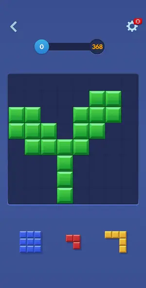
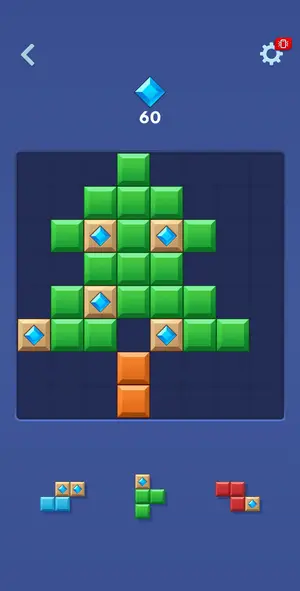
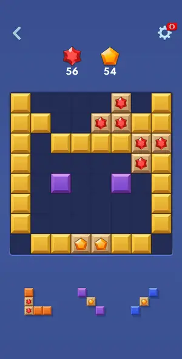
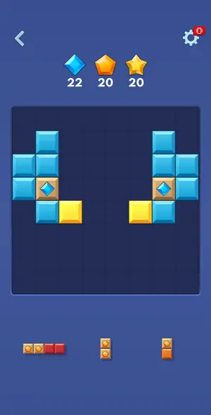
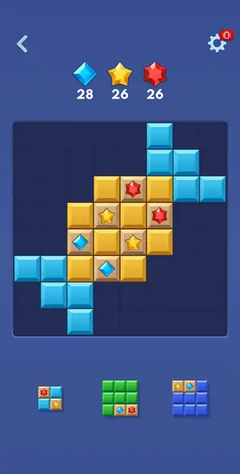
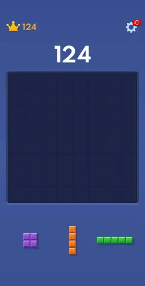
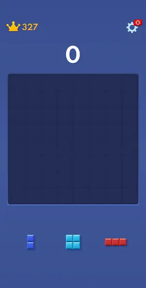
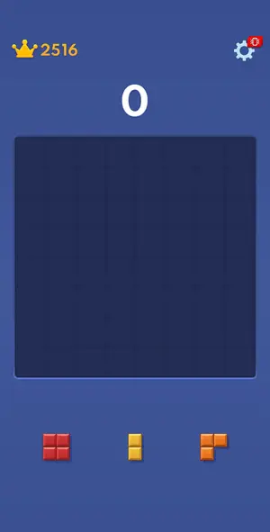
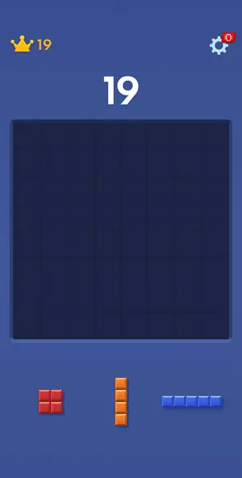

# Levels: Block Blast!

Every level the agents met, as its board looked at the start (the ad strips cropped). The notes tell where a new element or rule appears.

| adventure 1 | adventure 2 | adventure 3 | adventure 4 | adventure L5 hard |
|---|---|---|---|---|
|  |  |  |  |  |

| classic game 1 | classic game 3 | classic row-7 drop test | tutorial |
|---|---|---|---|
|  |  |  |  |

## Tries

| Level | Mechanic | Result | Time | Note |
|---|---|---|---|---|
| adventure 1 | adventure | 1 won | 131 s | won in ~1.9 min by the classic solver (15 rounds, 56 moves); NOTE the --board score mode on the plain 'solve' call was not kept: the --run rounds said [mode gameover], and the target 368 was still rea |
| adventure 2 | adventure | 1 won, 1 lost | 188 s | retry of diamond L2 won in ~2.2 min of play by the classic solver in score mode (--board on the first --run, kept by memory on the next): 60 diamonds collected by line clears; a transient adb reset cr |
| adventure 3 | adventure | 1 won | 137 s | two-gem goal (56 red, 54 orange) won in ~2 min by the classic solver in score mode; stops on gem-fly animation frames, rerun works |
| adventure 4 | adventure | 1 won, 1 quit | 320 s | L4 gem level won (win screen seen, shot 31) |
| adventure L5 hard | adventure | 1 won | 256 s | L5 hard won with solver score mode, 2 solver runs, ~1.5 min play plus ad; goals 28/26/26 gems |
| classic game 1 | classic | 1 lost | — | scout: gameover mode reached No Space Left at 327 in ~2.2 min (solver 41 placements + 1 hand drag); interstitial then the end screen, no revive |
| classic game 3 | classic | 1 quit | — | row 7 unreachable, stuck at 2516 with no game over; tried Replay next |
| classic row-7 drop test | classic | 1 quit | — | row-7 drop test: 4 of 4 hand drags landed with the 2.4-lift model; 1-row 2-line from (347,1210) to finger (415,1186) landed on row 7 cols 4-5 (finger 2.05 cells under the board edge); 2x2 to rows 6-7  |
| tutorial | classic | 1 won | 172 s | tutorial board: one 2x2 drop cleared 2 rows + 2 columns (score 19); classic game followed directly; frame 5 shows the cleared board |
