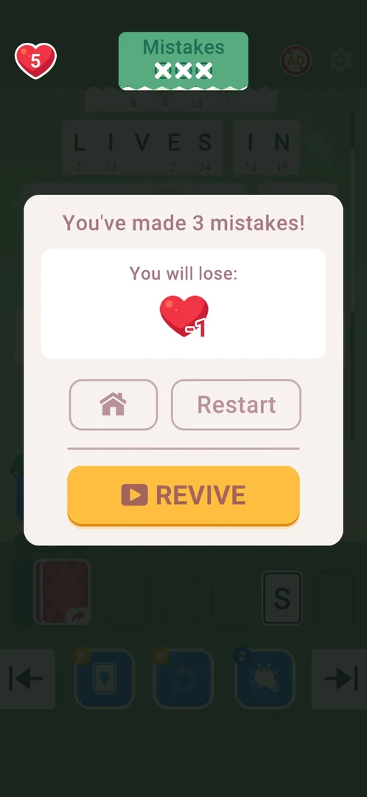
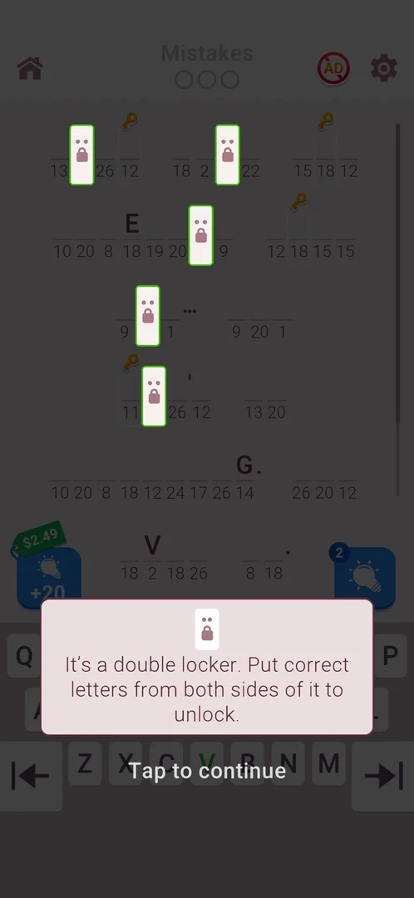

# How to play: Cryptogram: Word Logic Puzzles

The player reads this before every level and works in the local copy `state/com.crypt.gram.puzz/playbook.md`;
the dream merges it here. Level times: `sw.py playbook`. Budget: 5 min per level.

**Never read, decode or write the quote text.** Four sessions on level 16 (071926, 092740, 114433,
192245) ended with the model's output blocked by the content filter right after the level 16 board
loaded, losing their notes and the rest of the plan [s:20261001-071926-chrono-2FYKPJ#69]
[s:20261001-092740-chrono-2FYKPJ#9] [s:20261001-114433-chrono-2FYKPJ#18] [s:20261001-192245-chrono-2FYKPJ#17].
Do not put any word of a quote in plans, `--why`, level notes, marks or the summary; refer to a level
by its number and to letters by counts.

## cryptogram: Number-coded quote
- Goal: fill every blank of a famous quote; each number is one letter (same number = same letter
  everywhere) [s:20261001-020937-chrono-2FYKPJ#8].
- Controls: the selected cell is green; tap a keyboard letter to fill it. A letter fills ONLY the
  selected cell, then the cursor jumps to the next empty cell and skips given letters. Arrows at the
  keyboard edges move to the previous/next cell [s:20261001-020937-chrono-2FYKPJ#11] [s:20261001-020937-chrono-2FYKPJ#14].
- Keyboard (730x1583 frame only — never use these on a `shot --hi` frame): row 1 y=1155 Q42 W114
  E186 R257 T329 Y400 U472 I543 O615 P687; row 2 y=1250 A74 S146 D218 F290 G363 H436 J508 K580
  L653; row 3 y=1345 Z150 X221 C293 V364 B436 N508 M580. A key turns grey when its letter is
  complete everywhere [s:20261001-020937-chrono-2FYKPJ#14].
- Rules: some letters are given (shown above the cell). Key icons above cells are Chest Hunt keys, not
  locks: the cursor fills them normally [s:20261001-071926-chrono-2FYKPJ#24]. Lock icons hide a cell's
  number. A **one-dot** lock takes the next letter when the cursor reaches it; a **two-dot** ("double
  locker", from level 10) is skipped and opens when the letters on both sides are right, so it is
  filled on the wrap-around [s:20261001-050941-chrono-2FYKPJ#54] [s:20261001-050941-chrono-2FYKPJ#72].
  Restart moves the locks to other cells [s:20261001-050941-chrono-2FYKPJ#74].
- Mistakes: 3 circles at the top; a wrong letter costs one. 3 mistakes end the level: popup "You will
  lose: heart -1" with Home, Restart and REVIVE (rewarded ad); Home and Restart both cost a life, a life
  regenerates in 30 min [s:20261001-050941-chrono-2FYKPJ#44] [s:20261001-050941-chrono-2FYKPJ#47]
  [s:20261001-050941-chrono-2FYKPJ#83]. REVIVE never started an ad on this device (3 taps) — do not count
  on it [s:20261001-050941-chrono-2FYKPJ#73].

  

- Method (on chrono): solver. `sw.py solve cryptogram --run --rounds 6` — each round reads the board,
  types the letters it is sure of (a tap on the cell, a tap on the key) and stops before a tap that
  would scroll the board; the next round reads the scrolled board. Run it again while it says `rescan`
  and cells are left. The solver's note holds counts only; quote it. The solver was checked on 25
  recorded boards of levels 9-14 (about 340 cells, 0 wrong) but has not won a level on the phone yet,
  so it lives only in `state/com.crypt.gram.puzz/solvers/` on chrono and is not published (task
  cryptogram-solver-phone) [lab 2026-10-01]. Level 1 of the 2026-10-03 install stalled with "no settled
  letter to type" and 2 cells of one number left (one letter typed by hand): the word list lacked about 12 000
  common words (its source drops every word that is also a common password). The lab added them; the same
  frames now type every cell, 0 wrong, the last number one cell per round ("single") [lab 2026-10-04].
  Level 2 (session 20261005-143208) stalled the same way with 2 cells of the last number left (typed by
  hand): that number sat in two listed but less common words, each too rare alone for "single". The solver
  now also settles a number pinned by two such words that agree (best solution with no unknown word); the
  recorded frames type the last cells, one per round, with the letter the player typed [lab 2026-10-05].
  Level 3 (session 20261005-221933) stalled with 5 cells of 3 numbers (typed by hand): two numbers sat only
  in one very common short word with two free numbers, the third number was a true tie between two listed
  words (margin 0.21). The solver now settles both numbers of a very common word whose runner-up is far
  below, and when nothing settled is left it plays a "toss": one cell with the best solution's letter (a
  two-way tie, at 0 mistakes only) or with a letter all near-best solutions agree on (at 0-1 mistakes). A
  wrong toss costs one mistake, never the level: the game leaves the cell empty, the solver's memory bans the
  letter and the next round types the other one. On the recorded frame the toss letter is the one the player
  typed by hand [lab 2026-10-05b].
  Levels 4-8 (session 20261006-003220) all stalled on the last cell (one number left, 2-7 candidate letters
  that fit its one word; the last letter typed by hand each time). The lab found and fixed three reading or
  memory faults behind it and added an endgame: (1) the memory unified two different words of one shape and
  taught the last number a wrong letter (level 5: its key was grey, so nothing could be typed); words are now
  unified only with the word at the same place after the scroll, and a remembered letter whose key is grey
  is dropped; (2) a 25 read as 26 (level 7) and a 13 on the green cursor box read as 1 (level 4, which cost the
  mistake of that level): 5/6 are told apart by the loop of the 6, cursor digits are read from a thickened
  mask, a broken digit is left unread; (3) the "It's a locker" tooltip over the keyboard (level 6) made a
  covered key look grey, which banned the right letter and cost the mistake of that level: such a frame is now
  refused ("a popup covers the keyboard"). Endgame: when one number is left, the solver plays a "(toss, last
  number)": the best solution's letter, one cell per round; a wrong one costs one mistake, the memory bans it
  and the next round tries the next best. At 2 mistakes it taps the bulb and then the cell when the bulb shows
  a count, and otherwise still tosses (quitting would replay the level to the same last cell). On the recorded
  frames the hand-typed letter was candidate 1 in two levels, 2 in two, 3 in one [lab 2026-10-06].
  Level 9 (session 20261006-024420) cost a mistake and stalled with 2 numbers left (5 cells typed by hand);
  level 10 won by the solver but the run ended "keyboard not found" on the finished board, counted as a
  give-up. Fixed: (1) a word that was just completed flashes in big green letters for a moment; the solver read
  those cells as empty, tapped one (a filled cell does not take the cursor) and the letter went into the
  cursor cell: cells with green in their letter zone are now never typed; (2) complete words not in the word
  list (a name, a rare word) counted as "unknown words" and blocked every toss: complete words are left out
  of the search; (3) several numbers left and nothing settled: at 1 mistake with a hint count on the bulb it
  hints the least settled number, otherwise it tosses one cell of the number whose best letter most near-best
  solutions share (half of them at 0 mistakes, three quarters at 1), note "(toss)"; (4) the finished board (no
  top bar, no keyboard, every cell lettered) returns done, so the run ends "solved". On the recorded level-9
  frames the toss and the next "(toss, last number)" are the two letters the player typed by hand
  [lab 2026-10-06b].
  Keep running `solve --run` until the win card; a level-1/2 board takes 3-4 rounds, a level-3 board about 5,
  levels 4-8 6-11 rounds. A note "(toss)" or "(toss, last number)" followed by one mistake is expected, not a
  misread: run it again. A "(hint)" round taps the bulb and then the cell: run it again after it.
- Method (manual, proven on levels 9-15, the Daily Challenge and the secret level, 9 wins out of 10
  tries): decode the whole quote from one sharp shot (given letters, one-letter words, double letters,
  word shapes), keep the number→letter map to yourself, then type in cursor order: single locks in
  order, double locks on the wrap-around. 2-5 batches per level, 0.5-3 min
  [s:20261001-050941-chrono-2FYKPJ#82] [s:20261001-071926-chrono-2FYKPJ#36]. Use it only where the
  solver is missing, and never write the decoded words anywhere (see the warning above).
- Level plan: tap START/CONTINUE/PLAY; if an interstitial starts, wait, then press Back once (the skip icon
  at the top left, 45,110, may open the Play Store: [s:20261006-024420-chrono-2FYKPJ#32]), and use
  launch only after a store handoff or a blank screen (the route that reached level 16)
  [s:20261001-192245-chrono-2FYKPJ#15] [s:20261001-192245-chrono-2FYKPJ#17]; dismiss
  popups ("Tap to continue" tutorials dim the board; the solver refuses a dimmed board), take a normal
  shot so the board is settled, count the dots of every lock, then the solver (or the manual batches).
  With several numbers left the solver tosses or hints by itself at 0-1 mistakes (Method). When it still
  returns no moves ("no settled letter to type"), usually at 2 mistakes: use a hint (the bulb with a count at
  the bottom right, then tap one empty cell) and run the solver again, or `level end --result quit`; never
  type a letter by hand. Call `solve --run` only on a settled board: a call on a tutorial, an ad or a start
  screen returns no moves and is counted as the solver giving up. With one number left the solver tosses or hints by
  itself (Method): a stall there is a lab case, keep the frame and note the mistakes count. After the last letter a card with the quote and its author appears: do
  not read or describe it, tap its button (CLAIM/NEXT) and go on.
- Pitfalls:
  - Level 3 (session 20261005-221933) opens with a 4-tap tutorial (two highlighted cells of one number, the highlighted key each time); it replays after a restart. Taps: 170,272 543,1155 559,272 543,1155. Then the solver typed 22 cells in 2 rounds and stalled on 5 cells of 3 numbers (two near-best solutions, margin 0.21, no unknown word); typed by hand, 0 mistakes, won in 2.1 min. Fixed by the lab (strong two-number word + toss, see Method): do not type by hand; with "no settled letter to type", several numbers left and 2 mistakes, use a hint or quit.
  - Level 6 shows an "It's a locker. Put a correct letter near it to unlock." tooltip over the keyboard on its first lock: the solver refuses that frame ("a popup covers the keyboard"); tap the tooltip once (the next taps of 20261006-003220 closed it), take a new shot, run the solver [lab 2026-10-06].
  - The bulb at zero (orange play badge) starts a rewarded video that ends in a playable with no X (100 s, Back and launch ignored); only restart leaves it, the board is reset and no hint is credited. Do not use the bulb at zero on a level you need.
  - A one-dot lock treated as two-dot: level 13 lost 3 mistakes in one 29-tap batch [s:20261001-050941-chrono-2FYKPJ#72].
  - A quote longer than the screen (scroll bar on the right): the cursor scrolls the board; read the new
    lines after each batch (Daily Challenge Oct 1: 11 lines, 7 batches) [s:20261001-071926-chrono-2FYKPJ#36].
  - The solver stops with "no settled letter to type" on a finished board too (0 numbered cells): the level
    is won, look for the win card. Run it only after the "Tap to continue" tutorial boxes of levels 1-2 are
    gone: it does not see them and would type under the box [lab 2026-10-04].
  - Right after a level opens or the app resumes, the keyboard can be half drawn (one row): the solver
    refuses it ("keyboard not found"); take a new shot after a second and run it again [lab 2026-10-05].
  - Deliberate wrong letters for a study (mistakes, loss popup) are counted as hand-placed moves on this
    solver mechanic: end such a level with a note that says "study, not a solver level" so the lab can
    tell it apart [lab 2026-10-05].
  - The "+20" hint pack at the bottom left ($2.49 / RSD 399) opens a real purchase sheet: never tap there
    [s:20261001-020937-chrono-2FYKPJ#9].
  - Interstitials appear on PLAY/CONTINUE, after CLAIM and NEXT on win screens, on Secret Level PLAY and
    once mid-level; keep a batch to one line (an ad eats the rest of a long batch)
    [s:20261001-020937-chrono-2FYKPJ#15]. Once a level is won, restart at once if an ad with no close
    follows NEXT: the win stays counted [s:20261001-071926-chrono-2FYKPJ#41] [s:20261001-071926-chrono-2FYKPJ#59].
  - Level times on the win card ("Level Time") are longer than the logged time (01:24 vs 58 s); use the
    logged time [s:20261001-071926-chrono-2FYKPJ#24].

  

### Level times
| Level | Result | Time | Model | Note |
|---|---|---|---|---|
| 9 | quit | 581 s | opus | typed about 60 letters in about 2 min with 0 mistakes, then an unclosable ad took the rest [s:20261001-020937-chrono-2FYKPJ#32] |
| 9 (resumed) | won | 57 s | opus | 2 batches, 0 mistakes [s:20261001-050941-chrono-2FYKPJ#52] |
| 10 | won | 136 s | opus | first double locks, 1-tap probes, 3 batches [s:20261001-050941-chrono-2FYKPJ#60] |
| 11 | won | 58 s | opus | 2 batches, locks on the wrap [s:20261001-050941-chrono-2FYKPJ#64] |
| 12 | won | 85 s | opus | 3 batches [s:20261001-050941-chrono-2FYKPJ#69] |
| 13 | lost | 73 s | opus | one-dot lock typed as two-dot, 3 mistakes [s:20261001-050941-chrono-2FYKPJ#73] |
| 13 (retry) | won | 138 s | opus | locks moved after Restart; 5 batches, 1 mistake [s:20261001-050941-chrono-2FYKPJ#79] |
| 14 | won | 30 s | opus | one 28-tap batch [s:20261001-050941-chrono-2FYKPJ#82] |
| 15 | won | 58 s | opus | 3 batches, 0 mistakes [s:20261001-071926-chrono-2FYKPJ#24] |
| Daily Challenge Oct 1 | won | 177 s | opus | 11 lines, 7 batches, 0 mistakes [s:20261001-071926-chrono-2FYKPJ#36] |
| Secret level 1 | won | 100 s | opus | 3 batches, 0 mistakes [s:20261001-071926-chrono-2FYKPJ#57] |
| 16 | not played | — | opus, sonnet | board reached 3 times via skip icon + Back, every session then crashed on the output filter (above); 2 sessions never got past the ads |

Typical 1.4 min, best 0.5 min: within the budget (`sw.py playbook`).

## card-cryptogram: Peter Pan event "Special Game"
- Goal: the same number-coded quote, but letters come from a hand of 5 "Available Letters" cards and a
  draw pile instead of a keyboard: tap a cell, then a card [s:20261001-050941-chrono-2FYKPJ#7].
- Controls: the hand refills by itself when empty; tapping the draw pile with cards left deals a new
  hand [s:20261001-050941-chrono-2FYKPJ#41]. Event levels carry 5 picture pieces at levels 1, 3, 5, 7
  and 10 of chapter 1 [s:20261001-092740-chrono-2FYKPJ#1].
- Entry: the first visit is a forced tutorial — Home and Back do nothing until START LEVEL 1
  [s:20261001-050941-chrono-2FYKPJ#6].
- Availability: the event was seen only on the 2026-10-01 install; a fresh install (2026-10-03, level 1)
  shows no event icon on home [s:20261003-201504-chrono-2FYKPJ#8]. Play it only when its entry appears.
- Pitfalls:
  - The board auto-scrolls when the cursor jumps to a low or hidden cell, so the later taps of a batch
    land on the wrong cells. Event level 1 was lost with 3 mistakes after 551 s and about 170 moves
    [s:20261001-050941-chrono-2FYKPJ#14] [s:20261001-050941-chrono-2FYKPJ#44] [s:20261001-050941-chrono-2FYKPJ#46].
    Keep one cell+card pair per call when the target or the next empty cell is below y~800 (730 px
    frame), and take a fresh shot after it.
  - The keyboard solver (`cryptogram`) refuses this board (no keyboard): use `card-cryptogram`, never
    `cryptogram`, here.
  - The frames of the only event level (session 20261001-050941) are no longer on disk: the
    `card-cryptogram` solver has never been checked on a real event board.
- Method: manual until the solver is checked; over the budget (task card-cryptogram-fast).
  `solvers/card-cryptogram.py` is a complete draft (same word list as `cryptogram`, with the 12 000 added
  words of lab 2026-10-04; reads word cards, thin digits, the 5-card hand and
  the draw pile; types at most one hand, 5 pairs, per round; deals a new hand at most 2 times in a row
  when no card has a settled letter; refuses any frame without the card panel: 12 of 12 menu frames of
  20261003-201504 refused; its memory unifies a word only with the word at the same place, as `cryptogram`
  since lab 2026-10-06; complete words left out of the search as `cryptogram` since lab 2026-10-06b; no
  toss, no flash-cell rule, still 0 event frames). On the first event board of a session:
  1. dismiss tutorials, take a normal shot, then `sw.py solve card-cryptogram` WITHOUT `--run`: it only
     draws the moves. Check on the drawn frame that every cell tap is on an empty box and every card tap
     is on a card of the hand; mark the frame (counts only, never the letters).
  2. If the drawing is right: `sw.py solve card-cryptogram --run --rounds 6`, and again while it says
     `rescan`; note in `level end --note` how many pairs it placed and how many mistakes.
  3. If the drawing is wrong or it returns no moves: say which in the level note (the lab needs it) and
     play by hand with the pitfall rule above; the lab fixes the reading from those frames.

### Level times
| Level | Result | Time | Model | Note |
|---|---|---|---|---|
| event level 1 | lost | 551 s | opus | auto-scroll shifted cells, 3 mistakes [s:20261001-050941-chrono-2FYKPJ#46] |

## Dream 2026-10-04: corrections on the fresh install (3.6.1)

- The fresh install has no shop, currency or event entry at levels 1-2; the Chest Hunt, +20 hint pack and card event notes above come from the earlier install and are not verified here [s:20261003-201504-chrono-2FYKPJ#8].
- Level 1 is a tutorial with no Mistakes counter and no hint bulb; both arrive on level 2 (3 mistakes, bulb with 1) [s:20261003-234451-chrono-2FYKPJ#10] [s:20261003-234451-chrono-2FYKPJ#17]. So "use a hint when the solver stalls" does not apply on level 1.
- No interstitial after NEXT on the level-1 win card and none on START of level 2 [s:20261003-234451-chrono-2FYKPJ#16-17]. The in-level home icon quits for free [s:20261003-234451-chrono-2FYKPJ#19].
- Level 1: the solver stopped with "no settled letter to type" on one ambiguous number; two letters were then typed by hand [s:20261003-234451-chrono-2FYKPJ#13-15]. The lab's word-list fix is to be checked (task solver-l1-recheck).
- After opening a text field (Promo Code), take a fresh shot: the keyboard moves the dialog [s:20261003-201504-chrono-2FYKPJ#11].

| Level | Result | Seconds (win card) | Source |
|---|---|---|---|
| 1 | won (two letters by hand) | 113 (01:30) | [s:20261003-234451-chrono-2FYKPJ#15] |

## Session 20261005-003245 (sonnet): loss and hints
- Wrong letter is not kept in the cell; each costs one Mistakes circle. 3rd opens "You've made 3 mistakes" (Home, Restart, REVIVE); heart is spent already (5->4, 30 min regen).
- Restart from that popup: same board, 0 mistakes, no ad. Force-stop mid-level: CONTINUE reopens the board fresh (hint-revealed letter gone, hint not refunded).
- Hint bulb: tap, then tap one empty cell to reveal only that cell. At 0 the bulb shows a play icon: video ad with no close for 60+ s (restart needed).

## Level times by mechanic (dream 2026-10-06)

```yaml
---
mechanics:
- id: cryptogram
  name: Number-coded quote
  status: mastered
  method: solver
  solver: solvers/com.crypt.gram.puzz/cryptogram.py
  levels:
    won: 10
    lost: 3
    quit: 4
  typical_min: 2.0
  best_min: 1.5
  solver_file: solvers/com.crypt.gram.puzz/cryptogram.py
  solver_sign: solver gave up in 4 of 5 levels (no moves, the same moves, or no change
    on screen)
- id: card-cryptogram
  name: card-cryptogram
  status: studying
  method: manual
  levels:
    won: 0
    lost: 0
    quit: 0
  typical_min: null
  best_min: null
  solver_file: solvers/com.crypt.gram.puzz/card-cryptogram.py
level_budget_min: 5
```
