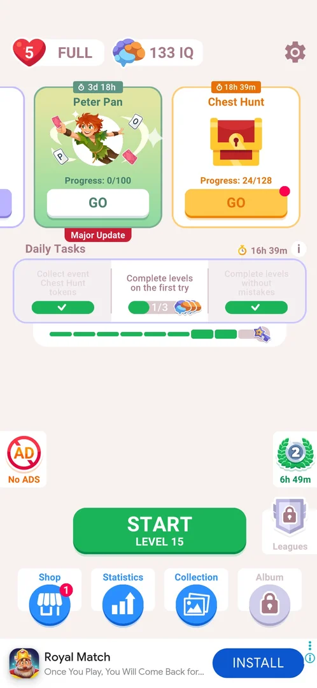
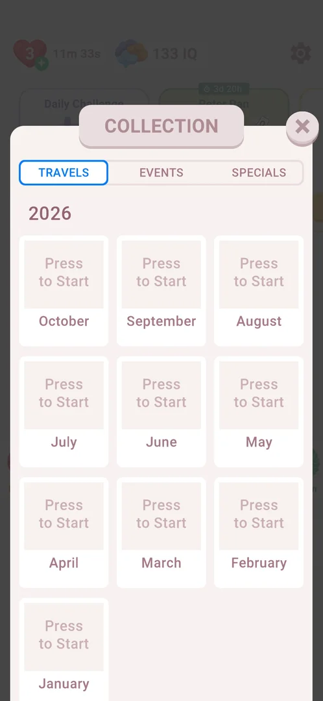

# Routes

From the main screen (positions in the 730x1583 frame unless noted). Skills (candidates):
`open-settings`, `open-collection`, `open-daily-challenge`.

## Main screen
- Settings: gear at the top right (679,120) — skill `open-settings` [s:20261001-071926-chrono-2FYKPJ#2].
  Never tap its ADS toggle: it opens the Google Play payment sheet for Remove ads
  [s:20261001-071926-chrono-2FYKPJ#51].
- No ADS: red crossed "AD" circle on the left edge (about 55,1055). It opens the Google Play payment
  sheet directly — never tap it [s:20261001-071926-chrono-2FYKPJ#27].
- Bottom row, left to right: Shop (114,1390, badge 1) [s:20261001-071926-chrono-2FYKPJ#4], Statistics
  [s:20261001-071926-chrono-2FYKPJ#6], Collection (452,1390) — skill `open-collection`, X top right
  (683,287) closes it [s:20261001-050941-chrono-2FYKPJ#84] [s:20261001-050941-chrono-2FYKPJ#85], Album
  (locked until level 99: "Complete 84 more levels" at level 15) [s:20261001-071926-chrono-2FYKPJ#11].
- Leagues: right side above the bottom row (667,1200), locked until level 50 ("Complete 35 more levels"
  at level 15) [s:20261001-071926-chrono-2FYKPJ#13].
- Event carousel at the top: Daily Challenge card (PLAY at about 190,467) → the month calendar, no
  interstitial seen on this entry — skill `open-daily-challenge`; the calendar's home button (365,1285)
  returns [s:20261001-224924-chrono-2FYKPJ#14] [s:20261001-224924-chrono-2FYKPJ#15]. Peter Pan card (GO at
  about 505,466) → the event book [s:20261001-114433-chrono-2FYKPJ#11]. Swipe the row left to see the
  third card, Chest Hunt [s:20261001-071926-chrono-2FYKPJ#1].
- Daily Tasks panel under the carousel; its (i) opens the rules [s:20261001-071926-chrono-2FYKPJ#14].
- START / CONTINUE LEVEL N: bottom centre (367,1210-1220) [s:20261001-224924-chrono-2FYKPJ#1].
- Quote Race laurel badge on the right (680,1050-1060) while a race runs → race screen; PLAY (365,1482)
  starts the next level [s:20261001-092740-chrono-2FYKPJ#3] [s:20261001-092740-chrono-2FYKPJ#4].

> ⚠️ Previously (v3.6.1, 2026-10-01): "Collection (locked), Album (locked)" and "Daily Challenge: card at
> the top centre, LOCKED at level 9". Daily Challenge and Collection unlock after level 14
> [s:20261001-050941-chrono-2FYKPJ#83].

## Getting into a level past an interstitial
- The skip icon at the top left (45,110), tapped as soon as it shows and before the ad opens the
  Play Store by itself, then Back once, then launch if the screen is blank: the only route that loaded
  level 16 (3 sessions) [s:20261001-092740-chrono-2FYKPJ#8] [s:20261001-114433-chrono-2FYKPJ#17]
  [s:20261001-192245-chrono-2FYKPJ#15] [s:20261001-192245-chrono-2FYKPJ#17].
- If the store is already in front: Back (launch and restart leave the store in front), then
  `sw.py restart` from the end card [s:20261001-192245-chrono-2FYKPJ#8] [s:20261001-190315-chrono-2FYKPJ#12].
- No skill: the ad screens differ every time, so a screen hash cannot match.

## Events
- Quote Race popup on launch while a race runs: GO → "Tap to continue" (first time) → race screen
  [s:20261001-020937-chrono-2FYKPJ#1] [s:20261001-020937-chrono-2FYKPJ#2]. Race screen: home top left,
  (i) top right (671,152), chest on the right (645,445), PLAY at the bottom
  [s:20261001-071926-chrono-2FYKPJ#16] [s:20261001-071926-chrono-2FYKPJ#17]. After the race ends, a
  "Finished" popup with OK on the next launch [s:20261001-190315-chrono-2FYKPJ#1].
- Chest Hunt popup on returning home: GO → Chest Hunt screen; its PLAY starts the next main level
  [s:20261001-050941-chrono-2FYKPJ#48] [s:20261001-050941-chrono-2FYKPJ#50].
- Peter Pan event, first visit: a forced popup and HOW IT WORKS pages; Home and Back do nothing until
  START LEVEL 1 [s:20261001-050941-chrono-2FYKPJ#6]. Chapters 2-5 are locked; BACK TO CURRENT CHAPTER
  returns [s:20261001-114433-chrono-2FYKPJ#13] [s:20261001-114433-chrono-2FYKPJ#14].

## In a level
- Home top left, remove-ads circle and gear top right [s:20261001-020937-chrono-2FYKPJ#8].
- Hint button bottom right of the board; "+20" hint pack (real money) bottom left — do not tap
  [s:20261001-020937-chrono-2FYKPJ#8] [s:20261001-020937-chrono-2FYKPJ#9].
- Shop → 1 Free Hint GET: a free hint with no ad, then a 24 h cooldown [s:20261001-071926-chrono-2FYKPJ#5].
