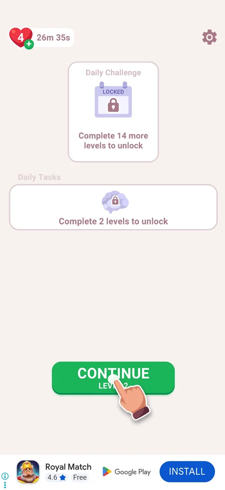

# Banner ad

A passive ad strip across the bottom of the screen, on the home screen and in the level, after the first level is won. It cannot be closed and offers nothing to the player; its creative changes on its own every few tens of seconds [^s1] [^s5].

## Why it appeared

After level 1 was won, the banner appeared at the bottom of the home screen, and then in level 2; level 1 and the home screen before it had none [^s1] [^s4].

## Where to find it

No control opens it: it sits at the very bottom of the home screen and, in a level, under the keyboard [^s2] [^s3]. It stays there while the level's popups are open (the loss popup, hint mode) [^s6] [^s7].

 [^s2]
*In the level: the banner strip under the keyboard, INSTALL and the AdChoices (i) at the right*

## What it looks like

A white full-width strip: the advertised game's icon, its name, then either a tagline or a rating with Free and the Google Play logo, and a blue INSTALL button; a small AdChoices (i) with a three-dot mark sits at the left or the right edge. There is no close cross [^s3] [^s5].

 [^s3]
*On home: the banner at the bottom, INSTALL at the right, the AdChoices (i) at the left*

## How it works

All in 3.6.1:

- Shown always, at the bottom of home and of the level, from the home screen after the level 1 win; not tied to the start or end of a level [^s1] [^s5].
- The creative changes about every 20 to 60 s: Royal Kingdom, Royal Match and Gossip Harbor within 5 minutes of this session; Solitaire was seen in an earlier one [^s5] [^s4].
- No close cross: only the AdChoices (i); the banner cannot be dismissed [^s5].
- Not rewarded: no offer and nothing given for it [^s4].
- No interstitial (full-screen) ad was seen after the level 1 win [^s4], nor before the level 2 win card; the banner stays under the win card [^s8].

## Cases

| Case | What was done | Result | Source |
|---|---|---|---|
| Why it appeared <!-- case:chk-appeared --> | Won level 1, went home, opened level 2 | The banner at the bottom of home, then in the level | [^s1] |
| Where to find it <!-- case:chk-entry --> | Looked at home and at the level | Bottom of home after the level 1 win; under the keyboard in the level from level 2 | [^s1] |
| What it looks like <!-- case:chk-screen --> | Looked at the banner | Full-width strip with an INSTALL button and the AdChoices (i); Royal Match, Gossip Harbor, Solitaire seen | [^s4] |
| Kind <!-- case:chk-kind --> | Watched home and the level | A banner on home and in the level; no interstitial after the level 1 win | [^s4] |
| Reward <!-- case:chk-reward --> | Looked for an offer | Not rewarded: a passive banner, no offer screen | [^s4] |
| Frequency <!-- case:chk-frequency --> | Watched the banner for 5 minutes | Always on; the creative changes about every 20-60 s (Royal Kingdom, Royal Match, Gossip Harbor); not tied to levels | [^s5] |
| Level 2 win <!-- case:win-card-l2 --> | Won level 2 | No interstitial before the win card; the banner (Gossip Harbor) under the win card | [^s8] |
| Close <!-- case:chk-close --> | Looked for a close control | No close cross, only AdChoices (i); it cannot be dismissed | [^s5] |

## Not verified

- What a tap on the banner or on INSTALL does (not tapped)
- Whether the banner can be removed (no remove-ads offer was seen)

[^s1]: session 20261003-234451-chrono-2FYKPJ, step 16 — [video at 3:45](https://youtu.be/WwMBaKGzEUU?t=225)
[^s2]: session 20261005-003245-chrono-2FYKPJ, step 1 — [video at 0:25](https://youtu.be/xwf29tc75Dk?t=25)
[^s3]: session 20261005-003245-chrono-2FYKPJ, step 11 — [video at 4:03](https://youtu.be/xwf29tc75Dk?t=243)
[^s4]: session 20261003-234451-chrono-2FYKPJ, step 18 — [video at 4:19](https://youtu.be/WwMBaKGzEUU?t=259)
[^s5]: session 20261005-003245-chrono-2FYKPJ, step 12 — [video at 4:44](https://youtu.be/xwf29tc75Dk?t=284)
[^s6]: session 20261005-003245-chrono-2FYKPJ, step 4 — [video at 1:04](https://youtu.be/xwf29tc75Dk?t=64)
[^s7]: session 20261005-003245-chrono-2FYKPJ, step 6 — [video at 1:27](https://youtu.be/xwf29tc75Dk?t=87)
[^s8]: session 20261005-143208-chrono-2FYKPJ, step 16 — [video at 3:35](https://youtu.be/-oFCHQRu4HA?t=215)
