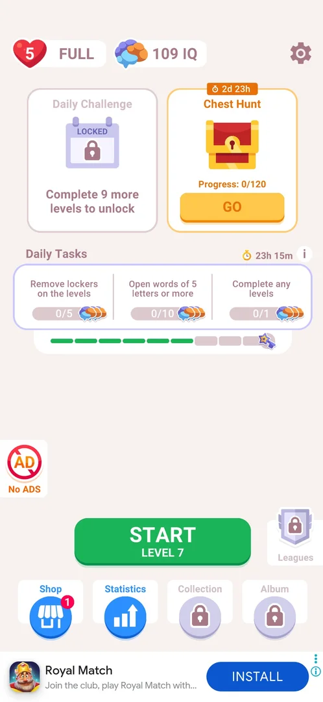
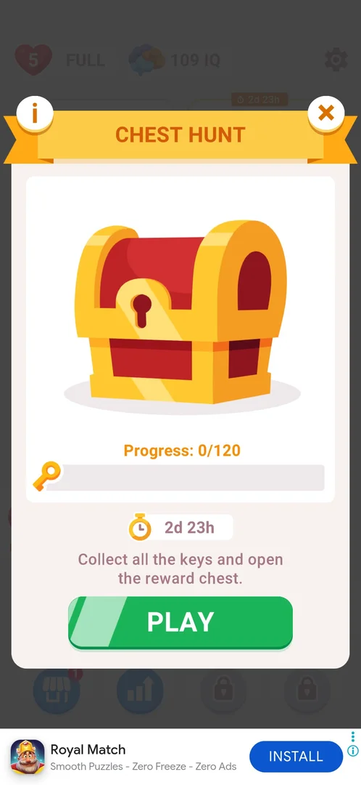
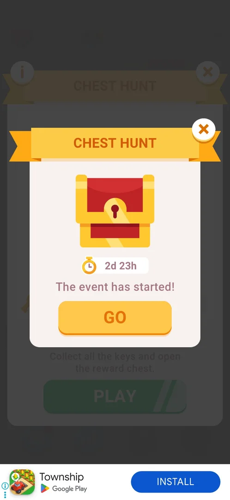
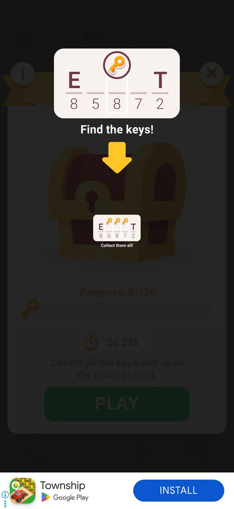
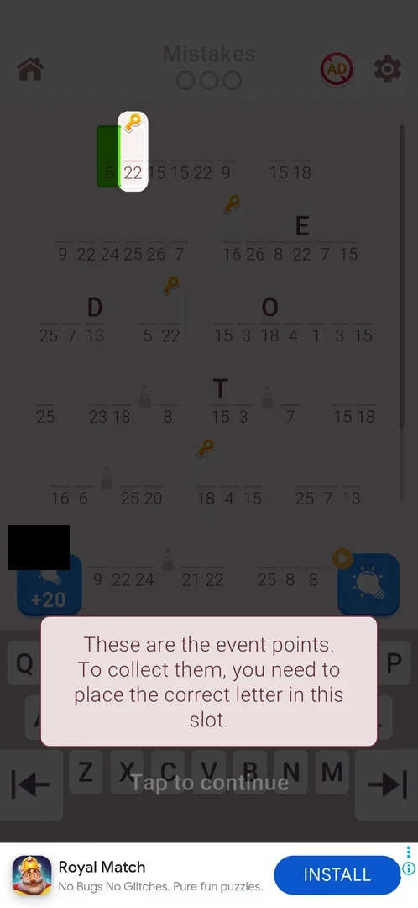
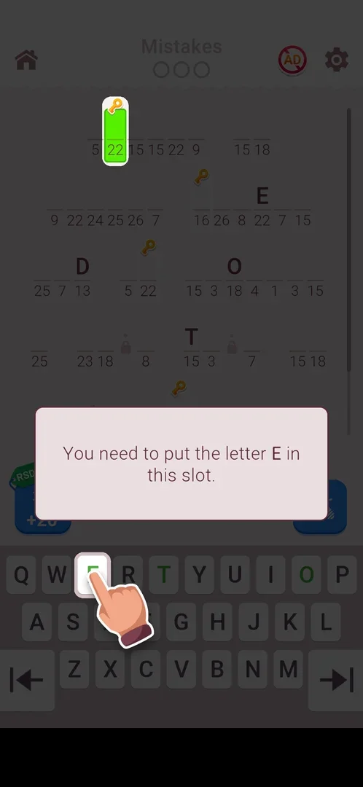
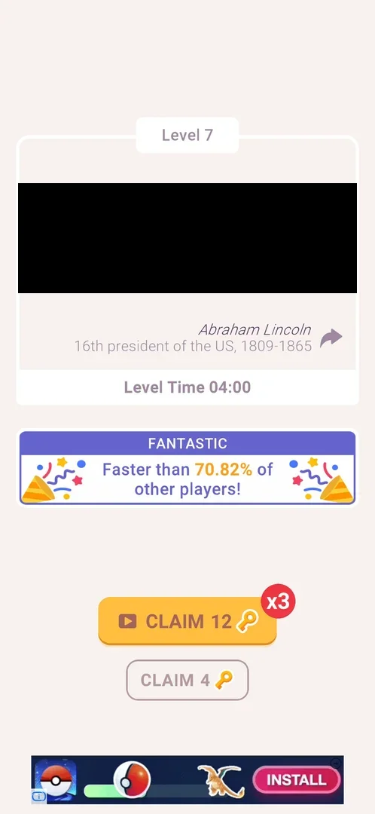

# Chest Hunt event

A timed event: some cells of the regular levels carry a key, and placing the correct letter in such a cell collects it. Keys collected in a level are claimed on its win card, and 120 keys open a reward chest before the timer (2d 23h at the start) runs out [^s1] [^s2] [^s3] [^s4].

## Why it appeared

Level 6 was won and NEXT tapped; an ad that would not close was ended by restarting the game, and on the relaunch home opened with the "CHEST HUNT" popup: "The event has started!" and a 2d 23h timer [^s1]. Hypothesis: the event unlocks after 6 levels won and shows on the next visit to home; not verified (whether the restart played a part is not known).

## Where to find it

Home screen > the Chest Hunt card right of the Daily Challenge card (Daily Challenge, until then alone in the middle, moved left to make room). The card shows the time left in an orange tag, a chest, "Progress: 0/120" and a GO button [^s5]. After keys are collected the GO button carries a red dot [^s6].

 [^s5]
*The Chest Hunt card with its GO button, right of Daily Challenge*

## What it looks like

The event panel (it opened by itself under the start popup): a "CHEST HUNT" ribbon with an "i" button on the left and an X on the right, a large closed chest, "Progress: 0/120" over a bar with a key icon, the timer 2d 23h, the line "Collect all the keys and open the reward chest." and a green PLAY button [^s2].

 [^s2]
*The panel: progress toward 120 keys, the timer, PLAY; "i" top left, X top right*

## What you can do

| Tab or button | What it does |
|---|---|
| [The event has started!](#the-event-has-started) | The start popup: GO, or X to close it |
| [Find the keys!](#find-the-keys) | A one-screen tutorial on the panel |
| [Key slots](#key-slots) | The keys on the level board, with an in-level tutorial |
| [Claim keys](#claim-keys) | The win card's two claim buttons |
| [Progress](#progress) | The count on the home card |

The panel's "i", PLAY and the card's GO were not tapped; the panel's X closes it to home [^s5].

### The event has started!

A popup over the panel: the "CHEST HUNT" ribbon, a chest, the timer 2d 23h, "The event has started!", a yellow GO button and an X at the top right. X closed it [^s1].

 [^s1]
*The popup that announced the event on the first home after level 6*

### Find the keys!

After the popup the panel shows a tutorial: an example word (the letters E and T known, a key icon over a cell between them), "Find the keys!", an arrow down to a small copy of the word on the chest and "Collect them all!". A tap anywhere continues to the panel [^s7].

 [^s7]
*The tutorial: keys sit over cells of the quote; collect them all*

### Key slots

In level 7, the first level after the event started, some cells carried an orange key icon over them (four on the first screen of the board; separately, other cells had small padlocks, the [lockers](lockers.md)). A tutorial dimmed the board and highlighted one key cell: "These are the event points. To collect them, you need to place the correct letter in this slot." with "Tap to continue" [^s3]. Then: "You need to put the letter E in this slot." with a hand on the E key [^s8]. E was typed: the letter went into the cell and the key icon over it was gone [^s9]. No clip: the span from the hand to the typed E is 24.5 s, and the typed-E step alone shows only the result.

On the later levels the key cells were outlined in white with the key tag on their top edge: three on the first screen of level 9, more on levels 10 and 11, on the same boards as the lockers [^s10] [^s11]. After a loss and Restart, the same quote came back with its keys on other cells [^s12].

 [^s3]
*Key icons over cells of the level; the tutorial calls them event points*

 [^s8]
*The second tutorial step: put the letter E in the key slot*

### Claim keys

While the event runs the win card has no NEXT: under the speed banner (or the Quote Race strip, when that race runs) there are two buttons, a yellow "CLAIM" with a video icon and an "x3" badge, and an outlined plain "CLAIM" [^s4] [^s13]. The numbers per level: 12 / 4 on level 7, 15 / 5 on level 8, 9 / 3 on level 9, 15 / 5 on level 10 [^s4] [^s14] [^s13] [^s15]. The free button gives the keys collected in the level (level 9 had three key cells and gave 3); inferred: the video button triples them. The free CLAIM was tapped every time; after it came an interstitial ad (a full-screen playable with no close button on levels 7 and 9) [^s16] [^s17].

 [^s4]
*The win card under the event: CLAIM x3 for a video, or the plain CLAIM (the decoded quote is blacked out)*

### Progress

After the free claim on level 7 the home card read "Progress: 4/120" and a red dot sat on GO [^s18]; after level 8 (free CLAIM 5) it read 9/120 [^s6]; after level 9 (free CLAIM 3) it read 12/120, with 2d 21h left [^s19]. The session's closing note gives 17/120 after level 10's free CLAIM 5 (no frame of the card) [^s12].

 [^s6]
*The card counts the claimed keys: 9 of 120 after two levels*

## How it works

All in 3.6.1:

- Goal: 120 keys open the reward chest [^s2].
- Timer: 2d 23h at the start; 2d 21h on the card the next session, about two hours later [^s1] [^s19].
- Keys: cells of the regular level marked with a key; the correct letter in the cell collects it [^s3].
- Claim on the win card: 3 to 5 keys free, or three times as many for a video (levels 7-10) [^s4] [^s15].
- Pace: 0 → 4 → 9 → 12 → 17 keys over levels 7-10 with free claims; at that rate 120 keys take about 25-30 levels (inferred) [^s12].
- A loss by 3 mistakes shows nothing about the keys; Restart moves the key cells [^s20] [^s12].
- What the chest holds, what the "i" shows, and what happens at the timer's end were not seen.

## Outcomes

| Outcome | Under Chest Hunt | Source |
|---|---|---|
| Win | Differs: NEXT is replaced by CLAIM (free) and CLAIM x3 (video) | [^s4] |
| Loss: 3 mistakes | As the base: heart -1, Home, Restart, REVIVE; no key count or key penalty shown | [^s20] |
| Restart after a loss | An interstitial ad, then the same quote with mistakes reset and the key (and lock) cells on other cells | [^s12] |
| Quit by the home icon | Not seen | |
| Close the app mid-level | Not seen | |

 [^s20]
*A loss during the event: the base popup; the keys are not mentioned*

## Cases

| Case | What was done | Result | Source |
|---|---|---|---|
| Why it appeared <!-- case:chk-appeared --> | Won level 6, restarted the game past an ad, came back to home | "The event has started!" popup with 2d 23h and GO | [^s1] |
| Where to find it <!-- case:chk-entry --> | Closed the panel with X | The Chest Hunt card right of Daily Challenge on home: timer, Progress: 0/120, GO (GO not tapped) | [^s5] |
| What it looks like <!-- case:chk-screen --> | Closed the start popup and the tutorial | The panel: chest, Progress: 0/120, key bar, 2d 23h, PLAY, i, X | [^s2] |
| Rules <!-- case:chk-rules --> | Read the panel and the in-level tutorial | Keys over cells are collected by placing the correct letter; 120 keys open the chest | [^s8] |
| Its timer and schedule <!-- case:chk-timer --> | Read the popup and the card | 2d 23h at the start; when it comes back not seen | [^s1] |
| What shows during a level <!-- case:chk-in-level --> | Played level 7 | Key icons over some cells; a two-step tutorial on the first event level | [^s8] |
| Progress per level <!-- case:chk-progress --> | Won levels 7, 8 and 9 with the free claim | CLAIM 4, 5, then 3 (level 9 had three key cells): the card went 0 → 4 → 9 → 12 of 120 | [^s19] |
| Win card under Chest Hunt event <!-- case:under-win --> | Won levels 7 and 8 | NEXT is replaced by CLAIM N (free) and CLAIM 3N (video, x3) | [^s14] |
| Claim keys on the win card <!-- case:win-claim --> | Won levels 7 and 8, tapped the free CLAIM | CLAIM 4 or CLAIM 12 (video, x3) on level 7, CLAIM 5 or 15 on level 8; the free claims took the card to 9/120 and put a red dot on GO | [^s6] |
| Lose by 3 mistakes under Chest Hunt event <!-- case:under-loss-3-mistakes --> | Typed three wrong letters on level 11 | As the base: heart -1, Home, Restart, REVIVE; nothing about the keys | [^s20] |
| Restart from the loss popup under Chest Hunt event <!-- case:under-restart --> | Tapped Restart | An interstitial, then the same quote, mistakes reset, the key and lock cells moved to other cells | [^s12] |
| The rewards <!-- case:chk-rewards --> | — | not verified: the chest's contents not seen | |
| The end <!-- case:chk-end --> | — | not verified | |
| Home icon in level under Chest Hunt event <!-- case:under-quit --> | — | not verified | |
| Force-stop mid-level under Chest Hunt event <!-- case:under-exit-app --> | — | not verified | |

## Not verified

- Where to find it: what GO on the home card and PLAY on the panel open
- What it looks like: the "i" (rules) screen
- Rules: whether a key is lost when its cell gets a wrong letter or a hint
- Its timer and schedule: what happens at 0 and when the event comes back
- What shows during a level: whether a key counter shows in the HUD (none seen on levels 7-11)
- Progress per level: whether the video claim really triples, and whether keys typed before a loss are kept
- The rewards per rank or milestone: what the chest holds <!-- case:chk-rewards -->
- The end: the results screen and the reward paid at the timer's end <!-- case:chk-end -->
- Win card under Chest Hunt event: the video CLAIM
- Home icon in level under Chest Hunt event: whether collected keys are kept <!-- case:under-quit -->
- Force-stop mid-level under Chest Hunt event <!-- case:under-exit-app -->

[^s1]: session 20261006-003220-chrono-2FYKPJ, step 33 — [video at 11:25](https://youtu.be/W0PeVNo113E?t=685)
[^s2]: session 20261006-003220-chrono-2FYKPJ, step 35 — [video at 12:08](https://youtu.be/W0PeVNo113E?t=728)
[^s3]: session 20261006-003220-chrono-2FYKPJ, step 44 — [video at 14:50](https://youtu.be/W0PeVNo113E?t=890)
[^s4]: session 20261006-003220-chrono-2FYKPJ, step 57 — [video at 18:46](https://youtu.be/W0PeVNo113E?t=1126)
[^s5]: session 20261006-003220-chrono-2FYKPJ, step 36 — [video at 12:18](https://youtu.be/W0PeVNo113E?t=738)
[^s6]: session 20261006-003220-chrono-2FYKPJ, step 72 — [video at 24:16](https://youtu.be/W0PeVNo113E?t=1456)
[^s7]: session 20261006-003220-chrono-2FYKPJ, step 34 — [video at 11:59](https://youtu.be/W0PeVNo113E?t=719)
[^s8]: session 20261006-003220-chrono-2FYKPJ, step 46 — [video at 15:29](https://youtu.be/W0PeVNo113E?t=929)
[^s9]: session 20261006-003220-chrono-2FYKPJ, step 47 — [video at 15:44](https://youtu.be/W0PeVNo113E?t=944)
[^s10]: session 20261006-024420-chrono-2FYKPJ, step 7 — [video at 4:03](https://youtu.be/ZmbMZC7iP0E?t=243)
[^s11]: session 20261006-024420-chrono-2FYKPJ, step 34 — [video at 16:11](https://youtu.be/ZmbMZC7iP0E?t=971)
[^s12]: session 20261006-024420-chrono-2FYKPJ, step 39 — [video at 17:52](https://youtu.be/ZmbMZC7iP0E?t=1072)
[^s13]: session 20261006-024420-chrono-2FYKPJ, step 17 — [video at 8:04](https://youtu.be/ZmbMZC7iP0E?t=484)
[^s14]: session 20261006-003220-chrono-2FYKPJ, step 70 — [video at 22:31](https://youtu.be/W0PeVNo113E?t=1351)
[^s15]: session 20261006-024420-chrono-2FYKPJ, step 28 — [video at 13:43](https://youtu.be/ZmbMZC7iP0E?t=823)
[^s16]: session 20261006-003220-chrono-2FYKPJ, step 58 — [video at 19:02](https://youtu.be/W0PeVNo113E?t=1142)
[^s17]: session 20261006-024420-chrono-2FYKPJ, step 19 — [video at 8:59](https://youtu.be/ZmbMZC7iP0E?t=539)
[^s18]: session 20261006-003220-chrono-2FYKPJ, step 60 — [video at 20:16](https://youtu.be/W0PeVNo113E?t=1216)
[^s19]: session 20261006-024420-chrono-2FYKPJ, step 20 — [video at 9:46](https://youtu.be/ZmbMZC7iP0E?t=586)
[^s20]: session 20261006-024420-chrono-2FYKPJ, step 35 — [video at 16:34](https://youtu.be/ZmbMZC7iP0E?t=994)
