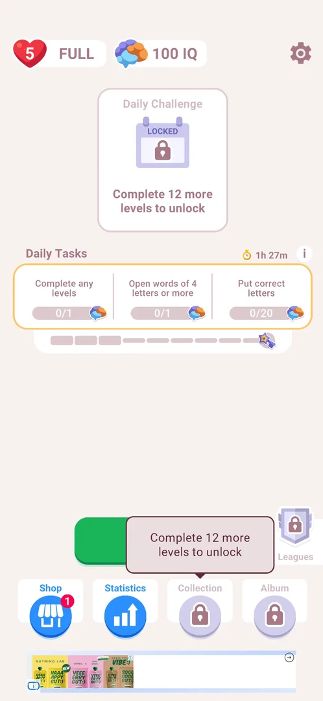

# Collection

A button in the home screen's bottom bar named Collection, shown with a lock. In 3.6.1 it opens after 15 completed levels, the same threshold as the Daily Challenge; the session had 3, so what it collects was not seen [^s1].

## Why it appeared

The locked Collection button appeared in the new bottom bar of home after the third level was won [^s1].

## Where to find it

Home screen > the bottom bar, the third button, Collection (a grey circle with a lock). While locked, a tap shows a tooltip above it: "Complete 12 more levels to unlock" (3 levels won, so it opens at 15) [^s1].

 [^s1]
*The locked Collection button, third in the bottom bar, and its tooltip*

## What it looks like

<!-- no-screen: locked until 15 completed levels; the session had 3 -->

Not seen: the button is locked.

## How it works

- Unlock: 15 completed levels (3.6.1), the same as the Daily Challenge card ("Complete 12 more levels to unlock" on both at 3 levels) [^s1].

## Cases

| Case | What was done | Result | Source |
|---|---|---|---|
| Why it appeared <!-- case:chk-appeared --> | Won level 3, NEXT | The locked Collection button is in the home bottom bar | [^s1] |
| Where to find it <!-- case:chk-entry --> | — | not verified (seen locked only) |  |
| What it looks like <!-- case:chk-screen --> | — | not verified |  |
| The progress <!-- case:chk-progress --> | — | not verified |  |
| The items <!-- case:chk-items --> | — | not verified |  |
| How an item is earned <!-- case:chk-earn --> | — | not verified |  |
| Using an item <!-- case:chk-use --> | — | not verified |  |
| Completing a set <!-- case:chk-complete --> | — | not verified |  |

## Not verified

All wait for the unlock at 15 completed levels.

- Where to find it: the button was seen locked; what it opens <!-- case:chk-entry -->
- What it looks like: its screen <!-- case:chk-screen -->
- The progress: what fills it and where it is now <!-- case:chk-progress -->
- The items: every set or item, owned and locked <!-- case:chk-items -->
- How an item is earned <!-- case:chk-earn -->
- Using an item: what changes <!-- case:chk-use -->
- Completing a set: the reward <!-- case:chk-complete -->

[^s1]: session 20261005-221933-chrono-2FYKPJ, step 37 — [video at 12:18](https://youtu.be/I7zPQ2z7rvA?t=738)
