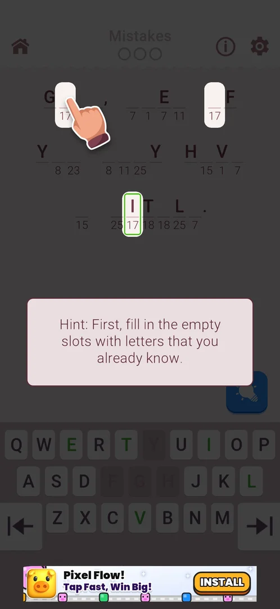
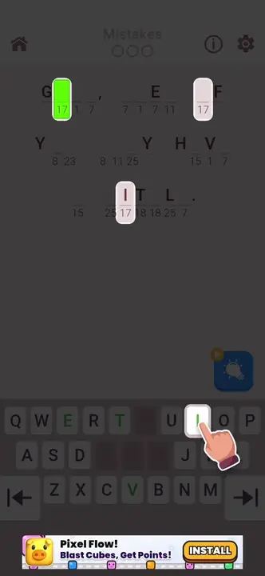
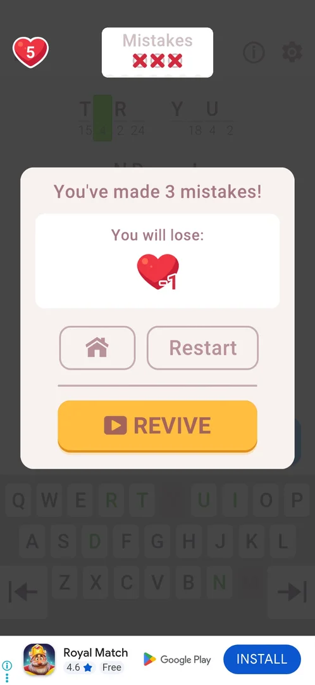
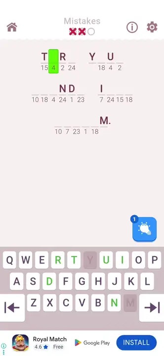
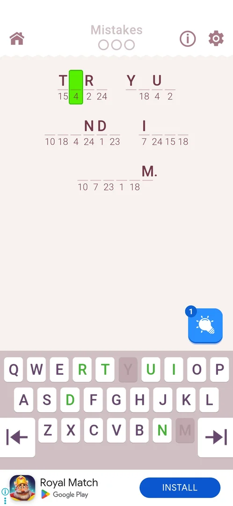
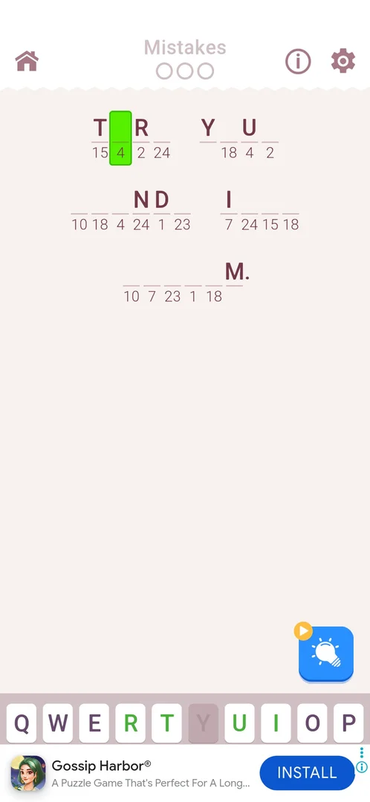

# Cryptogram level

The game's core level: a short quote in which some letters are shown and the rest are blank cells with a number under each; every number stands for one letter. The player picks a cell and types its letter on the in-game keyboard; the level is won when the quote is complete, and from level 2 three wrong letters lose it and cost a life [^s4] [^s6] [^s10]. Level 1 is a guided tutorial [^s4].

## Why it appeared

On the first launch the home screen shows START LEVEL 1 with an animated tutorial hand pointing at it [^s1].

## Where to find it

Home screen > the green START LEVEL N button at the bottom; the button carries the number of the next level [^s2]. After leaving a level unfinished (by the home icon, or by closing the app) the same button reads CONTINUE LEVEL N [^s7] [^s13].

 [^s2]
*The green START LEVEL 1 button at the bottom of the home screen*

On a fresh install an animated hand repeatedly taps the button:

 [^s2]
*Clip 4.1 s · [original on YouTube from 2:08](https://youtu.be/D5rsIC9WNT8?t=128)*

## What it looks like

 [^s3]
*Level 2: home icon, Mistakes counter, info (i) and gear on top; the coded quote; the hint bulb (1) bottom right; the keyboard; a banner ad at the bottom*

Top to bottom (level 2, 3.6.1) [^s3]:

- the home icon at the top left, the Mistakes counter (three empty circles) at the top centre, the info (i) icon and the gear at the top right;
- the quote in lines of cells: letters already given are shown, the rest are blank cells with a number under them; the chosen cell is filled bright green;
- a blue hint bulb button with a count badge (1) at the bottom right of the board (see [Hints (bulb)](hints.md));
- the keyboard: QWERTY letter keys, some green, some greyed, and two arrow keys at the left and right edges of the bottom row;
- a banner ad at the very bottom (see [Banner ad](banner-ad.md)).

Level 1 differs: it has no Mistakes counter, no hint bulb and no banner ad; the keyboard rises only once a cell is chosen [^s4] [^s5].

## What you can do

| Tab or button | What it does |
|---|---|
| [Level 1 tutorial](#level-1-tutorial) | Guided cards on level 1: the cipher, choosing a cell, typing a letter, green keys |
| [Level 3 tutorial](#level-3-tutorial) | A guided card on level 3: fill in the cells of a number whose letter is already known |
| [Keyboard](#keyboard) | Types a letter into the chosen cell |
| [Mistakes](#mistakes) | Counts wrong letters; 3 lose the level |
| [Loss popup](#loss-popup) | After 3 mistakes: Home, Restart, REVIVE (video); a life is lost |
| [Restart](#restart) | In the loss popup: the same board again, mistakes reset |
| [Home icon](#home-icon) | Leaves the level for home at once, without cost |

The info (i) icon and the gear in the level were not tapped. The hint bulb has its own page: [Hints (bulb)](hints.md).

### Level 1 tutorial

Level 1 opens dimmed under a card: a digit refers to a letter, with the example that 19 is E, and "Tap to continue" [^s4]. Then the cards say, in order: tap to choose a cell (a hand points at a blank cell coded 19), choose a letter (the hand on the E key), and, after E is typed, that a green letter on the keyboard means more instances of that letter remain in the phrase [^s4] [^s5]. After the tutorial the level is solved freely.

 [^s4]
*Level 1: the first tutorial card and "Tap to continue"*

<!-- no-clip: the recording of session 20261003-234451 is broken after 1:12 (segments without an index), so the animated tutorial hand on the keyboard could not be cut -->

### Level 3 tutorial

Level 3 opens dimmed under a second tutorial: a card saying, in short, to first fill in the empty cells whose letters are already known, and a hand on two blank cells coded 17, a number whose letter (I) is already shown elsewhere in the quote [^s14]. The hand then points at the I key, and after I is typed, at the second blank 17 [^s15]. The tutorial plays again when the level is reopened after the app was force-stopped [^s16].

 [^s14]
*Level 3: the tutorial card and the hand on a blank cell of a number whose letter is known*

 [^s15]
*Clip 3.9 s · [original on YouTube from 4:29](https://youtu.be/I7zPQ2z7rvA?t=269)*

### Keyboard

Choosing a blank cell fills it green and raises the keyboard. A letter key turns green when that letter is in the quote and more of its cells remain; it is greyed when, as inferred from the frames, every instance of the letter is already in place (level 1: W, R, T, S, F, H, V and others greyed). The arrow keys at both edges of the bottom row were not tried [^s5] [^s3].

 [^s5]
*The keyboard after a cell is chosen; the tutorial hand points at E*

### Mistakes

From level 2 the Mistakes counter, three empty circles, sits at the top centre. Level 2 opens with a card that says it is a mistake counter and that three mistakes with wrong letters lose the level [^s6]. Each wrong letter turns one circle into a red cross, and the chosen cell stays empty (the clip under [Loss popup](#loss-popup) starts with two crosses and the cell still blank) [^s10].

 [^s6]
*Level 2: the Mistakes counter (top centre) and its tutorial card*

### Loss popup

The third wrong letter fills the last circle with a cross and a popup opens over the dimmed board: "You've made 3 mistakes!", a box "You will lose:" with a heart marked -1, two outlined buttons, Home (a house icon) and Restart, and below a divider a yellow REVIVE button with a video icon. While the popup is up, the home icon at the top left of the level is replaced by a heart with the lives count (5) [^s10]. REVIVE was not tapped.

 [^s10]
*The loss popup: Home and Restart side by side, REVIVE (video) below; the heart with 5 at the top left*

 [^s10]
*Clip 6 s · [original on YouTube from 0:58](https://youtu.be/xwf29tc75Dk?t=58)*

### Restart

Restart in the loss popup reopens level 2 at once: no confirmation and no ad; the same quote with the same cells given, the Mistakes counter back to three empty circles, and the hint bulb still at 1 (it had not been used) [^s11]. No restart control was seen on the level's HUD; Restart was seen only in the loss popup [^s12].

 [^s11]
*After Restart: the same board, Mistakes reset, hint bulb still 1*

### Home icon

The home icon at the top left leaves the level at once: no confirmation, the lives stay at 5 FULL, and the home button changes from START LEVEL 2 to CONTINUE LEVEL 2 [^s7].

 [^s7]
*Home after the home icon in level 2: CONTINUE LEVEL 2, lives unchanged*

## How it works

All in 3.6.1:

- Each number stands for one letter throughout the quote; given letters are shown from the start (level 1 opened with most letters given, two numbers to find: 19 and 17) [^s4].
- Mistakes: three wrong letters lose the level, from level 2; level 1 has no counter [^s6] [^s4] [^s10].
- A loss costs one life: the popup announces a heart -1, and home later showed 4 lives (from 5) with a refill timer at 26m 35s [^s10] [^s13]. According to the session's case, Home and Restart in the popup both take the life; REVIVE was not tried [^s12].
- Hints: a hint bulb with a count of 1 at the start of level 2; one hint reveals one chosen cell (see [Hints (bulb)](hints.md)) [^s3].
- Level 1 was won in 1:30 by the level's own timer (113 s of session time) [^s8].
- Level Time on the win card counts across a force-stop: level 3, reopened from the start after the app was force-stopped, was won with Level Time 02:41, which includes the time before the restart (the solve after it took about 2:08) [^s16].
- Tutorials: level 1 explains the cipher and the keyboard, level 2 the Mistakes counter, level 3 filling in known letters; a tutorial replays when its level is reopened after a force-stop [^s4] [^s6] [^s16].
- Win card: the level number, the decoded quote with its author and the author's description, a share arrow, Level Time, and NEXT, which goes to the home screen with the next level on its button [^s8] [^s9].
- Closing the app mid-level does not keep the progress: CONTINUE LEVEL N reopens the same quote from the start, with a revealed hint letter gone and the spent hint not returned [^s12].
- Banner ads: none in level 1; a banner at the bottom of the level from level 2 [^s4] [^s3].
- From level 5 the info (i) button at the top right of the HUD is replaced by a red crossed-out AD button (a No ADS offer); level 4 still had the (i) [^s17] [^s18].
- The win card can carry one banner under Level Time: none on level 4, "CONGRATULATIONS! A New Best Time!" on level 5, "FANTASTIC / Faster than 70.82% of other players!" on level 7, and the [win streak](win-streak.md) banner on levels 6 and 8 [^s19] [^s20] [^s21] [^s22].

## Outcomes

| Outcome | What happens | Source |
|---|---|---|
| Win <!-- case:chk-win --> | The win card (below); NEXT returns to home with START LEVEL 2 | [^s8] |
| Loss: 3 mistakes <!-- case:loss-3-mistakes --> <!-- case:chk-loss --> | The loss popup: heart -1, Home, Restart, REVIVE (video); home then shows one life fewer and a refill timer | [^s10] [^s13] |
| Restart after a loss <!-- case:chk-restart --> | The same board, mistakes reset, no ad, no confirmation | [^s11] |
| Quit <!-- case:chk-quit --> | Home icon: straight to home, no confirmation, no life lost, CONTINUE LEVEL N | [^s7] |
| Close the app mid-level <!-- case:chk-exit-app --> | CONTINUE LEVEL N reopens the quote from the start; revealed letters lost, hint not refunded, no life lost | [^s12] |

 [^s8]
*Win card, level 1: the quote (blacked out), author, share arrow, Level Time 01:30, NEXT*

 [^s12]
*After closing the app: level 2 from the start; the bulb shows the video icon, so the used hint was not returned*

## Cases

| Case | What was done | Result | Source |
|---|---|---|---|
| Why it appeared <!-- case:chk-appeared --> | First launch of a fresh install | START LEVEL 1 on home with a tutorial hand | [^s1] |
| Where to find it <!-- case:chk-entry --> | Tapped START LEVEL 1, later START LEVEL 2 | The level opens | [^s2] |
| What it looks like <!-- case:chk-screen --> | Played level 1, opened level 2 | Home, info, gear, Mistakes counter, coded cells, hint bulb, keyboard, banner ad | [^s3] |
| Rules <!-- case:chk-rules --> | Followed the level 1 tutorial, read the level 2 card | Numbers code letters; green keys mean more to fill; 3 mistakes lose | [^s4] |
| The level screen and its HUD <!-- case:chk-hud --> | Looked at level 2 | Home icon, info (i), gear, Mistakes (3 circles, from level 2), hint bulb with count, keyboard with edge arrows, banner ad | [^s3] |
| Win <!-- case:chk-win --> | Solved level 1 | Win card with quote, author, share, Level Time; NEXT to home with level 2 | [^s8] |
| Quit <!-- case:chk-quit --> | Home icon in level 2 | No confirmation, no life lost, START becomes CONTINUE | [^s7] |
| Lose by 3 mistakes <!-- case:loss-3-mistakes --> | Typed Q into the same cell three times on level 2 | Popup "You've made 3 mistakes!", heart -1, Home / Restart / REVIVE | [^s10] |
| Each loss <!-- case:chk-loss --> | Lost level 2 by 3 mistakes | The life is spent: home later showed 4 lives (from 5) and a 26m 35s refill timer | [^s13] |
| After a loss: retry and continue offers <!-- case:chk-retry --> | Read the loss popup, tapped Restart | Home and Restart (both cost the life), REVIVE with a video icon (not tapped); Restart gives the same board, 0 mistakes, no ad | [^s11] [^s12] |
| Restart <!-- case:chk-restart --> | Restart in the loss popup; looked for a restart control on the HUD | Restart exists only in the loss popup; no confirmation, no ad, same board, mistakes reset | [^s11] |
| Exit the app mid-level <!-- case:chk-exit-app --> | Used a hint, then the app was force-stopped and reopened; CONTINUE LEVEL 2 | The quote from the start: revealed letter lost, hint not refunded, no life lost | [^s12] |
| Level 3 tutorial <!-- case:tutorial-level-3 --> | Opened level 3; force-stopped mid-level, CONTINUE; won | A tutorial card on filling in known letters with a hand on two cells of a known number; it replays after the force-stop; the win card's Level Time (02:41) kept the time from before the restart | [^s16] |
| Win card banner <!-- case:win-speed-banner --> | Won levels 4-8 | One banner under Level Time that varies: FANTASTIC / Faster than 70.82% of other players! on level 7, the win-streak banner on levels 6 and 8 | [^s21] |
| No ADS button on the HUD <!-- case:hud-no-ads --> | Played levels 4 and 5 | From level 5 the (i) at the top right is replaced by a red crossed-out AD button; level 4 still had the (i) | [^s18] |
| Level elements <!-- case:chk-elements --> | — | not verified |  |

## Not verified

- Level elements: levels 7 and 8 showed small padlocks over some cells (the "lockers" of Daily Tasks) and, during the [Chest Hunt](chest-hunt.md) event, keys over cells; the padlocks were not studied <!-- case:chk-elements -->
- The red AD button on the HUD was not tapped
- REVIVE in the loss popup: what the video gives (the mistakes back?) was not tried
- The info (i) icon and the gear in the level, and the keyboard's arrow keys, were not tapped

[^s1]: session 20261003-201504-chrono-2FYKPJ, step 1 — [video at 0:12](https://youtu.be/D5rsIC9WNT8?t=12)
[^s2]: session 20261003-201504-chrono-2FYKPJ, step 8 — [video at 2:11](https://youtu.be/D5rsIC9WNT8?t=131)
[^s3]: session 20261003-234451-chrono-2FYKPJ, step 18 — [video at 4:19](https://youtu.be/WwMBaKGzEUU?t=259)
[^s4]: session 20261003-234451-chrono-2FYKPJ, step 8 — [video at 2:05](https://youtu.be/WwMBaKGzEUU?t=125)
[^s5]: session 20261003-234451-chrono-2FYKPJ, step 10 — [video at 2:31](https://youtu.be/WwMBaKGzEUU?t=151)
[^s6]: session 20261003-234451-chrono-2FYKPJ, step 17 — [video at 4:04](https://youtu.be/WwMBaKGzEUU?t=244)
[^s7]: session 20261003-234451-chrono-2FYKPJ, step 19 — [video at 4:32](https://youtu.be/WwMBaKGzEUU?t=272)
[^s8]: session 20261003-234451-chrono-2FYKPJ, step 15 — [video at 3:34](https://youtu.be/WwMBaKGzEUU?t=214)
[^s9]: session 20261003-234451-chrono-2FYKPJ, step 16 — [video at 3:48](https://youtu.be/WwMBaKGzEUU?t=228)
[^s10]: session 20261005-003245-chrono-2FYKPJ, step 4 — [video at 1:04](https://youtu.be/xwf29tc75Dk?t=64)
[^s11]: session 20261005-003245-chrono-2FYKPJ, step 5 — [video at 1:16](https://youtu.be/xwf29tc75Dk?t=76)
[^s12]: session 20261005-003245-chrono-2FYKPJ, step 12 — [video at 4:44](https://youtu.be/xwf29tc75Dk?t=284)
[^s13]: session 20261005-003245-chrono-2FYKPJ, step 11 — [video at 4:03](https://youtu.be/xwf29tc75Dk?t=243)

[^s14]: session 20261005-221933-chrono-2FYKPJ, step 19 — [video at 4:00](https://youtu.be/I7zPQ2z7rvA?t=240)
[^s15]: session 20261005-221933-chrono-2FYKPJ, step 21 — [video at 4:32](https://youtu.be/I7zPQ2z7rvA?t=272)
[^s16]: session 20261005-221933-chrono-2FYKPJ, step 31 — [video at 10:10](https://youtu.be/I7zPQ2z7rvA?t=610)

[^s17]: session 20261006-003220-chrono-2FYKPJ, step 2 — [video at 1:23](https://youtu.be/W0PeVNo113E?t=83)
[^s18]: session 20261006-003220-chrono-2FYKPJ, step 13 — [video at 4:38](https://youtu.be/W0PeVNo113E?t=278)
[^s19]: session 20261006-003220-chrono-2FYKPJ, step 6 — [video at 1:50](https://youtu.be/W0PeVNo113E?t=110)
[^s20]: session 20261006-003220-chrono-2FYKPJ, step 17 — [video at 5:18](https://youtu.be/W0PeVNo113E?t=318)
[^s21]: session 20261006-003220-chrono-2FYKPJ, step 57 — [video at 18:07](https://youtu.be/W0PeVNo113E?t=1087)
[^s22]: session 20261006-003220-chrono-2FYKPJ, step 70 — [video at 21:46](https://youtu.be/W0PeVNo113E?t=1306)
