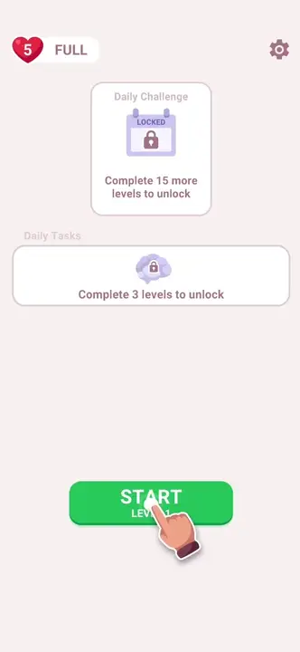
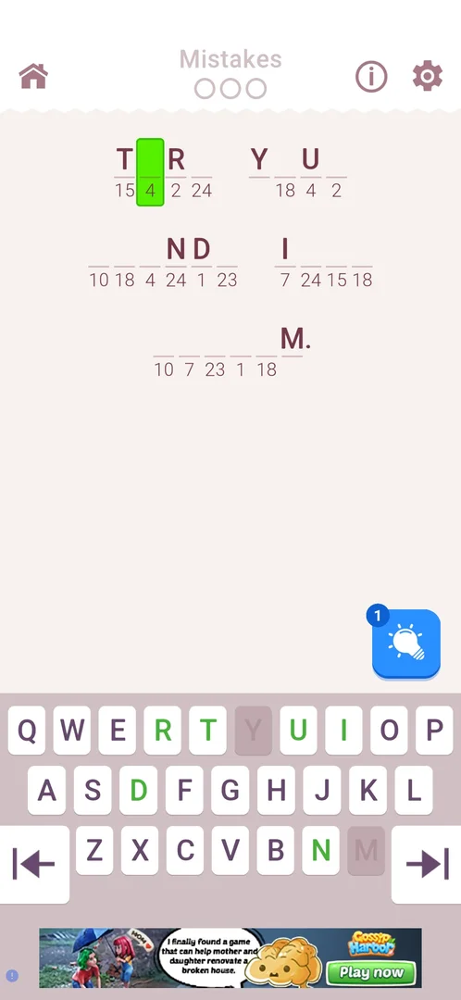
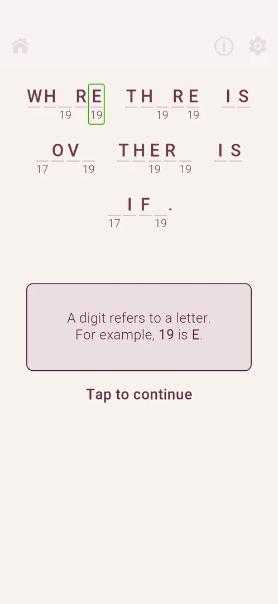
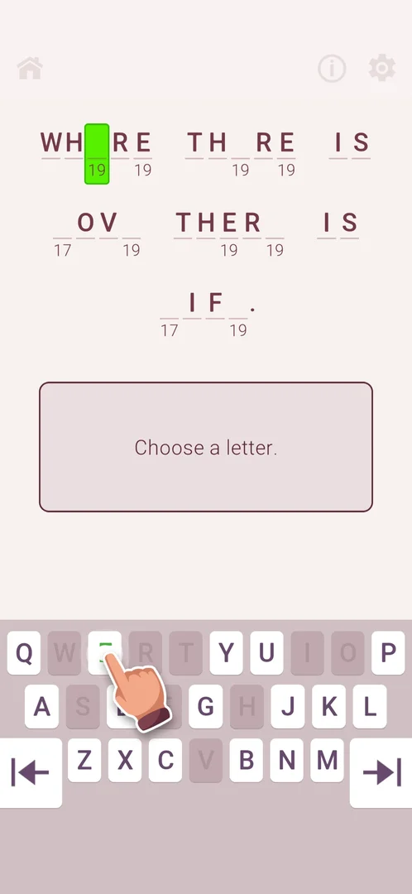
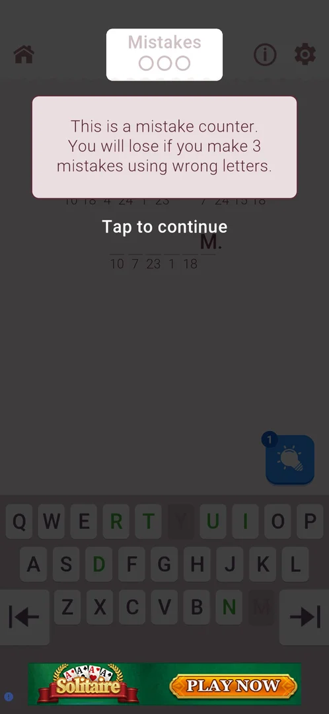
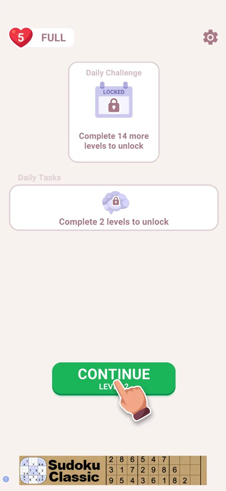
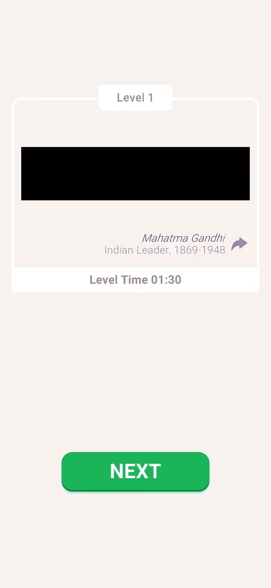

# Cryptogram level

The game's core level: a short quote in which some letters are shown and the rest are blank cells with a number under each; every number stands for one letter. The player picks a cell and types its letter on the in-game keyboard; the level is won when the quote is complete, and from level 2 three wrong letters lose it [^s4] [^s6]. Level 1 is a guided tutorial [^s4].

## Why it appeared

On the first launch the home screen shows START LEVEL 1 with an animated tutorial hand pointing at it [^s1].

## Where to find it

Home screen > the green START LEVEL N button at the bottom; the button carries the number of the next level [^s2]. After leaving a level unfinished the same button reads CONTINUE LEVEL N [^s7].

 [^s2]
*The green START LEVEL 1 button at the bottom of the home screen*

On a fresh install an animated hand repeatedly taps the button:

 [^s2]
*Clip 4.1 s · [original on YouTube from 2:08](https://youtu.be/D5rsIC9WNT8?t=128)*

## What it looks like

 [^s3]
*Level 2: home icon, Mistakes counter, info (i) and gear on top; the coded quote; the hint bulb (1) bottom right; the keyboard; a banner ad at the bottom*

Top to bottom (level 2, 3.6.1) [^s3]:

- the home icon at the top left, the Mistakes counter (three empty circles) at the top centre, the info (i) icon and the gear at the top right;
- the quote in lines of cells: letters already given are shown, the rest are blank cells with a number under them; the chosen cell is filled bright green;
- a blue hint bulb button with a count badge (1) at the bottom right of the board;
- the keyboard: QWERTY letter keys, some green, some greyed, and two arrow keys at the left and right edges of the bottom row;
- a banner ad at the very bottom.

Level 1 differs: it has no Mistakes counter, no hint bulb and no banner ad; the keyboard rises only once a cell is chosen [^s4] [^s5].

## What you can do

| Tab or button | What it does |
|---|---|
| [Level 1 tutorial](#level-1-tutorial) | Guided cards on level 1: the cipher, choosing a cell, typing a letter, green keys |
| [Keyboard](#keyboard) | Types a letter into the chosen cell |
| [Mistakes](#mistakes) | Counts wrong letters; 3 lose the level |
| [Home icon](#home-icon) | Leaves the level for home at once, without cost |

The info (i) icon, the gear and the hint bulb were not tapped in this session.

### Level 1 tutorial

Level 1 opens dimmed under a card: a digit refers to a letter, with the example that 19 is E, and "Tap to continue" [^s4]. Then the cards say, in order: tap to choose a cell (a hand points at a blank cell coded 19), choose a letter (the hand on the E key), and, after E is typed, that a green letter on the keyboard means more instances of that letter remain in the phrase [^s4] [^s5]. After the tutorial the level is solved freely.

 [^s4]
*Level 1: the first tutorial card and "Tap to continue"*

<!-- no-clip: the recording of this session is broken after 1:12 (segments without an index), so the animated tutorial hand on the keyboard could not be cut -->

### Keyboard

Choosing a blank cell fills it green and raises the keyboard. A letter key turns green when that letter is in the quote and more of its cells remain; it is greyed when, as inferred from the frames, every instance of the letter is already in place (level 1: W, R, T, S, F, H, V and others greyed). The arrow keys at both edges of the bottom row were not tried [^s5] [^s3].

 [^s5]
*The keyboard after a cell is chosen; the tutorial hand points at E*

### Mistakes

From level 2 the Mistakes counter, three empty circles, sits at the top centre. Level 2 opens with a card that says it is a mistake counter and that three mistakes with wrong letters lose the level [^s6].

 [^s6]
*Level 2: the Mistakes counter (top centre) and its tutorial card*

### Home icon

The home icon at the top left leaves the level at once: no confirmation, the lives stay at 5 FULL, and the home button changes from START LEVEL 2 to CONTINUE LEVEL 2 [^s7].

 [^s7]
*Home after the home icon in level 2: CONTINUE LEVEL 2, lives unchanged*

## How it works

All in 3.6.1:

- Each number stands for one letter throughout the quote; given letters are shown from the start (level 1 opened with most letters given, two numbers to find: 19 and 17) [^s4].
- Mistakes: three wrong letters lose the level, from level 2; level 1 has no counter [^s6] [^s4].
- Hints: a hint bulb with a count of 1 at the start of level 2; what it reveals and how more are got was not seen [^s3].
- Level 1 was won in 1:30 by the level's own timer (113 s of session time) [^s8].
- Win card: the level number, the decoded quote with its author and the author's description, a share arrow, Level Time, and NEXT, which goes to the home screen with the next level on its button [^s8] [^s9].
- Banner ads: none in level 1; a banner at the bottom of the level from level 2 [^s4] [^s3].

## Outcomes

| Outcome | What happens | Source |
|---|---|---|
| Win <!-- case:chk-win --> | The win card (below); NEXT returns to home with START LEVEL 2 | [^s8] |
| Quit <!-- case:chk-quit --> | Home icon: straight to home, no confirmation, no life lost, CONTINUE LEVEL N | [^s7] |
| Loss <!-- case:chk-loss --> | Not seen: three mistakes lose the level (as the level 2 card says); what it costs is not known | [^s6] |

 [^s8]
*Win card, level 1: the quote (blacked out), author, share arrow, Level Time 01:30, NEXT*

## Cases

| Case | What was done | Result | Source |
|---|---|---|---|
| Why it appeared <!-- case:chk-appeared --> | First launch of a fresh install | START LEVEL 1 on home with a tutorial hand | [^s1] |
| Where to find it <!-- case:chk-entry --> | Tapped START LEVEL 1, later START LEVEL 2 | The level opens | [^s2] |
| What it looks like <!-- case:chk-screen --> | Played level 1, opened level 2 | Home, info, gear, Mistakes counter, coded cells, hint bulb, keyboard, banner ad | [^s3] |
| Rules <!-- case:chk-rules --> | Followed the level 1 tutorial, read the level 2 card | Numbers code letters; green keys mean more to fill; 3 mistakes lose | [^s4] |
| The level screen and its HUD <!-- case:chk-hud --> | Looked at level 2 | Home icon, info (i), gear, Mistakes (3 circles, from level 2), hint bulb with count, keyboard with edge arrows, banner ad | [^s3] |
| Win <!-- case:chk-win --> | Solved level 1 | Win card with quote, author, share, Level Time; NEXT to home with level 2 | [^s8] |
| Quit <!-- case:chk-quit --> | Home icon in level 2 | No confirmation, no life lost, START becomes CONTINUE | [^s7] |
| Each loss <!-- case:chk-loss --> | — | not verified |  |
| After a loss: retry and continue offers <!-- case:chk-retry --> | — | not verified |  |
| Restart <!-- case:chk-restart --> | — | not verified |  |
| Exit the app mid-level <!-- case:chk-exit-app --> | — | not verified |  |
| Level elements <!-- case:chk-elements --> | — | not verified |  |

## Not verified

- Each loss: no level was lost; three mistakes, the loss screen and what it costs (a life?) are open <!-- case:chk-loss -->
- After a loss: the retry and continue offers and their price <!-- case:chk-retry -->
- Restart: no restart control was seen in the level; the info (i) icon and the gear were not opened <!-- case:chk-restart -->
- Exit the app mid-level: whether the level is kept (leaving by the home icon keeps it as CONTINUE) <!-- case:chk-exit-app -->
- Level elements: only levels 1 and 2 were seen; the hint bulb was not used <!-- case:chk-elements -->

[^s1]: session 20261003-201504-chrono-2FYKPJ, step 1 — [video at 0:12](https://youtu.be/D5rsIC9WNT8?t=12)
[^s2]: session 20261003-201504-chrono-2FYKPJ, step 8 — [video at 2:11](https://youtu.be/D5rsIC9WNT8?t=131)
[^s3]: session 20261003-234451-chrono-2FYKPJ, step 18 — [video at 4:23](https://youtu.be/WwMBaKGzEUU?t=263)
[^s4]: session 20261003-234451-chrono-2FYKPJ, step 8 — [video at 2:06](https://youtu.be/WwMBaKGzEUU?t=126)
[^s5]: session 20261003-234451-chrono-2FYKPJ, step 10 — [video at 2:33](https://youtu.be/WwMBaKGzEUU?t=153)
[^s6]: session 20261003-234451-chrono-2FYKPJ, step 17 — [video at 4:07](https://youtu.be/WwMBaKGzEUU?t=247)
[^s7]: session 20261003-234451-chrono-2FYKPJ, step 19 — [video at 4:35](https://youtu.be/WwMBaKGzEUU?t=275)
[^s8]: session 20261003-234451-chrono-2FYKPJ, step 15 — [video at 3:34](https://youtu.be/WwMBaKGzEUU?t=214)
[^s9]: session 20261003-234451-chrono-2FYKPJ, step 16 — [video at 3:48](https://youtu.be/WwMBaKGzEUU?t=228)
