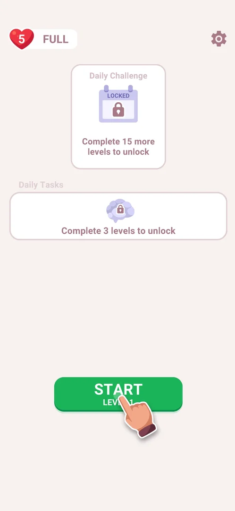
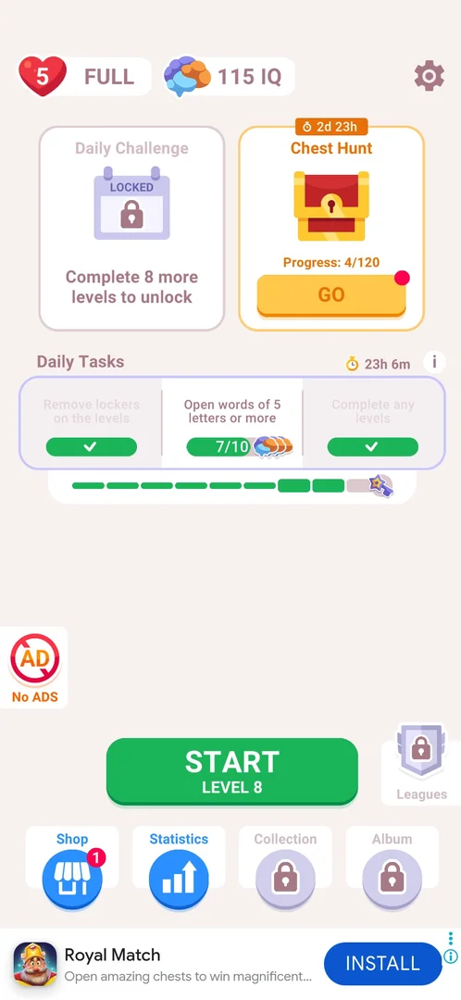
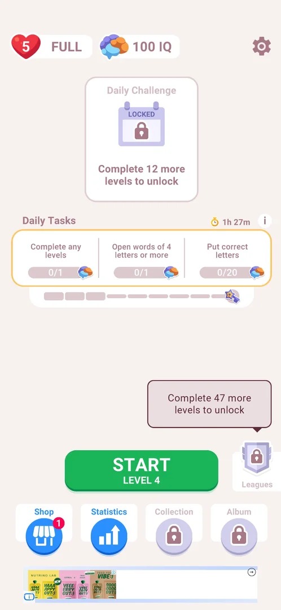
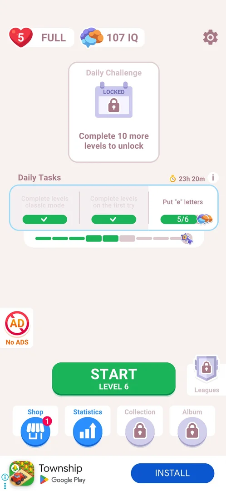
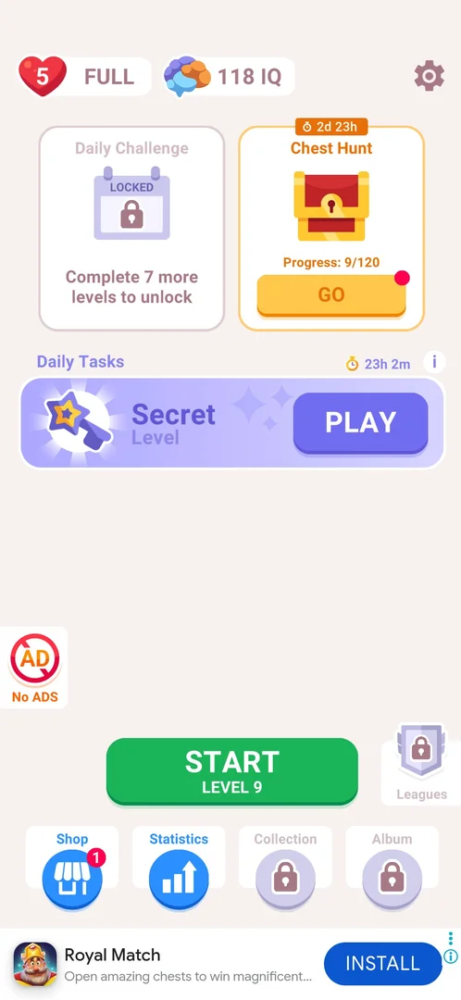

# Daily Tasks

A daily list of small goals on a card on the home screen. Tasks come three at a time; each one done adds [IQ](iq.md) and fills one of nine segments of a bar, and the full bar turns the card into a [Secret Level](secret-level.md). It is locked on a fresh install and opens after 3 completed levels [^s1] [^s4] [^s8] [^s10].

## Why it appeared

The card is on the home screen from the first launch, locked with "Complete 3 levels to unlock" [^s1]. It opened when the third level was won: back on home after NEXT, the card showed the day's tasks and a timer [^s10].

## Where to find it

Home screen > the wide Daily Tasks card under the Daily Challenge card (once the [Chest Hunt](chest-hunt.md) event runs, under the Daily Challenge and Chest Hunt cards). On a fresh install it shows a lock and "Complete 3 levels to unlock"; a tap on the locked card does nothing [^s2]. Once open, the tasks are on the card itself; there is no separate screen [^s9].

 [^s2]
*The Daily Tasks card in the middle of home on a fresh install: a lock and "Complete 3 levels to unlock"*

## What it looks like

The card has the title Daily Tasks, a stopwatch with the time to the day's reset and an "i" button on the right; below them three task tiles, each with its goal, a progress bar and a stack of brain (IQ) icons, and under the card a 9-segment bar ending in a star-wand icon. A finished task's tile is dimmed and its bar turns into a green tick; a finished task's bar segment turns green [^s3].

 [^s3]
*Two tiles ticked, one in progress; eight segments of the bar filled; the star wand at its end*

## What you can do

| Tab or button | What it does |
|---|---|
| [Task list](#task-list) | The first batch of three tasks; a tap on a tile does nothing |
| [Second batch](#second-batch) | The next three tasks, shown as soon as the first three are done |
| [Third batch](#third-batch) | The last three tasks of the day |
| [IQ popup](#iq-popup) | The "i" right of the timer opens the IQ popup |
| [Secret Level](#secret-level) | The full bar turns the card into a Secret Level with PLAY |

### Task list

The first batch, each task with one brain icon [^s4] [^s11]:

| Task | Goal |
|---|---|
| Complete any levels | 0/1 |
| Open words of 4 letters or more | 0/1 |
| Put correct letters | 0/20 |

While a batch runs, its three bar segments are drawn larger than the rest. A tap on a task tile opens nothing [^s9]. The same three tasks, at 0, were on the card again after the day's reset [^s11].

 [^s4]
*The first batch: Complete any levels, Open words of 4 letters or more, Put correct letters*

### Second batch

After levels 4 and 5 the first batch was done (three segments green) and the card showed new tasks with two brain icons each: "Complete levels classic mode" and "Complete levels on the first try", both already ticked, and 'Put "e" letters' at 5/6. Five segments were green, IQ was 107 [^s5].

 [^s5]
*The second batch: the tiles of finished tasks dim and show a green tick*

### Third batch

After level 6 the third batch came, three brain icons each: "Remove lockers on the levels" 0/5, "Open words of 5 letters or more" 0/10, "Complete any levels" 0/1. Six segments were green, IQ was 109 [^s6]. After level 7 two of them were ticked and the words task stood at 7/10, eight segments, 115 IQ [^s3].

 [^s6]
*The third batch, three brains per task; the Chest Hunt card now sits above it*

### IQ popup

The "i" right of the timer opens the IQ popup: the score ("109 IQ" after six tasks), "You are smarter than 25.33% players!", "Complete Daily Tasks to increase your IQ" and a green NICE! button that closes it [^s7]. On the first day it read 100 IQ and 20% [^s12]. See [IQ score](iq.md).

 [^s7]
*The "i" on the card opens the IQ popup*

### Secret Level

With the ninth task done (level 8 won) the tiles and the bar gave way to a lilac card: a star wand, "Secret Level" and a purple PLAY button; the timer stayed above it (23h 2m) and IQ was 118 [^s8]. No claim screen or reward animation came before it.

 [^s8]
*The bar's reward: the Secret Level card in place of the tasks*

## How it works

All in 3.6.1:

- Unlock: 3 completed levels [^s1] [^s10].
- Nine tasks a day in three batches of three; the next batch appears as soon as one is done, with no claim step [^s5] [^s6].
- Each finished task fills one bar segment; the full bar gives the [Secret Level](secret-level.md) [^s8].
- IQ is credited when a task is done: 100 → 107 (five tasks) → 109 (six) → 115 (eight) → 118 (nine) [^s11] [^s5] [^s6] [^s3] [^s8]. Inferred from these numbers and the icons: a task gives as many IQ as its brain icons, 1 in the first batch, 2 in the second, 3 in the third, 18 for the day.
- Tasks seen: complete levels (any, classic mode, on the first try), open words of 4+ or 5+ letters, put correct letters, put "e" letters, remove lockers (the padlocks on some cells from level 7) [^s4] [^s5] [^s6].
- The day resets at local midnight: 1h 29m left at 22:31 and 23h 26m left at 00:33 [^s9] [^s11].

## Cases

| Case | What was done | Result | Source |
|---|---|---|---|
| Why it appeared <!-- case:chk-appeared --> | First launch of a fresh install | The card is on home, locked | [^s1] |
| Where to find it <!-- case:chk-entry --> | Looked at home on a fresh install; tapped the locked card | The card under Daily Challenge, "Complete 3 levels to unlock"; a tap does nothing while locked | [^s2] |
| What it looks like <!-- case:chk-screen --> | Looked at the card through the day | No screen of its own: title, timer, i, three task tiles with IQ icons, a 9-segment bar ending in a star wand; tiles do nothing on tap | [^s4] |
| Today's tasks <!-- case:chk-today --> | Won level 3, looked at the card, tapped a tile | "Complete any levels" 0/1 and "Open words of 4 letters or more" 0/1 with IQ icons; reset timer 1h 29m; tiles do nothing on tap | [^s9] |
| The task list <!-- case:task-list --> | Waited for the card to settle | Complete any levels 0/1, Open words of 4 letters or more 0/1, Put correct letters 0/20, each with IQ; a 9-segment bar ending in a star wand | [^s4] |
| The task list and rewards <!-- case:chk-calendar --> | Won levels 4-8 | Three batches of three tasks (1, 2, 3 brain icons); each task fills one of 9 segments; IQ 100 → 118 | [^s6] |
| The next day <!-- case:chk-next-day --> | Opened the game after midnight | The first batch again at 0, timer 23h 26m, IQ kept at 100 | [^s11] |
| A missed day <!-- case:chk-missed --> | — | not verified |  |
| Play it once <!-- case:chk-play --> | — | Does not apply: a task list, not a board; its bar reward is the Secret Level board | [^s8] |

## Not verified

- The next day: whether an unfinished bar or an unplayed Secret Level carries over the reset <!-- case:chk-next-day -->
- A missed day: what is lost or reset <!-- case:chk-missed -->
- The IQ per task is inferred from the counter and the icons, not shown as a number on the card.

[^s1]: session 20261003-201504-chrono-2FYKPJ, step 1 — [video at 0:12](https://youtu.be/D5rsIC9WNT8?t=12)
[^s2]: session 20261003-201504-chrono-2FYKPJ, step 8 — [video at 2:11](https://youtu.be/D5rsIC9WNT8?t=131)
[^s3]: session 20261006-003220-chrono-2FYKPJ, step 60 — [video at 19:37](https://youtu.be/W0PeVNo113E?t=1177)
[^s4]: session 20261005-221933-chrono-2FYKPJ, step 36 — [video at 12:17](https://youtu.be/I7zPQ2z7rvA?t=737)
[^s5]: session 20261006-003220-chrono-2FYKPJ, step 22 — [video at 6:45](https://youtu.be/W0PeVNo113E?t=405)
[^s6]: session 20261006-003220-chrono-2FYKPJ, step 36 — [video at 11:58](https://youtu.be/W0PeVNo113E?t=718)
[^s7]: session 20261006-003220-chrono-2FYKPJ, step 37 — [video at 12:01](https://youtu.be/W0PeVNo113E?t=721)
[^s8]: session 20261006-003220-chrono-2FYKPJ, step 72 — [video at 23:31](https://youtu.be/W0PeVNo113E?t=1411)
[^s9]: session 20261005-221933-chrono-2FYKPJ, step 35 — [video at 12:01](https://youtu.be/I7zPQ2z7rvA?t=721)

[^s10]: session 20261005-221933-chrono-2FYKPJ, step 32 — [video at 11:04](https://youtu.be/I7zPQ2z7rvA?t=664)
[^s11]: session 20261006-003220-chrono-2FYKPJ, step 0 — [video at 0:00](https://youtu.be/W0PeVNo113E?t=0)
[^s12]: session 20261005-221933-chrono-2FYKPJ, step 33 — [video at 11:35](https://youtu.be/I7zPQ2z7rvA?t=695)
