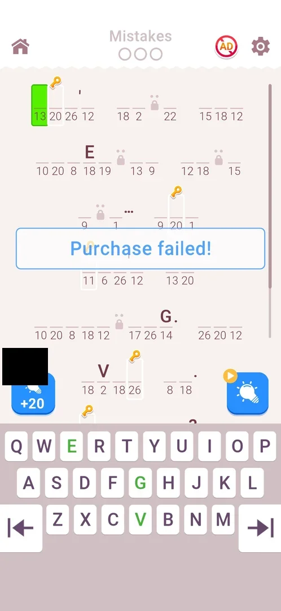

# Hint pack offer (+20 hints)

A paid offer that sits on every level board: a blue button with a bulb and "+20" in the bottom left corner sells 20 hints for real money. A tap goes straight to the Google Play payment sheet, with no game screen in between [^s1] [^s2].

## Why it appeared

The button was not on the level 3 board [^s3] and was there on level 4, the first level after the third win, with a green price tag [^s4]. It stayed on every board after that (levels 9, 10 and 11 in this session) [^s1] [^s5] [^s6].

## Where to find it

In a level, bottom left of the board above the keyboard: the blue "+20" button with a bulb, a price tag on its top left corner. The hint bulb with a video icon is its counterpart on the bottom right [^s1].

 [^s1]
*The +20 button bottom left of the board; the price tag shows the store's local currency and is blacked out*

## What it looks like

<!-- no-screen: the button opens the Google Play payment sheet directly, a system screen with the account's data -->
The offer has no screen of its own: the tap opens the Google Play payment sheet over the game [^s2]. The sheet is a system screen and is not shown here.

## What you can do

| Tab or button | What it does |
|---|---|
| [+20 button](#20-button) | Opens the Google Play payment sheet for 20 hints |
| [Price tag](#price-tag) | Shows the price; it changed within one level |

### +20 button

The tap on level 10 opened the payment sheet at once. The sheet was closed without buying; back on the board a "Purchase failed!" banner ran across the middle of the quote, and the board and the mistakes were as before [^s2].

 [^s2]
*Closing the payment sheet without buying: "Purchase failed!" over the board*

### Price tag

<!-- no-frame: the tag shows the price in the store's local currency, which tells the phone's country; described in words -->
At the start of level 9 the tag was green and read 399 (in the store's local currency). About two and a half minutes later in the same level it was pink and read 249. On level 10 and level 11 it was green with 399 again [^s1] [^s7] [^s5].

## How it works

All in 3.6.1:

- Contents: +20 hints; one tier only, no other pack offered from the board [^s2].
- Price: 399 on the green tag; 249 on a pink tag seen once, mid-level 9 (inferred: a discount) [^s7].
- Shown: on every level board from level 4; no popup offers it [^s4] [^s2].
- Buy path: board button → Google Play payment sheet; no confirmation screen in the game [^s2].
- What turns the tag pink (time in the level, a timer, a mistake) and for how long is not known.

## Cases

| Case | What was done | Result | Source |
|---|---|---|---|
| Where to find it <!-- case:chk-entry --> | Started levels 9 and 10 | The blue +20 bulb button with a price tag at the bottom left of the board | [^s1] |
| Its screen <!-- case:chk-screen --> | Tapped +20 on level 10 | No game screen: the Google Play payment sheet opens directly (not bought) | [^s2] |
| Contents and price <!-- case:chk-contents --> | Read the button and its tag | +20 hints; 399 at the level start, 249 on a pink tag mid-level; one tier | [^s7] |
| The buy path <!-- case:chk-buy-path --> | Tapped +20 | Straight to the payment sheet, nothing in between | [^s2] |
| Closing it <!-- case:chk-close --> | Closed the payment sheet | "Purchase failed!" banner; the board stays as before | [^s2] |
| How often it shows <!-- case:chk-frequency --> | Played levels 9-11 | A permanent button on every board; no popup; the tag went 399 → 249 within level 9 and was 399 again on level 10 | [^s5] |
| Why it appeared <!-- case:chk-appeared --> | Compared the level 3 and level 4 boards | Absent on level 3, present from level 4 | [^s4] |
| Its timer or limit <!-- case:chk-timer --> | — | not verified | |

## Not verified

- Its timer or limit: what turns the price tag pink and how long the 249 price lasts <!-- case:chk-timer -->
- A real purchase: whether 20 hints are credited at once and whether the button changes after it

[^s1]: session 20261006-024420-chrono-2FYKPJ, step 7 — [video at 4:03](https://youtu.be/ZmbMZC7iP0E?t=243)
[^s2]: session 20261006-024420-chrono-2FYKPJ, step 23 — [video at 11:09](https://youtu.be/ZmbMZC7iP0E?t=669)
[^s3]: session 20261005-221933-chrono-2FYKPJ, step 23 — [video at 4:56](https://youtu.be/I7zPQ2z7rvA?t=296)
[^s4]: session 20261006-003220-chrono-2FYKPJ, step 1 — [video at 0:40](https://youtu.be/W0PeVNo113E?t=40)
[^s5]: session 20261006-024420-chrono-2FYKPJ, step 21 — [video at 10:31](https://youtu.be/ZmbMZC7iP0E?t=631)
[^s6]: session 20261006-024420-chrono-2FYKPJ, step 34 — [video at 16:11](https://youtu.be/ZmbMZC7iP0E?t=971)
[^s7]: session 20261006-024420-chrono-2FYKPJ, step 12 — [video at 6:26](https://youtu.be/ZmbMZC7iP0E?t=386)
