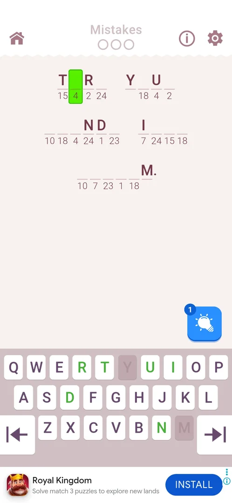
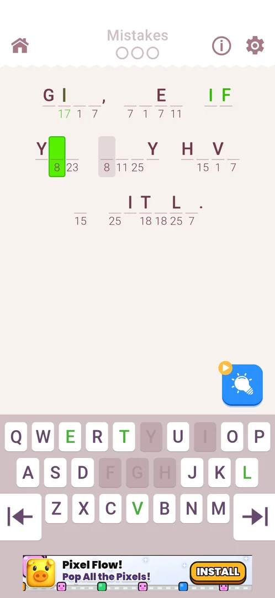
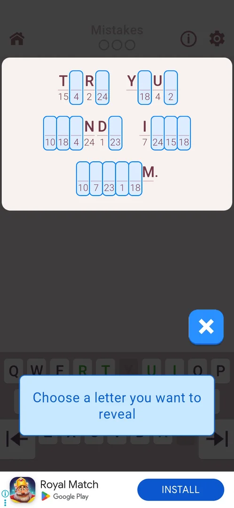
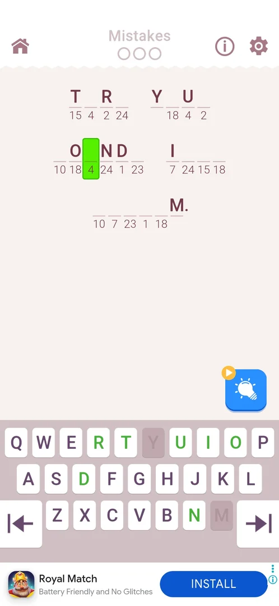
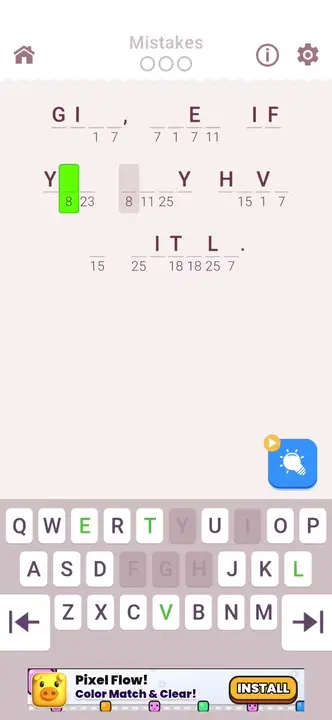
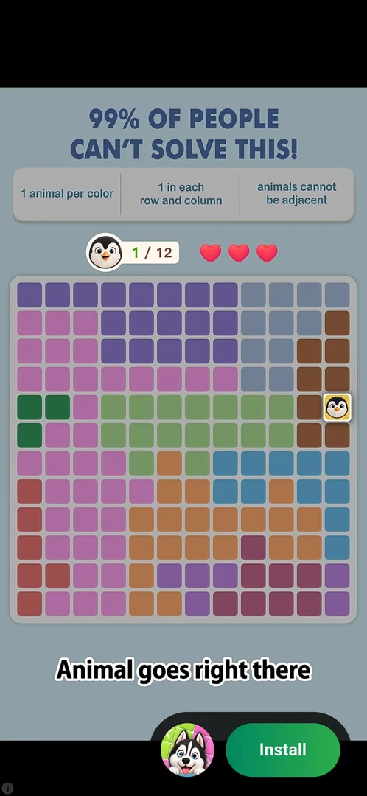
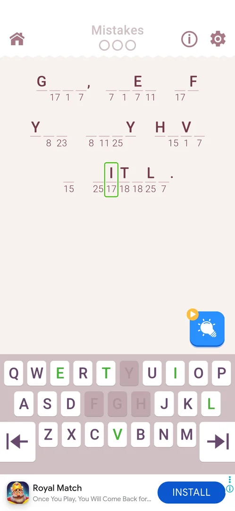
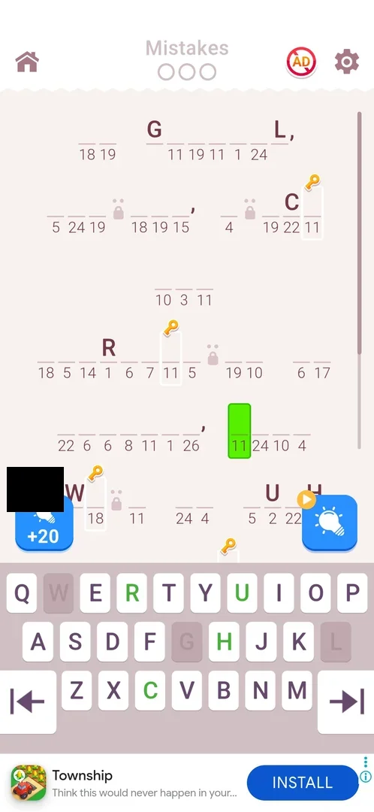

# Hints (bulb)

A booster inside the [Cryptogram level](cryptogram-level.md): a blue bulb button that reveals the letter of one cell the player picks. Level 2 starts with 1 hint; with none left, the bulb starts a video ad instead [^s2] [^s4] [^s5] [^s10].

## Why it appeared

At the start of level 2 the blue bulb with a count of 1 is at the bottom right of the board; level 1 has no bulb [^s1] [^s6].

## Where to find it

Level board (from level 2) > the blue bulb button at the bottom right of the board, just above the keyboard; a blue badge on its top left corner shows the number of hints [^s2]. With no hints the badge is an orange circle with a play icon, as on level 3 after the one hint was spent on level 2: the count is not given again on a new level [^s9]. There is no hint balance on the home screen [^s6].

 [^s2]
*The hint bulb with the badge 1, bottom right of the board above the keyboard*

 [^s9]
*Level 3: the bulb at zero, an orange play icon on its top left corner instead of a count*

## What it looks like

A tap on the bulb with hints left puts the level into hint mode: the board is shown on a light panel over the dimmed screen, every empty cell is outlined in blue, a caption over the keyboard says "Choose a letter you want to reveal", and the bulb itself turns into a blue X button [^s3].

 [^s3]
*Hint mode: empty cells outlined, the caption over the keyboard, the bulb turned into an X*

## What you can do

| Tab or button | What it does |
|---|---|
| [Hint mode](#hint-mode) | Tap an empty cell to reveal its letter; the X (inferred) leaves hint mode |
| [Hint video](#hint-video) | With no hints left a tap on the bulb starts a full-screen video ad at once; it showed no close button |
| [After a restart](#after-a-restart) | A tutorial hand over the bulb after a Restart, seen once |

### Hint mode

One tap on an empty cell reveals the letter of that cell only: in level 2 the second cell coded 18 got its letter, while the other cells coded 18 stayed empty; the selection then moved to the next empty cell [^s4] [^s7]. With the one hint used, the badge on the bulb is replaced by an orange circle with a play icon [^s4]. That the X leaves hint mode without spending a hint is inferred from the icon; it was not tapped.

 [^s4]
*After the hint: the letter revealed, the bulb's badge now an orange play icon*

### Hint video

A tap on the bulb at zero (the play icon) starts a full-screen video ad at once, with no popup asking first [^s10]:

 [^s10]
*Clip 3 s · [original on YouTube from 4:58](https://youtu.be/I7zPQ2z7rvA?t=298)*

In both tries the ad was for another game and ended on a playable end card with a Play Now button, and no close button ever appeared: about 60 s on level 2, about 100 s on level 3 (about 40 s of video, then the playable). The system Back key and relaunching the app did not leave it; the app had to be force-stopped [^s5] [^s7] [^s12].

 [^s5]
*The video started from the bulb at zero: a playable ad with no close button*

After the force-stop, CONTINUE reopened level 3 from its start (letters typed before the ad gone, Mistakes empty, the level's tutorial shown again) and the bulb still had the play icon: no hint was credited [^s11].

 [^s11]
*After the force-stop: level 3 from the start, the bulb still at zero*

### After a restart

After Restart from the 3-mistake popup on level 11 (in an earlier session) a tutorial hand pointed at the bulb, which had the play icon, and the home icon did not respond while the hand was up [^s13]. On level 12, about 1 s after Restart from the same popup with 0 hints, the board showed the bulb with the play icon and no hand [^s14]. Inferred: the hand is not shown after every restart at 0 hints; whether it showed later on that board was not seen (the session ended).

 [^s14]
*Level 12 after Restart with 0 hints: the bulb with its play icon and no hand over it (the hint pack's price tag is blacked out)*

## How it works

All in 3.6.1:

- Starting balance: 1 hint, given at the start of level 2; shown only as the badge on the bulb [^s2] [^s6].
- The balance carries over between levels; level 3 does not add a hint (0 after the one was used on level 2) [^s9].
- One hint reveals one cell (not every cell of the same number) [^s4] [^s7].
- No coin price was seen; at zero the bulb starts a video ad, and no purchase prompt was seen on the bulb [^s4] [^s7] [^s10].
- A hint used in a level that is then closed by force-stop is not returned: CONTINUE reopens the level from the start, the revealed letter gone, the bulb still showing the play icon [^s7].
- Restart after a loss does not change the count (still 1 when no hint had been used) [^s8].
- A hint can reveal a [Chest Hunt](chest-hunt.md) key cell: on level 11 the one hint (badge 1 at the start) was used on a key cell, and the level's free key claim included it (inferred from CLAIM 4 for four key cells) [^s15] [^s16] [^s17].
- A hint video that is never closed gives nothing: after a force-stop the bulb was still at zero [^s11]. Whether a video that does close grants a hint is unknown.

## Cases

| Case | What was done | Result | Source |
|---|---|---|---|
| Why it appeared <!-- case:chk-appeared --> | Opened level 2 for the first time | The bulb with 1 at the bottom right; not on level 1 | [^s1] |
| Where to find it <!-- case:chk-entry --> | Looked at the level 2 board | Blue bulb bottom right above the keyboard, from level 2 | [^s6] |
| The balance <!-- case:chk-balance --> | Looked at the bulb and at home | Badge 1 at the start of level 2; no hint balance on home | [^s6] |
| What it looks like <!-- case:chk-screen --> | Tapped the bulb | Board dimmed, empty cells outlined, "Choose a letter you want to reveal", bulb becomes an X | [^s3] |
| What one hint does <!-- case:chk-effect --> | Tapped an empty cell coded 18 in hint mode | Only that cell got its letter; the selection moved on | [^s4] |
| Sources <!-- case:chk-sources --> | Started level 2; tapped the bulb at zero | 1 free hint at level 2; at zero a video ad (no close in about 60 s, reward not seen) | [^s5] [^s7] |
| Sinks <!-- case:chk-sinks --> | Used the hint, then force-stopped the app | One hint per revealed cell, no coin price seen; not refunded after force-stop | [^s7] |
| At zero <!-- case:chk-empty --> | Looked at and tapped the bulb at zero | Orange play icon; a video ad, no purchase prompt | [^s4] [^s5] |
| The hint video without a close <!-- case:video-no-close --> | On level 3 at zero tapped the bulb, waited about 100 s, pressed Back, relaunched, then force-stopped | About 40 s of video, then a playable end card with Play Now and no close; Back and relaunch did not leave it; after the force-stop no hint was credited and the level board was reset | [^s11] |
| Refill timer <!-- case:chk-refill --> | — | not verified |  |

## Not verified

- Refill timer: whether hints come back over time, or are given again on later levels (none was added at level 3) <!-- case:chk-refill -->
- Whether the hint video grants a hint once it closes (in both tries the ad never closed; task hint-reward-retry)
- The X in hint mode: whether it leaves without spending the hint
- After a restart: what brings up the tutorial hand over the bulb (seen once, not on the next restart)

[^s1]: session 20261003-234451-chrono-2FYKPJ, step 17 — [video at 4:04](https://youtu.be/WwMBaKGzEUU?t=244)
[^s2]: session 20261005-003245-chrono-2FYKPJ, step 1 — [video at 0:25](https://youtu.be/xwf29tc75Dk?t=25)
[^s3]: session 20261005-003245-chrono-2FYKPJ, step 6 — [video at 1:27](https://youtu.be/xwf29tc75Dk?t=87)
[^s4]: session 20261005-003245-chrono-2FYKPJ, step 7 — [video at 1:39](https://youtu.be/xwf29tc75Dk?t=99)
[^s5]: session 20261005-003245-chrono-2FYKPJ, step 8 — [video at 1:53](https://youtu.be/xwf29tc75Dk?t=113)
[^s6]: session 20261003-234451-chrono-2FYKPJ, step 18 — [video at 4:19](https://youtu.be/WwMBaKGzEUU?t=259)
[^s7]: session 20261005-003245-chrono-2FYKPJ, step 12 — [video at 4:50](https://youtu.be/xwf29tc75Dk?t=290)
[^s8]: session 20261005-003245-chrono-2FYKPJ, step 5 — [video at 1:16](https://youtu.be/xwf29tc75Dk?t=76)
[^s9]: session 20261005-221933-chrono-2FYKPJ, step 23 — [video at 4:50](https://youtu.be/I7zPQ2z7rvA?t=290)
[^s10]: session 20261005-221933-chrono-2FYKPJ, step 24 — [video at 5:01](https://youtu.be/I7zPQ2z7rvA?t=301)
[^s11]: session 20261005-221933-chrono-2FYKPJ, step 28 — [video at 8:38](https://youtu.be/I7zPQ2z7rvA?t=518)

[^s12]: session 20261005-221933-chrono-2FYKPJ, step 25 — [video at 7:27](https://youtu.be/I7zPQ2z7rvA?t=447)

[^s13]: session 20261006-024420-chrono-2FYKPJ, step 39 — [video at 18:48](https://youtu.be/ZmbMZC7iP0E?t=1128)
[^s14]: session 20261006-131052-chrono-2FYKPJ, step 37 — [video at 18:49](https://youtu.be/2fot0pfWAP0?t=1129)
[^s15]: session 20261006-131052-chrono-2FYKPJ, step 10 — [video at 5:45](https://youtu.be/2fot0pfWAP0?t=345)
[^s16]: session 20261006-131052-chrono-2FYKPJ, step 17 — [video at 8:20](https://youtu.be/2fot0pfWAP0?t=500)
[^s17]: session 20261006-131052-chrono-2FYKPJ, step 19 — [video at 8:45](https://youtu.be/2fot0pfWAP0?t=525)
