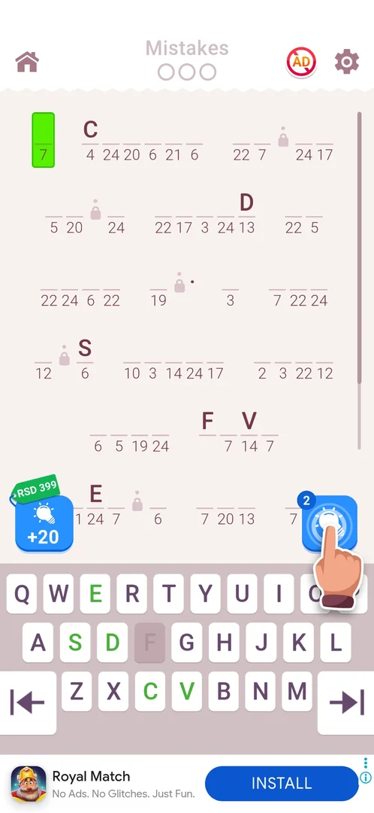

# Hints

A hint button sits at the bottom right of the level board with a stock badge (2 at level 9) and a
tutorial hand on first view; a "+20" pack button with a price tag sits at the bottom left
[s:20261001-020937-chrono-2FYKPJ#8].

## Cases

| Case | What was done | Result | Source |
|---|---|---|---|
| Hint pack price | The +20 button was hit by a mis-scaled tap | Google Play sheet "Hints Small Pack", RSD 399, "Top selling", with 1-tap buy; Back gave a "Purchase failed!" toast, nothing was bought | [s:20261001-020937-chrono-2FYKPJ#9] [s:20261001-020937-chrono-2FYKPJ#10] |

## Numbers (v3.6.1)

| What | Value | Source |
|---|---|---|
| Hint stock at level 9 | 2 | [s:20261001-020937-chrono-2FYKPJ#8] |
| +20 hint pack | RSD 399 (real money) | [s:20261001-020937-chrono-2FYKPJ#9] |

## Not verified

- What a hint reveals and how the stock changes after use.
- Whether hints can be earned (rewarded video, level rewards).
